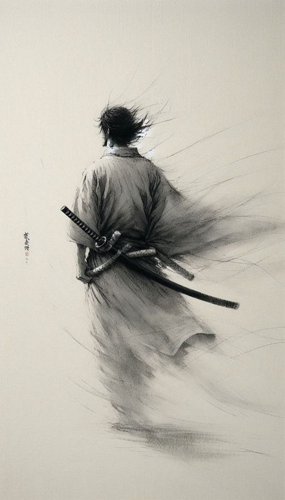

# 🐦 @Letstalk246

## 📅 September 14, 2026

> 6 post(s) archived.

---

### 🕐 15:41 UTC · @Letstalk246

> Focus on what you can control, stay disciplined, and trust the process you are building. Some chapters may be painful, but they are not the whole story. Keep believing in yourself, because the person you are becoming may be far greater than the person you once imagined. -Letstalkwisdom

🔗 [View original post](https://x.com/Letstalk246/status/2099524031175184598)

---

### 🕐 15:40 UTC · @Letstalk246

> Life will not always move according to your plans, but every difficult season carries a lesson. Do not let temporary setbacks convince you that you are incapable of greatness. Keep learning, keep growing, and keep moving forward even when progress feels slow. Your journey is not measured by how quickly you arrive, but by how much strength and wisdom you gain along the way. -Letstalkwisdom

🔗 [View original post](https://x.com/Letstalk246/status/2099523691566485554)

---

### 🕐 15:37 UTC · @Letstalk246

> Train your mind to stay calm in uncertainty, disciplined in difficulty, and focused in silence. Not every battle deserves your energy; sometimes the greatest victory is mastering yourself. -Letstalkwisdom

🔗 [View original post](https://x.com/Letstalk246/status/2099523002731839498)

---

### 🕐 09:32 UTC · @Letstalk246

> You don’t need to explain yourself to everyone. People committed to misunderstanding you will ignore every explanation…. -Letstalkwisdom

🔗 [View original post](https://x.com/Letstalk246/status/2099431145175679020)

---

### 🕐 09:11 UTC · @Letstalk246

> Sometimes the greatest battle is not changing your circumstances, but changing the meaning you give them. Because a matured mind doesn’t need to win every argument; it knows when understanding is more valuable than being right. Letstalkwisdom

🔗 [View original post](https://x.com/Letstalk246/status/2099425730643808573)

---

### 🕐 09:08 UTC · @Letstalk246

> Not everything you lose is a loss; sometimes, it is space being created for growth. You don’t always need a new life; sometimes you need a new perspective on the life you already have.

🔗 [View original post](https://x.com/Letstalk246/status/2099425034976534844)

---
