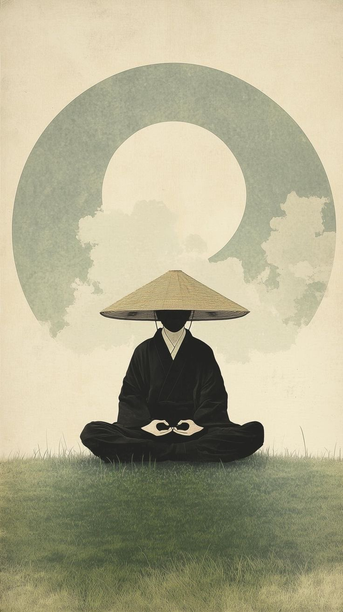

# 🐦 @Letstalk246

## 📅 September 14, 2026

> 3 post(s) archived.

---

### 🕐 09:32 UTC · @Letstalk246

> You don’t need to explain yourself to everyone. People committed to misunderstanding you will ignore every explanation…. -Letstalkwisdom

🔗 [View original post](https://x.com/Letstalk246/status/2099431145175679020)

---

### 🕐 09:11 UTC · @Letstalk246

> Sometimes the greatest battle is not changing your circumstances, but changing the meaning you give them. Because a matured mind doesn’t need to win every argument; it knows when understanding is more valuable than being right. Letstalkwisdom

🔗 [View original post](https://x.com/Letstalk246/status/2099425730643808573)

---

### 🕐 09:08 UTC · @Letstalk246

> Not everything you lose is a loss; sometimes, it is space being created for growth. You don’t always need a new life; sometimes you need a new perspective on the life you already have.

🔗 [View original post](https://x.com/Letstalk246/status/2099425034976534844)

---
