# 🐦 @Unlockyourlife_

## 📅 September 14, 2026

> 41 post(s) archived.

---

### 🕐 19:54 UTC · @Unlockyourlife_

> Build small circle A man can be surrounded by people and still have nobody he can trust. That&apos;s why your goal shouldn&apos;t be to know everyone. Build a small circle of people who tell you the truth, respect your boundaries, celebrate your growth, and don&apos;t disappear when life gets difficult. Quality over quantity.

🔗 [View original post](https://x.com/Masculinjournal/status/2099587549828198494)

---

### 🕐 17:30 UTC · @Unlockyourlife_

> The instruction manual for life

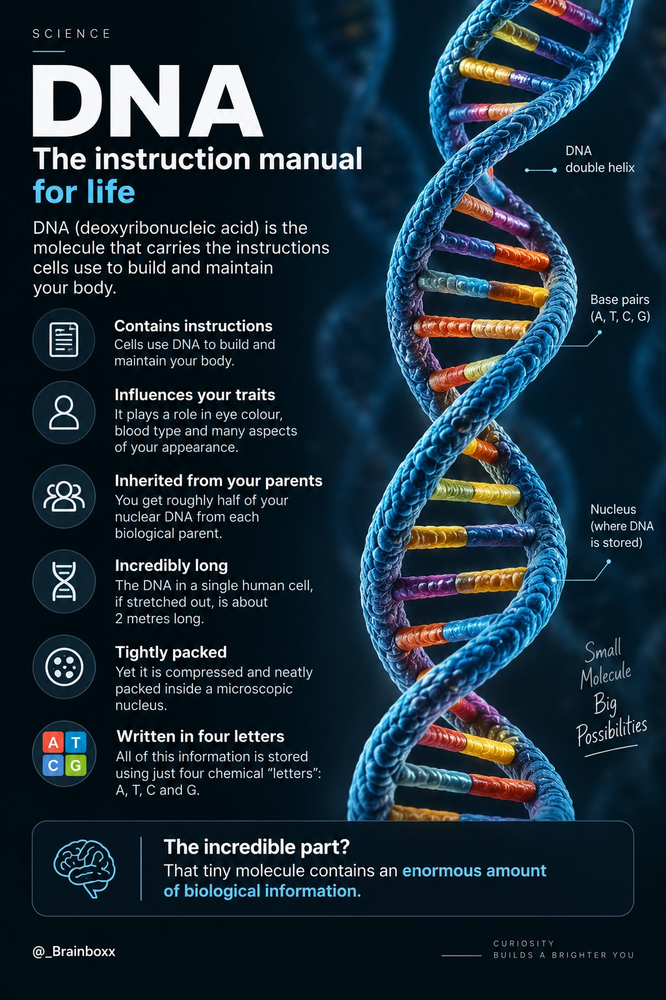

🔗 [View original post](https://x.com/_Brainboxx/status/2099551363483001283)

---

### 🕐 16:56 UTC · @Unlockyourlife_

> 10 surprising facts about the human brain.

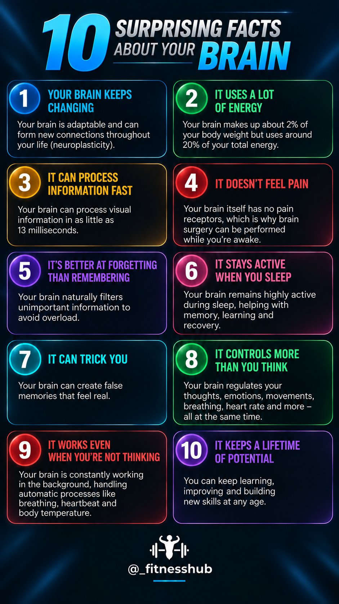

🔗 [View original post](https://x.com/_fitnesshub/status/2099542800425456118)

---

### 🕐 16:36 UTC · @Unlockyourlife_

> Numbness and tingling aren’t always “nothing.” Sometimes your nerves are asking for attention before the pain gets louder.

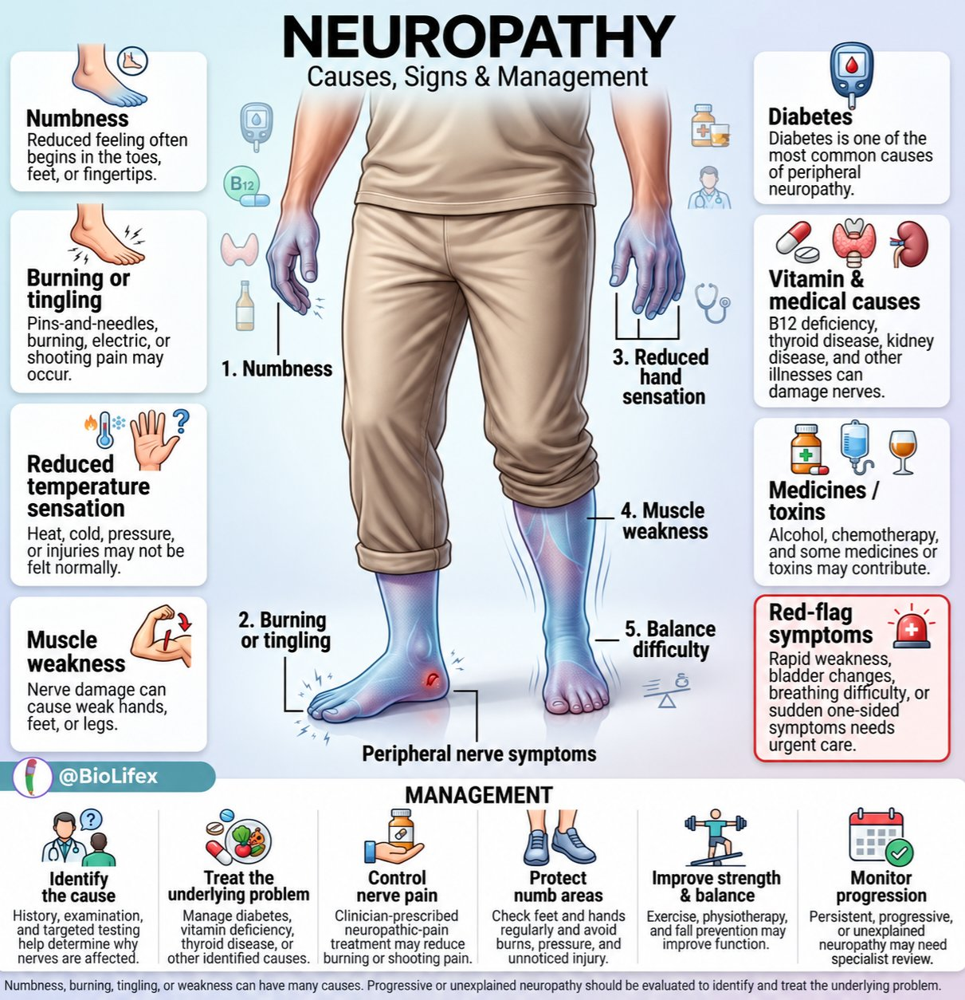

🔗 [View original post](https://x.com/BioLifex/status/2099537702752256467)

---

### 🕐 16:32 UTC · @Unlockyourlife_

> No fancy equipment. No complicated routine. Just 30–45 seconds of work, short rest, and the discipline to keep going.

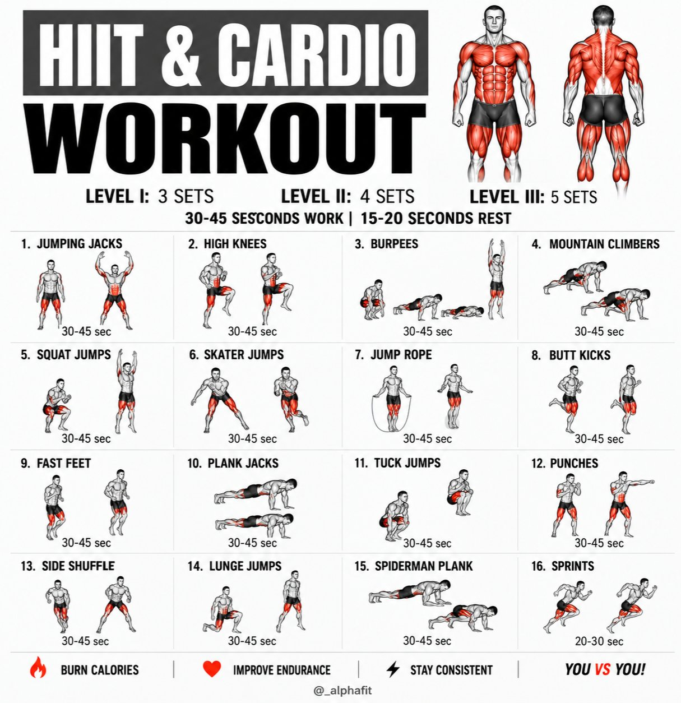

🔗 [View original post](https://x.com/_alphafit/status/2099536701500608558)

---

### 🕐 16:16 UTC · @Unlockyourlife_

> Psychology revealed this Media

🔗 [View original post](https://x.com/_learnskills/status/2099532681625157661)

---

### 🕐 15:11 UTC · @Unlockyourlife_

> Bro, wake up.. The clock is ticking 🕒

🔗 [View original post](https://x.com/Masculinjournal/status/2099516457646207474)

---

### 🕐 14:00 UTC · @Unlockyourlife_

> Vitamins may be needed in small amounts, but their role in your body is huge. From supporting muscle function and energy metabolism to protecting your cells and keeping your immune system healthy, getting enough essential vitamins helps your body perform at its best.

🔗 [View original post](https://x.com/_fitnesshub/status/2099498469203353981)

---

### 🕐 14:00 UTC · @Unlockyourlife_

> 5.

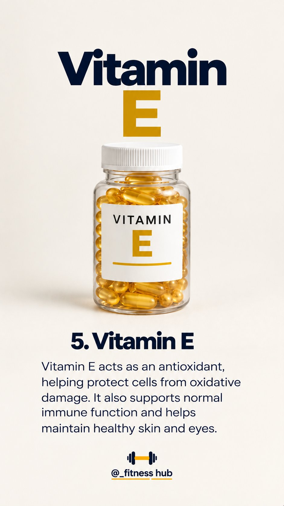

🔗 [View original post](https://x.com/_fitnesshub/status/2099498463268409545)

---

### 🕐 14:00 UTC · @Unlockyourlife_

> 4.

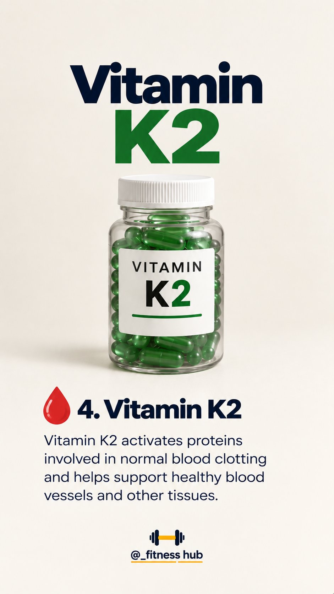

🔗 [View original post](https://x.com/_fitnesshub/status/2099498456532373527)

---

### 🕐 14:00 UTC · @Unlockyourlife_

> 3.

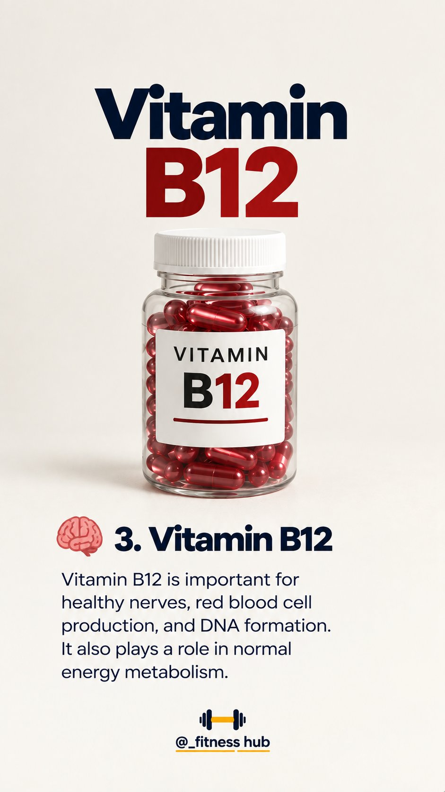

🔗 [View original post](https://x.com/_fitnesshub/status/2099498448131145813)

---

### 🕐 14:00 UTC · @Unlockyourlife_

> 2.

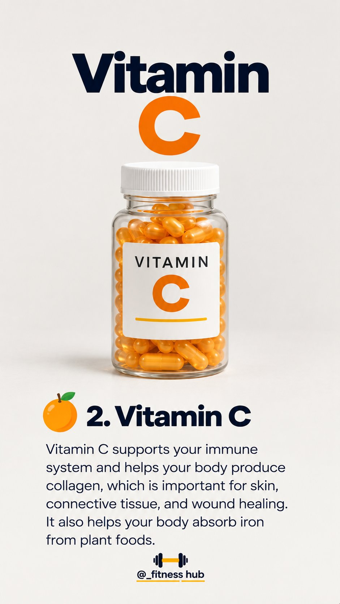

🔗 [View original post](https://x.com/_fitnesshub/status/2099498439729983706)

---

### 🕐 14:00 UTC · @Unlockyourlife_

> 5 Vitamins Your Body Truly Needs. Your body doesn’t just need protein and calories to perform — vitamins help keep the systems behind your energy, and overall health working properly. Here are 5 worth knowing. 1.

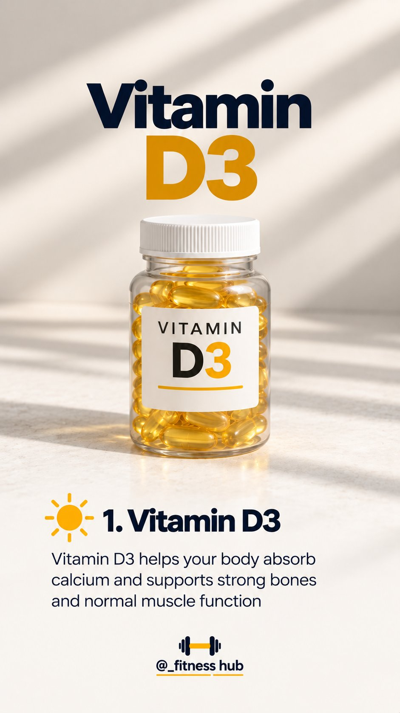

🔗 [View original post](https://x.com/_fitnesshub/status/2099498432809320795)

---

### 🕐 13:33 UTC · @Unlockyourlife_

> If you only have dumbbells, you still have everything you need for a serious full-body workout. 5 movements. Minimal equipment. Plenty of ways to challenge yourself. Work through them with control, use a weight that pushes you, and focus on getting stronger over time Media

🔗 [View original post](https://x.com/_alphafit/status/2099491800272507133)

---

### 🕐 13:33 UTC · @Unlockyourlife_

> Forget complicated routines. If you could only keep 5 movements for the rest of your life, make them these: 1. WALKING The most underrated exercise. Builds basic endurance, keeps you moving, helps manage body weight and is easy to recover from. Aim for a brisk 30-minute walk most days. Media

🔗 [View original post](https://x.com/Mastering_life_/status/2099491613370417372)

---

### 🕐 13:12 UTC · @Unlockyourlife_

> Don&apos;t Ignore Frequent Headaches A headache that keeps returning deserves attention, especially if it&apos;s becoming more severe or different from usual. - Check your blood pressure - Stay properly hydrated - Get enough sleep - Review your medications - Track your triggers A recurring headache is a symptom-not a diagnosis. Find out what&apos;s causing it.

🔗 [View original post](https://x.com/FitnessDr_/status/2099486322536657138)

---

### 🕐 12:25 UTC · @Unlockyourlife_

> Your response to your wife can change the direction of a difficult conversation. Here are 5 marriage mistakes worth avoiding:

🔗 [View original post](https://x.com/MensStandards/status/2099474710442729567)

---

### 🕐 11:53 UTC · @Unlockyourlife_

> 5 cooking mistakes that quietly ruin good food. Nothing fancy. Just small habits that can flatten flavor, wreck texture, or waste good ingredients. The surprising part? Most happen before the food even reaches your plate.

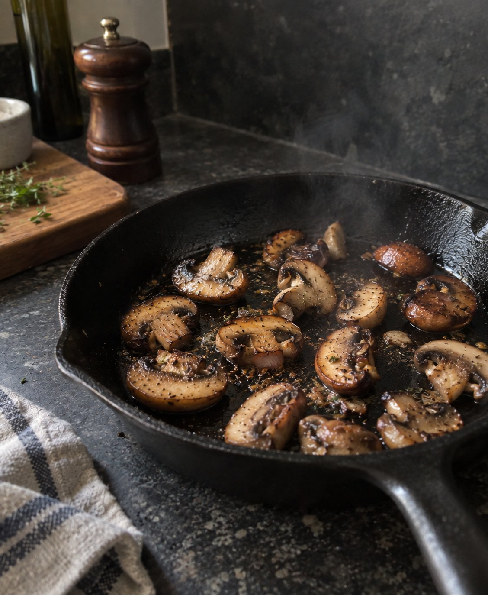

🔗 [View original post](https://x.com/Elitedelicacy/status/2099466440701059225)

---

### 🕐 11:27 UTC · @Unlockyourlife_

> Home Workout to Train Effectively.

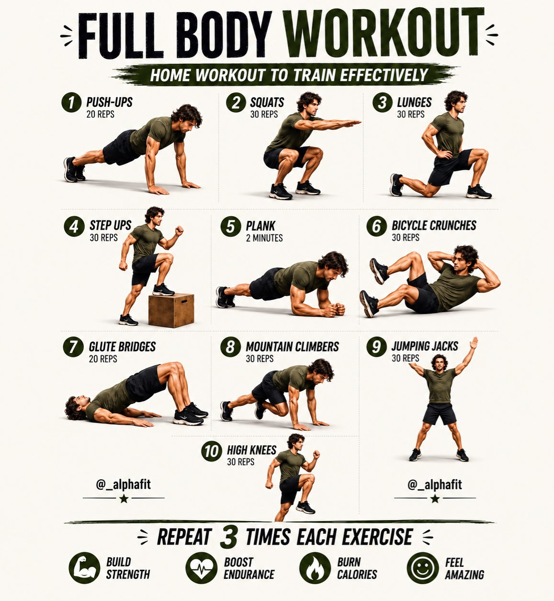

🔗 [View original post](https://x.com/_alphafit/status/2099460037315891642)

---

### 🕐 11:23 UTC · @Unlockyourlife_

> Your brain needs a steady supply of nutrients to support memory, focus and overall brain function. Here are some foods worth adding to your diet: - Fatty fish - Blueberries - Eggs - Walnuts - Leafy greens - Avocados - Dark chocolate - Extra-virgin olive oil - Beans &amp; lentils - Pumpkin seeds You don&apos;t need a perfect diet. Just make more brain-friendly choices consistently.

🔗 [View original post](https://x.com/_Brainboxx/status/2099458899518611512)

---

### 🕐 11:10 UTC · @Unlockyourlife_

> That “harmless little bump” has more going on than you think. Know what a common wart looks like before you start treating it blindly.

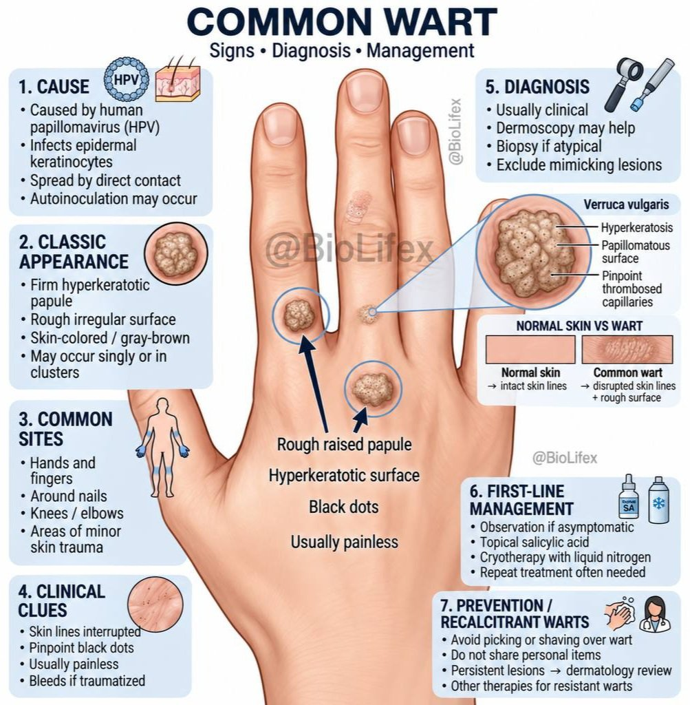

🔗 [View original post](https://x.com/BioLifex/status/2099455797319102622)

---

### 🕐 11:08 UTC · @Unlockyourlife_

> Don&apos;t let one bad morning become a bad day. - You overslept? • Get up. - Missed the workout? • Train later. - Made a mistake? • Correct it. A disciplined man doesn&apos;t need a perfect day to make progress. He knows how to recover quickly.

🔗 [View original post](https://x.com/Masculinjournal/status/2099455189103128707)

---

### 🕐 10:57 UTC · @Unlockyourlife_

> 7 Kegels every man should know.

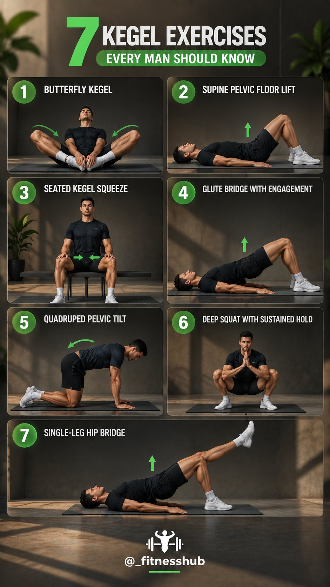

🔗 [View original post](https://x.com/_fitnesshub/status/2099452442769322180)

---

### 🕐 10:52 UTC · @Unlockyourlife_

> What your computer motherboard look like

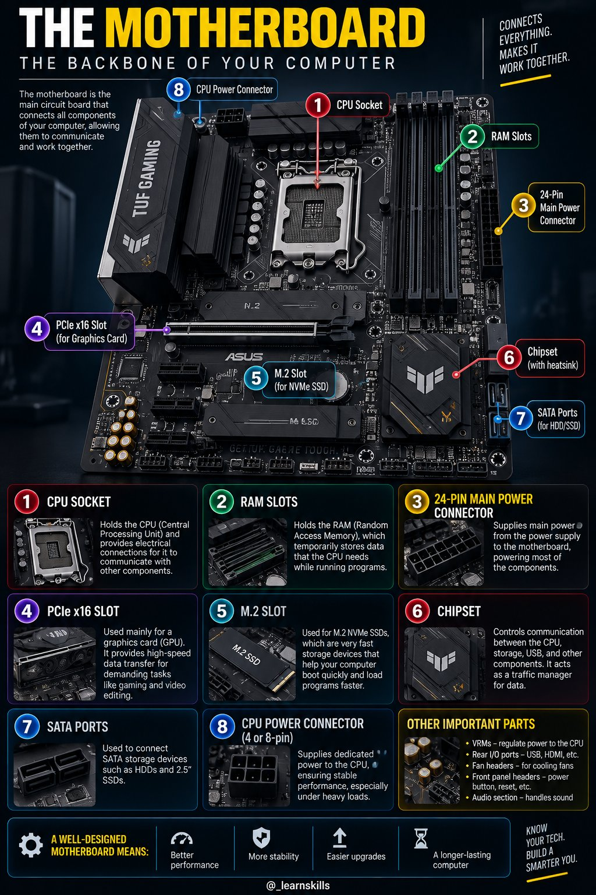

🔗 [View original post](https://x.com/_learnskills/status/2099451294893166784)

---

### 🕐 10:16 UTC · @Unlockyourlife_

> 7 Ways Chemistry Dies Without You Noticing The relationship is still there. The attraction isn&apos;t. Here’s how it happens: 🧵 1. You stop flirting.

🔗 [View original post](https://x.com/brutal_truth0/status/2099442237880803562)

---

### 🕐 10:16 UTC · @Unlockyourlife_

> You won&apos;t lose body fat until you improve your diet. Start eating these foods every day:

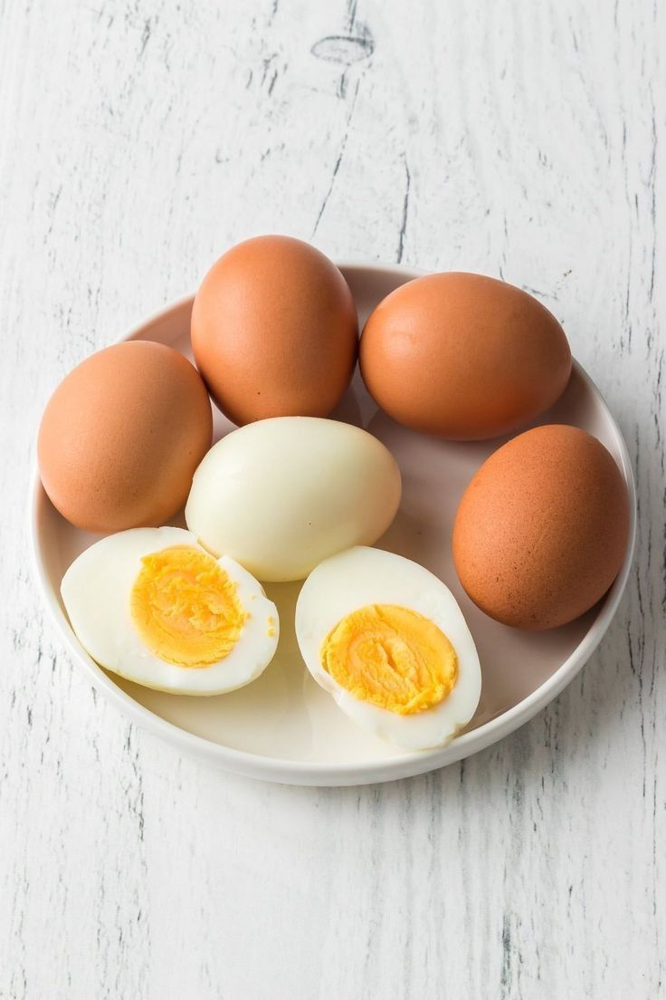

🔗 [View original post](https://x.com/HoliHappiness/status/2099442033345605652)

---

### 🕐 10:00 UTC · @Unlockyourlife_

> 6 Natural Recipes to Boost Your Bedmatics. 1. Beetroot + Ginger drink

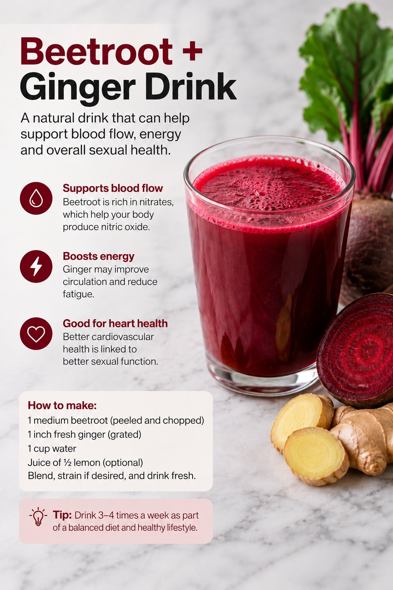

🔗 [View original post](https://x.com/FitnessDr_/status/2099438165433917573)

---

### 🕐 09:13 UTC · @Unlockyourlife_

> Is That Lamp Really Made With PVC?! Media

🔗 [View original post](https://x.com/Smart_Tipsx/status/2099426280139620547)

---

### 🕐 08:42 UTC · @Unlockyourlife_

> BREAKING: To every man who knows he needs to become better but doesn&apos;t know where to start; this is for you. The Masculine Journal is finally here. A practical guide to building discipline, strength, focus, purpose, financial responsibility, better relationships and a life you can be proud of. The first edition is officially out. http://gumroad.com/l/miznc

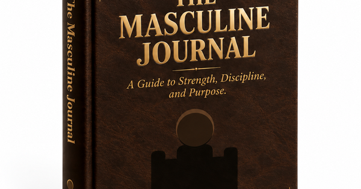

🔗 [View original post](https://x.com/Masculinjournal/status/2099418474409808028)

---

### 🕐 07:57 UTC · @Unlockyourlife_

> Carbohydrates are one of your body’s primary sources of energy, especially during exercise and other physical activity. Choosing nutrient-rich carbs like potatoes, oats, brown rice, beans, corn, and whole-grain foods can provide energy while also supplying fiber, vitamins, and minerals.

🔗 [View original post](https://x.com/_fitnesshub/status/2099407143917006885)

---

### 🕐 07:57 UTC · @Unlockyourlife_

> 6.

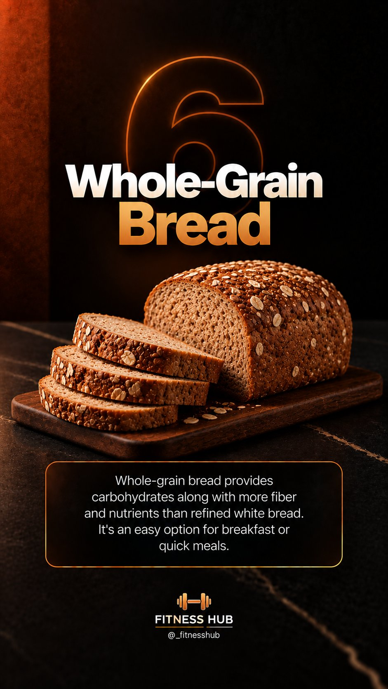

🔗 [View original post](https://x.com/_fitnesshub/status/2099407137747165464)

---

### 🕐 07:57 UTC · @Unlockyourlife_

> 5.

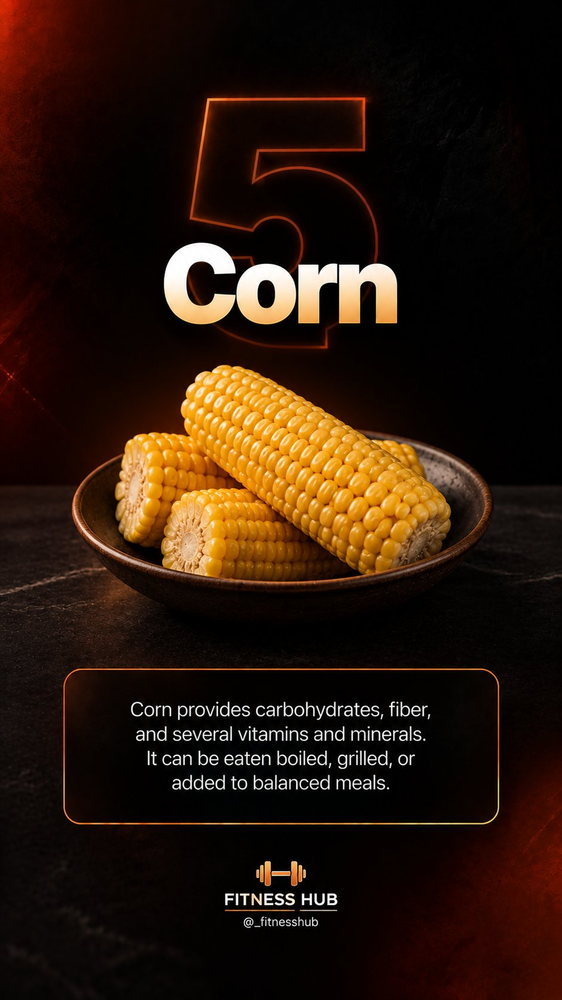

🔗 [View original post](https://x.com/_fitnesshub/status/2099407130633662963)

---

### 🕐 07:57 UTC · @Unlockyourlife_

> 4.

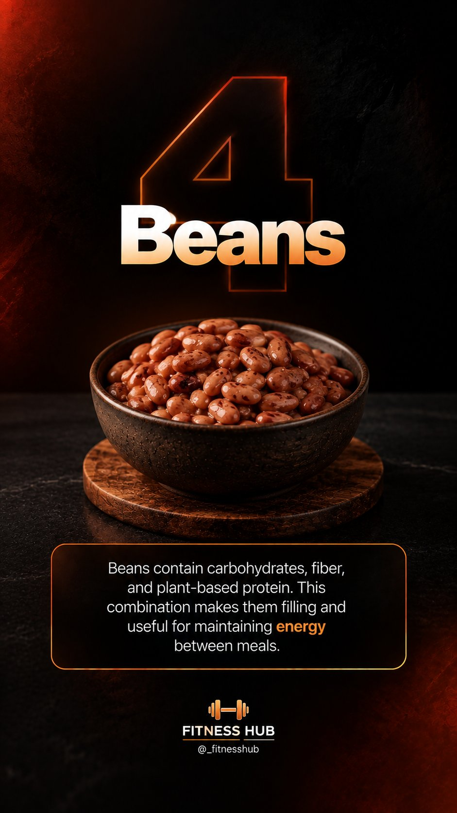

🔗 [View original post](https://x.com/_fitnesshub/status/2099407124170240114)

---

### 🕐 07:57 UTC · @Unlockyourlife_

> 3.

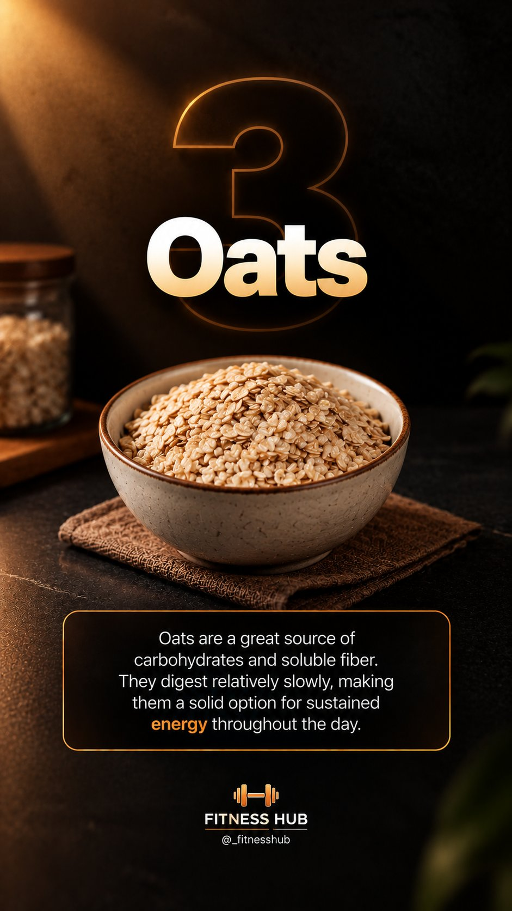

🔗 [View original post](https://x.com/_fitnesshub/status/2099407117081813203)

---

### 🕐 07:57 UTC · @Unlockyourlife_

> 2.

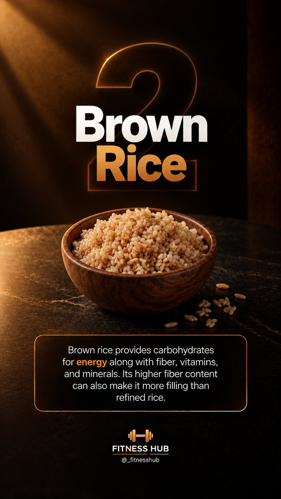

🔗 [View original post](https://x.com/_fitnesshub/status/2099407109666271501)

---

### 🕐 07:57 UTC · @Unlockyourlife_

> Carbs aren’t the enemy — they’re one of your body’s main sources of fuel. The real question is: which carbs are you eating? 6 Healthy Carb Sources for Energy. 1.

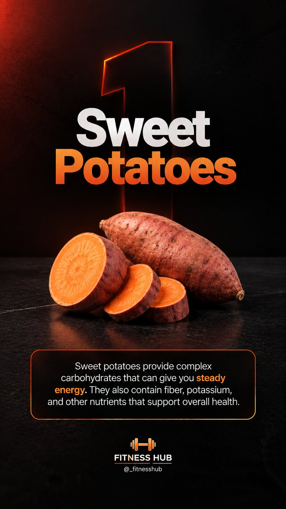

🔗 [View original post](https://x.com/_fitnesshub/status/2099407102376591670)

---

### 🕐 06:41 UTC · @Unlockyourlife_

> Al is moving ridiculously fast. And honestly, don&apos;t think we&apos;re taking the risks seriously enough. We&apos;re building systems that can learn, reason and eventually outperform us in more areas than we expected. Maybe Al never destroys humanity. But if it ever becomes smarter than us and we lose control of it, we may not get a second chance.

🔗 [View original post](https://x.com/_Brainboxx/status/2099388140318290140)

---

### 🕐 05:57 UTC · @Unlockyourlife_

> Save money doing this genius idea Media

🔗 [View original post](https://x.com/_learnskills/status/2099376905027760356)

---

### 🕐 05:51 UTC · @Unlockyourlife_

> Programme your mind to always thank your CREATOR before picking up your phone in the morning.

🔗 [View original post](https://x.com/Masculinjournal/status/2099375393736216976)

---

### 🕐 05:45 UTC · @Unlockyourlife_

> These drinks make hydration easier while adding useful compounds from real ingredients. 1. Ginger lemon drink

🔗 [View original post](https://x.com/BioLifex/status/2099373989021778202)

---

### 🕐 01:49 UTC · @Unlockyourlife_

> Bro.. Don&apos;t chase a lifestyle you cannot afford. A car payment can look like success. Designer clothes can look like success. Expensive nights out can look like success. But if they&apos;re keeping you broke, they&apos;re not moving you forward. Build wealth before you build an image.

🔗 [View original post](https://x.com/Masculinjournal/status/2099314639213347275)

---
