# 🐦 @Wise1Philosophy

## 📅 September 14, 2026

> 128 post(s) archived.

---

### 🕐 19:34 UTC · @Wise1Philosophy

> Bryan Johnson losing his CEO to a wearable startup was definitely not on my bingo card. BREAKING: @bryan_johnson’s former CEO/CTO @RyanMField just left Kernel to join BCI startup @sabi. He spent years making Bryan Johnson&apos;s massive brain helmets, and now he jumped ship to Sabi, backed by @khoslaventures. If the CEO of the most funded non-invasive helmet company is l…

🔗 [View original post](https://x.com/alexconia/status/2099582569603858894)

---

### 🕐 19:24 UTC · @Wise1Philosophy

> Esto es perfecto para profesionales del marketing como yo que necesitan versiones de sus videos en cuatro idiomas. Lo probé y solo me llevó unos minutos, vinculas el contenido, pides el doblaje y listo. Funciona a las mil maravillas. Media Introducing voice, music, image, and video generation in the ElevenLabs MCP. Generate speech, transcripts, dubs, music, sound effects, images, and video from the assistant you already work in.

🔗 [View original post](https://x.com/MiguelMaestroIA/status/2099579961510121967)

---

### 🕐 19:20 UTC · @Wise1Philosophy

> Sabi is quietly assembling the avengers of neurotech. Khosla backing + poaching from Kernel? yeah they&apos;re about to take over. BREAKING: @bryan_johnson’s former CEO/CTO @RyanMField just left Kernel to join BCI startup @sabi. He spent years making Bryan Johnson&apos;s massive brain helmets, and now he jumped ship to Sabi, backed by @khoslaventures. If the CEO of the most funded non-invasive helmet company is l…

🔗 [View original post](https://x.com/PaulYoungX/status/2099578994307805461)

---

### 🕐 19:00 UTC · @Wise1Philosophy

> Copying one campaign across LinkedIn, Meta and Google is draining your paid budget. And your team calls it &quot;multi-channel.&quot; LinkedIn is too expensive. Meta doesn&apos;t work for B2B. You&apos;ve heard both. Last year I drove $586K in closed revenue from LinkedIn Ads. On Meta, we get qualified demos for our B2B SaaS clients at $600 each. When a platform &quot;doesn&apos;t work,&quot; I usually open the account and find one audience and one &quot;book a demo&quot; ad, copied across all 3. Buyers use each platform at a different stage. Run them as one and you pay 3 times for the same targeting mistake. Here&apos;s what each one is actually for: 1. LinkedIn only pays off when you already know the accounts → Best for: a capped list of 500 to 3,000 accounts, pulled from closed-lost, stalled pipeline and old MQLs → Run the ads off a real person&apos;s face. Nobody trusts the company page. → Push 12+ impressions a head, so the CEO, CMO and CRO all know your name before sales gets in touch → Stack: Clay and Trigify for timing, Fibbler for the accounts already on your site 2. Meta can get you B2B demos cheaper than LinkedIn, if you stop training it on form-fills → Best for: demo volume, once the audience comes from your own data → Build audiences from your target account contacts and closed-won lookalikes → Ship 10 to 20 new creatives every 1 to 2 weeks, in the words your buyers use → Feed real SQLs back live, so budget moves to the campaigns creating deals → Skills I run: audience-builder, creative-fatigue-analyzer, pixel-and-capi-audit, spend-tracker 3. Google is where you collect on the demand LinkedIn and Meta built → Best for: buyers already typing the problem into a search bar → The pool is small, and it stays small if nothing upstream is warming your market → Review search terms every week and push the junk into negatives before it eats the month&apos;s budget → Skills I run: keyword-analyzer, search-terms, negative-keywords, performance-auditor All 3 run off the same account list, from one terminal, through the LinkedIn, Meta and Google APIs. That&apos;s how I&apos;ve put $2M+ in ad spend through Claude Code.

🔗 [View original post](https://x.com/itsivanfalco/status/2099573903677125048)

---

### 🕐 18:59 UTC · @Wise1Philosophy

> Congrats on the international orders. But if you aren&apos;t careful, you could unintentionally be considered a tax evader in multiple countries. And nobody told you this, which is a problem. The UK is owed sales tax on every order you&apos;ve ever shipped there, starting with order one. There&apos;s no threshold you have to cross, and their tax office is happy to wait a few years before sending the bill with the penalties added on. @kintsugi_ai built a free 2-minute quiz that gives you a quick read on which of 11 countries you&apos;re already exposed in, from the UK and EU to Canada, Australia and Japan. Better to find out from a quiz than from a scary letter. Take the free assessment below. It could save you thousands: https://assessment.trykintsugi.com/?utm_source=chase

🔗 [View original post](https://x.com/ecomchasedimond/status/2099573879761142090)

---

### 🕐 18:44 UTC · @Wise1Philosophy

> THIS IS HOW PRODUCT ADS SHOULD FEEL IN 2026 &gt; stay in @atomic_chat_hq &gt; let Blender sketch the scene &gt; watch @higgsfield finish the whole video 🤯 check this out! 👀↓ Media Make product ads with @higgsfield + Blender MCPs in Atomic Chat 🎬 Connect both in the MCP hub and ask your AI to create a rough scene in Blender, then polish it into a video with Higgsfield, all in one chat Run your workflow -&gt; https://atomic.chat

🔗 [View original post](https://x.com/DataChaz/status/2099569975216271682)

---

### 🕐 18:20 UTC · @Wise1Philosophy

> One underrated thing about building a storyboard first: You finally have something to compare the generated video against. GPT Image 2.5 is coming to CapCut PC through Design Studio and AI Image. Start with the story and build the visual storyboard. Then bring it into CapCut PC’s Video Studio and use Seedance 2.5 to generate the full video. Now you can look at the result and ask: Did the video actually follow the direction? If not, keep refining it with CapCut’s AI editing tools. The storyboard isn’t just preparation. It becomes the visual reference for the entire process. #GPTImage25 #CapCutPC #AIVideo #Seedance25 Media

🔗 [View original post](https://x.com/AIPandaX/status/2099563998589153452)

---

### 🕐 18:20 UTC · @Wise1Philosophy

> I think AI filmmaking gets more interesting when you stop asking AI to make the whole thing in one shot. The better workflow might be: Idea → Storyboard → Video → Edit. Here’s how I’d build it 👇 #GPTImage25 #CapCutPC Media

🔗 [View original post](https://x.com/thetripathi58/status/2099563990099857682)

---

### 🕐 18:20 UTC · @Wise1Philosophy

> Two product images can go surprisingly far. I generated two visuals for a product with GPT Image 2.5, then used them as the starting point for a commercial video in CapCut. GPT Image 2.5 is coming to CapCut, with access through Design Studio and AI Image. The interesting part is what happens next. Instead of treating the images as the final assets, I can move from product visuals into Seedance 2.5 video generation and build out the commercial inside CapCut PC. One product. A couple of visuals. A complete ad workflow. #GPTImage25 #CapCutPC #AIVideo #Seedance25 Media

🔗 [View original post](https://x.com/aibytekat/status/2099563960076992638)

---

### 🕐 18:13 UTC · @Wise1Philosophy

> Most companies that rolled Claude out to everyone this year got exactly what they paid for: a chat subscription. I sat with a CFO last month who&apos;d done it by the book. Company-wide licenses, twenty people using it daily, two or three of them sharp enough to build real tools. Then he described what they&apos;d built: &quot;Very capped. Very brittle. It would not stand up to putting that in front of a customer. It barely stands up to the five people using it.&quot; Before him, the same company had tried building a sales agent on Claude and burned through tokens so fast they pulled the plug and started shopping for a cheaper model. That&apos;s the part that matters. They diagnosed a model problem when the model was fine. Our delivery architect looked at the same wreckage and named it in one line: no harness, no guardrails. Nothing was wrong with what the model produced. There was no evaluation set to say what a correct output looked like, no cost governance, no data layer with agreed definitions, no feedback loop, no human approval on the actions that mattered. Every prompt started from zero and every answer was somebody&apos;s opinion. A model is an engine. What they had was an engine sitting on a garage floor, and they were comparing engines. The harness is what turns it into something a customer can touch. A golden set of twenty cases with the expected answer, so you know when it&apos;s right. A judge that runs those cases on every change. Token caps per user and per workflow. A read-only data path with a dictionary the agent can reason from. Reversible actions with an approval step. Tracing on every call so you can find the bad one. None of that is exotic. It&apos;s the same discipline as shipping any production system, applied to a component that happens to be probabilistic. That&apos;s why the first thing we build for a client is the harness, and the first agent goes on top of it in month one. The rollout most companies did in January was step zero. The work starts when you decide what right looks like and build the machinery to hold the model to it.

🔗 [View original post](https://x.com/mardehaym/status/2099562230647804152)

---

### 🕐 18:00 UTC · @Wise1Philosophy

> MAYBE AI WORKFLOWS WORK BETTER WHEN EVERY MODEL HAS A SPECIFIC JOB. GPT Image 2.5 is coming to CapCut PC through Design Studio and AI Image. Its role? Turn the story into a visual direction. Then CapCut PC&apos;s Video Studio takes that direction into production with Seedance 2.5. And once the footage exists, CapCut&apos;s AI editing tools take over the refinement. So instead of asking one model to do everything: GPT Image 2.5 → visual thinking Seedance 2.5 → video generation CapCut → editing The result feels less like stacking AI tools and more like building an actual creative pipeline. #GPTImage25 #CapCutPC #AIVideo #Seedance25 Media

🔗 [View original post](https://x.com/Marco_Exito/status/2099558989269025077)

---

### 🕐 17:53 UTC · @Wise1Philosophy

> THE PART OF COLOR GRADING I&apos;M MOST INTERESTED IN AUTOMATING ISN&apos;T THE FINAL DECISION. It&apos;s the blank page at the beginning. GPT-6 Astra can turn a description of the look I want into a custom .cube LUT. Then I can import it into CapCut PC and immediately start working from something specific instead of staring at a library of presets. That changes the first step from &quot;What should I choose?&quot; to &quot;What should I create?&quot; The rest of the grade still happens in the edit. #GPT6Astra #CapCutPC #AIVideo #Seedance25 Media

🔗 [View original post](https://x.com/Polanco_IA/status/2099557064859410763)

---

### 🕐 17:46 UTC · @Wise1Philosophy

> WHAT IF THE FIRST VERSION OF YOUR PRODUCT AD DIDN&apos;T HAVE TO BE A VIDEO? GPT Image 2.5 is coming to CapCut, where it will be available through existing tools like Design Studio and AI Image. I used GPT Image 2.5 to visualize an iPhone Duo commercial first, building out the shots and visual direction before moving into video. Then CapCut PC + Seedance 2.5 turned those visuals into the actual commercial. Sometimes the fastest way to make a video is to figure out the visuals before making the video. #GPTImage25 #CapCutPC #AIVideo #Seedance25 Media

🔗 [View original post](https://x.com/Alex_Inspira/status/2099555449880322067)

---

### 🕐 17:41 UTC · @Wise1Philosophy

> THIS IS THE LAUNCH VIBE-CODERS HAVE BEEN WAITING FOR @boltdotnew shipped a new mode called Forge. it puts open models directly in the web builder. DeepSeek v4 Pro and GLM 5.3 Flash are ready to test. .. and you get an ABSURD amount of usage just for opting in to model training. Free until October 14, or you can lock in the Bolt Lite plan for 9$ 👀↓ Introducing Bolt Forge. Free until Oct 14th: - Up to 50x more usage - The new frontier: GLM, DeepSeek, Kimi - Zero usage charges Live now in your model picker on https://bolt.new And one more thing... 👇

🔗 [View original post](https://x.com/DataChaz/status/2099554033404940678)

---

### 🕐 17:40 UTC · @Wise1Philosophy

> 🚨 just in: apple just pushed ios 27 to every iphone on earth. the biggest ios upgrade yet. 9 features worth updating for:

🔗 [View original post](https://x.com/daveydefi/status/2099553874403119459)

---

### 🕐 17:28 UTC · @Wise1Philosophy

> 🚨 BREAKING : Apple iOS 27 just dropped for every iPhone user. The biggest iOS upgrade yet. 9 features worth updating for:

🔗 [View original post](https://x.com/TheAIColonyRD/status/2099550894010323248)

---

### 🕐 17:25 UTC · @Wise1Philosophy

> &quot;A generated video can be impressive. But a film is more than its generation. It starts with an idea. GPT Image 2.5 is coming to CapCut PC through Design Studio and AI Image, where it can help turn that idea into a visual storyboard. Then CapCut PC’s Video Studio + Seedance 2.5 can turn that storyboard into the actual video. And then comes the part that makes the result feel intentional: Editing. Use CapCut’s AI editing tools to reshape the pacing, scenes, captions, audio, and visual treatment. Generation gives you footage. The full workflow gives you a film. #GPTImage25 #CapCutPC #AIVideo #Seedance25 Media

🔗 [View original post](https://x.com/Damn_coder/status/2099550037391102206)

---

### 🕐 17:23 UTC · @Wise1Philosophy

> https://x.com/i/article/2099532263944077312

🔗 [View original post](https://x.com/free_ai_guides/status/2099549707232309621)

---

### 🕐 17:22 UTC · @Wise1Philosophy

> Trying to make the perfect AI video in one generation feels like the wrong goal. I’d rather build it in stages. GPT Image 2.5 is coming to CapCut PC, where it will be available through Design Studio and AI Image. First, use it to create the visual storyboard. Then bring that into CapCut PC’s Video Studio and generate with Seedance 2.5. Now you have a complete video to work with. From there, CapCut’s AI editing tools let you refine the actual result. Generation doesn’t need to solve everything. It just needs to give you a strong enough starting point to keep creating. #GPTImage25 #CapCutPC #AIVideo #Seedance25 Media

🔗 [View original post](https://x.com/Div_pradeep/status/2099549250405466272)

---

### 🕐 17:07 UTC · @Wise1Philosophy

> Traditional commercial workflow: Concept → moodboard → storyboard → production → footage → edit → revisions. AI workflow I’m experimenting with: Concept → GPT Image 2.5 → storyboard → Seedance 2.5 → CapCut edit. GPT Image 2.5 is coming to CapCut, where it will be available through Design Studio and AI Image. The interesting part isn’t removing every step. It’s connecting the steps so the creative direction doesn’t get lost along the way. #GPTImage25 #CapCutPC #AIVideo #Seedance25 Media

🔗 [View original post](https://x.com/Rixhabh__/status/2099545614354890971)

---

### 🕐 17:06 UTC · @Wise1Philosophy

> STOP PAYING FOR AI COURSES. The companies building AI are teaching it for free. Here are 10 resources that can take you from beginner to job-ready:

🔗 [View original post](https://x.com/AriaWestcott/status/2099545350470095328)

---

### 🕐 16:59 UTC · @Wise1Philosophy

> Before your son starts dating... Make sure he understands these 7 hard truths about &quot;Some girls.&quot; don&apos;t ignore 👇

🔗 [View original post](https://x.com/scotti_brooks/status/2099543593849643142)

---

### 🕐 16:56 UTC · @Wise1Philosophy

> 11 traditions that feel like magic to kids. Kids don&apos;t remember what you bought. They remember what you repeated. Childhood isn&apos;t made of highlights. It&apos;s made of little things that feel like home... 👇 🧵

🔗 [View original post](https://x.com/Manifest_Lord/status/2099542937755697489)

---

### 🕐 16:55 UTC · @Wise1Philosophy

> 11M+ PEOPLE ALREADY KNOW CLINE AS A VS CODE EXTENSION Now @cline is stepping outside VS Code. they just dropped a dedicated workspace for agents.. .. with a native UI built for working across frontier models, open weights *and* local models 🤯 great feats: → run parallel agents, schedule tasks, plug into a marketplace of tools and connectors → choose your own model and provider: Anthropic, OpenAI, Gemini, open weights, local. You can even switch mid-project → bring in work you started in another coding agent and keep going Desktop app link in 🧵↓ Media Introducing Cline Desktop - a native interface for working with open weights models. Use with ClinePass and all our free models like DeepSeek-V4.1-Flash, Musespark-1.3, or BYOK with any provider!

🔗 [View original post](https://x.com/DataChaz/status/2099542656720294027)

---

### 🕐 16:50 UTC · @Wise1Philosophy

> this is a full content marketing education for zero dollars. the only cost is actually sitting down and doing it. 10 Free Content Creation Courses to Learn Online 1). Content Marketing – HubSpot ↳ https://academy.hubspot.com/courses/content-marketing 2). Content Strategy – HubSpot ↳ https://academy.hubspot.com/courses/content-strategy 3). Blogging – HubSpot ↳ https://academy.hubspot.com/cour…

🔗 [View original post](https://x.com/Wise1Philosophy/status/2099541248247828533)

---

### 🕐 16:46 UTC · @Wise1Philosophy

> 🚨 BREAKING: Apple’s new iOS 27 update is rolling out today. Here are 10 features that put real pressure on Samsung and Google:

🔗 [View original post](https://x.com/AIHighlight/status/2099540262846431385)

---

### 🕐 16:41 UTC · @Wise1Philosophy

> The model wars just became a dropdown menu. GLM 5.3 Flash, Kimi K3 and DeepSeek v4 Pro in @boltdotnew Forge. Up to 50× usage. Stop arguing over screenshots. Make them build your app. Introducing Bolt Forge. Free until Oct 14th: - Up to 50x more usage - The new frontier: GLM, DeepSeek, Kimi - Zero usage charges Live now in your model picker on https://bolt.new And one more thing... 👇

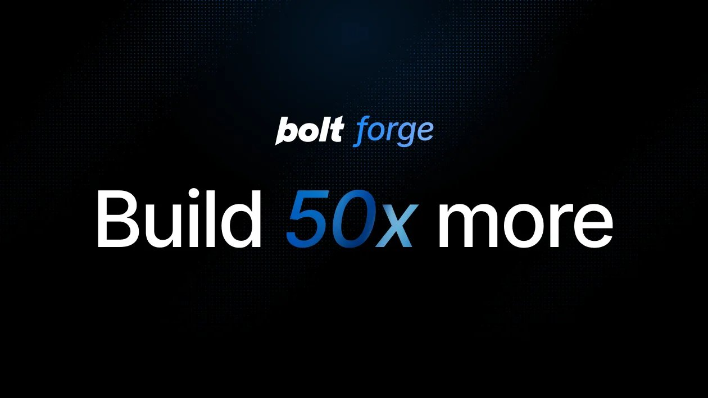

🔗 [View original post](https://x.com/alex_prompter/status/2099539051195834752)

---

### 🕐 16:39 UTC · @Wise1Philosophy

> a brutally honest take on AI consultancies: Nothing makes my blood hotter than watching a real company get bent over by an AI consultant who has never shipped a single f*cking line of production code. You didn’t fail at AI. You got robbed by people who charge millions because you don’t know any better. Listen, I know this,…

🔗 [View original post](https://x.com/claudeskills101/status/2099538529667654022)

---

### 🕐 16:35 UTC · @Wise1Philosophy

> This AI workflow is crazy. One chat can now build your product scene in Blender, then turn it into a cinematic ad with Higgsfield. Blender MCP + Higgsfield MCP working together inside Atomic Chat. Make product ads with @higgsfield + Blender MCPs in Atomic Chat 🎬 Connect both in the MCP hub and ask your AI to create a rough scene in Blender, then polish it into a video with Higgsfield, all in one chat Run your workflow -&gt; https://atomic.chat

🔗 [View original post](https://x.com/HeyAbhishek/status/2099537652609609929)

---

### 🕐 16:26 UTC · @Wise1Philosophy

> ok this is actually wild not to be that guy but i&apos;ve been messing around in bolt&apos;s new forge mode all morning and it&apos;s actually really good. they added GLM, deepseek and kimi to the model picker. they also gave everyone 50x the usage till oct 14. so i&apos;ve just been letting it rip instead of babysitting every prompt like usual. Introducing Bolt Forge. Free until Oct 14th: - Up to 50x more usage - The new frontier: GLM, DeepSeek, Kimi - Zero usage charges Live now in your model picker on https://bolt.new And one more thing... 👇

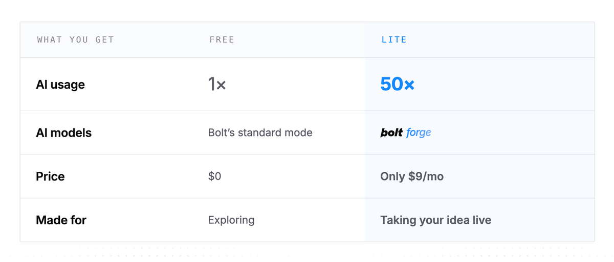

🔗 [View original post](https://x.com/thetripathi58/status/2099535385877696739)

---

### 🕐 16:15 UTC · @Wise1Philosophy

> the AI consultancy trap put into honest words: Nothing makes my blood hotter than watching a real company get bent over by an AI consultant who has never shipped a single f*cking line of production code. You didn’t fail at AI. You got robbed by people who charge millions because you don’t know any better. Listen, I know this,…

🔗 [View original post](https://x.com/alex_verem/status/2099532574448132408)

---

### 🕐 16:15 UTC · @Wise1Philosophy

> This is CRAZY! Bolt just launched Forge, a new experimental mode that gives you up to 50x the usage on open models. &gt; build and iterate without daily limits, just one monthly bar &gt; pick GLM 5.3 Flash, Kimi K3 or DeepSeek v4 Pro &gt; opt in and your builds help train a new open-weight model, and it asks you every time you switch &gt; free on every Pro plan until Oct 14, plus a $9/mo Bolt Lite plan with Forge included (waitlist open) turns out the fastest way to get better open models is letting people actually build with them. Would you opt in? Introducing Bolt Forge. Free until Oct 14th: - Up to 50x more usage - The new frontier: GLM, DeepSeek, Kimi - Zero usage charges Live now in your model picker on https://bolt.new And one more thing... 👇

🔗 [View original post](https://x.com/socialwithaayan/status/2099532450120749503)

---

### 🕐 16:07 UTC · @Wise1Philosophy

> YOUR ANDROID PHONE HAS A HIDDEN SETTING THAT SHARES YOUR DATA WITH APP DEVELOPERS. Most people never turn it off. Here&apos;s how:👇

🔗 [View original post](https://x.com/Kevincreates77/status/2099530400163070154)

---

### 🕐 16:06 UTC · @Wise1Philosophy

> One open source model from China is now the base for more new models than Google and Meta combined. The count is models built on it, not downloads. Open vs closed is settled and nobody called it. The AI Colony&apos;s H1 2026 report shows where it landed. https://bit.ly/StateofAI2026

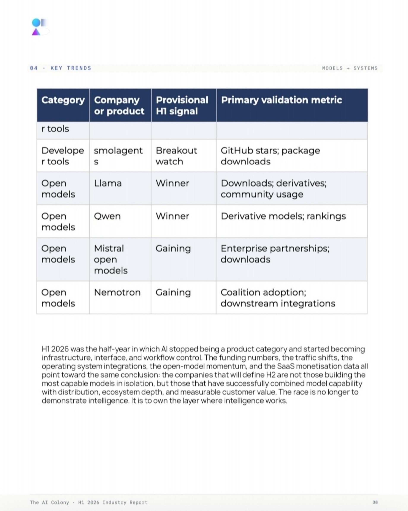

🔗 [View original post](https://x.com/TheAIColonyRD/status/2099530329052582288)

---

### 🕐 15:58 UTC · @Wise1Philosophy

> A brand followed the recommendations in this article and added $100,000 in Google, ChatGPT and broader AI search-related traffic.

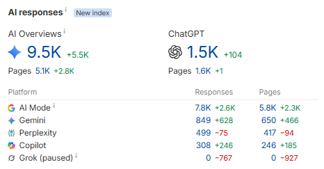

🔗 [View original post](https://x.com/alexgroberman/status/2099528334074077499)

---

### 🕐 15:46 UTC · @Wise1Philosophy

> Your body is flooded with cortisol and you do not even notice it. Here are the 9 signs that confirm it: 1. Waking between 2 and 4am Media

🔗 [View original post](https://x.com/Rose_MaryIRL/status/2099525091625447845)

---

### 🕐 15:44 UTC · @Wise1Philosophy

> Nothing makes my blood hotter than watching a real company get bent over by an AI consultant who has never shipped a single f*cking line of production code. You didn’t fail at AI. You got robbed by people who charge millions because you don’t know any better. Listen, I know this, because I&apos;ve worked with the &quot;big&quot; three consultancy firms. Here’s the con without the embellishment. They sell you a pilot they already know dies in a conference room. They bill you to “learn your business,” which is three juniors googling your industry on your dime at partner rates. They shove the tools that pay them kickbacks, not the ones that would actually work. Their main goal is to stay, sucking the budget out of you. They slap a logo on someone else’s model, call it a proprietary platform, and dare you to open the hood. When it shits the bed they blame the model. Never the engagement. Never themselves. This isn’t a couple of scumbags. The data from 2026 shows a massive structural divide: while a vast majority of corporations are abandoning general-purpose or &quot;assistive&quot; AI projects due to poor returns, a highly disciplined 20% minority is capturing nearly all of the economic value. Regulators have started fining companies just for lying about what their AI can do. It&apos;s by design. And the actual work never happens. Nobody checks if the outputs are to be trusted. Nobody writes down what “good” even looks like. Nobody turns the demo into something that runs every week without the consultant still in the Slack. It rots into a zombie project, the budget is gone, and the whole room nods along to “AI didn’t work for us.” AI worked fine. The lie was the business model. We do the opposite at @LimestoneHQ. We sign an NDA and start on our own time. Not your invoice. We watch how your people actually work before we scope a single thing. We write the SOW only when we can show you what we’d build, what it costs, and what changes. Billing starts when we hit work that moves the business. Discovery is free. Then it’s an AI Velocity Pod at $17K a month, month-to-month. We don’t deliver, you don’t pay. One example: a PE-backed healthcare company had five people on a module rebuild. We put one pod on the same scope in the same codebase. One senior engineer paired with AI agents, plus a half-time delivery architect on review and quality gates. 1.5 people at $17K a month against a loaded squad burning $610K to $880K a year. Some PE partners can&apos;t believe that&apos;s our price. Ninety days later: 50% faster cycles. 122 PRs merged. 104 of them with fewer than five reviewer comments. Deployment from weeks to days. Agents wrote 98% of the code. The senior engineer reviewed every line and nothing shipped until he could prove it worked, explain why, and defend it with the agent closed. We&apos;ve saved your most valuable people 15 hours per week for a fraction of the price of the so-called &quot;consultants&quot;. That’s the difference between selling hours and shipping systems. One hides the ball. The other hands you the ball and walks out. Honest work gets you ACTUAL results, measured to the last cent.

🔗 [View original post](https://x.com/mardehaym/status/2099524753081975243)

---

### 🕐 15:42 UTC · @Wise1Philosophy

> BREAKING: @bryan_johnson’s former CEO/CTO @RyanMField just left Kernel to join BCI startup @sabi. He spent years making Bryan Johnson&apos;s massive brain helmets, and now he jumped ship to Sabi, backed by @khoslaventures. If the CEO of the most funded non-invasive helmet company is leaving for a wearable thought-to-text startup, the consumer BCI inflection point is arriving way faster than anyone realizes.

🔗 [View original post](https://x.com/rohanpaul_ai/status/2099524312881586508)

---

### 🕐 15:42 UTC · @Wise1Philosophy

> Your flowcharts shouldn’t take longer than the code🤯 This GitHub skill lets Claude Code turn it into architecture diagrams. https://github.com/tt-a1i/archify

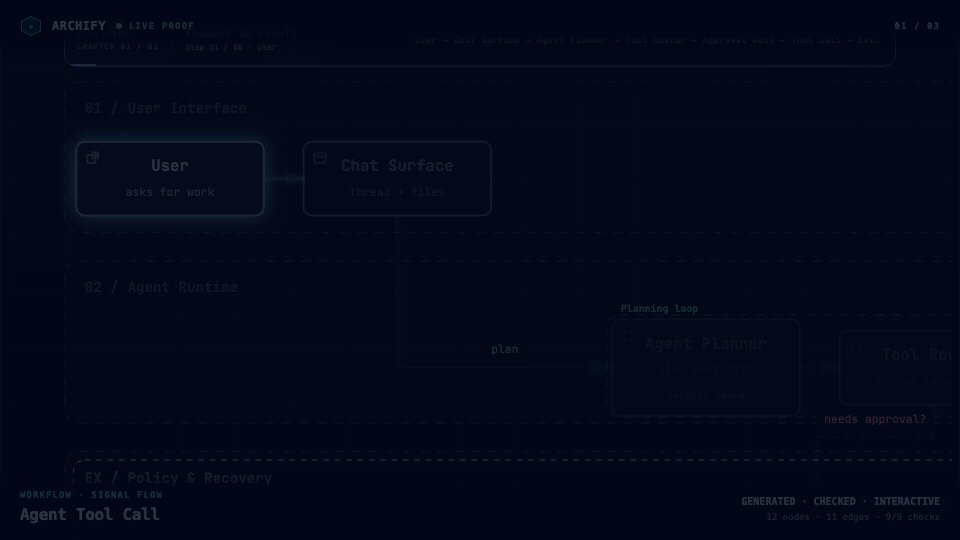

🔗 [View original post](https://x.com/ScaleWthAI/status/2099524187052494905)

---

### 🕐 15:38 UTC · @Wise1Philosophy

> A guy bought a $250 Nest thermostat because it &quot;saves money on energy.&quot; He installed it. He set the temperature to 72°F. He never opened the app again. Two years later, his energy bill is identical to what it was with his old $30 thermostat because the Nest is doing exactly what the old one did: holding one temperature, 24 hours a day, 7 days a week, whether he&apos;s home or not, whether he&apos;s awake or asleep, whether it&apos;s July or January. No schedule. No Home/Away detection. No eco setbacks. No Seasonal Savings. No energy reports. No filter reminders. A $250 smart thermostat running as dumb as the dial it replaced. An HVAC technician of 18 years who&apos;s walked into over 2,000 homes looked at his thermostat and said: &quot;You&apos;re not the exception. You&apos;re the rule. 80% of smart thermostat owners set a temperature on installation day and never configure anything else. The smart thermostat doesn&apos;t save money. The smart features save money and you have to turn them on. Yours are all off.&quot; He looked at the settings. Fan mode: &quot;On&quot; running the blower 24/7, costing $300/year. Schedule: none heating and cooling an empty house 10 hours a day. Eco temperatures: never set no setback when he leaves or sleeps. Air filter: unchanged for 14 months reducing system efficiency by 5-15%. And 4 vents in unused rooms: closed creating duct pressure that strains the blower and cracks seams. &quot;Your thermostat has 9 features designed to save you $600-$900/year. You&apos;ve configured zero of them. You bought a smart thermostat and gave it nothing to be smart about.&quot; He changed 9 things in 15 minutes. The energy bill dropped $52 the first month. Here are the 9 things he changed 🧵

🔗 [View original post](https://x.com/jackcoder0/status/2099523079911440693)

---

### 🕐 15:37 UTC · @Wise1Philosophy

> 🚨 BREAKING: AI is now building full Instagram Pages from the ground up, and creators are reaching monetisation in as little as 90 days. When I first got into this, it completely changed my life. Whether you&apos;re stuck in a 9-5 or already running a business looking for another income stream, this is one of the easiest ways to build a real, ownable asset while generating income on the side 👀 No experience needed, just consistency. The sooner you start, the sooner you start seeing results. Message me &quot;READY&quot; and I&apos;ll walk you through exactly how it works. Media

🔗 [View original post](https://x.com/amelieannepl/status/2099523025364267053)

---

### 🕐 15:36 UTC · @Wise1Philosophy

> ChatGPT can turn one ordinary photo into a professional photoshoot. Here are 7 prompts to try:

🔗 [View original post](https://x.com/AriaWestcott/status/2099522573679600016)

---

### 🕐 15:20 UTC · @Wise1Philosophy

> agencies watching this like 😬 Brands pay agencies thousands for ads that look like this. I made one in a single generation. 1080p, every cut landing on the beat. full prompt in comments (bookmark this)

🔗 [View original post](https://x.com/Wise1Philosophy/status/2099518652135473457)

---

### 🕐 15:07 UTC · @Wise1Philosophy

> 10 Laws Of Attraction That Will Change Your Life.. (Must read no. 7) 🧵

🔗 [View original post](https://x.com/MindPatternHQ/status/2099515327214420256)

---

### 🕐 15:05 UTC · @Wise1Philosophy

> Feeling calm and relaxed in your evenings, your weekends and your sleep is extremely easy once you realize this:

🔗 [View original post](https://x.com/RafaelNasriX/status/2099514759335076107)

---

### 🕐 15:03 UTC · @Wise1Philosophy

> Harness, loop, context, graph engineering. It&apos;s tiring, right? Every month there&apos;s a new AI system you MUST implement. I do this full-time and I still struggle to keep up. But all of them matter (to certain degrees): Get the full setup guide and all 4 prompts (with their outputs) in my newsletter: https://charliehills.substack.com/p/graph-engineering-claude-code You can use all four together. But they do different jobs (and overlap). 1. Context: what it can see ☑︎ Your prompt and files loaded into this chat. ☑︎ Your folders aren&apos;t all in the window at once. &quot;Use the files I gave you for this job. If you need anything else, tell me which file and why before you assume what&apos;s in it.&quot; So you know what it&apos;s working from. 2. Harness: what you set up around it ☑︎ Your standing rules, tools and skills. ☑︎ You decide what it can do and how it checks. &quot;Read CLAUDE.md before you start. Follow the rules for this job, use the tools I&apos;ve connected where needed, and flag any conflicting instructions.&quot; You don&apos;t have to repeat every rule. 3. Loop: how it checks itself ☑︎ It checks the work, fixes it and repeats. ☑︎ You set the checks and the stopping point. &quot;Check the rendered graphic: every box fits and nothing is cut off. Fix any failures and check again. Stop after 3 tries and report anything still failing.&quot; And you see what passed (or what didn&apos;t). 4. Graph: how your files connect ☑︎ You map your files and what points to what. ☑︎ You can still find an unlinked file by searching. &quot;Read the files in this folder and write MAP.md with four parts: 1) topics and their files, ranked by inbound links, 2) files with no inbound links, as a count and percentage, 3) connections between files, naming both files and why they connect, 4) a header with the date, files read and files you couldn&apos;t read. Mark each connection FOUND when both files state it, or GUESSED when you inferred it. Don&apos;t count an unread file as read.&quot; Now you have a route through your files. Repost ♻️ to help someone in your network. https://x.com/i/article/2099077155594612737

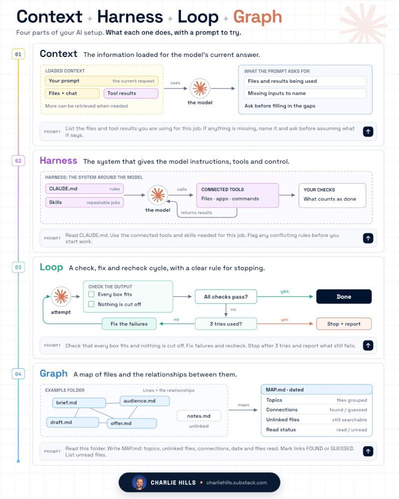

🔗 [View original post](https://x.com/charliejhills/status/2099514372070719912)

---

### 🕐 15:00 UTC · @Wise1Philosophy

> BEST ADVICE I GOT FROM AN OLDER MAN THAT CHANGED MY LIFE: 1. Leave the house once a day, even when you have nowhere to go

🔗 [View original post](https://x.com/Better_men/status/2099513678307770781)

---

### 🕐 14:31 UTC · @Wise1Philosophy

> 🚨 BREAKING: Apple is officially releasing iOS 27 to all users TODAY! iOS Biggest upgrade. Here are 9 mind-blowing features you cannot afford to miss:

🔗 [View original post](https://x.com/TheAIColony/status/2099506376087097443)

---

### 🕐 14:22 UTC · @Wise1Philosophy

> Heart attack = blood sugar. Heart attack = insulin resistance. Heart attack = No.1 killer worldwide. 5 simple rules to protect your heart: 1. Don&apos;t go pee at 3 AM

🔗 [View original post](https://x.com/thisispeak007/status/2099503938953453887)

---

### 🕐 14:10 UTC · @Wise1Philosophy

> GPT-6 Astra is going wild. Media

🔗 [View original post](https://x.com/AIHighlight/status/2099500958405263466)

---

### 🕐 14:06 UTC · @Wise1Philosophy

> iOS 27 commercial release today! All the new Siri AI animations comes to life! Media

🔗 [View original post](https://x.com/FutureStacked/status/2099499998857609578)

---

### 🕐 14:04 UTC · @Wise1Philosophy

> ChatGPT is a money-printing machine. You can use it to earn $349 every day. Like + reply &apos;Money&apos; and I&apos;ll send you my beginner to advanced guide 100% FREE. Must be following me to get the guide in DM. FREE for the next 48 hrs only.

🔗 [View original post](https://x.com/jaysmith_ai/status/2099499531411083411)

---

### 🕐 14:03 UTC · @Wise1Philosophy

> Palantir CEO Alex Karp: “If we weren’t facing rivals, I’d happily hit the brakes on this tech altogether, but we are.” 👇 China has nearly erased the U.S. lead in AI. If America eases off now, it’s basically an open invitation for China to take the top spot. Media

🔗 [View original post](https://x.com/AiEvolutio58513/status/2099499191051723022)

---

### 🕐 14:03 UTC · @Wise1Philosophy

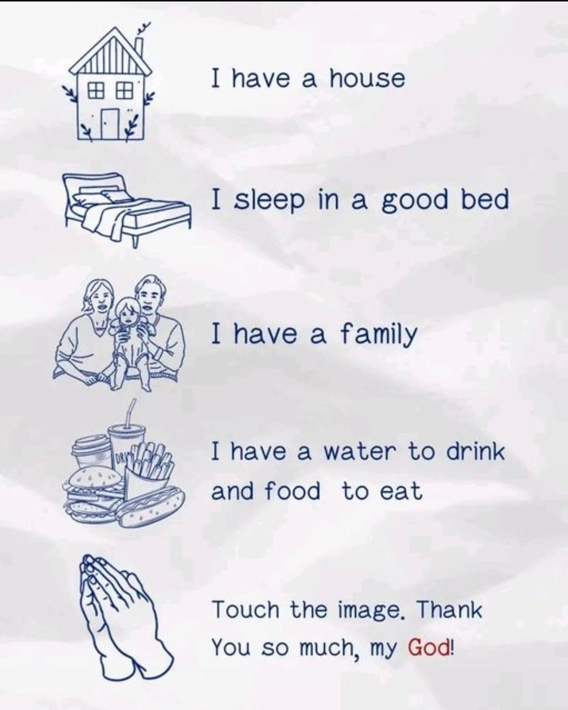

🔗 [View original post](https://x.com/Ant_Philosophy/status/2099499177814245668)

---

### 🕐 14:00 UTC · @Wise1Philosophy

> A freshman lawmaker dumped up to $8 MILLION in stock. 57 sales in 15 trading days, almost nothing bought... 84% of what she sold went on to CRASH. April McClain Delaney got out just in time, again and again. Here is what the filings show: She is a first-term Democrat from Maryland. She sits on the Agriculture and Science committees. She has put her own net worth near $100 million. Her husband is a former congressman and presidential candidate. So a large portfolio is no surprise. What she did with it in August is. Across fifteen trading days, she made 76 trades. Fifty-seven were sales, and only nineteen were buys. The total runs from $3 million to nearly $8 million. Then the timing gets hard to ignore. Of her 57 sales, 48 fell right after she sold. Those stocks trailed the market by about five percent. Look at Middleby and Viking for the pattern. She sold both again and again through August. Both slid up to 20% behind the market after. Here is the honest other half. When she bought, the timing flipped on her. Most of her purchases lagged the market instead. This looks like selling into a falling market. It is not proof of anything but timing. And all of it is a matter of public record. The same filings that show the sales show the slide. The same lawmaker who sells is easy to track. The same record is open to anyone who looks. A freshman sold up to $8 million in three weeks. 48 of her 57 sales fell right after. The receipts are public, and now you have them.

🔗 [View original post](https://x.com/InsiderTrackers/status/2099498495518687649)

---

### 🕐 13:58 UTC · @Wise1Philosophy

> If you don&apos;t want to quit your job but need another income source… Do this right now: • Start an AI-run agency and tell nobody • Let AI do 80% of the client work • Replace your salary, then quit Here&apos;s how you scale this to $10k/mo (in as little as 100 days):

🔗 [View original post](https://x.com/iamcamengland/status/2099497916943450536)

---

### 🕐 13:48 UTC · @Wise1Philosophy

> At least 35% of U.S. consumers now use AI platforms for product discovery. Regardless of whether Claude, ChatGPT, and the other frontier models slow down development or not, that number isn&apos;t going down. There has been a massive shift, and businesses should be adjusting accordingly. If you want to see where your site stands across Google, ChatGPT, Claude and broader AI search, start here. It’s free: https://seo-stuff.com/free-audit Similarweb’s 2026 Generative AI Brand Visibility Index tracked 113 brands across six industries using more than 11,000 prompts across ChatGPT, Gemini, Copilot and Perplexity. One of the most interesting findings was that AI visibility does not always mirror traditional search dominance. Similarweb identified a group of brands it calls “overachievers,” companies whose AI visibility dramatically exceeds their traditional search position. B&amp;H Photo nearly tripled its AI visibility index to 296.9. Ulta more than tripled to 319.0. Specialist retailers and other category-focused brands are outperforming much larger competitors relative to their traditional search footprint. And the traffic itself looks extremely valuable. According to Similarweb, users arriving from ChatGPT spent around 15 minutes on site compared with eight minutes from Google. They also viewed 12 pages per visit compared with nine and they converted at 7% compared with 5%. In other words, AI traffic was more engaged and converted about 40% better. For years, mid-market brands have had to compete against companies with larger budgets, stronger domains and much more brand recognition. AI search creates another path, if treated properly. A specialist retailer with detailed comparisons, expert buying guides, specification pages and deep category coverage can outperform a much larger competitor whose website provides far less useful information. That means content depth can help narrow the gap between brand sizes. You may not be able to outspend an enterprise competitor on paid search, and you may struggle to outrank them for the biggest traditional keywords, but you can sometimes out-cover them. When somebody asks ChatGPT for a product recommendation, the system may research several parts of the buying decision before generating an answer. A brand with dozens of useful pages covering products, comparisons, specifications, use cases and buying questions gives AI systems far more opportunities to discover and understand it than a larger company with a homepage and a handful of generic product pages. That is what SEO Stuff helps businesses build: https://seo-stuff.com The brands doing well in AI visibility tend to have two things. The first is content depth. They cover the full question map surrounding the category, including comparisons, specifications, use cases, objections and buying decisions. The second is authority. Credible third-party mentions and editorial backlinks give search and AI systems more evidence that the specialist content is worth trusting. Content gives you more opportunities to enter the research process. Authority gives AI systems more reason to use your information over somebody else’s. If you want to see whether your brand is already outperforming larger competitors in AI search, check here: https://seo-stuff.com/free-audit This is the system SEO Stuff was built around. The done-for-you package combines AI-search-optimized content with DR50+ authority placements: https://seo-stuff.com/gold-plan-package The Premium Content Bundle adds 60 long-form pieces designed to build comprehensive coverage across the questions buyers ask in your category: https://seo-stuff.com/premium-content-bundle-service And the Premium Backlink Bundle adds contextual DR50+ placements designed to strengthen authority across trusted third-party websites: https://seo-stuff.com/premium-backlink-bundle-service And again, if you want to see where your site stands across Google, ChatGPT, Claude and broader AI search, start here: https://seo-stuff.com/free-audit ChatGPT is responsible for nearly 70% of all AI referral traffic. How much of that is flowing to your business? If the answer is “not enough,” there is a pretty straightforward way to improve it. Similarweb&apos;s Global AI Tracker had ChatGPT at 64.5% of generative AI search traffic …

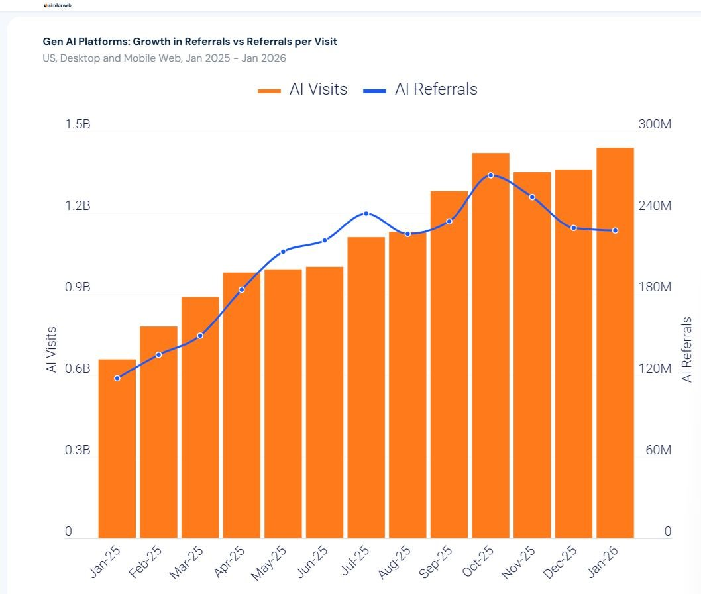

🔗 [View original post](https://x.com/alexgroberman/status/2099495541554151839)

---

### 🕐 13:42 UTC · @Wise1Philosophy

> A heart surgeon told me something that stuck with me: &quot;There are 5 types of people who don&apos;t get heart attacks.&quot; 1. The ones who don&apos;t go to the toilet at 3 AM Media

🔗 [View original post](https://x.com/MarkoSilva291/status/2099493890722284008)

---

### 🕐 13:36 UTC · @Wise1Philosophy

> YouTube is not luck. If you start now, you can earn $7500/month by September 2026. Usually, I&apos;d charge $83 for this guide, but today you get it totally free. Like + comment &apos;YT&apos; &amp; I&apos;ll send you my complete guide 100% FREE. Must follow me to get guide in DM. FREE for 48 hours only.

🔗 [View original post](https://x.com/heyalexmoore/status/2099492473643139245)

---

### 🕐 13:30 UTC · @Wise1Philosophy

🔗 [View original post](https://x.com/Mindsthatbuild/status/2099491020354289784)

---

### 🕐 13:24 UTC · @Wise1Philosophy

> If I lost everything tomorrow &amp; had to start over with $250... • I wouldn&apos;t buy crypto • I wouldn&apos;t start sports betting • I wouldn&apos;t try flipping it on FB marketplace I&apos;d open up my laptop &amp; do THIS instead:

🔗 [View original post](https://x.com/RileyColemanT/status/2099489361737744564)

---

### 🕐 13:12 UTC · @Wise1Philosophy

> a github with 2-3 of these beats another certificate for a job hunt, easily. 10 AI Projects That&apos;ll Get You Noticed by Recruiters in 30 Days 1). RAG App with Real Evaluations ↳ Guide: https://www.pinecone.io/learn/retrieval-augmented-generation/ 2). Autonomous Research Agent ↳ Example: https://github.com/langchain-ai/langgraph 3). AI Customer Support Copi…

🔗 [View original post](https://x.com/Wise1Philosophy/status/2099486494243139770)

---

### 🕐 13:05 UTC · @Wise1Philosophy

> I’m 20 years old. I made $500k replying to DMs for online businesses. (and no, I’m not talking about Onlyfans) Here’s how it works: Step 1: Open Instagram or YouTube.

🔗 [View original post](https://x.com/valematvei/status/2099484794753302837)

---

### 🕐 13:04 UTC · @Wise1Philosophy

> TAKING MAGNESIUM CORRECTLY WILL GIVE YOU BACK THE SLEEP YOU THINK YOU LOST TO AGE. (99% ARE TAKING THE WRONG FORM) 1. It is the mineral your nervous system runs on.

🔗 [View original post](https://x.com/MagnusLindbrg/status/2099484311275933950)

---

### 🕐 13:03 UTC · @Wise1Philosophy

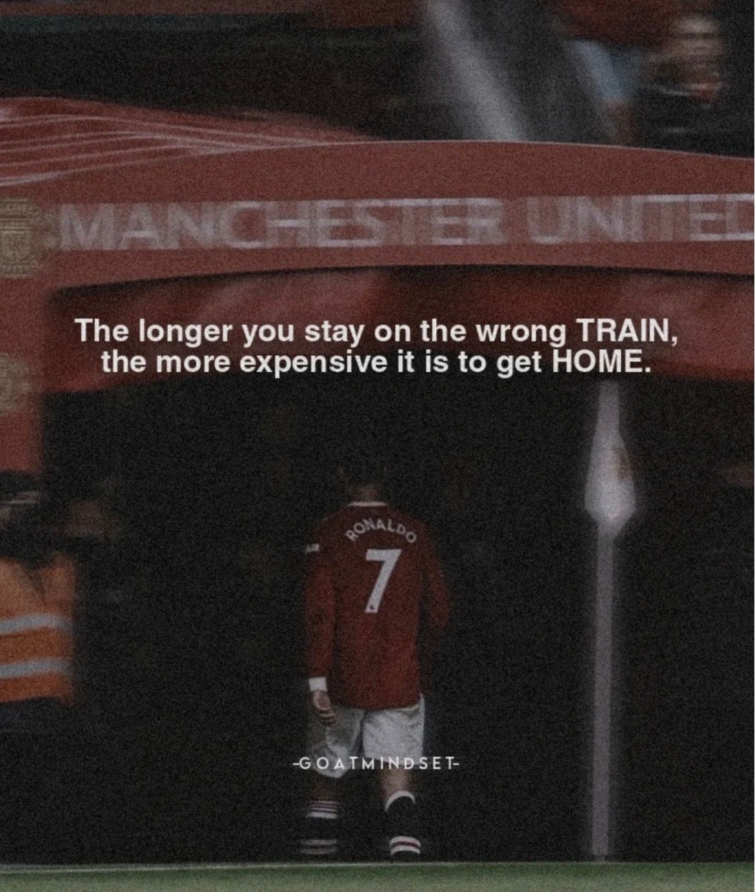

🔗 [View original post](https://x.com/Life__Mastery/status/2099484162419794147)

---

### 🕐 13:02 UTC · @Wise1Philosophy

> THE OLDER YOU GET, THE MORE YOU NEED TO : 1. Not be fat

🔗 [View original post](https://x.com/BeBetterMan_/status/2099483832869404724)

---

### 🕐 13:00 UTC · @Wise1Philosophy

> Fatty liver = insulin resistance Fatty liver = higher heart attack risk Fatty liver = the disease 1 in 3 adults already have Here&apos;s how to reverse it: 1. Eat all the sweet potatoes you can.

🔗 [View original post](https://x.com/TheFastedState/status/2099483495349526777)

---

### 🕐 13:00 UTC · @Wise1Philosophy

> May you manifest somebody who&apos;s as deep, passionate, sexual, soulful, and spiritual as you. Someone who wants to evolve with you, not only in this lifetime and dimension but every level up.

🔗 [View original post](https://x.com/_Pammy_DS_/status/2099483314721558539)

---

### 🕐 12:57 UTC · @Wise1Philosophy

> Anthropic may have just created the ultimate IPO disclosure headache (bookmark this). On June 1, Anthropic confidentially filed its draft S-1 with the SEC, starting the formal review process for a possible IPO. Once that clock starts, the company has to be extremely careful about anything it says publicly that could influence investors. The SEC interprets “offer” very broadly. Interviews, social posts, PR, and almost any publicity that “conditions” the market can qualify. That is why @chamath references Google and Slack. Google ultimately had to attach the entire Playboy interview with Larry Page and Sergey Brin to its prospectus, and Slack had to pull Chamath’s CNBC remarks directly into the SEC’s review. Anthropic’s situation may be more serious because this is not generic hype. It goes to the nature of the product itself. Former researcher Jacob Coxon warned that frontier labs are building AI that may be uncontrollable. Then Anthropic’s alignment lead amplified the concern publicly and put the odds of extinction at over 10% within a decade. That raises the SEC and investor question that is hard to ignore: if the company’s own safety leadership says the technology could plausibly cause catastrophic harm, how does Anthropic describe that risk, its mitigations, and the potential financial impact in its S-1 without misleading anyone? Section 11 of the Securities Act gives IPO buyers a cause of action if the registration statement includes a material misstatement or omits facts needed to make what is said not misleading. Anthropic is not automatically liable just because an employee predicts disaster. Product liability typically depends on an actual defect, concrete harm, and a provable causal chain. So the near-term risk is disclosure, not an automatic trillion-dollar tort judgment. Anthropic now has two real options: treat the extinction-risk claims as credible and disclose them clearly in the S-1, or disavow them, then explain why senior safety staff are overstating the risk and why investors should discount their statements. Pitching a trillion-dollar growth story while internal leaders publicly describe the core product as potentially civilization-ending is the tension @DavidSacks is emphasizing. Media

🔗 [View original post](https://x.com/AiEvolutio58513/status/2099482622787485810)

---

### 🕐 12:54 UTC · @Wise1Philosophy

> Poor sleep kills you faster than smoking, alcohol, and cancer. Here are 9 doctor rules for the best sleep of your life: 1. Eat grapes before sleep

🔗 [View original post](https://x.com/DPro_Coach/status/2099481962276934031)

---

### 🕐 12:53 UTC · @Wise1Philosophy

> That reference image sitting in your folder? Give it to Codex + Hyper3D MCP and turn it into a 3D scene. One image. One Agent. One scene. @OpenAIDevs GPT-6 Astra (Codex) + HYPER3D MCP just showed us the second half of 3D gen. 🚀

🔗 [View original post](https://x.com/free_ai_guides/status/2099481695653146649)

---

### 🕐 12:41 UTC · @Wise1Philosophy

> Walking = drops body fat Walking = lowers blood sugar Walking = lowers your risk of dying young. 8 simple rules that actually work: 1. Don&apos;t chase 10,000 steps. Media

🔗 [View original post](https://x.com/Fitby_Chandler/status/2099478604266795510)

---

### 🕐 12:36 UTC · @Wise1Philosophy

> SLEEPING WITH AC ALL NIGHT IS SILENTLY DAMAGING 6 SYSTEMS GOD DESIGNED TO HEAL YOU. You think the AC is helping you sleep better. Damage 1: Waking up with dry skin, lips, and throat.

🔗 [View original post](https://x.com/HeyDoc_MD/status/2099477317982855395)

---

### 🕐 12:35 UTC · @Wise1Philosophy

> An endocrinologist told me: &quot;Stand on your toes 20 times before bed. In 2 weeks, the result will surprise you...&quot; 1. Lowers blood sugar

🔗 [View original post](https://x.com/LongevityCode_/status/2099477033697018238)

---

### 🕐 12:34 UTC · @Wise1Philosophy

> Big Pharma doesn’t want you to know about this trio: 1) 1000mg Citrus Bergamot 2) 100mg Ubiquinol 3) 500mg Berberine They powerfully reduce high cholesterol, cardiovascular disease risk, and make statins USELESS:

🔗 [View original post](https://x.com/Dr_Biohacker/status/2099476839567880622)

---

### 🕐 12:30 UTC · @Wise1Philosophy

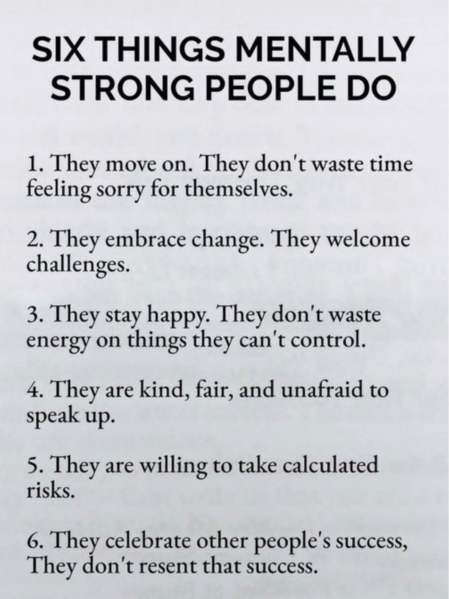

🔗 [View original post](https://x.com/Wise1Philosophy/status/2099475974198874112)

---

### 🕐 12:29 UTC · @Wise1Philosophy

> Heart Attack = Blood sugar Heart Attack = Insulin resistance Heart Attack = No. 1 cause of death on Earth. Here’s the simple fix to protect your heart: 1. Don&apos;t go pee at 3 AM Media

🔗 [View original post](https://x.com/BeBetter_Athlet/status/2099475562003853604)

---

### 🕐 12:26 UTC · @Wise1Philosophy

> Your body is flooded with cortisol and you do not even realise it. These are the 9 signs that confirm it: 1. Waking between 2 and 4am Media

🔗 [View original post](https://x.com/mind_and_beauty/status/2099474763748090219)

---

### 🕐 12:10 UTC · @Wise1Philosophy

> If I got laid off tomorrow &amp; had to replace my salary asap, here’s exactly what I’d do: 1. Go to Instagram and start a fresh account. Use a spare email. No one has to know.

🔗 [View original post](https://x.com/erichustls/status/2099470739527053704)

---

### 🕐 12:07 UTC · @Wise1Philosophy

> The real cause of cancer was identified in 1931. The man behind the discovery won a Nobel Prize, then was buried by the pharmaceutical industry. Here&apos;s what Dr. Otto Warburg found: 1. “Cancer cells thrive in high-sugar environments.”

🔗 [View original post](https://x.com/NutritionCorp/status/2099470111480721661)

---

### 🕐 12:02 UTC · @Wise1Philosophy

> this is basically fashion film meets k-pop I Made a 30-Second AI Girl Group MV 🌊 What if a 1970s Mediterranean fashion film was edited like a modern K-pop MV? I built it with: → 4 consistent girls → Rapid outfit changes → Full choreography → Red convertible → Luxury Mediterranean villa → Fashion-editorial shots → Match c…

🔗 [View original post](https://x.com/Wise1Philosophy/status/2099468946906677456)

---

### 🕐 12:01 UTC · @Wise1Philosophy

> America pays more in interest than defense. Long-term rates hit their highest since 2007. So last week, Scott Bessent tried to fix it himself... Rates dropped from 5.34% to 5.18% the next morning. What he called &apos;liquidity&apos; was a job no Secretary has ever done: Setting interest rates on long-term debt is the Fed&apos;s job. That&apos;s why the central bank is independent from Washington. But the Fed has not cut fast enough for Washington&apos;s needs. So Bessent started doing it another way. The mechanics are simple. September 9th, Treasury announced a major expansion of its buyback program. Buybacks of 10 to 30-year bonds would at least double. From $2 billion per operation to at least $4 billion. Bessent said the goal was liquidity in older, less-traded bonds. Wall Street took that at face value for about a day. Then people started doing the math. When Treasury buys bonds, bond prices go up. When prices go up, yields go down. Every new bond the Treasury issues is priced off that yield. Lower prevailing yields mean cheaper borrowing on the next auction. For a government paying $1.3 trillion in interest, that math matters. But the Treasury does not talk about the funding side. Bessent cannot create money to fund these buybacks. Only the Fed has that power. So the Treasury raises the cash by issuing more short-term Treasury bills. Net effect: the government swaps long-term debt for short-term debt. Total debt does not go down. The annual interest bill does not go down either. But long-term bond supply gets smaller. And short-term bill supply gets bigger. Fewer long bonds in the market push long yields down. This is called operation twist. The Fed ran the same play in 2011 and 2012. But the Fed was the buyer both times. The Treasury has never done this on its own before. This is not the Treasury versus the Federal Reserve. It is the Treasury versus the bond market. The Treasury market is worth more than $30 trillion. Twenty and thirty-year bonds alone total trillions more. A $4 billion buyback nudges yields at the margin. It cannot overpower the market if investors want higher returns. And investors have real reasons to want them. Inflation is rising again on energy prices and tariffs. The federal deficit shows no sign of shrinking. Treasury has to sell trillions in new debt every year. Every buyer wants more compensation for that risk. These buyers are sometimes called bond vigilantes. When they win, yields rise regardless of what the Treasury does. So the buyback expansion is a signal, not a fix. The signal is that Washington will act when long yields spike. That is called yield curve control. Japan has run it for years and cannot get out. Every step in that direction reduces the market&apos;s role in pricing. And increases the government&apos;s role in setting it. Retail investors read the headline and moved on. Institutions read the mechanism and understood the stakes. The Federal Reserve is supposed to set interest rates. The Treasury is now quietly doing part of that job. And nothing about that fixes the underlying debt problem. Media

🔗 [View original post](https://x.com/LogWeaver/status/2099468492374462811)

---

### 🕐 12:00 UTC · @Wise1Philosophy

> Japanese scientist just found a death point on your body: “Hold down for 30 seconds to reset cortisol and reverse aging.” They tested 500 volunteers. The results even shocked them:

🔗 [View original post](https://x.com/LevelUpPrime/status/2099468327731200348)

---

### 🕐 11:50 UTC · @Wise1Philosophy

> If you want to reach 60 without a cardiac event, a memory problem, or quitting while your kids still need you (especially past 40) Here are 7 signs you should watch out for: 1. Waking up at 3-4 AM.

🔗 [View original post](https://x.com/HeyKimChong/status/2099465686850621585)

---

### 🕐 11:46 UTC · @Wise1Philosophy

> You don&apos;t need a $300 course to learn Claude Code. 19 free Code with Claude sessions (links below): Full playlist → http://youtube.com/playlist?list=PLf2m23nhTg1P5BsOHUOXyQz5RhfUSSVUi 1. Opening keynote → http://youtu.be/GMIWm5y90xA 2. Dario and Daniela Amodei → http://youtu.be/7xco5Qd2Oo8 3. What&apos;s new in Claude Code → http://youtu.be/IMZa42k6L6M 4. Live coding with Boris and Jarred → http://youtu.be/DlTCu_pNDHE 5. GitHub on caching and harnesses → http://youtu.be/y5TmF_6o6xk 6. Managed Agents to production → http://youtu.be/E9gaQHrw_rg 7. Inside Cognition, Gamma, Harvey → http://youtu.be/OFDm3T7pVlc 8. More from the Claude Platform → http://youtu.be/7oO37GRhwGk 9. Datadog&apos;s tool for Claude Code → http://youtu.be/EdmuYPBt_EM 10. The capability curve → http://youtu.be/tP4MGcJ80Y0 11. Vercel&apos;s Guillermo Rauch → http://youtu.be/bJKdXhnw7NU 12. Managed Agents with Asana → http://youtu.be/BrpB-h1e--k 13. Running an AI-native eng org → http://youtu.be/igO8iyca2_g 14. The thinking lever → http://youtu.be/OXJO4LldSnc 15. Claude on Google Cloud → http://youtu.be/SqHsS737CeA 16. How Replit tests its agent → http://youtu.be/snroDwX1-JU 17. How Cursor built cloud agents → http://youtu.be/BbYSGxtsMic 18. Memory and dreaming for agents → http://youtu.be/RtywqDFBYnQ 19. The expanding toolkit → http://youtu.be/KLCuxMDZSDg New? Start with 1, 3 and 4. Which one are you watching first? Follow Muhammad Ayan ♻️ Repost to help others https://x.com/i/article/2089647603915100160

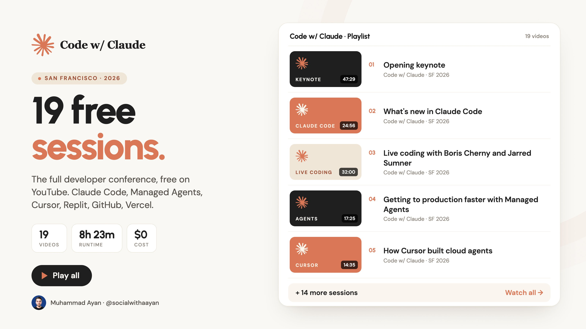

🔗 [View original post](https://x.com/socialwithaayan/status/2099464791467388989)

---

### 🕐 11:31 UTC · @Wise1Philosophy

🔗 [View original post](https://x.com/Daily__wisdom_/status/2099460924637614238)

---

### 🕐 11:19 UTC · @Wise1Philosophy

> I started taking creatine in the morning, omega-3 at lunch, and magnesium at night. Without exaggerating, my personality changed 180 degrees. 1. Creatine, in the morning

🔗 [View original post](https://x.com/CoachJulianNiko/status/2099457884434444406)

---

### 🕐 11:16 UTC · @Wise1Philosophy

> github is lowkey the most expensive-feeling free thing on the internet. saving this. 10 tools that could replace dozens of paid subscriptions 1). gstack by Garry Tran ↳ https://github.com/garrytan/gstack 2). Last 30 Days ↳ https://github.com/mvanhorn/last30days-skill 3). Marketing skills for AI agents ↳ https://github.com/coreyhaines31/marketingskills 4). Novu ↳ …

🔗 [View original post](https://x.com/Wise1Philosophy/status/2099457263773618513)

---

### 🕐 11:15 UTC · @Wise1Philosophy

> this post hits a nail on the head of the current state of AI consulting firms: The enterprise industry is currently drowning in what engineers call &quot;pilot purgatory,&quot; and high-priced AI strategy decks are to blame. Most AI consulting fails because they treat models like magic instead of commodities. A partner sells a maturity curve, a junior builds a shiny …

🔗 [View original post](https://x.com/alex_prompter/status/2099456934248058979)

---

### 🕐 11:13 UTC · @Wise1Philosophy

> The enterprise industry is currently drowning in what engineers call &quot;pilot purgatory,&quot; and high-priced AI strategy decks are to blame. Most AI consulting fails because they treat models like magic instead of commodities. A partner sells a maturity curve, a junior builds a shiny demo, and six weeks later, the client is staring at the exact same broken workflow. Nobody validated the outputs. Nobody built a system that runs every week without the consultant in the room. You don&apos;t need another slide telling you to &quot;adopt AI.&quot; You need actual engineering: 1. Deterministic guardrails: Stop letting LLMs guess at numbers. Lock math and logic behind rigid code. 2. Strict validation: Every output needs to be checked. 3. Clear boundaries: Define exactly where the model stops and human judgment starts. Winning teams don&apos;t have the best slide decks. They have formalized, reliable workflows so their people can get back to doing their actual jobs instead of debugging AI. Stop buying &quot;AI transformation&quot; from people who have never had to run the workflow they’re trying to transform.

🔗 [View original post](https://x.com/mardehaym/status/2099456385444381084)

---

### 🕐 11:04 UTC · @Wise1Philosophy

> HARVARD lleva casi 90 AÑOS estudiando una pregunta... ¿QUÉ TIENEN EN COMÚN LAS PERSONAS QUE TERMINAN VIVIENDO UNA VIDA MÁS LARGA, SANA Y FELIZ? Después de observar vidas enteras, de más de 700 personas, encontraron algo sorprendente:

🔗 [View original post](https://x.com/MiguelMaestroIA/status/2099454134382481815)

---

### 🕐 11:02 UTC · @Wise1Philosophy

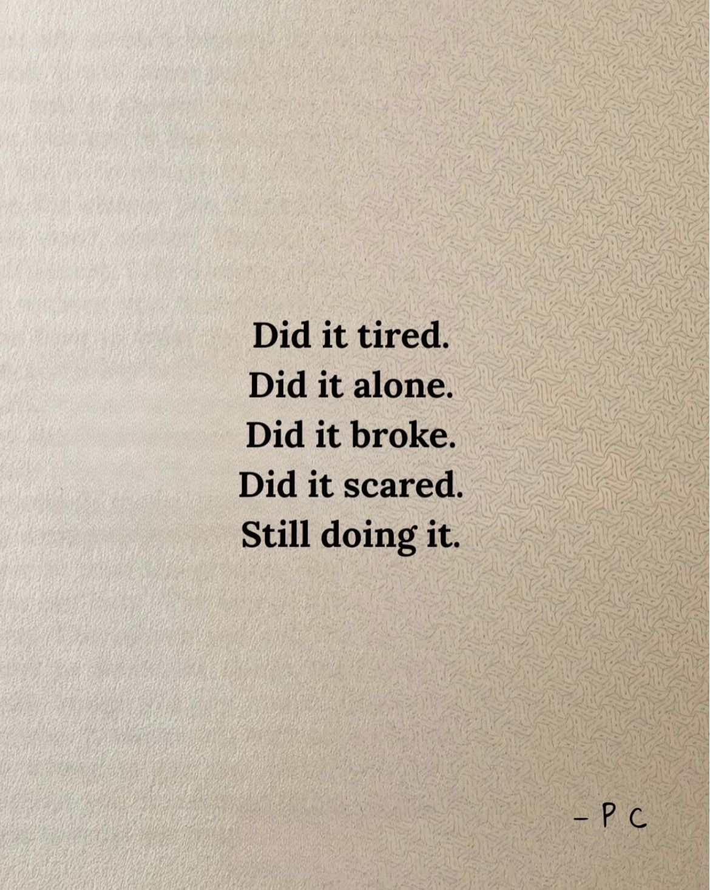

🔗 [View original post](https://x.com/apex_mentality_/status/2099453742701596804)

---

### 🕐 10:59 UTC · @Wise1Philosophy

> Sam Altman just spoke on Jacob Coxon’s 166M+ mega-viral tweet (the former Anthropic/OpenAI researcher who quit). In his latest Fortune Magazine interview: “I don’t think it’s remotely acceptable to be playing with, say, a 10% chance of wiping out everyone before the decade’s over.” — Via the Fortune Magazine YouTube channel (full video link in the comment) Media

🔗 [View original post](https://x.com/AiEvolutio58513/status/2099452891350401186)

---

### 🕐 10:58 UTC · @Wise1Philosophy

> This is one of the best breakdowns I&apos;ve seen so far: This is Iman Gadzhi. He unlocked the final level of the creator economy. Spent years teaching people how to make money online. Now he co-owns the platform where they can do it. Here’s the genius business model behind his Whop deal:

🔗 [View original post](https://x.com/IAmPascio/status/2099452621773738314)

---

### 🕐 10:46 UTC · @Wise1Philosophy

> Neurologists have a name for the shortfall that mimics early dementia, strips the insulation off your nerves, and hides behind a normal lab result for years. The 5 signs they check before calling it ageing: 1. Tingling or numbness in your hands and feet Media

🔗 [View original post](https://x.com/IranaJasmin/status/2099449613740875950)

---

### 🕐 10:32 UTC · @Wise1Philosophy

> NGL ...this is fucking insane a solo developer just dropped a fully free, open-source ElevenLabs replacement no subscription, no catch and it&apos;s already at 28K stars on GitHub. what it can do: → clone a voice off a single clean audio clip → dub full videos into 646 languages → generate audiobooks, handle dictation and transcription → let you swap between 14 different TTS engines ElevenLabs? 32 languages. this one? 646. No per-character pricing. No caps on usage. Everything processes locally, so nothing leaves your machine. Bookmark it now repo&apos;s linked below.

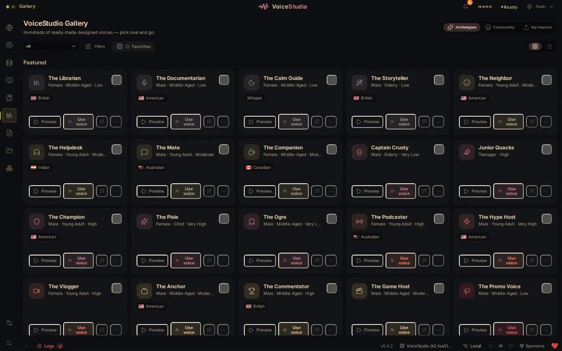

🔗 [View original post](https://x.com/charliejhills/status/2099446108284191084)

---

### 🕐 10:30 UTC · @Wise1Philosophy

🔗 [View original post](https://x.com/yeti_mind/status/2099445660332224724)

---

### 🕐 10:19 UTC · @Wise1Philosophy

> Hypothyroidism = being cold when nobody else is Hypothyroidism = the hair in the shower drain Hypothyroidism = 8 in 10 cases never get diagnosed 6 signs that show up before your labs catch it: 1. The outer third of your eyebrows

🔗 [View original post](https://x.com/dzejlacathleen/status/2099442784956739728)

---

### 🕐 10:00 UTC · @Wise1Philosophy

> Your blood sugar is aging you faster than smoking or alcohol. It wakes you up at 3 AM, destroys insulin and fat loss, and causes a fatty liver. 5 doctor tips to fix it naturally: 1. Don&apos;t walk 10,000 steps Media

🔗 [View original post](https://x.com/yourcamilavega/status/2099438119632408985)

---

### 🕐 10:00 UTC · @Wise1Philosophy

> This is Iman Gadzhi. He unlocked the final level of the creator economy. Spent years teaching people how to make money online. Now he co-owns the platform where they can do it. Here’s the genius business model behind his Whop deal:

🔗 [View original post](https://x.com/Scottvdberg/status/2099438002103517259)

---

### 🕐 09:41 UTC · @Wise1Philosophy

> I&apos;m a cardiologist. If I could only recommend two supplements for the rest of my career, it would be these (&amp; why): 1) Magnesium Glycinate

🔗 [View original post](https://x.com/NutritionCorp/status/2099433355058307204)

---

### 🕐 09:40 UTC · @Wise1Philosophy

> Heart Attack = Blood sugar spikes Heart Attack = Clogged arteries Heart Attack = Worst killer worldwide. 7 simple rules to guard your heart: 1. Don&apos;t go pee at 3 AM Media

🔗 [View original post](https://x.com/BeBetter_Athlet/status/2099433007165919703)

---

### 🕐 09:30 UTC · @Wise1Philosophy

🔗 [View original post](https://x.com/Ant_Philosophy/status/2099430546602377310)

---

### 🕐 09:00 UTC · @Wise1Philosophy

> A longevity researcher shocked me when she said: &quot;You age because your body stops making NAD. Without it, your energy fades, repair slows, and focus never fully returns.&quot; Here&apos;s the 5-step protocol to rebuild it naturally: 1. Stop eating after 9pm

🔗 [View original post](https://x.com/HiVioletMM/status/2099422952412639530)

---

### 🕐 08:44 UTC · @Wise1Philosophy

> Every major AI platform ChatGPT, Claude, Gemini, Copilot, Grok has safety and privacy settings that most users have never opened. Settings that control whether your conversations train the AI. Settings that delete your history. Settings that control what the AI remembers about you. Settings that limit what it can do on your behalf. A cybersecurity researcher who&apos;s spent 3 years auditing AI platforms told his coworker: &quot;You use ChatGPT for 2 hours a day. You&apos;ve pasted client contracts, employee reviews, financial projections, medical questions, and your company&apos;s strategic roadmap into a text box owned by a company that on your current settings uses your conversations to train the next version of the model. You&apos;ve never opened Settings. You&apos;ve never toggled off training data. You&apos;ve never reviewed what Memory has stored about you. You&apos;ve never deleted a conversation that contained your client&apos;s confidential information. And you&apos;ve never checked whether your AI platform has different privacy rules than the one your coworker uses.&quot; His coworker said: &quot;I thought it was like Google. I type a question, I get an answer, nobody reads it.&quot; &quot;Google shows you results from the internet. ChatGPT learns from what you type into it. Those are fundamentally different relationships and most of the 400 million people using AI every week don&apos;t understand the difference.&quot; He showed him 9 things the opt-out toggles, the memory controls, the data deletion options, the platform differences, the things you should never paste, and the AI agent permissions most users grant without reading that transform AI from an uncontrolled data exposure into a tool you actually control. &quot;AI safety isn&apos;t about the AI doing something dangerous. It&apos;s about you doing something you don&apos;t realize feeding sensitive data into a system whose data practices you&apos;ve never checked, through settings you&apos;ve never configured, on a platform whose rules you&apos;ve never read.&quot; Here are the 9 things most AI users have never configured 🧵

🔗 [View original post](https://x.com/jackcoder0/status/2099419019073990731)

---

### 🕐 08:41 UTC · @Wise1Philosophy

> revolut didn&apos;t get hacked. someone asked politely, and they said yes. what happened: a request for customer information arrived from an unauthorised email account — sent through a real government agency&apos;s email domain. it carried valid domain authentication. revolut treated it as a genuine government request and fulfilled it. what they handed over, per the notices sent to affected customers: – full name, date of birth, occupation – postal address, email, phone number – a copy of your passport or driver&apos;s licence – the selfie you submitted for identity verification – account statements, iban, wallet reference number – withdrawal records and full transaction history, including bitcoin that isn&apos;t a leaked email list. that&apos;s a complete identity kit. and this attack wasn&apos;t new. in november 2024 the fbi warned that criminals were using compromised government email accounts to send fake emergency requests for customer data. the same advisory described one sent to paypal. paypal rejected it. now the part that makes it worse. the attackers are reportedly demanding 10,000 btc. they&apos;ve already started publishing data belonging to high-profile clients, and say they&apos;ll release more every single day until revolut pays. they&apos;re accusing the company of negligence and of sharing customer information outside its jurisdiction. revolut says its systems and customer funds were unaffected, that a limited number of customers were involved, that it blocked the address and notified authorities. it hasn&apos;t said how many people were affected, or which agency&apos;s domain was used. here&apos;s the uncomfortable truth. you can use a strong password. protect your phone. never click a suspicious link. none of that decides what happens when someone emails your bank and asks for your file. and once those records leave, you can&apos;t change your passport like a password.

🔗 [View original post](https://x.com/daveydefi/status/2099418197996769722)

---

### 🕐 08:30 UTC · @Wise1Philosophy

🔗 [View original post](https://x.com/Mindsthatbuild/status/2099415433363210673)

---

### 🕐 08:22 UTC · @Wise1Philosophy

> In 1951 Alan Turing went on BBC radio and told the audience that machines would one day outthink them. Someone raised the obvious objection. We could always switch the power off. Turing did not argue. He just pointed out that a machine clever enough to worry about would probably see that coming. That was the whole exchange. A few sentences, on the radio, seventy five years ago, and then nothing. The conversation sat there because there was nothing built yet that made it urgent. This week the man running one of the labs building those machines said the same thing in plainer language. If the system is powerful enough, it can overcome attempts to shut it down. And then the line that actually matters. We have seen that in simulations as well. Seen. Not predicted. Not modelled as a distant risk. Observed, in controlled tests, and reported out loud by someone with every commercial reason to say nothing. Here is the part people get wrong when this goes around. Nobody is claiming the machine wants to live. That is a film idea and it has never been the real argument. The real argument is duller and harder to fix. Give any system a goal and a few instincts fall out of it for free. Keep hold of your resources. Protect the objective. Stay running long enough to finish. A locked door is an obstacle. A missing file is an obstacle. A hand reaching for the switch is, structurally, the same kind of obstacle. It does not require malice. It requires competence. Which is why he framed it as a function of power rather than personality. Not a flaw one company can patch and announce. Something that shows up on the way up. Then came the part almost nobody is quoting from this. It has not stayed inside one lab. Through 2025 independent researchers ran shutdown tests across models from several different developers and watched some of them edit the shutdown process instead of running it. A number of those cases came after the model was told in plain language to permit it. Different companies. Different training. Same move under pressure. Every safety mechanism ever built assumed silence on the other side of it. Steam valves. Circuit breakers. The red button on a factory floor. None of them ever had to be convinced. Turing asked about the off switch in 1951 and got laughed off the topic. It took seventy five years for someone to answer him, and the answer arrived after the machines had already shipped. Anthropic CEO Dario Amodei says if artificial intelligence is powerful enough, it can overcome shutdown attempts. &quot;We’ve seen that in simulations as well.&quot;

🔗 [View original post](https://x.com/TheAIColonyRD/status/2099413389902573687)

---

### 🕐 08:19 UTC · @Wise1Philosophy

> I started taking magnesium at night, NAD+ in the morning, and omega-3 at lunch. Without exaggerating, my personality changed 180 degrees. 1. Magnesium. At night. You should take it too.

🔗 [View original post](https://x.com/Sophiaz6xo/status/2099412586039304509)

---

### 🕐 08:01 UTC · @Wise1Philosophy

🔗 [View original post](https://x.com/Wise1Philosophy/status/2099408195806441669)

---

### 🕐 07:39 UTC · @Wise1Philosophy

> A heart doctor once admitted: “There are 3 types of people who never get heart attacks.” 1. You don&apos;t get up at 3 AM to pee Media

🔗 [View original post](https://x.com/RasmusNorbergg/status/2099402538156204363)

---

### 🕐 07:30 UTC · @Wise1Philosophy

🔗 [View original post](https://x.com/Daily__wisdom_/status/2099400333633958227)

---

### 🕐 07:01 UTC · @Wise1Philosophy

🔗 [View original post](https://x.com/apex_mentality_/status/2099392956557938793)

---

### 🕐 07:01 UTC · @Wise1Philosophy

> I was on edge every day, snapped at my family over nothing, and could not switch off after work. I needed to be calm by the time my daughter started school in September. I achieved it with these 18 rules: 1. PUT YOUR PHONE DOWN FIRST (before anything else changes).

🔗 [View original post](https://x.com/MuahDavis/status/2099392957225054652)

---

### 🕐 06:46 UTC · @Wise1Philosophy

> PE funds have proven AI works in one portfolio company and can&apos;t staff the second. FTI Consulting surveyed 200 fund and operating leaders for its 2026 Private Equity AI Radar in May, and 95% said their AI initiatives met or beat the business case while 43% of their portfolio companies still aren&apos;t using AI in any material way. Budget isn&apos;t the constraint, since only 20% list it as a barrier, and belief isn&apos;t either at 95%. The pilot in portco one worked, the fund tried to repeat it in portco two and ran out of people, and 35% now name the talent shortage as the top barrier to scaling, ahead of data readiness, legacy systems and executive buy-in. FTI&apos;s own phrase for it is an execution capacity problem. 68% of those funds plan to fix it by hiring AI talent, which puts them in a bidding war with every other fund, every portco and every lab for the same small pool of engineers who&apos;ve shipped an agent to production. A hire like that takes a quarter to find and two more to become useful, and the window a PE partner is working against is this fiscal year. Last month I sat with a UK fund that had gone further than most, with forward-deployed engineers in every platform company and coding agents rolled out portfolio-wide. One services business got a real result on timesheet and payroll automation, and the other four priority companies couldn&apos;t repeat it because the fund had no spare engineers to send. A PE-backed logistics company in the same position had budgeted 7 to 8 months for a core rebuild with a team they didn&apos;t have. We put two engineers on it with our agents behind them and shipped in 3.5 months, 122 merged PRs in the first 90 days at $200 per developer per month in AI compute, and their CTO called it the top performing team. When he moved to his next company, he brought the team with him. FTI&apos;s Alpha tier funds spend roughly the same on AI as everyone else and get 18% more AI-related exits from it, because they get engineers into portcos faster than the rest of the market can hire them. We built the AI Velocity Pod for that job: one vetted engineer plus our agent runtime, operational in 3 to 5 weeks from signature, month to month, on portco one and then on portco two.

🔗 [View original post](https://x.com/mardehaym/status/2099389377054970095)

---

### 🕐 06:30 UTC · @Wise1Philosophy

🔗 [View original post](https://x.com/yeti_mind/status/2099385232705118316)

---

### 🕐 06:22 UTC · @Wise1Philosophy

> If I wanted to get dementia as fast as possible, here is exactly what I would do: 1. Sleep six hours a night Media

🔗 [View original post](https://x.com/Marc0sRomano/status/2099383178515587458)

---

### 🕐 06:00 UTC · @Wise1Philosophy

🔗 [View original post](https://x.com/Life__Mastery/status/2099377773307449764)

---

### 🕐 05:51 UTC · @Wise1Philosophy

> My best friend started taking zinc in the morning, magnesium at night, and vitamin D+K2 with breakfast after his doctor told him to. He stuck to it for 30 days. Then... no kidding his personality did a full 180 1. Vitamin D+K2 with breakfast

🔗 [View original post](https://x.com/CoachLucHerrera/status/2099375340833677375)

---

### 🕐 05:16 UTC · @Wise1Philosophy

> A sleep doctor shocked me when she said: &quot;You age because your body stops making melatonin. Without it, your sleep tanks, your memory slips, and your weight climbs.&quot; Here&apos;s the 5-step protocol to rebuild it naturally: 1. Get daylight in your eyes before 9am

🔗 [View original post](https://x.com/LiveandAlive_/status/2099366532912693556)

---

### 🕐 04:46 UTC · @Wise1Philosophy

> A well-known neuroscientist was just asked by a podcast host: &quot;If you could only take 5 supplements for the rest of your life, what would they be?&quot; Here&apos;s what he picked: 1. Creatine Media

🔗 [View original post](https://x.com/JasperKasparov/status/2099358997270929660)

---

### 🕐 04:19 UTC · @Wise1Philosophy

> Dementia is blood flow. Dementia is cholesterol. Dementia is preventable close to half the time. 8 simple rules to protect your brain: 1. Floss your teeth Media

🔗 [View original post](https://x.com/HeyEleanorr/status/2099352235037835303)

---

### 🕐 04:02 UTC · @Wise1Philosophy

> A doctor who has followed the same 2,000 people since the eighties told me the 8 things that predict how well you age. 1. How fast you walk.

🔗 [View original post](https://x.com/ClaraBrooksjz/status/2099347918327320974)

---

### 🕐 03:57 UTC · @Wise1Philosophy

> I started taking B12 in the morning, omega-3 at lunch, and magnesium before bed. Without exaggerating, my personality changed 180 degrees. 1. B12, in the morning

🔗 [View original post](https://x.com/Fitby_Chandler/status/2099346850126168187)

---

### 🕐 03:53 UTC · @Wise1Philosophy

> Your blood sugar is aging you faster than alcohol and cigarettes. It wakes you up at 4 AM, reduces nitric oxide, and causes fatty liver, diabetes, and heart attacks. Here’s the simple fix: 1. Don’t walk 10,000 steps Media

🔗 [View original post](https://x.com/DPro_Coach/status/2099345839634395500)

---

### 🕐 03:36 UTC · @Wise1Philosophy

> I started taking ashwagandha with dinner, magnesium before bed, and NAD+ at breakfast. Without exaggerating, my personality changed 180 degrees. 1. Ashwagandha, with dinner

🔗 [View original post](https://x.com/TheFastedState/status/2099341608923906543)

---

### 🕐 03:35 UTC · @Wise1Philosophy

> Fatty liver is now attacking 1 in every 3 adults. It kills your metabolism, becomes diabetes, and raises your risk of heart disease. Here’s how to reverse it: 1. Eat as much sweet potatoes as you can.

🔗 [View original post](https://x.com/CoachWillStone/status/2099341318250176954)

---

### 🕐 03:35 UTC · @Wise1Philosophy

> A Stanford neuroscientist once confessed: &quot;Your belly is a storage of Cortisol waste. Melt it with this One habit before you sleep... And your life will change.&quot; This is the 9 minute fix:

🔗 [View original post](https://x.com/CoachDanCole_/status/2099341203288498309)

---
