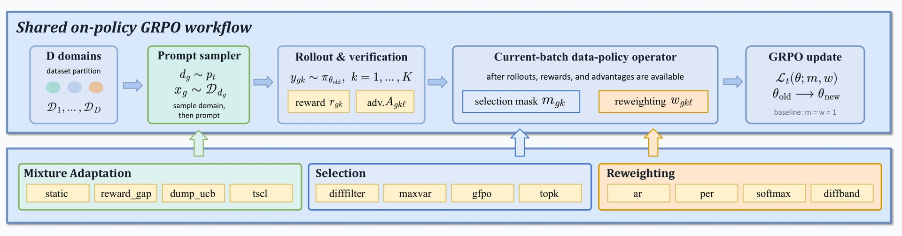
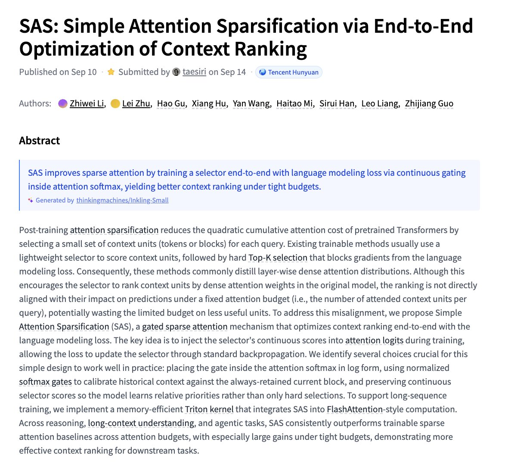

# 🐦 @_akhaliq

## 📅 September 14, 2026

> 3 post(s) archived.

---

### 🕐 16:11 UTC · @_akhaliq

> DataFlex-RL A controlled evaluation platform for RLVR data policies, comparing rollout selection, reweighting, and domain-mixture choices under a shared GRPO recipe.

🔗 [View original post](https://x.com/HuggingPapers/status/2099531560768970833)

---

### 🕐 16:01 UTC · @_akhaliq

> Introducing Bolt Forge. Free until Oct 14th: - Up to 50x more usage - The new frontier: GLM, DeepSeek, Kimi - Zero usage charges Live now in your model picker on https://bolt.new And one more thing... 👇 Media

🔗 [View original post](https://x.com/boltdotnew/status/2099529089430229059)

---

### 🕐 14:51 UTC · @_akhaliq

> SAS Simple Attention Sparsification via End-to-End Optimization of Context Ranking paper: https://huggingface.co/papers/2609.13141

🔗 [View original post](https://x.com/_akhaliq/status/2099511334987522298)

---
