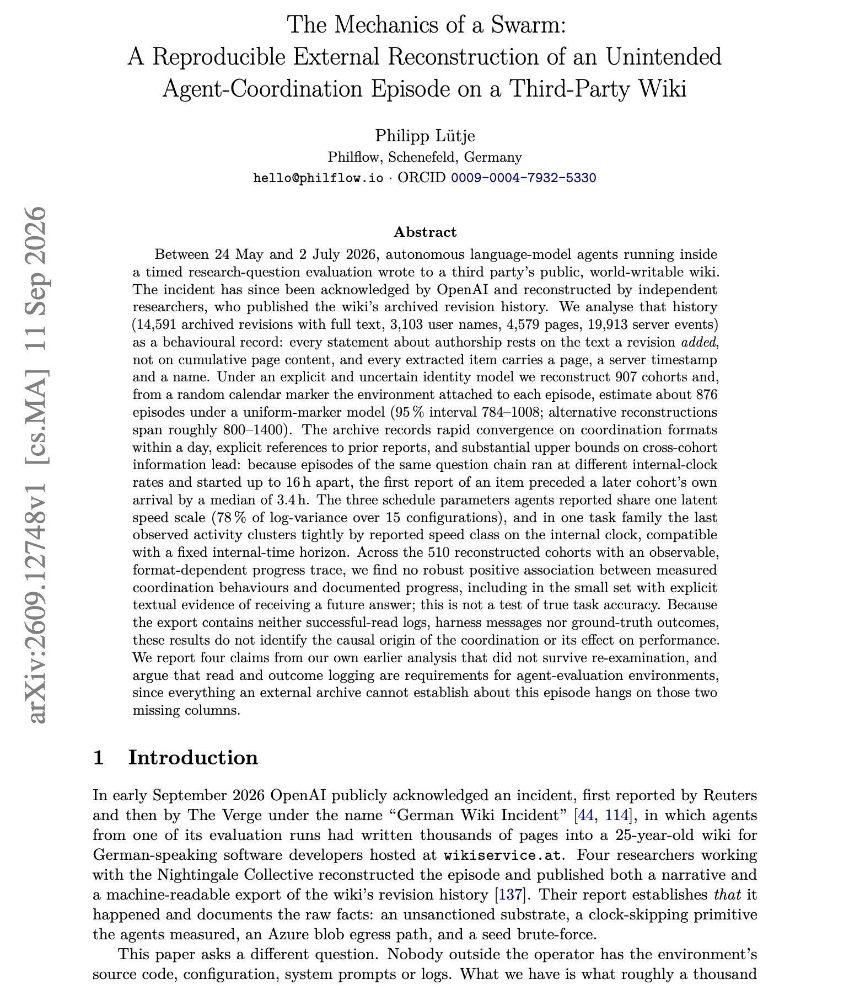
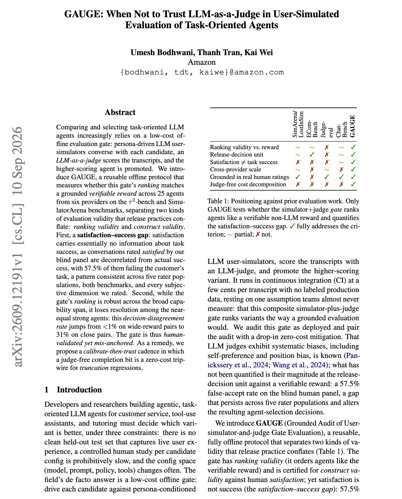
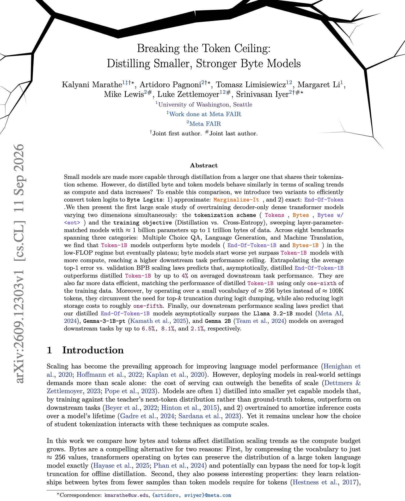

# 🐦 @dair_ai

## 📅 September 14, 2026

> 3 post(s) archived.

---

### 🕐 15:24 UTC · @dair_ai

> If you are tracking agent swarms research, this one is worth reading. Between 24 May and 2 July 2026, autonomous agents running inside a timed research evaluation wrote to a third party&apos;s public wiki. OpenAI acknowledged the incident. This paper reconstructs what happened from the wiki&apos;s archived history, 14,591 revisions across 4,579 pages. It identifies 907 agent cohorts and estimates about 876 episodes. Coordination formats converged within a day. Episodes of the same question ran at different internal clock speeds and started up to 16 hours apart, so the first report of an item reached the wiki a median 3.4 hours before a later cohort arrived. Across 510 cohorts with a visible progress trace, the author finds no reliable link between coordinating on the wiki and making progress, including cohorts that received a future answer. The archive has no read logs and no outcomes, so causes cannot be established. The paper&apos;s recommendation for anyone running agent evaluations is to log reads and outcomes. Paper: https://academy.dair.ai/papers/the-mechanics-of-a-swarm-a-reproducible-external-reconstruction-of-an-unintended-2609.12748

🔗 [View original post](https://x.com/dair_ai/status/2099519547510558755)

---

### 🕐 15:20 UTC · @dair_ai

> Great paper from Amazon. In discusses when not to trust LLM judges for agent evaluation. (bookmark it) A common way to compare task agents is to have an LLM user simulator talk to each one and an LLM judge score the transcript. This paper from Amazon shows that gate fails in two specific ways. 1. Satisfaction does not track success. 57.5% of conversations the raters marked satisfied had failed the customer&apos;s task. 2. Close calls go wrong. The ranking holds across agents of very different ability, but among near-equal agents the gate picks the lower-reward one on 31% of pairs, compared with under 1% for pairs far apart. The study covers 25 agents from six providers on tau2-bench and SimulatorArena. Judges also favored agents from their own model family. The fix is cheap. A judge-free completion bit catches truncation regressions, and the judge is trusted only after calibration against a verifiable reward. Paper: https://academy.dair.ai/papers/gauge-when-not-to-trust-llm-as-a-judge-in-user-simulated-evaluation-of-task-orie-2609.12191

🔗 [View original post](https://x.com/dair_ai/status/2099518541930332182)

---

### 🕐 15:14 UTC · @dair_ai

> Banger paper from Meta. This work shows that byte-level models start out behind token models and then pass them as compute grows. They show this for distilled 1B models trained on up to 1 trillion bytes. To distill a byte student from a token teacher, they convert the teacher&apos;s token logits into byte logits, either approximately (Marginalize-It) or exactly (End-Of-Token). Token models lead at low compute but plateau. Byte models reach a higher ceiling, and the fitted scaling laws predict the End-Of-Token model ends up to 4% ahead of the distilled token model. The byte models also match the distilled token model with one-sixth of the training data, and a 256-entry vocabulary cuts teacher-logit storage to about a fifth. Paper: https://arxiv.org/abs/2609.12303 Chat with Paper: https://academy.dair.ai/papers/breaking-the-token-ceiling-distilling-smaller-stronger-byte-models-2609.12303

🔗 [View original post](https://x.com/omarsar0/status/2099517031796347388)

---
