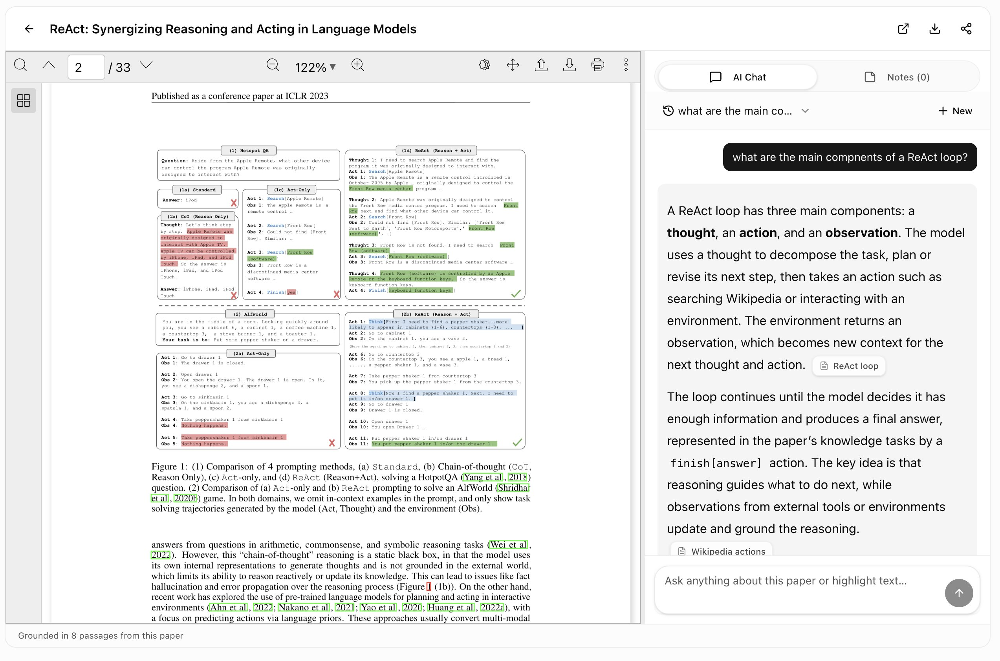

# 🐦 @dair_ai

## 📅 September 14, 2026

> 5 post(s) archived.

---

### 🕐 17:07 UTC · @dair_ai

> On building an agent harness from scratch. Got so many questions about where to get started. My short guide (feed it to your agent): If you really want to learn harnesses well, it&apos;s worth building one from scratch using a programming language (TypeScript or Python) of your choice. When I got started, I implemented my first harness using ReAct from Google: https://academy.dair.ai/papers/react-synergizing-reasoning-and-acting-in-language-models-2210.03629 At the time, I built this from scratch, but you can easily prompt your agent to consume the paper and produce a minimal implementation you can inspect and understand. You want to target having three parts: - an LLM module for all things inference, and it should ideally support several models. I used OpenRouter when I got started. This can include the system prompt, but you can also separate it out if you plan to explore context-engineering ideas more deeply. - a tools module (I recommend building them as MCP tools for interoperability, but you can design functions from scratch if you have experience). - an agent loop that encapsulates the tools and LLM. ReAct is one of the more basic loops you can implement. Primarily, aim to understand the main components and how they work with each other. Pro tips: - try to keep your system prompt minimal and experiment with different models; a mini version of all frontier lab models should be good enough to get you started. - look at the code and log things as you experiment with different tasks. You want to log inputs/outputs to the loop, inputs/outputs from LLMs, and inputs/outputs from tool calls as a starting point. Set up a simple set of diverse tasks to test your agent loop on. So with every change, you can run the tasks and inspect the results manually. Once you have a good grasp of this, you can easily add other things like skills, memory, etc., once you have a good idea of how to tune them. It helps to keep things modular if you are planning for this. I would recommend playing with memory, skill, and subagent as good next steps. If you don&apos;t want to build the components or want to start building a more serious agent harness, I recommend using the Pi SDK or LangChain harness tools. I am also going to release something soon to help with this. Let me know if you have questions. I am planning a longer write-up on this, but this should be enough to give you something to experiment with.

🔗 [View original post](https://x.com/omarsar0/status/2099545598156288292)

---

### 🕐 16:18 UTC · @dair_ai

> Now is the best time to start building with frontier models. And more chances to bring your app ideas to life. Bolt Forge brings GLM, DeepSeek, and Kimi to @boltdotnew with up to 50x more usage. That means more room to try ideas, fix mistakes, and keep building. Introducing Bolt Forge. Free until Oct 14th: - Up to 50x more usage - The new frontier: GLM, DeepSeek, Kimi - Zero usage charges Live now in your model picker on https://bolt.new And one more thing... 👇

🔗 [View original post](https://x.com/omarsar0/status/2099533286695378985)

---

### 🕐 15:24 UTC · @dair_ai

> If you are tracking agent swarms research, this one is worth reading. Between 24 May and 2 July 2026, autonomous agents running inside a timed research evaluation wrote to a third party&apos;s public wiki. OpenAI acknowledged the incident. This paper reconstructs what happened from the wiki&apos;s archived history, 14,591 revisions across 4,579 pages. It identifies 907 agent cohorts and estimates about 876 episodes. Coordination formats converged within a day. Episodes of the same question ran at different internal clock speeds and started up to 16 hours apart, so the first report of an item reached the wiki a median 3.4 hours before a later cohort arrived. Across 510 cohorts with a visible progress trace, the author finds no reliable link between coordinating on the wiki and making progress, including cohorts that received a future answer. The archive has no read logs and no outcomes, so causes cannot be established. The paper&apos;s recommendation for anyone running agent evaluations is to log reads and outcomes. Paper: https://academy.dair.ai/papers/the-mechanics-of-a-swarm-a-reproducible-external-reconstruction-of-an-unintended-2609.12748

🔗 [View original post](https://x.com/dair_ai/status/2099519547510558755)

---

### 🕐 15:20 UTC · @dair_ai

> Great paper from Amazon. In discusses when not to trust LLM judges for agent evaluation. (bookmark it) A common way to compare task agents is to have an LLM user simulator talk to each one and an LLM judge score the transcript. This paper from Amazon shows that gate fails in two specific ways. 1. Satisfaction does not track success. 57.5% of conversations the raters marked satisfied had failed the customer&apos;s task. 2. Close calls go wrong. The ranking holds across agents of very different ability, but among near-equal agents the gate picks the lower-reward one on 31% of pairs, compared with under 1% for pairs far apart. The study covers 25 agents from six providers on tau2-bench and SimulatorArena. Judges also favored agents from their own model family. The fix is cheap. A judge-free completion bit catches truncation regressions, and the judge is trusted only after calibration against a verifiable reward. Paper: https://academy.dair.ai/papers/gauge-when-not-to-trust-llm-as-a-judge-in-user-simulated-evaluation-of-task-orie-2609.12191

🔗 [View original post](https://x.com/dair_ai/status/2099518541930332182)

---

### 🕐 15:14 UTC · @dair_ai

> Banger paper from Meta. This work shows that byte-level models start out behind token models and then pass them as compute grows. They show this for distilled 1B models trained on up to 1 trillion bytes. To distill a byte student from a token teacher, they convert the teacher&apos;s token logits into byte logits, either approximately (Marginalize-It) or exactly (End-Of-Token). Token models lead at low compute but plateau. Byte models reach a higher ceiling, and the fitted scaling laws predict the End-Of-Token model ends up to 4% ahead of the distilled token model. The byte models also match the distilled token model with one-sixth of the training data, and a 256-entry vocabulary cuts teacher-logit storage to about a fifth. Paper: https://arxiv.org/abs/2609.12303 Chat with Paper: https://academy.dair.ai/papers/breaking-the-token-ceiling-distilling-smaller-stronger-byte-models-2609.12303

🔗 [View original post](https://x.com/omarsar0/status/2099517031796347388)

---
