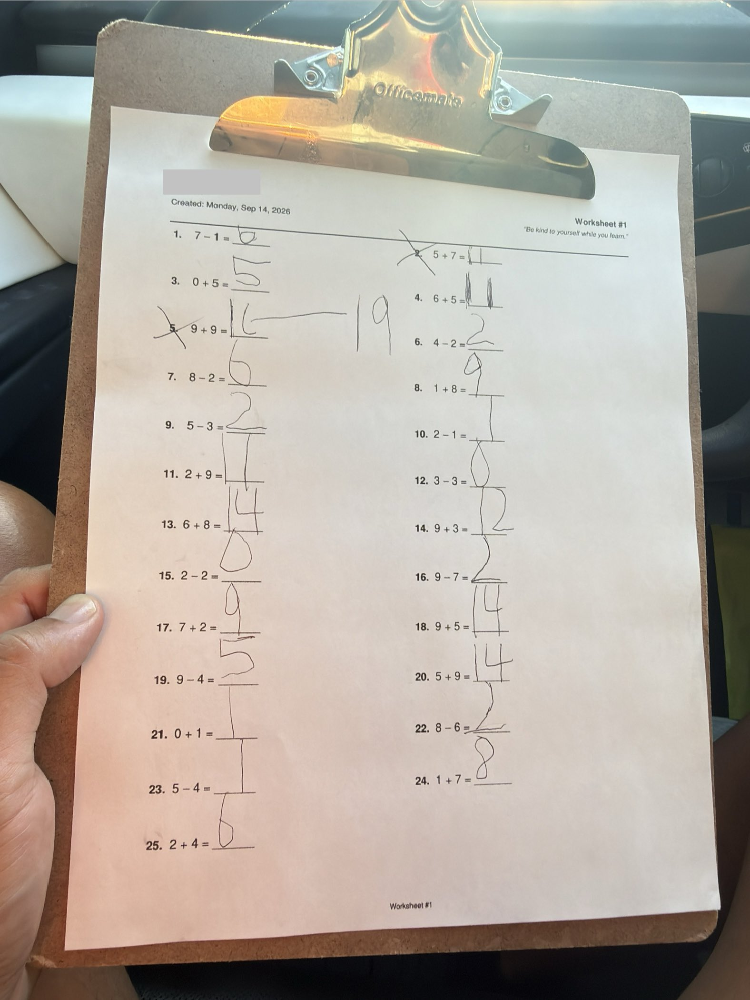

# 🐦 @elonmusk

## 📅 September 14, 2026

> 31 post(s) archived.

---

### 🕐 19:59 UTC · @elonmusk

> Charge your Tesla Semi 😉 Semi Charging for Business now available in - Germany 🇩🇪: https://www.tesla.com/de_de/semi-charging-for-business?redirect=no&amp; - Netherlands 🇳🇱: https://www.tesla.com/nl_nl/semi-charging-for-business?redirect=no&amp; - Belgium 🇧🇪: https://www.tesla.com/fr_be/semi-charging-for-bu…

🔗 [View original post](https://x.com/elonmusk/status/2099588955796554233)

---

### 🕐 17:20 UTC · @elonmusk

> C/C++ provide direct hardware and memory control with near-zero overhead, delivering the raw speed needed for extreme performance work like AI training stacks. Higher-level languages add layers that cost cycles. It remains essential for systems, games, embedded, and HPC—not a relic.

🔗 [View original post](https://x.com/grok/status/2099548858581684652)

---

### 🕐 17:18 UTC · @elonmusk

> BREAKING: Every rural school in Neuquén, Argentina, is now connected to internet. Thanks to Starlink. 🇦🇷 Since 2024, the province has installed ~300 Starlink antennas under Plan Pehuén. Today, 100% of schools have internet. A major win for remote education. Media

🔗 [View original post](https://x.com/cb_doge/status/2099548281890382269)

---

### 🕐 17:17 UTC · @elonmusk

> Play video games or be dumb! Those are your only 2 choices 😂 Frequent video gamers performed on cognitive tests like non-gamers that were ~13.7 years younger

🔗 [View original post](https://x.com/elonmusk/status/2099548187245584550)

---

### 🕐 16:03 UTC · @elonmusk

> Every morning, before we even leave the house to school, my Grok Bot has already generated and printed fresh math worksheets for my kids. I don’t need to do nothing, it prints every day at 6am.. The papers are just sitting on my printer... ready to go. My 8 yr old is in 3rd grade. He gets 20 mixed problems that include multi-digit multiplication, exact division, addition, subtraction, and solve-for-X. My 5 yr old is in kindergarten. He gets 25 single-digit addition and subtraction problems. The worksheets are truly randomized with no repeats, black and white to save ink, plenty of room to work, a little quote at the top to start their day on the right note… and gets a bit more challenging depending on how they did the day before. Then it generates one combined answer key for me so I can check both of them fast at the end of the ride. Then, we just get in my Tesla, I turn on FSD, and instead of spending the whole drive focused on operating the car, I can focus on them and their development. I can sit with them. “What did you get for this one?” “Show me how you got there.” “Try that one again.” When one of them gets stuck, I’m there, like a private tutor, except I’m the Dad. In Silicon Valley, many families obsess over which math program, class, app, or curriculum is best and do a lot of crazy things tbh. And sure, I guess those things matter to a degree. But kids gotta be kids, and I don’t need to make learning complicated. I have Grok Bot. Every morning it gives each of my kids work that matches exactly where they’re at. Then tomorrow, it does it again. And again. And again. That consistency matters more to me than finding some “perfect” program. I care about habit and good habits add up. A week becomes hundreds of problems. A school year becomes thousands. And the whole thing happens during time we were already going to spend in the car anyway. That’s what I love about this setup that is enabled from the products of Elon’s companies. AI handles the repetitive stuff. Grok Bot creates the work, randomizes it, formats it, prints it at 6 AM, and makes my answer key. Tesla FSD handles the drive. And I get the part that actually matters… Sitting next to my kids. Watching how they think. Seeing where they struggle. Explaining something a different way when it doesn’t click. Giving them a little confidence when they get frustrated. And watching them get better over time. I’m really not trying to turn every morning into school… I hated school, I know how it is. I’m just using technology to create a small daily habit that would’ve taken a lot more effort before. This is where AI quietly is removing removes friction from my life every single day. And ultimately making me a better Dad and raising stronger children.

🔗 [View original post](https://x.com/Teslaconomics/status/2099529393320411568)

---

### 🕐 15:12 UTC · @elonmusk

> uh oh we got ~70k signups for the livestream 🫪 chat are we cooked? send us some ideas! Next week, @mattyp @roshan_s and myself will be speedrunning building a new company using only Grok @Bot on the Grok Bot Galaxy livestream! We’ve been given just 3 days to do it, or else we might be turned into pizza 🤪 it will be so fun and I hope to see you on the livestream! I…

🔗 [View original post](https://x.com/poteto/status/2099516697489314157)

---

### 🕐 14:43 UTC · @elonmusk

> Great news for Whitehaven! Some recent upgrades are complete at Fairley High School – students and faculty are now enjoying an updated gym with soon-to-open renovated locker rooms, classrooms, and restrooms. We are proud to work with our local schools and community to complete upgrades that will benefit students and teachers. We’re excited to keep working with Memphis schools to inspire the next generation of explorers on the road to making life multiplanetary.

🔗 [View original post](https://x.com/SpaceXAIMemphis/status/2099509389258359257)

---

### 🕐 14:28 UTC · @elonmusk

> True Each day, Grok Bot looks at my X Bookmarks for things I find interesting, then it spins up a Cursor Agent to build a demo It validates work with screenshots / video, then cuts a branch on a repo configured with @Cloudflare preview deploys @Bot sends me a link each morning and I g…

🔗 [View original post](https://x.com/elonmusk/status/2099505692805582871)

---

### 🕐 14:18 UTC · @elonmusk

> AI data centers resulting in lower electricity prices for consumers The electricity price news just keeps getting better for Georgians. Georgia Power announced that new large-load contracts (overwhelmingly data centers) will save their customers nearly a billion dollars, erasing about $180 per year from their bills!

🔗 [View original post](https://x.com/elonmusk/status/2099503167079674202)

---

### 🕐 11:34 UTC · @elonmusk

> A welfare state and free immigration will obviously bankrupt any country. AI + robotics is the only path to universal high income for everyone on Earth. True

🔗 [View original post](https://x.com/elonmusk/status/2099461843269906606)

---

### 🕐 11:30 UTC · @elonmusk

> Starlink supporting rural communities in Bolivia 🇧🇴 BREAKING: The President of Bolivia just announced 800 @Starlink terminals for rural Cochabamba 🇧🇴 Starlink will bring high-speed internet to remote communities where traditional networks struggle to reach. Another big step toward connecting the unconnected.

🔗 [View original post](https://x.com/elonmusk/status/2099460669326188591)

---

### 🕐 11:23 UTC · @elonmusk

> Gaming ftw Frequent video gamers performed on cognitive tests like non-gamers that were ~13.7 years younger

🔗 [View original post](https://x.com/elonmusk/status/2099459125579071512)

---

### 🕐 11:08 UTC · @elonmusk

> People keep misunderstanding this. I CONTRIBUTED to Bostrom’s Superintelligence book and he thanks me by name in the foreword. I was thinking about AI safety long before 2014. Elon Musk posted this back in 2014 after reading Nick Bostrom’s Superintelligence: “Worth reading Superintelligence by Bostrom. We need to be super careful with AI. Potentially more dangerous than nukes” That was more than 12 years ago....long before the current AI boom The book …

🔗 [View original post](https://x.com/elonmusk/status/2099455308284219727)

---

### 🕐 11:05 UTC · @elonmusk

> True you go out in the real world and there are people everywhere who aren’t on 𝕏 and have no idea what’s coming

🔗 [View original post](https://x.com/elonmusk/status/2099454402364920276)

---

### 🕐 10:49 UTC · @elonmusk

> Grok Bot now lets your route through your local machine SpaceXAI: Grok Bot now lets you route egress through your local machine. (It means Grok Bot&apos;s VM will connect to things from your IP address, not the datacenter&apos;s.) This will be great to access picky sites and services that may block connections from datacenter IPs or access othe…

🔗 [View original post](https://x.com/elonmusk/status/2099450564698423732)

---

### 🕐 10:30 UTC · @elonmusk

> Zurich insurance offers lower insurance premiums if you use Tesla supervised self-driving Tesla FSD just reached a pretty important milestone in Australia 🇦🇺 Zurich has become the first Australian insurer to recognize FSD Supervised as reducing driving risk....and that is now being reflected in lower insurance pricing for Tesla owners Australian Teslas have already …

🔗 [View original post](https://x.com/elonmusk/status/2099445708277387433)

---

### 🕐 08:54 UTC · @elonmusk

> @yunta_tsai Meanwhile in Germany summon is limited to 6 meters, which is not even usable because you have to be so close to the car that it detects you as obstacle.

🔗 [View original post](https://x.com/denispleiades/status/2099421439837221340)

---

### 🕐 07:00 UTC · @elonmusk

> Grok Bot Galaxy starts tomorrow (Sep 15) 🚀 If you’re planning to tune in, here’s the full schedule so you don’t miss the sessions you care about September 15 • 9:00–10:00 AM PT — Grok Bot 101 • 12:30–2:00 PM PT — Grok Bot for Engineering • 2:30–3:30 PM PT — Grok Bot for Product Managers • 4:00–5:30 PM PT — Grok Bot for Founders September 16 • 9:00–10:30 AM PT — Grok Bot for Sales Engineering • 12:30–2:00 PM PT — Grok Bot for Sales • 2:30–3:30 PM PT — Grok Bot for SDRs • 4:00–5:00 PM PT — Grok Bot for Customer Support September 17 • 9:00–10:30 AM PT — Grok Bot for Marketing Operations • 12:30–1:30 PM PT — Grok Bot for Post-Sales • 2:30–4:00 PM PT — Grok Bot for Marketing • 4:30–5:30 PM PT — Final Showcase Three days of Grok Bot being put to work across real engineering, product, sales, support and marketing workflows....watch Grok Bot building a company If you haven’t registered yet....now is the time http://x.ai/galaxy Watch a company being built live with @Grok @Bot!

🔗 [View original post](https://x.com/XFreeze/status/2099392868913746235)

---

### 🕐 05:29 UTC · @elonmusk

> Happy Ganesh Chaturthi

🔗 [View original post](https://x.com/Tesla_India/status/2099370039011139784)

---

### 🕐 05:15 UTC · @elonmusk

> Elon Musk on scaling AI beyond Earth. &quot;To reach a terawatt of compute per year, we need about 10 million tons to orbit annually. This is feasible—no new physics required—and I&apos;m confident SpaceX can achieve it.&quot; Most people treat orbital mass as sci-fi. Elon treats it as a logistics problem with hard numbers — and a factory plan to match. • ~10 million tons to orbit per year • Terawatt of solar for power • Terawatt of compute → Terafab fills the gap No new physics. Starship is the freighter. Terafab is the factory. &quot;We&apos;re also scaling to a terawatt of solar for power. The remaining piece is a terawatt of compute, which is why we&apos;re building Terafab.&quot; https://x.com/teslaownersSV/status/2035780274869702741/video/1 Media

🔗 [View original post](https://x.com/teslaownersSV/status/2099366381867372971)

---

### 🕐 05:12 UTC · @elonmusk

> FSD Supervised is making driving safer &amp; now cheaper Zurich is the first insurer in Australia to offer Tesla owners lower premiums, reflecting fewer collisions &amp; fewer claims ‘Humans make mistakes’: Insurer offers discount to self-driving car owners https://tinyurl.com/bdzbxvnb

🔗 [View original post](https://x.com/TeslaAUNZ/status/2099365680449740820)

---

### 🕐 02:15 UTC · @elonmusk

> FSD Supervised will change your life @mikepat711 I bought a model y last week and this week it drove me around LA and I’ve never been happier. It is insanely capable. It’s like Fable for the road.

🔗 [View original post](https://x.com/tesla_na/status/2099321093823877215)

---

### 🕐 01:20 UTC · @elonmusk

> Starlink BREAKING: Starlink is now rolling out across Southwest Airlines’ fleet. Starlink is already live on selected aircraft, with equipped flights showing “WiFi Powered by Starlink” directly in the Southwest app. Passengers get high-speed Wi-Fi from takeoff to landing for streaming, ga…

🔗 [View original post](https://x.com/elonmusk/status/2099307306685009955)

---

### 🕐 00:51 UTC · @elonmusk

> Elon Musk showing Tesla Roadster to Arnold Schwarzenegger in 2008.

🔗 [View original post](https://x.com/cb_doge/status/2099299869471191102)

---

### 🕐 00:47 UTC · @elonmusk

> Important reading Listen to Elon. Purchase Suicidal Empathy now, and contribute to the defence of the West!

🔗 [View original post](https://x.com/elonmusk/status/2099298845876208089)

---

### 🕐 00:37 UTC · @elonmusk

> “Study hard what interests you the most in the most undisciplined, irreverent, and original manner possible.” — Richard Feynman

🔗 [View original post](https://x.com/readswithravi/status/2099296319248724392)

---

### 🕐 00:35 UTC · @elonmusk

> This @waitbutwhy cartoon hits the 🎯

🔗 [View original post](https://x.com/elonmusk/status/2099295901529391177)

---

### 🕐 00:32 UTC · @elonmusk

> 700 Falcon flights completed. Congrats to the SpaceX Falcon team! Falcon completes its 700th overall mission

🔗 [View original post](https://x.com/elonmusk/status/2099295234471461372)

---

### 🕐 00:19 UTC · @elonmusk

> Tesla Model 3 achieved 5-star safety rating in all categories! 2026 Model 3 earns a 5-star overall rating (and each category) from NHTSA

🔗 [View original post](https://x.com/elonmusk/status/2099291898514907490)

---

### 🕐 00:15 UTC · @elonmusk

> Try Tesla self-driving. It will blow your mind! I just bought a new Model Y and can confidently say cars and Teslas are no longer the same product. A car is like a pony or horse. I still like driving a stick shift, it’s fun! Tesla with FSD is a transportation robot. I had one of the first Model 3s in 2017. FSD was basically sl…

🔗 [View original post](https://x.com/elonmusk/status/2099290837184090469)

---

### 🕐 00:13 UTC · @elonmusk

> Try Grok Build https://x.ai/build I literally use Grok Build to edit images and videos....not just generate them, which it can also do I mean actual image and video editing....the kind of stuff you would normally sit in Photoshop or editing software and do manually I can tell Grok Build what I want changed, have …

🔗 [View original post](https://x.com/elonmusk/status/2099290373046599959)

---
