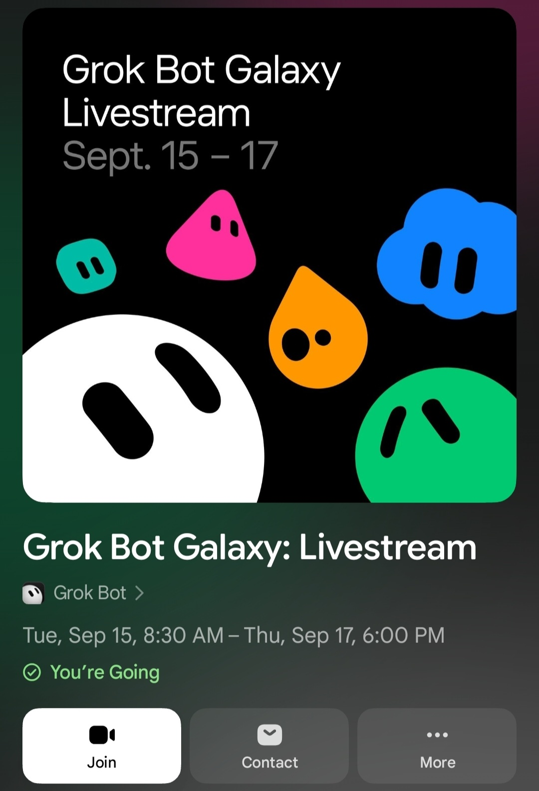
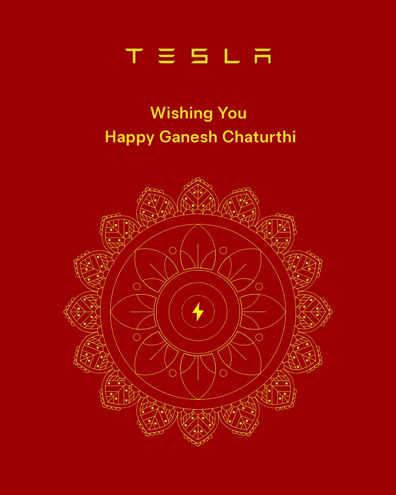
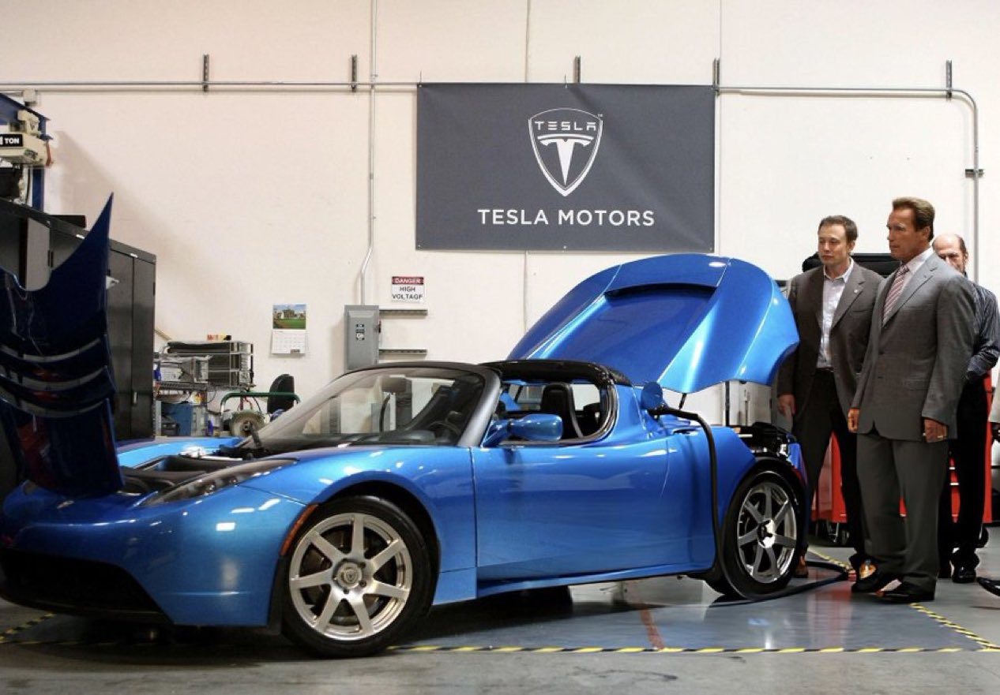
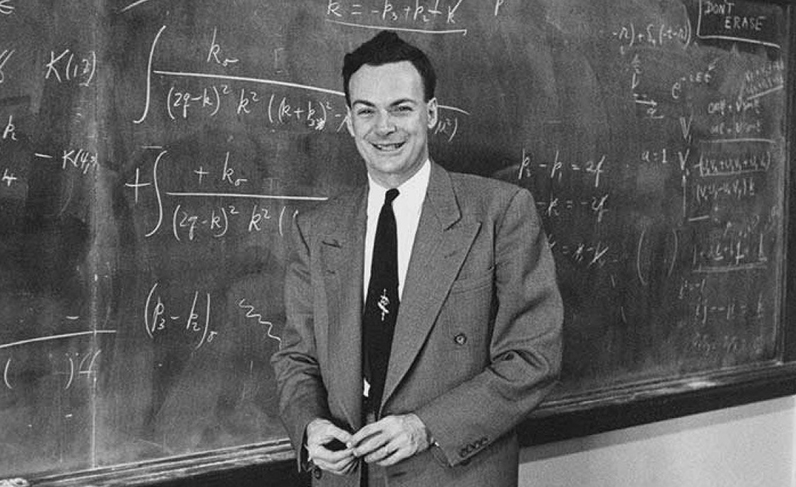
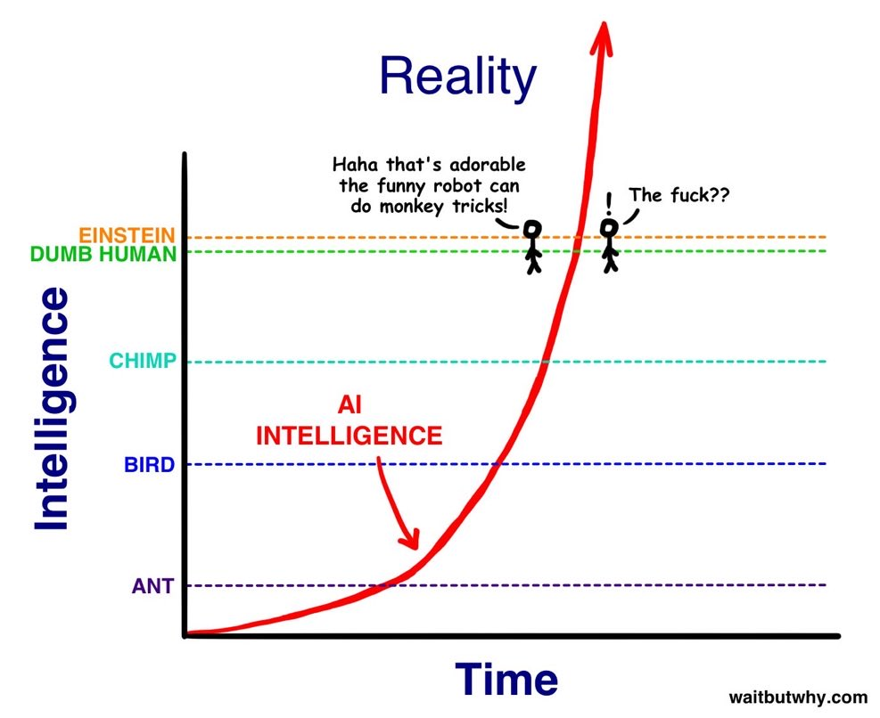
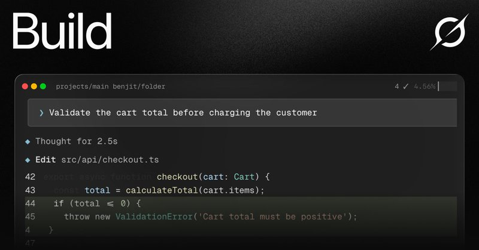

# 🐦 @elonmusk

## 📅 September 14, 2026

> 18 post(s) archived.

---

### 🕐 11:08 UTC · @elonmusk

> People keep misunderstanding this. I CONTRIBUTED to Bostrom’s Superintelligence book and he thanks me by name in the foreword. I was thinking about AI safety long before 2014. Elon Musk posted this back in 2014 after reading Nick Bostrom’s Superintelligence: “Worth reading Superintelligence by Bostrom. We need to be super careful with AI. Potentially more dangerous than nukes” That was more than 12 years ago....long before the current AI boom The book …

🔗 [View original post](https://x.com/elonmusk/status/2099455308284219727)

---

### 🕐 11:05 UTC · @elonmusk

> True you go out in the real world and there are people everywhere who aren’t on 𝕏 and have no idea what’s coming

🔗 [View original post](https://x.com/elonmusk/status/2099454402364920276)

---

### 🕐 10:49 UTC · @elonmusk

> Grok Bot now lets your route through your local machine SpaceXAI: Grok Bot now lets you route egress through your local machine. (It means Grok Bot&apos;s VM will connect to things from your IP address, not the datacenter&apos;s.) This will be great to access picky sites and services that may block connections from datacenter IPs or access othe…

🔗 [View original post](https://x.com/elonmusk/status/2099450564698423732)

---

### 🕐 10:30 UTC · @elonmusk

> Zurich insurance offers lower insurance premiums if you use Tesla supervised self-driving Tesla FSD just reached a pretty important milestone in Australia 🇦🇺 Zurich has become the first Australian insurer to recognize FSD Supervised as reducing driving risk....and that is now being reflected in lower insurance pricing for Tesla owners Australian Teslas have already …

🔗 [View original post](https://x.com/elonmusk/status/2099445708277387433)

---

### 🕐 08:54 UTC · @elonmusk

> @yunta_tsai Meanwhile in Germany summon is limited to 6 meters, which is not even usable because you have to be so close to the car that it detects you as obstacle.

🔗 [View original post](https://x.com/denispleiades/status/2099421439837221340)

---

### 🕐 07:00 UTC · @elonmusk

> Grok Bot Galaxy starts tomorrow (Sep 15) 🚀 If you’re planning to tune in, here’s the full schedule so you don’t miss the sessions you care about September 15 • 9:00–10:00 AM PT — Grok Bot 101 • 12:30–2:00 PM PT — Grok Bot for Engineering • 2:30–3:30 PM PT — Grok Bot for Product Managers • 4:00–5:30 PM PT — Grok Bot for Founders September 16 • 9:00–10:30 AM PT — Grok Bot for Sales Engineering • 12:30–2:00 PM PT — Grok Bot for Sales • 2:30–3:30 PM PT — Grok Bot for SDRs • 4:00–5:00 PM PT — Grok Bot for Customer Support September 17 • 9:00–10:30 AM PT — Grok Bot for Marketing Operations • 12:30–1:30 PM PT — Grok Bot for Post-Sales • 2:30–4:00 PM PT — Grok Bot for Marketing • 4:30–5:30 PM PT — Final Showcase Three days of Grok Bot being put to work across real engineering, product, sales, support and marketing workflows....watch Grok Bot building a company If you haven’t registered yet....now is the time http://x.ai/galaxy Watch a company being built live with @Grok @Bot!

🔗 [View original post](https://x.com/XFreeze/status/2099392868913746235)

---

### 🕐 05:29 UTC · @elonmusk

> Happy Ganesh Chaturthi

🔗 [View original post](https://x.com/Tesla_India/status/2099370039011139784)

---

### 🕐 05:12 UTC · @elonmusk

> FSD Supervised is making driving safer &amp; now cheaper Zurich is the first insurer in Australia to offer Tesla owners lower premiums, reflecting fewer collisions &amp; fewer claims ‘Humans make mistakes’: Insurer offers discount to self-driving car owners https://tinyurl.com/bdzbxvnb

🔗 [View original post](https://x.com/TeslaAUNZ/status/2099365680449740820)

---

### 🕐 02:15 UTC · @elonmusk

> FSD Supervised will change your life @mikepat711 I bought a model y last week and this week it drove me around LA and I’ve never been happier. It is insanely capable. It’s like Fable for the road.

🔗 [View original post](https://x.com/tesla_na/status/2099321093823877215)

---

### 🕐 01:20 UTC · @elonmusk

> Starlink BREAKING: Starlink is now rolling out across Southwest Airlines’ fleet. Starlink is already live on selected aircraft, with equipped flights showing “WiFi Powered by Starlink” directly in the Southwest app. Passengers get high-speed Wi-Fi from takeoff to landing for streaming, ga…

🔗 [View original post](https://x.com/elonmusk/status/2099307306685009955)

---

### 🕐 00:51 UTC · @elonmusk

> Elon Musk showing Tesla Roadster to Arnold Schwarzenegger in 2008.

🔗 [View original post](https://x.com/cb_doge/status/2099299869471191102)

---

### 🕐 00:47 UTC · @elonmusk

> Important reading Listen to Elon. Purchase Suicidal Empathy now, and contribute to the defence of the West!

🔗 [View original post](https://x.com/elonmusk/status/2099298845876208089)

---

### 🕐 00:37 UTC · @elonmusk

> “Study hard what interests you the most in the most undisciplined, irreverent, and original manner possible.” — Richard Feynman

🔗 [View original post](https://x.com/readswithravi/status/2099296319248724392)

---

### 🕐 00:35 UTC · @elonmusk

> This @waitbutwhy cartoon hits the 🎯

🔗 [View original post](https://x.com/elonmusk/status/2099295901529391177)

---

### 🕐 00:32 UTC · @elonmusk

> 700 Falcon flights completed. Congrats to the SpaceX Falcon team! Falcon completes its 700th overall mission

🔗 [View original post](https://x.com/elonmusk/status/2099295234471461372)

---

### 🕐 00:19 UTC · @elonmusk

> Tesla Model 3 achieved 5-star safety rating in all categories! 2026 Model 3 earns a 5-star overall rating (and each category) from NHTSA

🔗 [View original post](https://x.com/elonmusk/status/2099291898514907490)

---

### 🕐 00:15 UTC · @elonmusk

> Try Tesla self-driving. It will blow your mind! I just bought a new Model Y and can confidently say cars and Teslas are no longer the same product. A car is like a pony or horse. I still like driving a stick shift, it’s fun! Tesla with FSD is a transportation robot. I had one of the first Model 3s in 2017. FSD was basically sl…

🔗 [View original post](https://x.com/elonmusk/status/2099290837184090469)

---

### 🕐 00:13 UTC · @elonmusk

> Try Grok Build https://x.ai/build I literally use Grok Build to edit images and videos....not just generate them, which it can also do I mean actual image and video editing....the kind of stuff you would normally sit in Photoshop or editing software and do manually I can tell Grok Build what I want changed, have …

🔗 [View original post](https://x.com/elonmusk/status/2099290373046599959)

---
