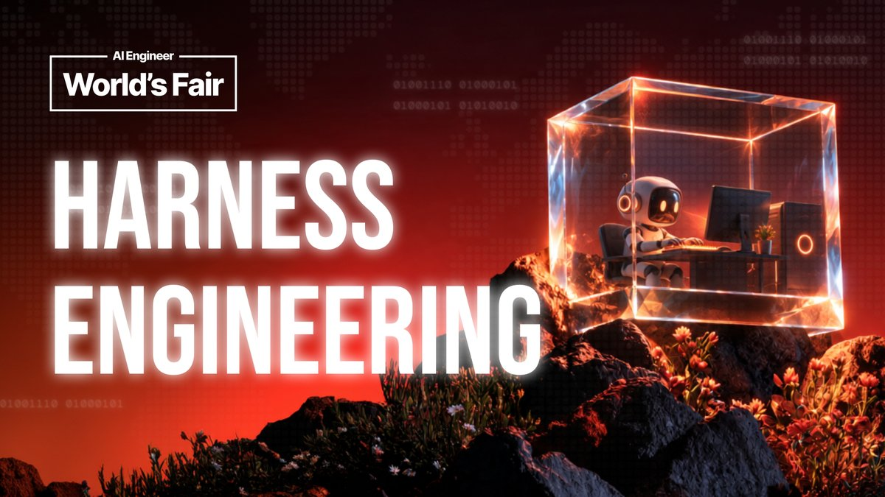
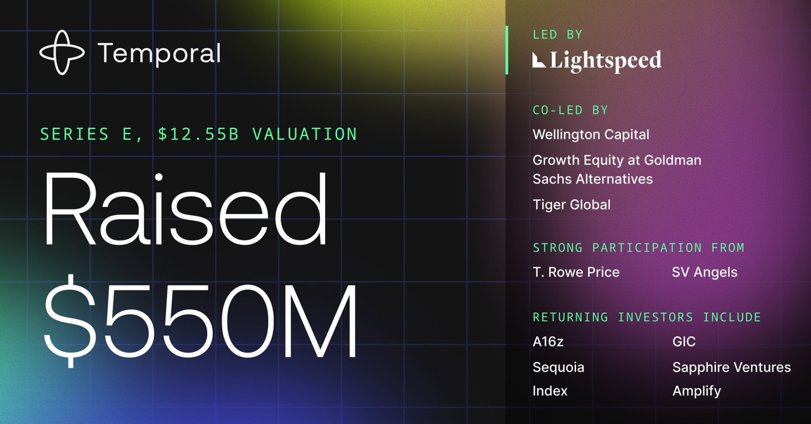

# 🐦 @swyx

## 📅 September 14, 2026

> 3 post(s) archived.

---

### 🕐 17:31 UTC · @swyx

> Live now: our Harness Engineering Track from AI Engineer World&apos;s Fair 2026. Ports, proofs, kill switches, and what is left of an agent when you remove the model. Thesis: when an agent breaks in production, the model is rarely the part that failed. https://www.youtube.com/watch?v=PXj0p_mW9nI&amp;list=PLcfpQ4tk2k0WzqWDdWkN2DnZOhtYI9jyI - 2026 State of AI Engineering: @barrnanas, Amplify Partners - The Unreasonable Effectiveness of Separating the Task from the Model: @MaximeRivest &amp; @isaacbmiller1, DSPy - How Anthropic Builds: @mikeyk, Anthropic - Tokens Should Have Jobs: @katelyn_lesse &amp; @angjiang, Anthropic - Building the Production Cage for Powerful Domain Agents: Mike Chambers, AWS - Loophole: @brendanh0gan, Morgan Stanley - Every step you take, every call you make: @vdgiselle, Restate - Agent Frameworks Considered Harmful: @remilouf, .txt - We let an AI agent execute Bash and lived to talk about it: Sarah Sanders, PostHog - No Memory, No Harness: Kay Malcolm, Oracle - How we Solved Agent Building: @andrewqu, Vercel - Agents Without Code: @_philschmid, Google DeepMind - &quot;I&apos;ve never seen anything scarier than an LLM with tool calls.&quot; @headinthebox

🔗 [View original post](https://x.com/aiDotEngineer/status/2099551501613986198)

---

### 🕐 16:18 UTC · @swyx

> I CAN FINALLY TALK ABOUT IT The last few months, my team at @g2i_ai has been helping organize AIE Code Summit in SF this Nov alongside the AIE core team. So grateful for the opportunity to run point on something this big. Huge thank you to @swyx and @liamcbride for the trust 💚 AI Engineer Code Summit is headed home to San Francisco on Nov 10-12, presented by @GoogleDeepMind and supported by @g2i_ai Bringing together hand-selected engineers, technical leaders, researchers, and power users building the next generation of AI-powered software development f…

🔗 [View original post](https://x.com/Beccalytics/status/2099533331247300879)

---

### 🕐 12:30 UTC · @swyx

> We did it again. Temporal just raised a $550M Series E round at a $12.55B valuation. Learn more about how we got here: https://temporal.io/blog/temporal-raises-usd550m-series-e-at-usd12-55b-valuation-ai

🔗 [View original post](https://x.com/temporalio/status/2099475886844072252)

---
