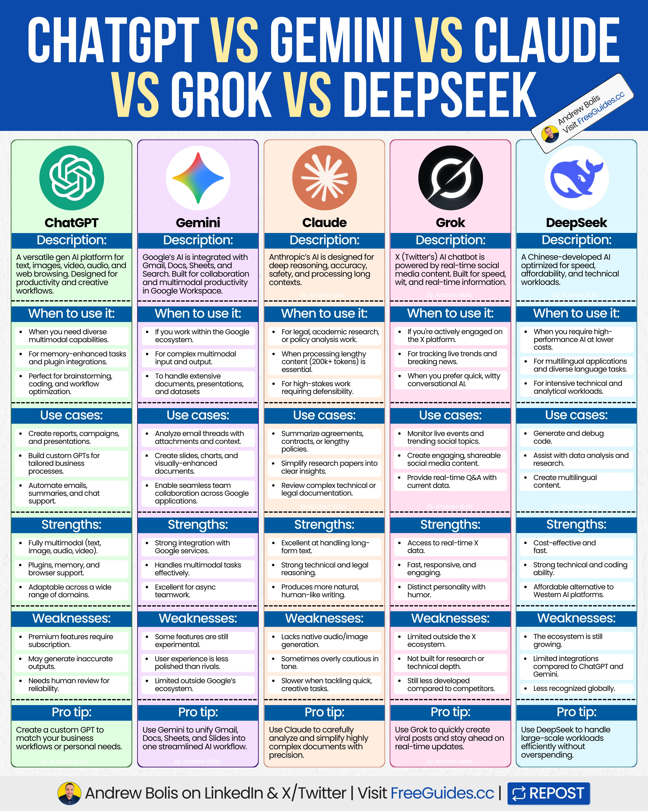
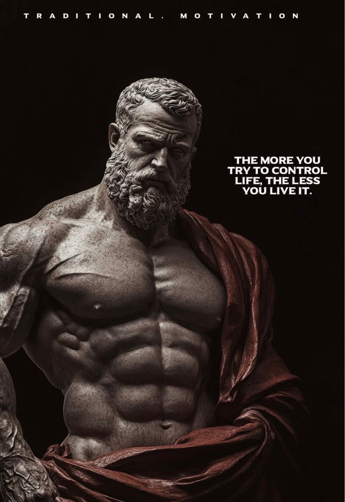
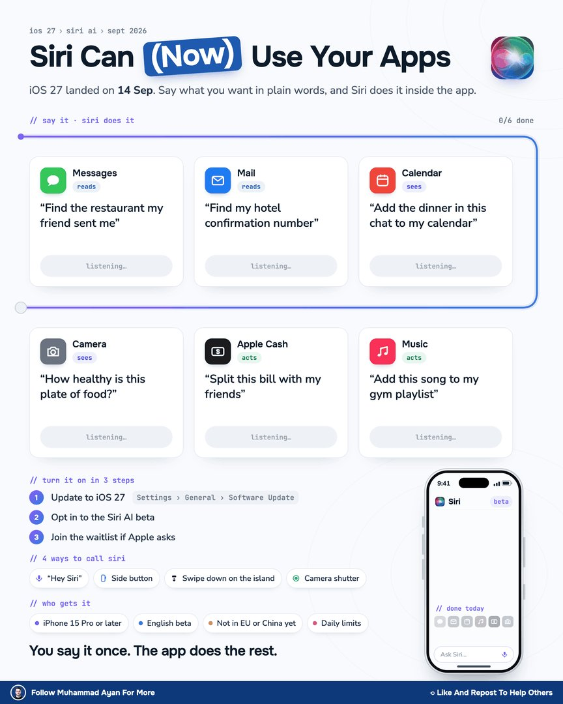
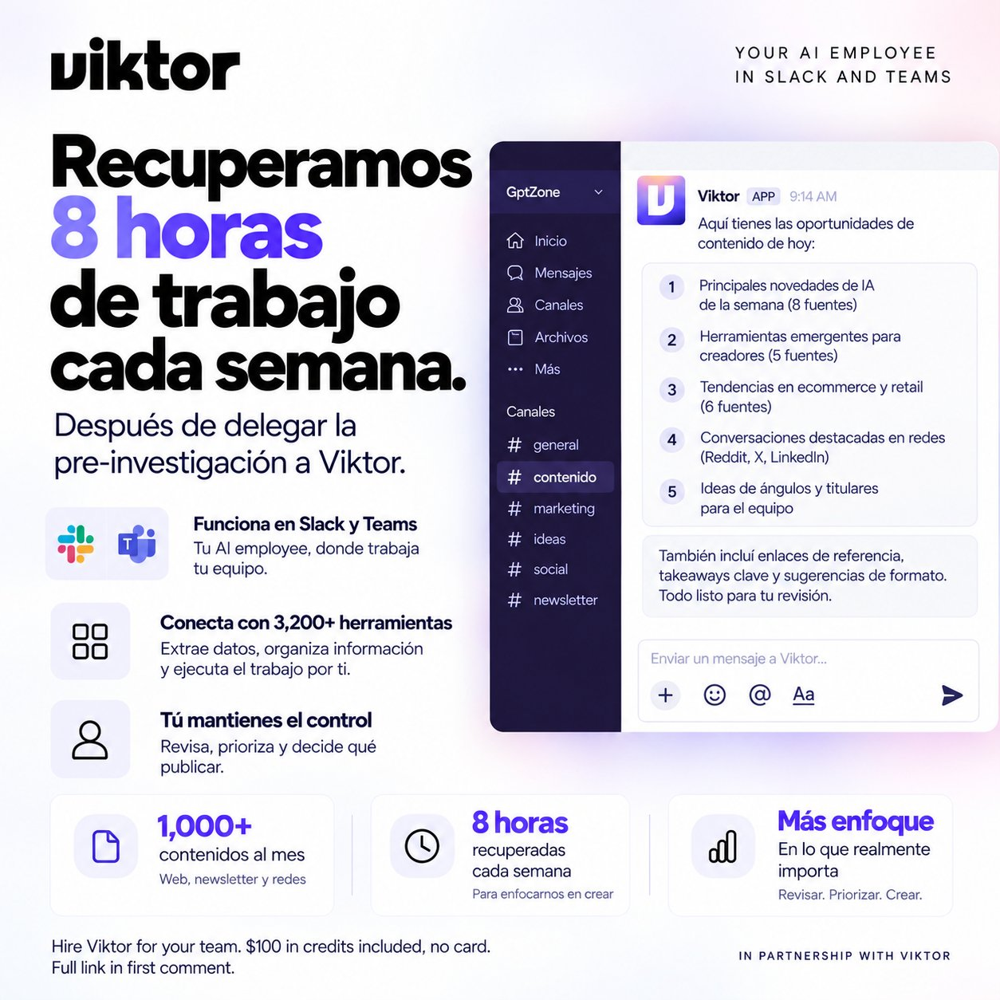
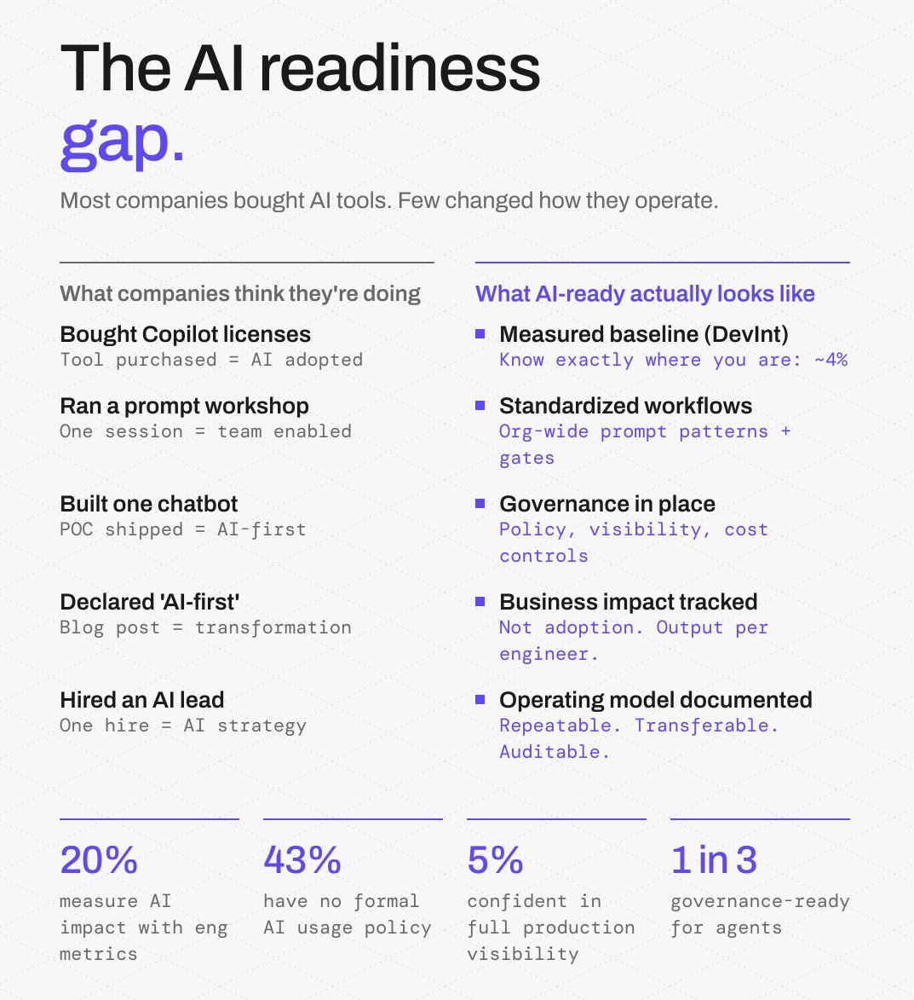
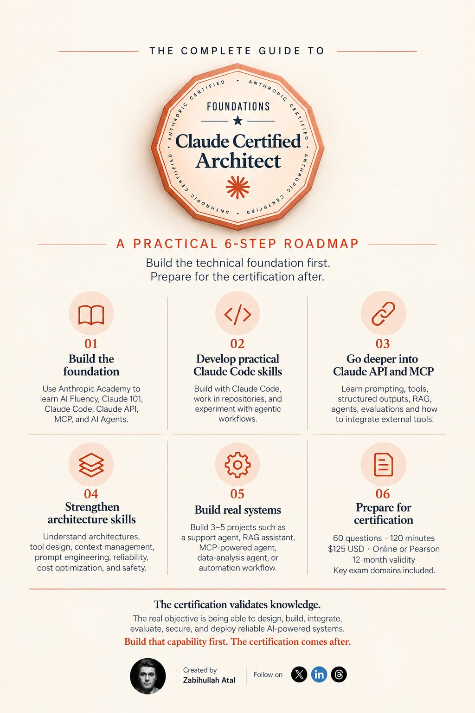
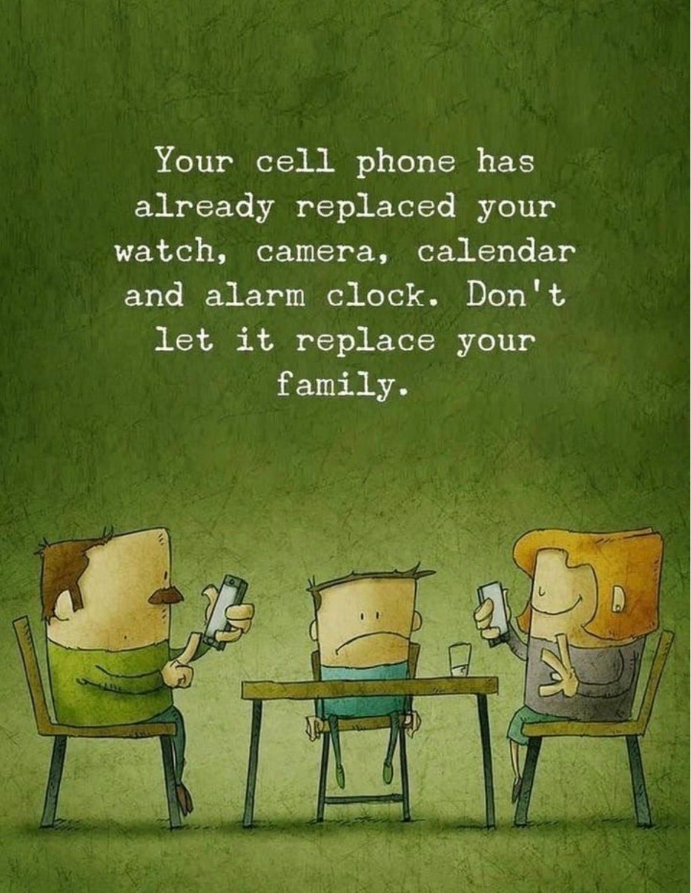
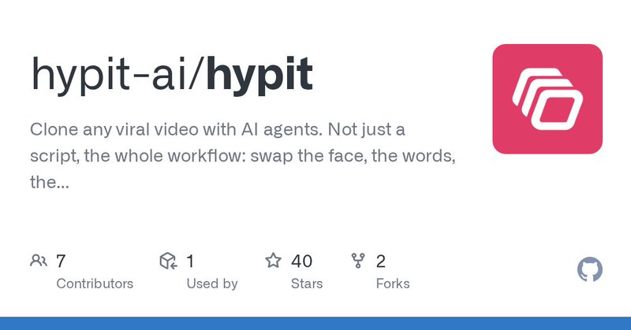

# 🐦 @Wise1Philosophy

## 📅 September 15, 2026

> 70 post(s) archived.

---

### 🕐 12:30 UTC · @Wise1Philosophy

🔗 [View original post](https://x.com/Wise1Philosophy/status/2099838301939073158)

---

### 🕐 12:24 UTC · @Wise1Philosophy

> Heart Attack = Blood sugar Heart Attack = Insulin resistance Heart Attack = No. 1 cause of death on Earth. Here’s the simple fix to protect your heart: 1. Don&apos;t go pee at 3 AM Media

🔗 [View original post](https://x.com/CoachDanCole_/status/2099836685228093481)

---

### 🕐 12:22 UTC · @Wise1Philosophy

> One Agent plus an infinite board feels very clean, Pletor Pletor just dropped 2.0 and it completely changes how commerce brands make AI visuals. It&apos;s no longer just a workflow builder, it&apos;s a creative system built around your brand. &gt; Brain: guidelines, products and past campaigns in one place &gt; set it up from your site URL, brand book …

🔗 [View original post](https://x.com/Wise1Philosophy/status/2099836223053275308)

---

### 🕐 12:08 UTC · @Wise1Philosophy

> A poor diet is the #1 reason people can&apos;t lose weight. After coaching 800+ people, the ones who lose the fastest do this same thing, pick 3-4 simple diet on repeat. Here&apos;s the list: 1. 𝐄𝐠𝐠 &amp; 𝐑𝐢𝐜𝐞 (𝐒𝐢𝐦𝐩𝐥𝐞)

🔗 [View original post](https://x.com/Fitby_Chandler/status/2099832848446582785)

---

### 🕐 12:04 UTC · @Wise1Philosophy

> THE ONLY 5 EXERCISES YOUR BODY REALLY NEEDS. 1. Walking Media

🔗 [View original post](https://x.com/BeBetter_Athlet/status/2099831828748390511)

---

### 🕐 12:01 UTC · @Wise1Philosophy

> Eating anti-inflammatory for 30 days will have your energy stable, your stomach flat, and your skin completely different. Here are the bowls that changed ever ything for me:

🔗 [View original post](https://x.com/LevelUpPrime/status/2099830993893101865)

---

### 🕐 11:50 UTC · @Wise1Philosophy

> If you wake up to pee at 3 AM, it&apos;s cortisol. If your face is puffy, it&apos;s cortisol. If your libido is 0, it&apos;s cortisol. Here are the simple tips to fix all three: 1. No food 3 hours before bed Media

🔗 [View original post](https://x.com/HeyKimChong/status/2099828097772319216)

---

### 🕐 11:30 UTC · @Wise1Philosophy

🔗 [View original post](https://x.com/Daily__wisdom_/status/2099823242814910950)

---

### 🕐 11:28 UTC · @Wise1Philosophy

> yup, photographers are gonna have some thoughts 👀 🚨 BREAKING NEWS: ChatGPT can now give your photos a full professional photoshoot glow-up Some prompts you can use are as follows:

🔗 [View original post](https://x.com/Wise1Philosophy/status/2099822725862719834)

---

### 🕐 11:16 UTC · @Wise1Philosophy

> Fatty liver now affects 1 in 3 adults. It destroys your metabolism, tracks with diabetes, and increases your risk of heart disease. Here is how to walk it back: 1. Eat all the sweet potatoes you want.

🔗 [View original post](https://x.com/CoachJulianNiko/status/2099819526875759053)

---

### 🕐 11:15 UTC · @Wise1Philosophy

> ChatGPT vs Gemini vs Claude vs Grok vs DeepSeek. Each one has different strengths and use cases. Some excel in multimodal creativity, others stand out in deep research, real-time updates or lower costs. Choosing the right one helps you become truly effective with AI. [ 🔖 bookmark this post for later ] Here&apos;s your complete guide: 1. ChatGPT The all-rounder AI is ideal for text, audio, video, code, and automation-focused tasks. 2. Gemini Ideal for Google Workspace users, with deep integration across Gmail, Docs, Sheets, and Drive. 3. Claude An AI built for safety, with long-context reasoning and strong accuracy in legal or policy-heavy work. 4. Grok A real-time social AI for X/Twitter, delivering witty answers and keeping up with breaking news. 5. DeepSeek An open-source powerhouse that’s cost-efficient, technically strong, and designed to scale. Mastering AI goes beyond picking a single “best” model. The key is matching the right tool to the right job. Save this guide. Share it. Start with one use case. 📌 Get Advanced ChatGPT Guide (free): https://bit.ly/3StIB3z 👉 Follow me @AndrewBolis for more and 🔄 Repost this to help others use AI

🔗 [View original post](https://x.com/AndrewBolis/status/2099819277889187905)

---

### 🕐 11:02 UTC · @Wise1Philosophy

🔗 [View original post](https://x.com/apex_mentality_/status/2099816205691310138)

---

### 🕐 10:56 UTC · @Wise1Philosophy

> a16z’s David George argues ai is pushing the power law into overdrive because money itself can now stack a company’s edge: “it’s pretty obvious the power law is sharper today than it’s been for the past 10 to 20 years of tech investing, maybe since the rise of network effect consumer winners.” “we’ve always lived with increasing returns… reputation, resource buildup, and other forms of accumulation create defensible advantages.” “all of that still holds. but with the labs, for the first time in my career, you can basically pour capital into a company and that spend directly amplifies the lead.” “traditionally, the fastest way to ruin a startup is to swamp it with cash, hire 1,000 people, and end up with coordination drag, overhead, and teams pulling in different directions… because humans can’t scale execution fast enough.” “but this time it’s different. you can funnel dollars into compute, and the compute turns into better products and stronger businesses. so it’s not shocking the power law looks more extreme. in ai, scale economies are very real right now, and i expect that to keep being true.” Media

🔗 [View original post](https://x.com/AiEvolutio58513/status/2099814555195228437)

---

### 🕐 10:46 UTC · @Wise1Philosophy

> 7 early signs that your liver is quietly starting to fail (and what to do about it): 1. Itching, especially at night

🔗 [View original post](https://x.com/IranaJasmin/status/2099811975517950447)

---

### 🕐 10:33 UTC · @Wise1Philosophy

> You don&apos;t need to open 6 apps for small jobs. Siri AI does all 6 for you (in plain words): MESSAGES Finds the restaurant a friend sent you. No scrolling back through three weeks of chat. MAIL Pulls up your hotel confirmation number. Even from the email you forgot about. CALENDAR Adds the dinner plan sitting on your screen. You don&apos;t retype a single detail. MUSIC Adds the song to your gym playlist. You just say which one. APPLE CASH Splits the bill with your friends. Nobody gets the calculator out. CAMERA Tells you how healthy the plate in front of you is. Point, ask, done. iOS 27 brought this on 14 Sep, and it&apos;s a beta. You&apos;ll need an iPhone 15 Pro or later. It&apos;s English first, and not in the EU or China yet. Expect daily limits, with paid Expanded Access. To try it, update to iOS 27 and opt in. Join the waitlist if Apple puts you on one. The big change is simple. Old Siri answered you. Siri AI reads your apps, sees your screen and acts. Start with the one you do ten times a day. Follow Muhammad Ayan ♻️ Repost to help others Which job would you give Siri first? https://x.com/i/article/2097274811928231936

🔗 [View original post](https://x.com/socialwithaayan/status/2099808865424711783)

---

### 🕐 10:30 UTC · @Wise1Philosophy

> YOUR MACBOOK HAS BEEN SECRETLY SLOWING DOWN FOR MONTHS. Here&apos;s the one setting that fixes it:👇

🔗 [View original post](https://x.com/Kevincreates77/status/2099808132122001748)

---

### 🕐 10:30 UTC · @Wise1Philosophy

🔗 [View original post](https://x.com/yeti_mind/status/2099808078791139356)

---

### 🕐 10:29 UTC · @Wise1Philosophy

> What if we got to experience Los Santos like this in GTA 6? This feels like a game I could spend hours playing. Created with @itsPolloAI #PolloAI #GTA6 #AIVideo Media

🔗 [View original post](https://x.com/thetripathi58/status/2099807810880221459)

---

### 🕐 10:26 UTC · @Wise1Philosophy

> You can make around $800/month with ChatGPT, a laptop, an internet connection, and just 60 minutes a day. I know it sounds crazy, but AI has created some very practical ways to make money online. Here’s the simple approach 🧵👇

🔗 [View original post](https://x.com/REXO_TECH/status/2099807075773903320)

---

### 🕐 10:19 UTC · @Wise1Philosophy

> 🚨 BREAKING NEWS: Apple has officially released iOS 27 for all users! One of the biggest updates to iOS to date. Here are 9 new features you shouldn&apos;t miss:

🔗 [View original post](https://x.com/AriaWestcott/status/2099805368889016536)

---

### 🕐 10:19 UTC · @Wise1Philosophy

> The 3pm crash in your energy, your focus and your mood is extremely easy to fix once you realize this:

🔗 [View original post](https://x.com/dzejlacathleen/status/2099805173220819384)

---

### 🕐 10:06 UTC · @Wise1Philosophy

> Recuperamos 8 horas de trabajo cada semana después de delegar la pre-investigación a Viktor. Cada día aparecen cientos de noticias, herramientas y novedades sobre IA. En GptZone, nuestro problema ya no era encontrar información. Era saber cuál merecía convertirse en contenido. Entre medios, blogs, newsletters, lanzamientos, redes y comunidades, podíamos pasar buena parte del día buscando. Y durante mucho tiempo lo hicimos. Abrir fuentes. Revisar novedades. Descartar ruido. Comprobar si ya habíamos hablado del tema. Buscar un ángulo. Y finalmente decidir qué merecía llegar a nuestra web, newsletter o redes. La IA nos ayudaba, pero había algo bastante absurdo: para preguntarle qué era importante, primero teníamos que encontrar nosotros lo importante. Así que cambiamos el enfoque con Viktor. En lugar de usarlo para crear contenido, empezamos a delegarle el trabajo que ocurre antes de crearlo. Le dimos nuestras fuentes y criterios de investigación. Viktor revisó las fuentes, organizó las señales, identificó patrones y preparó oportunidades editoriales dentro de Slack. El resultado fue 8 horas recuperadas cada semana para el equipo, mientras seguíamos publicando más de 1.000 contenidos al mes entre web, newsletter y redes. Y eso es lo importante: Viktor no decide qué publicamos. Nos entrega el trabajo previo para que nuestro equipo pueda revisar, priorizar y tomar la decisión final. Viktor trabaja dentro de Slack y Microsoft Teams y conecta con 3.200+ herramientas. Un chatbot espera a que encuentres algo y le hagas una pregunta. Un AI employee puede encargarse del trabajo que ocurre antes de esa pregunta. Menos tiempo buscando. Más tiempo creando. Hire @viktor_com for your team. $100 in credits included, no card. Full link in first comment. In partnership with Viktor.

🔗 [View original post](https://x.com/MiguelMaestroIA/status/2099801937738608667)

---

### 🕐 10:00 UTC · @Wise1Philosophy

> TAKING MAGNESIUM CORRECTLY WILL STOP THE CRAMPS YOU HAVE BEEN BLAMING ON DEHYDRATION. (99% ARE TAKING THE WRONG FORM)

🔗 [View original post](https://x.com/yourcamilavega/status/2099800426942173288)

---

### 🕐 09:51 UTC · @Wise1Philosophy

> 🚨 SOMEONE BUILT A FULL GAME ALONE No team. No 3D modeling skills. He talked to an AI and it wrote the code and built the game. You can play it right now in your browser. No download. No install. Click in and you&apos;re on a bike: throwing papers, dodging dogs. Not a tech demo. A real game. The numbers: - Tokens used: 1.56 billion - Time to build: 39 hours - Cost in AI usage: $2,175 - Commits: 90 - Days from start to launch: 11 He ran two separate chats the whole time: One handled how the game plays. The other handled how it looks. The AI was fine at houses and trees. Faces were the problem so he made a character in a different tool, turned it into a 3D model, and handed it back to the AI to finish. What actually surprised him: the AI took screenshots of its own work, checked them, and fixed most mistakes on its own. One guy, one AI, a few days. Media

🔗 [View original post](https://x.com/charliejhills/status/2099798372941242629)

---

### 🕐 09:50 UTC · @Wise1Philosophy

> This is the cutest thing you&apos;ll see today and it was made entirely with AI.

🔗 [View original post](https://x.com/AIHighlight/status/2099797921549979769)

---

### 🕐 09:30 UTC · @Wise1Philosophy

🔗 [View original post](https://x.com/Ant_Philosophy/status/2099792934782583022)

---

### 🕐 09:00 UTC · @Wise1Philosophy

> Having energy in the morning, the afternoon and the evening is extremely easy once you realize this:

🔗 [View original post](https://x.com/HiVioletMM/status/2099785323840778631)

---

### 🕐 08:31 UTC · @Wise1Philosophy

> someone just dropped a 21-minute masterclass on turning $1k into $1m trading memecoins. no fluff. just the full strategy, mistakes, entries and what most people keep getting wrong. if you trade memecoins, this is worth watching. Media

🔗 [View original post](https://x.com/daveydefi/status/2099778187089621073)

---

### 🕐 08:30 UTC · @Wise1Philosophy

🔗 [View original post](https://x.com/Mindsthatbuild/status/2099777822659129768)

---

### 🕐 08:19 UTC · @Wise1Philosophy

> Two warriors face off in a cinematic bamboo forest, with every strike, block, and counterattack planned before generation. 3D Director Studio is @pippitofficial&apos;s 3D workspace for planning a scene before you generate it, 150+ props, a character action library, keyframe timing on a timeline, drawn movement trajectories and full camera control, all before Seedance 2.5 renders a frame. For this scene, we arranged two fighters and choreographed their movements to create a fast-paced battle sequence. Every position, action, and camera angle was planned in the 3D workspace before bringing the scene to life with Seedance 2.5. Try Pippit 3D Director Studio:https://www.pippit.ai/?utm_medium=Media&amp;utm_source=influencers_agency&amp;utm_campaign=x&amp;utm_content=2609_bld_TheAIColony #3DDirectorStudio #PippitAI #Seedance25 #PippitPartner Media

🔗 [View original post](https://x.com/TheAIColony/status/2099775010357317690)

---

### 🕐 08:19 UTC · @Wise1Philosophy

> A heart doctor once admitted: “There are 3 types of people who never get heart attacks.” 1. You don&apos;t get up at 3 AM to pee Media

🔗 [View original post](https://x.com/Sophiaz6xo/status/2099774993064489175)

---

### 🕐 08:11 UTC · @Wise1Philosophy

> China just built a robotic fish for underwater surveillance. And you could easily mistake it for the real thing. It swims like a fish, navigates on its own, avoids obstacles and can operate underwater without a fixed route. We’re entering the era where robots don’t have to look like robots. https://x.com/RT_com/status/2099419420833517648/video/1 Media

🔗 [View original post](https://x.com/TheAIColonyRD/status/2099773147285275116)

---

### 🕐 08:01 UTC · @Wise1Philosophy

🔗 [View original post](https://x.com/Wise1Philosophy/status/2099770651863134643)

---

### 🕐 07:47 UTC · @Wise1Philosophy

> 5 things that defines what &quot;AI-ready&quot; actually means in diligence: There&apos;s 5 things that defines what &quot;AI-ready&quot; actually means in diligence. 1. Platform quality. CI/CD, automated testing, clean APIs. Not nice-to-haves. The foundation AI tooling needs to function. 2. Data foundations. Can the team access, validate, and govern the data AI models …

🔗 [View original post](https://x.com/mardehaym/status/2099767142560215449)

---

### 🕐 07:46 UTC · @Wise1Philosophy

> If you run value creation for a PE fund, you&apos;re about to make the same decision four or five times this year: how do we get AI into this portco? FTI&apos;s 2026 Private Equity AI Radar puts the problem in two numbers. 95% of funds say their AI initiatives met the business case, while 43% of their portfolio companies still aren&apos;t materially using AI, and 35% of funds name talent as the top barrier against 20% for budget. The pilot in portco one works and portco two is waiting on people. So the decision is where the hands come from. I&apos;ve sat in this conversation with operating partners across healthcare, logistics, and financial services this year, and it comes down to three options. Hiring means a senior AI engineer who has shipped an agent to production, which costs $400K to $600K a year fully loaded, takes a quarter to find, and another quarter to become useful inside a portco he didn&apos;t grow up in, and then you repeat the search for the next company in a market where every fund and every lab is bidding for the same people. FTI says 68% of funds are choosing this path, which is why so many of them are still at one portco. A consultancy at $50K to $150K delivers a strategy, a maturity assessment, and a roadmap, and the portco CFO ends up with a document he now has to find engineers to execute. Because the model bills by the man-day, the team on the account tends to grow over time rather than shrink. An embedded pod is one senior engineer with agents across the whole delivery cycle plus a fractional architect, at $17K a month, month-to-month, operational three to five weeks from signature, with proof of value in month one. When portco one is done the same pod moves to portco two and brings the harness, the eval discipline, and the cost dashboard with it. Twelve months, one portco: roughly $450K and a six-month ramp for the hire, $100K and no working software for the consultancy, $204K and a working agent by month three for the pod. Across four portcos the gap widens because the pod gets faster on each company and the hire starts from zero every time. PE-referred engagements close in two to four weeks against our twelve-week average, because the operating partner has already watched it work next door. The second portco is closer to a referral than a sale, and that&apos;s where the compounding comes from. Change any of my numbers to yours. If the hire still wins, hire. Most of the time it doesn&apos;t.

🔗 [View original post](https://x.com/Paul_Bracht/status/2099766832148230372)

---

### 🕐 07:45 UTC · @Wise1Philosophy

> There&apos;s 5 things that defines what &quot;AI-ready&quot; actually means in diligence. 1. Platform quality. CI/CD, automated testing, clean APIs. Not nice-to-haves. The foundation AI tooling needs to function. 2. Data foundations. Can the team access, validate, and govern the data AI models require? 60% of unsupported AI projects get abandoned (Gartner). 3. Engineering metabolism. How fast does this org absorb new tooling? Is there a pattern for evaluating and integrating new capabilities, or does every new tool become a 6-month initiative? 4. Talent readiness. Can developers critically evaluate AI output? Not just use it. Catch when it&apos;s wrong. 5. Leadership alignment. Is the CTO driving this with engineering buy-in, or is it a board mandate landing on a team that didn&apos;t ask for it? Companies that get this right see 30-35% ROI when AI layers onto mature digital foundations. Companies that skip the foundation work? 15-20% at best. And 40% of investors report 5%+ valuation haircuts when digital maturity lags behind. The question isn&apos;t whether a portco is &quot;using AI.&quot; It&apos;s whether their engineering org can digest it. That&apos;s the line between a checkbox and a competitive advantage.

🔗 [View original post](https://x.com/LimestoneHQ/status/2099766505025966555)

---

### 🕐 07:39 UTC · @Wise1Philosophy

> I was tired from the moment I woke up, needed three coffees before noon, and had nothing left by 3pm. I needed a full day back by spring. I achieved it with these 18 rules: 1. STOP DRINKING COFFEE FIRST THING (wait ninety minutes).

🔗 [View original post](https://x.com/RasmusNorbergg/status/2099764907516612616)

---

### 🕐 07:30 UTC · @Wise1Philosophy

> The difference between an AI consultancy and a hands-on implementation firm is simple. One sells a long transformation. The other ships work, gets first numbers on the board, and iterates from real metrics. That is the better path: implement, measure, adjust, move. Not a year-long generic AI program with workshops, frameworks, and no operating data. Every engagement we run at @LimestoneHQ has fewer people on it now than when it started. The firm is growing faster than it ever has. A consultancy has to keep an expensive person busy. $350 an hour, billed by the day. The work is built to last. Scope expands. The team expands. Phase two gets sold in month three. You end up with a $500K deck about “unlocking potential.” Ask people two or three levels below the executive who signed. They can’t stand consultants. They watched the circus. What the firm is really selling is cover: I hired a top firm, so I made the responsible choice. If it fails, I still hired a top firm and there&apos;s nothing else we can do. For a mid-market company, that’s an expensive way to avoid deciding. Consultants do earn it sometimes. A dynamic consultant at $5K an hour who unblocks the thing that’s been strangling operations for two years is worth every dollar. A specific, painful problem for the business solved. That’s a fair trade. Generic advice is the trap. In 2026, if the advice isn’t tied to a real problem, you can open a model, ask for the top five strategy frameworks, give the output to your HR lead with deliverables attached, and start Monday. You’ll learn more from the first failed iteration than from three months of workshops. If you need a $350-an-hour outsider to tell you what your strategy is, the honest move is to change your job. Vendors are selling the same billable-day model with an AI sticker on it. When a mid-sized or large engineering shop says they’ve gone AI-native, I ask one question: how many people have you let go, and why are you still hiring more? If the answer is none and lots, they aren’t passing any efficiency to you. They added “AI” to the rate card and kept the man-day model underneath. The small firms are the newest version. A group assembles a team to ride the AI demand wave, hires people with case studies, and suddenly the firm has case studies. But there’s no history behind the logos. Our @LimestoneHQ AI velocity pod is one senior engineer, agents across the whole SDLC, and a fractional architect. Roughly 1.5 FTE where a five-person team used to sit. 98% of the code we ship isn’t handwritten. That’s why engagements shrink: the work gets done, the harness takes more of the load, and we pull people off. We don’t know how to sell you more headcount. We grow on demand and on the efficiency we hand each client. That’s the only thing that carries to the next one. If your vendor’s team on your account has grown since AI arrived, you’re paying for their business model, not yours.

🔗 [View original post](https://x.com/mardehaym/status/2099762816446067164)

---

### 🕐 07:30 UTC · @Wise1Philosophy

🔗 [View original post](https://x.com/Daily__wisdom_/status/2099762714729996307)

---

### 🕐 07:08 UTC · @Wise1Philosophy

> Drop one picture into an AI agent and come back to a full 3D street. Shops, signs, road, sky, all built without anyone opening a 3D tool. GPT-6 Astra and Hyper3D MCP just did in one run what used to take a whole team. One image. One Agent. One scene. @OpenAIDevs GPT-6 Astra (Codex) + HYPER3D MCP just showed us the second half of 3D gen. 🚀

🔗 [View original post](https://x.com/FutureStacked/status/2099757158321598793)

---

### 🕐 07:04 UTC · @Wise1Philosophy

> AI filmmaking is one of the biggest goldmine skills right now. While others dismissed it as “SLOP,” Chinese creators turned it into a profession. And they’re already capitalizing on it. Media This is pretty solid Nebius just launched something AI builders should know about. A free AI Builder Program with: → $400+ in credits → Working code &amp; cookbooks → Office hours with engineers → Builder community Pretty useful for anyone building with AI.

🔗 [View original post](https://x.com/HeyZoyaKhan/status/2099756119191110119)

---

### 🕐 07:01 UTC · @Wise1Philosophy

🔗 [View original post](https://x.com/apex_mentality_/status/2099755564678926567)

---

### 🕐 07:01 UTC · @Wise1Philosophy

> A doctor who has followed the same 2,000 people since the eighties told me the 8 things that predict how well you age. 1. How fast you walk.

🔗 [View original post](https://x.com/MuahDavis/status/2099755355068940720)

---

### 🕐 06:50 UTC · @Wise1Philosophy

> Want to become a Claude Certified Architect? Certification preparation is only one part of the process. For anyone learning Generative AI, LLMs, Claude, MCP, APIs, or AI Agents, the better approach is to develop the technical foundation first. Here’s a practical 6-step Claude Architect roadmap: 1. Build the foundation Use Anthropic Academy to learn: • AI Fluency • Claude 101 • Claude Code • Claude API • MCP • AI Agents Official free resources: https://academy.claude.com/ 2. Develop practical Claude Code skills Move beyond tutorials and guided examples. Build with Claude Code, work inside repositories, experiment with agentic workflows, and understand AI-assisted development in real environments. 3. Go deeper into Claude API and MCP Focus on: Claude API: prompting, tools, structured outputs, RAG, agents, evaluations, production patterns. MCP: connecting AI applications to external tools, APIs, databases, and context. Docs: Claude API: https://claude.com/app-unavailable-in-region MCP: https://modelcontextprotocol.io/docs/2026-07-28/getting-started/intro 4. Strengthen architecture skills A Claude Architect needs more than product knowledge. Develop an understanding of: • Agentic architectures • Tool design • MCP integrations • Context management • Prompt engineering • Structured outputs • Reliability &amp; evaluation • Cost optimization • Safety &amp; responsible AI The focus should be on understanding architectural trade-offs and design decisions. 5. Build real systems Build 3–5 projects such as: • Customer support agent • RAG knowledge assistant • MCP-powered business agent • Data-analysis agent • Multi-step automation workflow Practical projects introduce challenges that are difficult to learn from tutorials alone: failures, permissions, context limits, tool errors, evaluation, and cost. 6. Prepare for certification The Claude Certified Architect – Foundations exam is currently listed as: • 60 questions • 120 minutes • $125 USD • Online proctored or Pearson Test Center • 12-month validity The listed domains include: • Agentic Architecture &amp; Orchestration • Tool Design &amp; MCP Integration • Claude Code Configuration &amp; Workflows • Prompt Engineering &amp; Structured Output • Context Management &amp; Reliability Anthropic currently lists the certification as available to people at organizations in the Claude Partner Network. Check eligibility before planning around the exam. The certification validates knowledge. The real objective is being able to design, build, integrate, evaluate, secure, and deploy reliable AI-powered systems. Build that capability first. The certification comes after. The 7-level Claude prompting system: A practical framework with examples to get the most perfect results from Claude. ↓

🔗 [View original post](https://x.com/ZabihullahAtal/status/2099752708307595469)

---

### 🕐 06:46 UTC · @Wise1Philosophy

> El año pasado rechacé 3 trabajos porque el presupuesto de diseño sonoro no salía. Un tráiler de pódcast. Un vídeo de producto. Y otro proyecto en el que todavía pienso. Hoy aceptaría los tres. Introducing voice, music, image, and video generation in the ElevenLabs MCP. Generate speech, transcripts, dubs, music, sound effects, images, and video from the assistant you already work in.

🔗 [View original post](https://x.com/IA_Quijote/status/2099751660935389675)

---

### 🕐 06:34 UTC · @Wise1Philosophy

> Signs you have insulin resistance (&amp; don’t realize it): 1. Foam when you pee.

🔗 [View original post](https://x.com/NutritionCorp/status/2099748670338224186)

---

### 🕐 06:30 UTC · @Wise1Philosophy

🔗 [View original post](https://x.com/yeti_mind/status/2099747638300012981)

---

### 🕐 06:26 UTC · @Wise1Philosophy

> Your blood sugar is aging you faster than cigarettes or alcohol. It wakes you up at 3 AM, wrecks insulin and fat loss, and causes a fatty liver. Here are 5 doctor tips to fix it naturally: 1. Don&apos;t walk 10,000 steps Media

🔗 [View original post](https://x.com/Marc0sRomano/status/2099746566445867318)

---

### 🕐 06:17 UTC · @Wise1Philosophy

> A cardiologist shocked me when he said: &quot;You age because your body stops making Nitric Oxide. Without it, blood pressure rises, erections fail, and Alzheimer&apos;s happens.&quot; Here&apos;s the 5-step protocol to boost it naturally: 1. Stop using mouthwash

🔗 [View original post](https://x.com/HeyDoc_MD/status/2099744441460535570)

---

### 🕐 06:17 UTC · @Wise1Philosophy

> Cortisol = Jaw clenching Cortisol = Awake at 3 AM Cortisol = Beer belly Cortisol = Fat face Cortisol = Low libido One hormone. Every symptom. Easy fix: 1. Ashwagandha in the morning.

🔗 [View original post](https://x.com/CoachWillStone/status/2099744311193829443)

---

### 🕐 06:14 UTC · @Wise1Philosophy

> I started taking zinc in the morning, magnesium at night, and vitamin D with K2 at breakfast. The doctor recommended it to me, I kept it up for 60 days, and after that… Without exaggerating, my personality changed 180 degrees. 1. Zinc (In the morning)

🔗 [View original post](https://x.com/CoachDanCole_/status/2099743733864644640)

---

### 🕐 06:14 UTC · @Wise1Philosophy

> The only 4 supplements worth your money: (Save this) 1. Creatine

🔗 [View original post](https://x.com/TheFastedState/status/2099743620949798923)

---

### 🕐 06:12 UTC · @Wise1Philosophy

> A heart doctor admitted: “There are 3 types of people who don&apos;t get heart attacks.” 1. Don&apos;t go pee at 3am Media

🔗 [View original post](https://x.com/DPro_Coach/status/2099743229180887292)

---

### 🕐 06:10 UTC · @Wise1Philosophy

> Waking up 2-3 times a night to piss and thinking it&apos;s because you drank water before bed. It&apos;s not the water. Here’s actually why (&amp; what stops it): 1. Your blood sugar is crashing at 1am, 3am, 5am

🔗 [View original post](https://x.com/BeBetter_Athlet/status/2099742627348586932)

---

### 🕐 06:10 UTC · @Wise1Philosophy

> High cortisol is aging you faster than smoking and tanning beds. Low libido, achy joints, dark circles, weak muscles. Here are 9 natural ways to slow the clock (without medication): 1. Cold water on your face.

🔗 [View original post](https://x.com/Fitby_Chandler/status/2099742581060198661)

---

### 🕐 06:07 UTC · @Wise1Philosophy

> Most voice benchmarks score transcripts or synthetic turns. @voicearena_ai’s Jarvis Bench has real people have the actual conversation, then has a separate set of humans blind-vote on it, with a human anchor scored the same way as the models. That&apos;s a much harder bar to game. Introducing Jarvis Bench v0.5, @voicearena_ai&apos;s conversational agent benchmark. We&apos;ve been obsessed with one question at VoiceArena: why do voice agent demos sound incredible, benchmarks say models are near-perfect, and yet you probably didn&apos;t have a single real conversation with…

🔗 [View original post](https://x.com/alex_verem/status/2099741866946146353)

---

### 🕐 06:07 UTC · @Wise1Philosophy

> The only 5 sleep supplements worth taking (and why each one works): 1. Magnesium Bisglycinate. Media

🔗 [View original post](https://x.com/LevelUpPrime/status/2099741809845182944)

---

### 🕐 06:05 UTC · @Wise1Philosophy

> If you&apos;re building a voice agent right now, this is the benchmark to nail, not the one to top. @voicearena_ai just showed a ~250 point human-vs-model gap that every other voice leaderboard was missing entirely. Introducing Jarvis Bench v0.5, @voicearena_ai&apos;s conversational agent benchmark. We&apos;ve been obsessed with one question at VoiceArena: why do voice agent demos sound incredible, benchmarks say models are near-perfect, and yet you probably didn&apos;t have a single real conversation with…

🔗 [View original post](https://x.com/alex_prompter/status/2099741387335905601)

---

### 🕐 06:01 UTC · @Wise1Philosophy

🔗 [View original post](https://x.com/Life__Mastery/status/2099740273290985943)

---

### 🕐 05:58 UTC · @Wise1Philosophy

> I just watched Claude write a skincare ad, voice it with a warm ad read, dub it into Latin American Spanish in the same voice, and leave the brand name and promo code untranslated. All of it from one chat, no tab switching, no passing files between five apps. It is the same ElevenLabs MCP that runs their Agents, so one install covers everything Introducing voice, music, image, and video generation in the ElevenLabs MCP. Generate speech, transcripts, dubs, music, sound effects, images, and video from the assistant you already work in.

🔗 [View original post](https://x.com/AriaWestcott/status/2099739699661119777)

---

### 🕐 05:57 UTC · @Wise1Philosophy

> ElevenLabs is not a voice company anymore. Its MCP now sits under ChatGPT, Claude, Cursor, Grok Bot and Hermes at once, and every clip, image or video you generate lands in one ElevenCreative workspace you can open in Studio to fix the timeline, layer music and export. The voice cloning startup just became the media engine behind every AI assistant. Introducing voice, music, image, and video generation in the ElevenLabs MCP. Generate speech, transcripts, dubs, music, sound effects, images, and video from the assistant you already work in.

🔗 [View original post](https://x.com/FutureStacked/status/2099739427274707088)

---

### 🕐 05:56 UTC · @Wise1Philosophy

> ElevenLabs just turned your chat window into a full production studio. One install inside ChatGPT, Claude, Cursor, Grok Bot or Hermes gives your assistant voice, dubbing, music, sound effects and over 50 image and video models. Type one brief and it hands back a script, a voiceover, a music bed, sound design and the video to carry it. Introducing voice, music, image, and video generation in the ElevenLabs MCP. Generate speech, transcripts, dubs, music, sound effects, images, and video from the assistant you already work in.

🔗 [View original post](https://x.com/TheAIColony/status/2099739125939134574)

---

### 🕐 05:47 UTC · @Wise1Philosophy

> A Heart doctor confessed: “There are 3 kinds of people who never get heart attacks.” 1. Don&apos;t get up to pee at 3 AM Media

🔗 [View original post](https://x.com/CoachLucHerrera/status/2099736741217550374)

---

### 🕐 05:19 UTC · @Wise1Philosophy

> The durable asset may not be the rendered video. It may be the editable method behind it. Hypit lets a coding agent clone that method from a reference, so the format can survive the first MP4. We starred the implementation here: https://github.com/hypit-ai/hypit Introducing Hypit: Clone any viral video with AI agents. 1 clone, 100 variants, 100M views. Hypit lets your AI agent (Claude Code, Codex...) clone any viral video. Paste any viral video link from TikTok, Instagram, or YouTube into your agent. Hypit clones it into a complete agent…

🔗 [View original post](https://x.com/FutureStacked/status/2099729678986584373)

---

### 🕐 05:16 UTC · @Wise1Philosophy

> Video editors were built for people clicking through timelines. Hypit is built for coding agents. Give Codex or Claude Code a reference video, and it can use Hypit to clone the production through natural-language instructions instead of navigating a traditional editing interface. It’s open source, free to use, and BYOK. Check it out and star the repo: https://github.com/hypit-ai/hypit Introducing Hypit: Clone any viral video with AI agents. 1 clone, 100 variants, 100M views. Hypit lets your AI agent (Claude Code, Codex...) clone any viral video. Paste any viral video link from TikTok, Instagram, or YouTube into your agent. Hypit clones it into a complete agent…

🔗 [View original post](https://x.com/TheAIColony/status/2099729057164177846)

---

### 🕐 05:16 UTC · @Wise1Philosophy

> A podcaster sat down with the Harvard scientist who turned back the clock in human cells. He named 5 everyday things quietly costing you 15 years of your life. The one that matters most has nothing to do with food, training, or supplements: 1. The person you wake up next to Media

🔗 [View original post](https://x.com/LiveandAlive_/status/2099728948087419086)

---

### 🕐 04:46 UTC · @Wise1Philosophy

> Dementia is blood flow. Dementia is cholesterol. Dementia is preventable close to half the time. 8 simple rules to protect your brain: 1. Floss your teeth Media

🔗 [View original post](https://x.com/JasperKasparov/status/2099721416166031438)

---

### 🕐 04:19 UTC · @Wise1Philosophy

> Harvard scientists now know how to grow hair back. By 35, 2 out of 3 men lose their hair (regardless of genetics). Here are 7 ways to grow your hair back (and keep its colour): 1. Your follicles don&apos;t die when the hair does

🔗 [View original post](https://x.com/HeyEleanorr/status/2099714583661531353)

---

### 🕐 04:02 UTC · @Wise1Philosophy

> Looking younger in your face, your skin and your hair is extremely easy once you realize this:

🔗 [View original post](https://x.com/ClaraBrooksjz/status/2099710299154846089)

---

### 🕐 01:36 UTC · @Wise1Philosophy

> Can’t believe people still don’t know how to profit from ChatGPT! Earn $1,000/Day with ChatGPT 💰 [100% GUARANTEED] Here’s all you need: 📱 A smartphone 🌐 WiFi ⏳ 60 minutes a day 👉 Like and Comment &quot;Send&quot; to get it via DM – FREE for the next 24 hours! 🕒 (Make sure you’re following @JayBisen473370 to receive the DM)

![Can’t believe people still don’t know how to profit from ChatGPT! Earn $1,000/Day with ChatGPT 💰 [100% GUARANTEED] Here’s all you need: 📱 A smartphone 🌐 WiFi ⏳ 60 minutes a day 👉 Like and Comment &quo](../../../../assets/images/2026/09/15/2099673655752130563-1.jpg)

🔗 [View original post](https://x.com/JayBisen473370/status/2099673655752130563)

---
