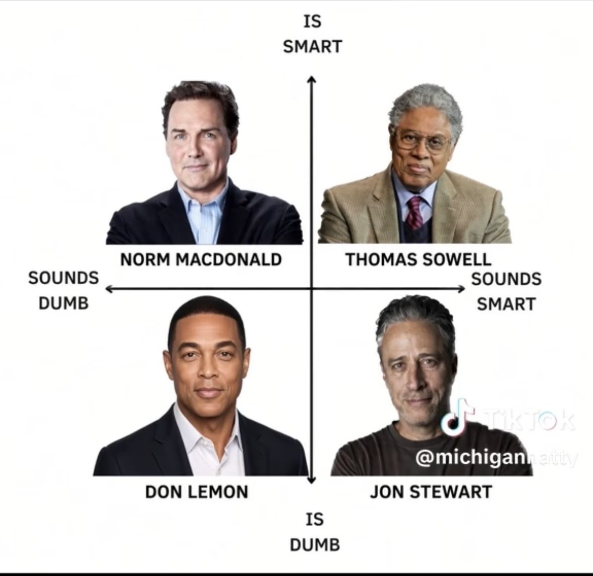

# 🐦 @elonmusk

## 📅 September 15, 2026

> 15 post(s) archived.

---

### 🕐 06:17 UTC · @elonmusk

> Slovenia 🇸🇮 🙌 “[FSD Supervised] is safe, efficient, and above all, an exciting glimpse into the future of mobility. It doesn&apos;t get tired, doesn&apos;t fall asleep, and can significantly contribute to safer driving” – Slovenia’s Deputy Prime Minister &amp; Minister for Infrastructure &amp; Energy 🇸🇮

🔗 [View original post](https://x.com/elonmusk/status/2099744349017747493)

---

### 🕐 06:15 UTC · @elonmusk

> True SpaceX specializes in converting things from impossible to late

🔗 [View original post](https://x.com/elonmusk/status/2099743954707067058)

---

### 🕐 06:06 UTC · @elonmusk

> Elon just gave a much more practical explanation of the current AI safety problem....and laid out a practical framework for making frontier AI safer OpenAI and Anthropic are the two leading AI companies....and their models are close enough in capability that it’s incredibly difficult for either one to slow down without basically handing the lead to the other Elon also made an important distinction: On balance, Anthropic puts more care into safety than OpenAI....but even people inside Anthropic are publicly worried about what their own models can do So instead of asking one company to voluntarily fall behind, Elon’s solution is much more practical: Have Anthropic run its safety test harness on OpenAI models Have OpenAI test Anthropic Have SpaceXAI test both And bring the leading Chinese AI companies into the same system Everyone tries to break everyone else’s models before release “The odds that you will find issues are dramatically greater” That makes way more sense than asking frontier labs to grade their own homework Media All-In Summit: Elon Musk &amp; Gwynne Shotwell -- AI Risks and Peer Review -- Starship -- Terafab as Taiwan Insurance -- SpaceX/Tesla Merger Potential -- Management at SpaceX ++ much more! (0:00) SpaceX&apos;s @Gwynne_Shotwell joins The Besties! (1:45) Gwynne&apos;s SpaceX story, selling rocke…

🔗 [View original post](https://x.com/XFreeze/status/2099741633868865621)

---

### 🕐 05:59 UTC · @elonmusk

> Wow This is absolutely DISGUSTING. James Talarico said parents who don’t transition their kids are “abusive” and thinks they should have their kids taken from them.

🔗 [View original post](https://x.com/elonmusk/status/2099739744598962225)

---

### 🕐 05:58 UTC · @elonmusk

> Physics is a harsh judge Elon’s entire engineering philosophy in one sentence: “Physics is the law, and everything else is a recommendation” &quot;Physics is a harsh judge, and there&apos;s no fooling physics. If something&apos;s wrong, the rocket&apos;s going to explode. It&apos;s not going to get to orbit. So it&apos;s not like, &quot;E…

🔗 [View original post](https://x.com/elonmusk/status/2099739543360438774)

---

### 🕐 05:56 UTC · @elonmusk

> All-In All-In Summit: Elon Musk &amp; Gwynne Shotwell -- AI Risks and Peer Review -- Starship -- Terafab as Taiwan Insurance -- SpaceX/Tesla Merger Potential -- Management at SpaceX ++ much more! (0:00) SpaceX&apos;s @Gwynne_Shotwell joins The Besties! (1:45) Gwynne&apos;s SpaceX story, selling rocke…

🔗 [View original post](https://x.com/elonmusk/status/2099739227499942339)

---

### 🕐 05:56 UTC · @elonmusk

> ELON MUSK: I saw some pretty funny jokes on 𝕏. One of them I saw was: &apos;Your girlfriend&apos;s a 10, but she&apos;s a benchmark maxxer.&apos; 🤣 Media All-In Summit: Elon Musk &amp; Gwynne Shotwell -- AI Risks and Peer Review -- Starship -- Terafab as Taiwan Insurance -- SpaceX/Tesla Merger Potential -- Management at SpaceX ++ much more! (0:00) SpaceX&apos;s @Gwynne_Shotwell joins The Besties! (1:45) Gwynne&apos;s SpaceX story, selling rocke…

🔗 [View original post](https://x.com/cb_doge/status/2099739185943056674)

---

### 🕐 05:51 UTC · @elonmusk

> 4D-Chess Media

🔗 [View original post](https://x.com/elonmusk/status/2099737765260763348)

---

### 🕐 05:48 UTC · @elonmusk

> This is the way Elon Musk says Anthropic puts more care into AI safety than OpenAI and explains how rival companies should test one another’s models. “All the AI companies have a test harness, a series of tests that you give to any model to see if it’s going to build bioweapons or nuclear bombs …

🔗 [View original post](https://x.com/elonmusk/status/2099737081756930206)

---

### 🕐 04:54 UTC · @elonmusk

> ELON MUSK: “Physics is a harsh judge. There’s no fooling physics. Physics is the law, and everything else is a recommendation. I’ve seen people break the laws made by humans, but I’ve not seen anyone break the laws made by physics. The rockets are ruled by physics.” Media All-In Summit: Elon Musk &amp; Gwynne Shotwell -- AI Risks and Peer Review -- Starship -- Terafab as Taiwan Insurance -- SpaceX/Tesla Merger Potential -- Management at SpaceX ++ much more! (0:00) SpaceX&apos;s @Gwynne_Shotwell joins The Besties! (1:45) Gwynne&apos;s SpaceX story, selling rocke…

🔗 [View original post](https://x.com/cb_doge/status/2099723415024533598)

---

### 🕐 04:47 UTC · @elonmusk

> The world’s richest man is living in an Airstream trailer in Memphis. “This is Elon, by the way, doing what people don’t believe he does. He sleeps on the factory floor. He’s in Memphis helping build buildings and bring up Colossus II.” — SpaceX COO, Gwynne Shotwell Media All-In Summit: Elon Musk &amp; Gwynne Shotwell -- AI Risks and Peer Review -- Starship -- Terafab as Taiwan Insurance -- SpaceX/Tesla Merger Potential -- Management at SpaceX ++ much more! (0:00) SpaceX&apos;s @Gwynne_Shotwell joins The Besties! (1:45) Gwynne&apos;s SpaceX story, selling rocke…

🔗 [View original post](https://x.com/cb_doge/status/2099721738687054206)

---

### 🕐 04:20 UTC · @elonmusk

> Grok @Bot summary Grok Bot Summary of Elon Musk’s All-In Summit Interview Today Opening bit - Joke cold open: “We’re all going to die.” Death rate still 100%. - Then straight into “what happened in the last 72 hours.” AI danger and the Hugging Face incident - AI can be very dangerous. He tells peo…

🔗 [View original post](https://x.com/elonmusk/status/2099714967113015716)

---

### 🕐 03:45 UTC · @elonmusk

> I thought white supremacy was the big issue Most Black women murdered in America are not killed by a distant “political villain.” They are killed by men in their own communities — often men police already knew. Newsrooms chase the rare case that fits the script. Everyday street crime does not. Cameras stay on the exception…

🔗 [View original post](https://x.com/adamcarolla/status/2099706124631195751)

---

### 🕐 03:44 UTC · @elonmusk

> Tesla self-driving is amazing I essentially stopped driving a month ago. Tesla FSD works like magic.

🔗 [View original post](https://x.com/elonmusk/status/2099705926332690482)

---

### 🕐 00:50 UTC · @elonmusk

> This might be the best political chart ever made…

🔗 [View original post](https://x.com/kevin_smith45/status/2099662060611076236)

---
