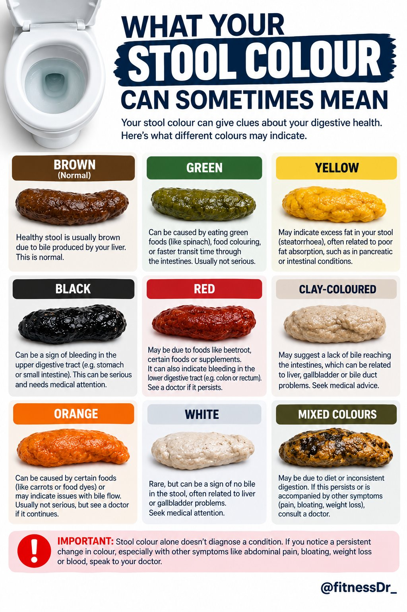
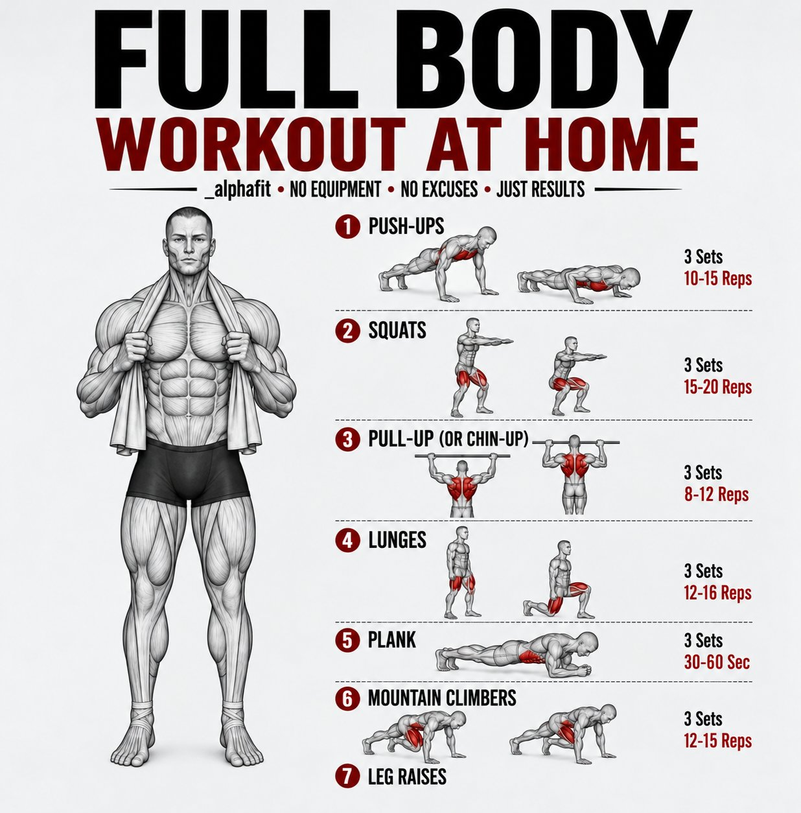
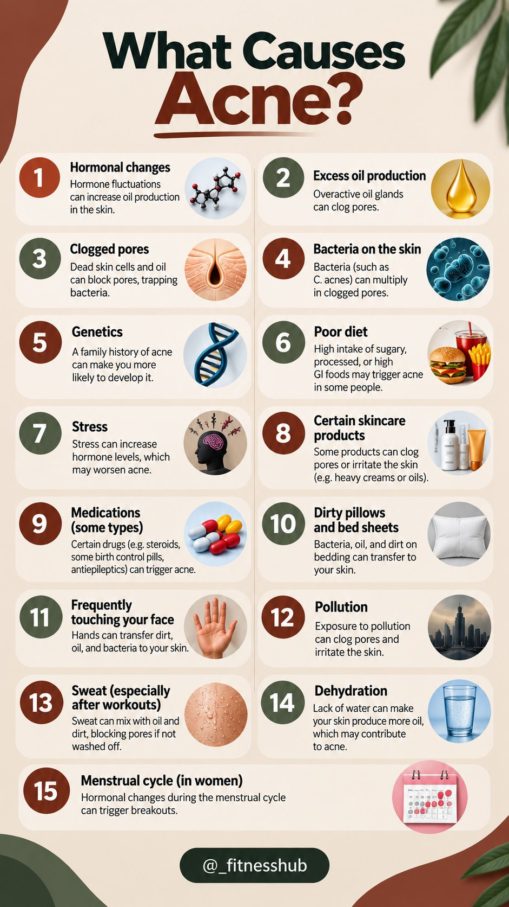
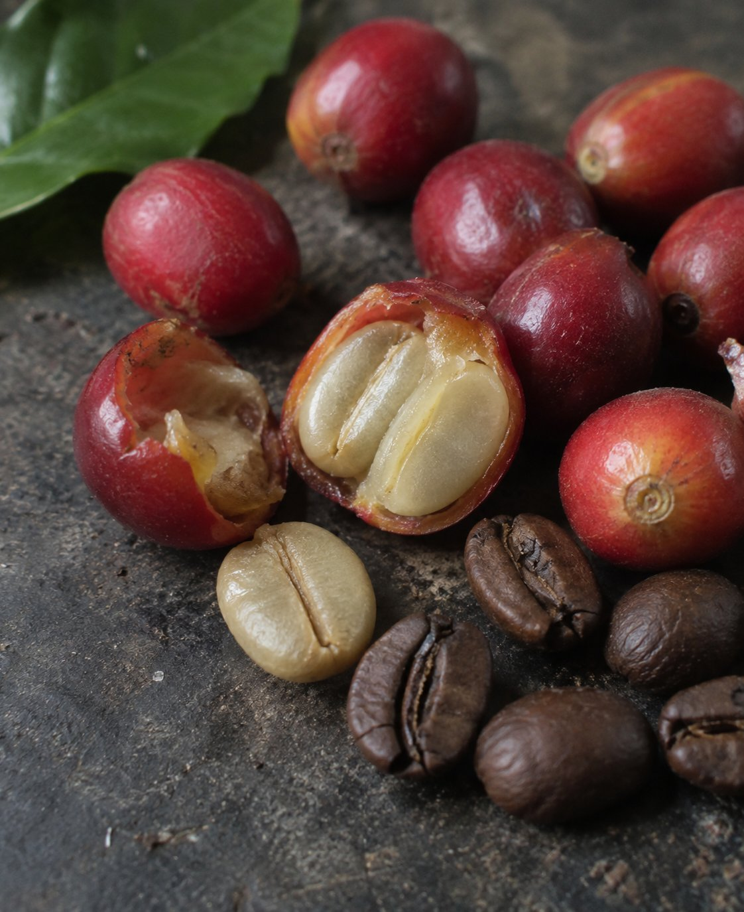
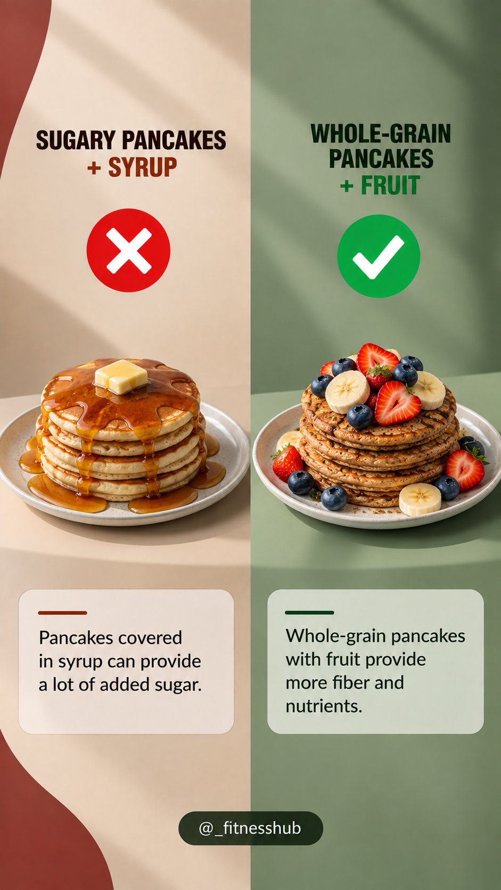
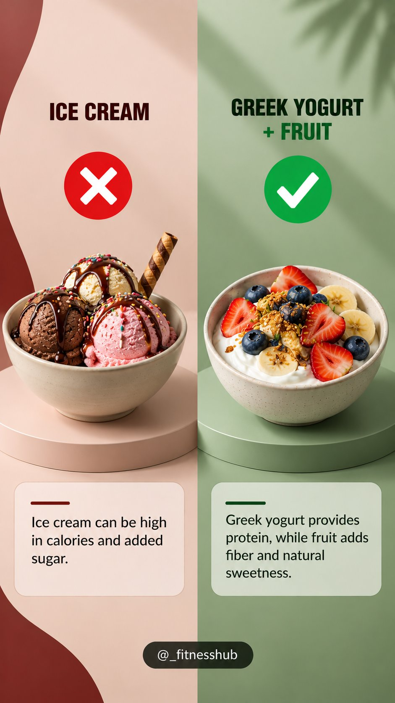
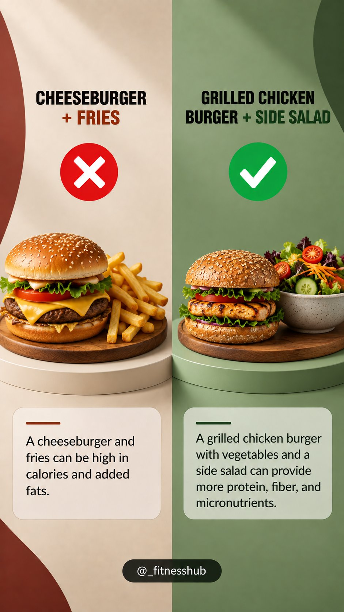
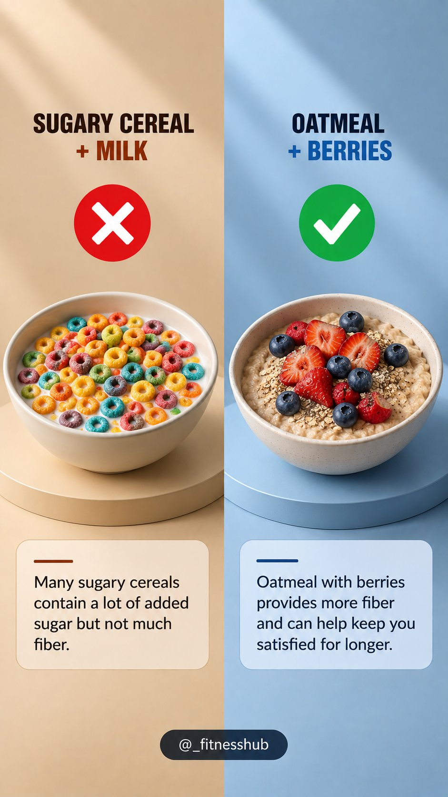
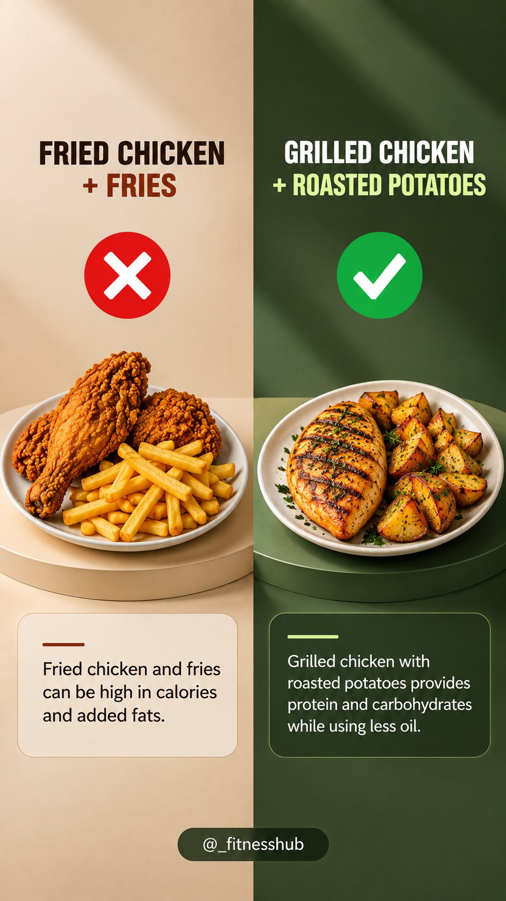
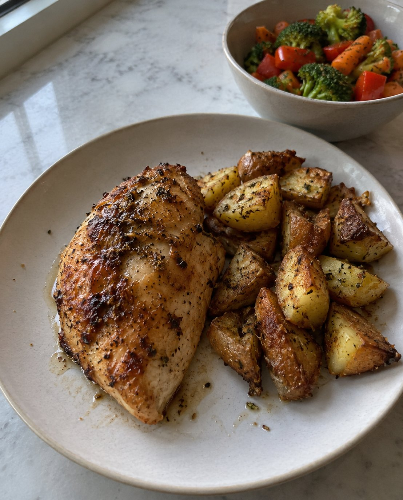

# 🐦 @Unlockyourlife_

## 📅 September 16, 2026

> 19 post(s) archived.

---

### 🕐 13:28 UTC · @Unlockyourlife_

> What your stool colour mean

🔗 [View original post](https://x.com/FitnessDr_/status/2100215310699594064)

---

### 🕐 11:09 UTC · @Unlockyourlife_

> Your body was the first gym you ever owned. Master the basics before chasing more equipment.

🔗 [View original post](https://x.com/_alphafit/status/2100180268434743574)

---

### 🕐 11:03 UTC · @Unlockyourlife_

> Don&apos;t compete with another man&apos;s lifestyle. 🔸 You don&apos;t know his income. 🔸 You don&apos;t know his debts. 🔸 You don&apos;t know who is funding it. Build your own financial foundation instead of trying to keep up with someone else&apos;s appearance.

🔗 [View original post](https://x.com/Masculinjournal/status/2100178691355472033)

---

### 🕐 11:00 UTC · @Unlockyourlife_

> Acne can be triggered by more than just oily skin. Here’s the full list.

🔗 [View original post](https://x.com/_fitnesshub/status/2100178108166844490)

---

### 🕐 11:00 UTC · @Unlockyourlife_

> 5 surprising facts about coffee. That morning cup has a much stranger story than most people realize. From the “beans” themselves to what roasting does to caffeine, coffee isn’t quite what it seems.

🔗 [View original post](https://x.com/Elitedelicacy/status/2100177948980502744)

---

### 🕐 09:57 UTC · @Unlockyourlife_

> Don&apos;t spend your best years trying to impress people who won&apos;t remember what you bought. Build something they can&apos;t take away: • Your skills. • Your character. • Your health. • Your financial independence

🔗 [View original post](https://x.com/Masculinjournal/status/2100162153135194531)

---

### 🕐 09:57 UTC · @Unlockyourlife_

> 7 Things That Make a Woman Crave More Intimacy Not tricks. Not begging. Just habits that keep desire alive. 🧵 1. Kiss her without rushing.

🔗 [View original post](https://x.com/brutal_truth0/status/2100162046650159262)

---

### 🕐 09:55 UTC · @Unlockyourlife_

> The biggest secret fantasies women desire (and which they often confess to you about frankly). 1. Practicing oral sex ...

🔗 [View original post](https://x.com/HoliHappiness/status/2100161766890070156)

---

### 🕐 08:45 UTC · @Unlockyourlife_

> Pregnancy changes how the body responds to many substances. Some herbs that seem harmless can contain compounds that may affect hormones, the uterus, blood pressure, or the developing baby. Here are 5 to be cautious with

🔗 [View original post](https://x.com/FitnessDr_/status/2100143910429331611)

---

### 🕐 08:05 UTC · @Unlockyourlife_

> Some men stay in bad relationships because they&apos;re afraid of starting over. Don&apos;t confuse familiarity with happiness. Sometimes starting over is exactly what gives you the chance to build something healthier.

🔗 [View original post](https://x.com/Masculinjournal/status/2100134042318311775)

---

### 🕐 08:01 UTC · @Unlockyourlife_

> Healthy eating doesn’t mean giving up your favorite foods. Start with small changes that add more protein, fiber, vitamins, and minerals while reducing excess added sugar and fat.

🔗 [View original post](https://x.com/_fitnesshub/status/2100132844894839209)

---

### 🕐 08:01 UTC · @Unlockyourlife_

> 5.

🔗 [View original post](https://x.com/_fitnesshub/status/2100132832848875530)

---

### 🕐 08:00 UTC · @Unlockyourlife_

> 4.

🔗 [View original post](https://x.com/_fitnesshub/status/2100132824133046644)

---

### 🕐 08:00 UTC · @Unlockyourlife_

> 3.

🔗 [View original post](https://x.com/_fitnesshub/status/2100132813240406018)

---

### 🕐 08:00 UTC · @Unlockyourlife_

> 2.

🔗 [View original post](https://x.com/_fitnesshub/status/2100132804826669170)

---

### 🕐 08:00 UTC · @Unlockyourlife_

> 5 Unhealthy Meals You Can Easily Swap for Healthier Options 🍽️ You don’t have to completely change your diet to eat healthier. Sometimes, making a few simple changes to your meals can make a difference; 1.

🔗 [View original post](https://x.com/_fitnesshub/status/2100132797830578210)

---

### 🕐 07:53 UTC · @Unlockyourlife_

> 4 cooking shortcuts that actually work. Not every shortcut makes food worse. A few can save serious time without sacrificing the part that matters: taste. One of the most useful ones is probably already in your freezer.

🔗 [View original post](https://x.com/Elitedelicacy/status/2100130908405748111)

---

### 🕐 07:46 UTC · @Unlockyourlife_

> Plyometric Circuit. Media

🔗 [View original post](https://x.com/BioLifex/status/2100129171003367871)

---

### 🕐 06:20 UTC · @Unlockyourlife_

> I saw today.... Lord am grateful

🔗 [View original post](https://x.com/Masculinjournal/status/2100107628244353226)

---
