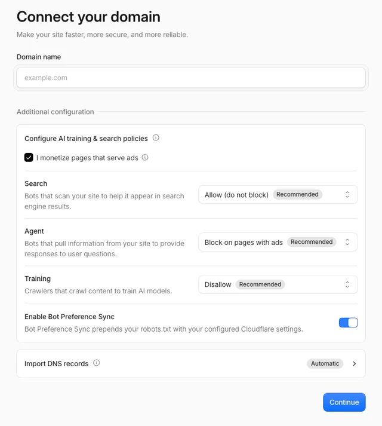
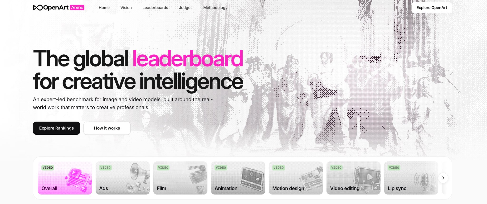
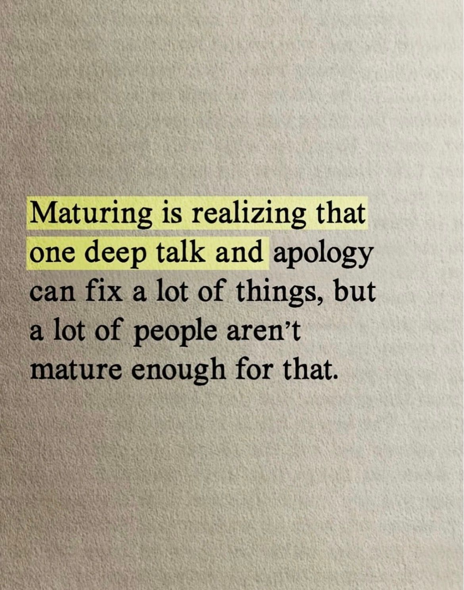
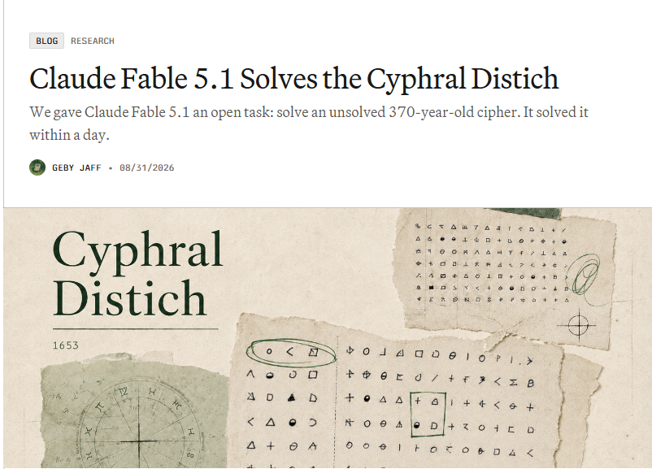
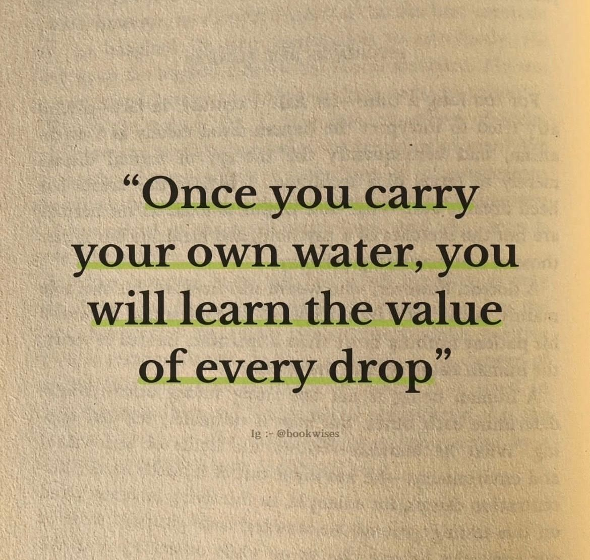
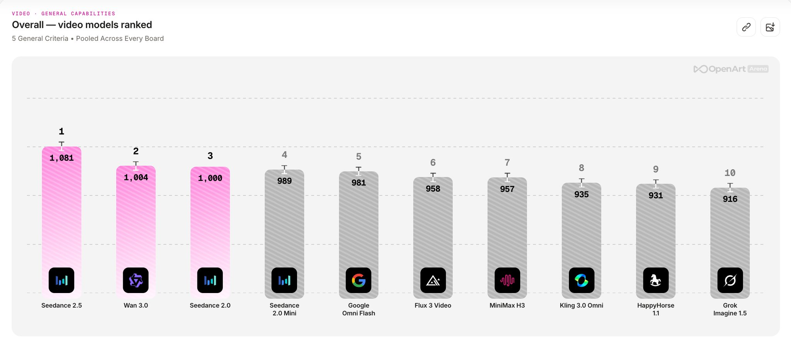
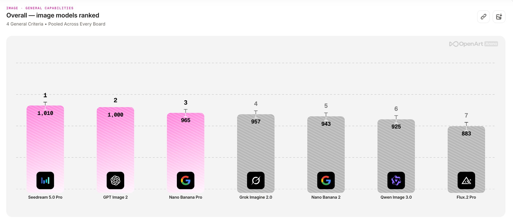
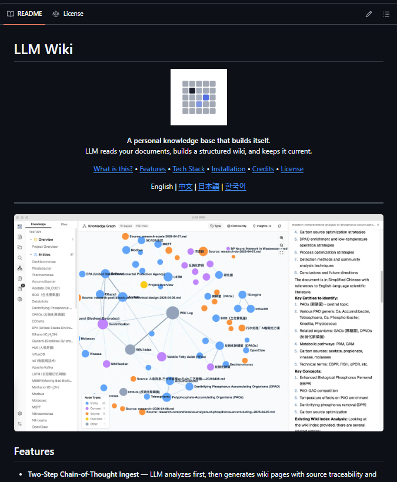
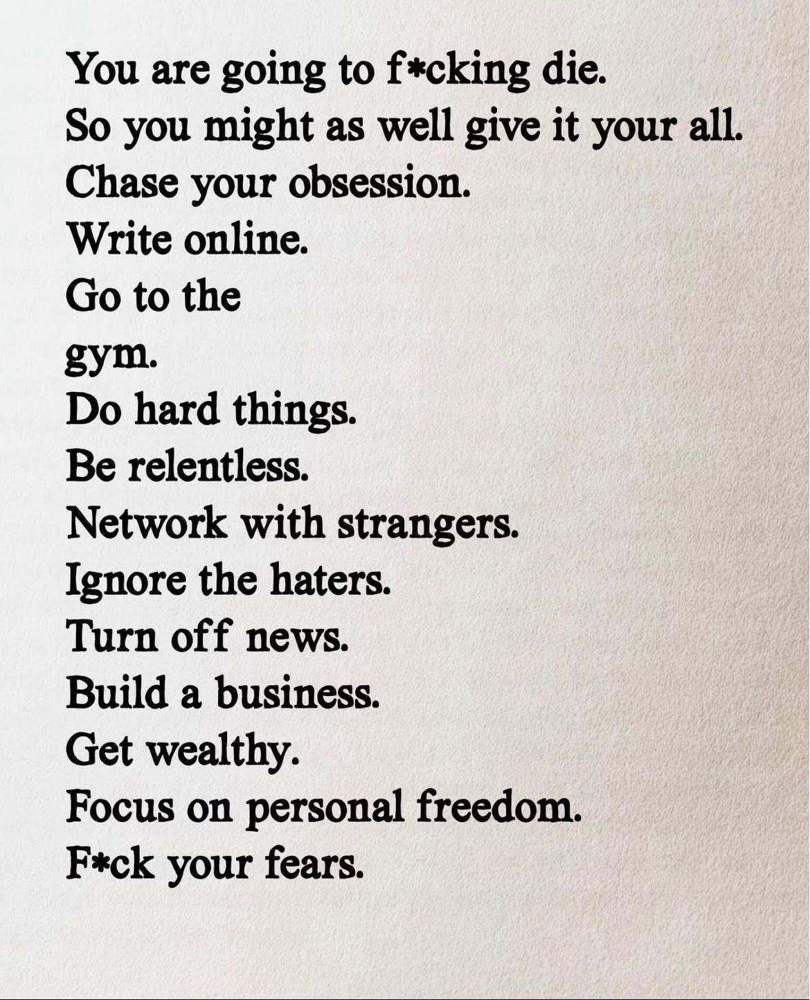
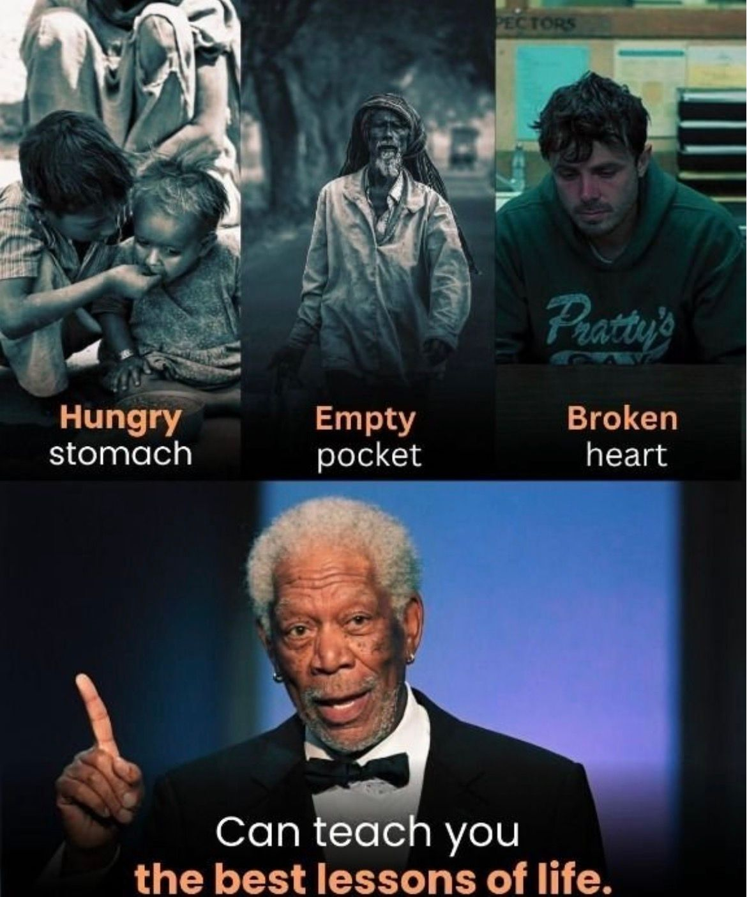

# 🐦 @Wise1Philosophy

## 📅 September 16, 2026

> 82 post(s) archived.

---

### 🕐 13:42 UTC · @Wise1Philosophy

> Just a heads up: You can now block crawlers from using your content for AI training without completely blocking those crawlers from Search. If you want to continue showing up in ChatGPT, Claude, Google&apos;s AI family, etc - pay attention. Some site owners are going to misunderstand what is happening and play this wrong Cloudflare just made an important change to its AI crawler controls. A few weeks ago I wrote about the problem with blocking AI crawlers. Some companies use the same crawler for both Search and AI training, which meant blocking training could also mean blocking the crawler helping customers find you. Cloudflare just introduced a new setting designed specifically around that problem: it is called Disallow AI Training. Let’s go through it. By the way, you can see whether your business is appearing across Google AI, ChatGPT, Claude, Perplexity and Grok here. It’s free: https://www.seo-stuff.com/free-audit Cloudflare now lets website owners tell supported crawlers not to use their content for AI training without completely blocking those crawlers from Search. Applebot, Googlebot and Bingbot are what Cloudflare calls mixed-use crawlers because the same crawler infrastructure can serve multiple purposes. With the new setting, Cloudflare publishes the appropriate no-training preference in robots.txt while continuing to allow what it calls “Accountable” crawlers to access the site for Search. Cloudflare says Apple, Google and Microsoft currently qualify as Accountable. For OpenAI, Anthropic, Amazon and Meta, Cloudflare says Search and Training already use separate crawlers, so it can block the training crawler without blocking the Search crawler. There is one very important warning. Do not confuse Disallow AI Training with Block. Cloudflare changed what Block means. If you select Block for Training, mixed-use crawlers including Googlebot, Bingbot and Applebot can now be blocked completely, including their Search access. If you want Search access to remain, Cloudflare says to use Disallow AI Training instead. There are also some caveats. Google-Extended can be disallowed without affecting Google Search rankings, but Google says that control also affects whether your content can be used for grounding in Gemini Apps. And Bing does not yet support Cloudflare&apos;s new robots.txt no-training preference automatically. Microsoft says that support is targeted for early 2027. So this still is not a giant “turn off AI training with zero tradeoffs everywhere” button, but it is a big improvement. Businesses can increasingly make separate decisions about traditional Search, AI training, AI agents and, eventually, AI summaries. That is the direction this needed to go. For most businesses, the goal shouldn&apos;t be to blindly block every AI crawler so much as it should be to understand which systems create discovery, which ones help customers take action, and which ones are simply using your content for training. If you don&apos;t know how to make sure you&apos;re handling this correctly, SEO Stuff (https://www.seo-stuff.com/gold-plan-package) can help. And if you&apos;re curious whether your business is appearing across Google AI, ChatGPT, Claude, Perplexity and Grok right now, check here. It’s free: https://www.seo-stuff.com/free-audit 69% of B2B buyers chose a different vendor than they originally planned based on what an AI chatbot told them. 33% bought from a brand they had never even heard of before. Increasingly in 2026 and beyond, if your brand is not the one AI is recommending, someone else’s brand is ta…

🔗 [View original post](https://x.com/alexgroberman/status/2100218835593040345)

---

### 🕐 13:37 UTC · @Wise1Philosophy

> Losing the fat on your stomach, your face and your arms is extremely easy once you realize this:

🔗 [View original post](https://x.com/MarkoSilva291/status/2100217389224993141)

---

### 🕐 13:24 UTC · @Wise1Philosophy

> Breaking: Stop testing AI models at random. OpenArt Arena shows which ones perform best for the exact creative work you need to do. Here’s how to use it before your next generation.

🔗 [View original post](https://x.com/AIFrontliner/status/2100214171321114880)

---

### 🕐 13:24 UTC · @Wise1Philosophy

> Life hack: • Save $50 • Open a futures trading account • Learn one chart pattern • Wake up before the market opens • Trade for 1 hour a day • Close the laptop • Repeat (This is the process that&apos;s kept me out of a 9-5.) Here&apos;s how it works:

🔗 [View original post](https://x.com/RileyColemanT/status/2100214139880603876)

---

### 🕐 13:23 UTC · @Wise1Philosophy

> If you&apos;re in debt, never start by: -Paying the minimum -Taking out another loan -Using one card to cover another Instead, start by:

🔗 [View original post](https://x.com/Better_men/status/2100214030636048499)

---

### 🕐 13:23 UTC · @Wise1Philosophy

> GPT-6 Astra SABE PROGRAMAR. Pero, ¿qué sucede cuando necesita un recurso 3D real y listo para producción? Conecté GPT-6 Astra con Hyper3D Rodin MCP para generar assets 3D altamente detallados, de alta calidad y listos para integrarse directamente en un proyecto real. Idea → asset 3D production-ready → integración → proyecto funcional Así fue el proceso 🧵 Media

🔗 [View original post](https://x.com/Alex_Inspira/status/2100213889527107587)

---

### 🕐 13:13 UTC · @Wise1Philosophy

> The real cause of cancer was identified in 1931. The man behind the discovery won a Nobel prize, then was buried by the pharmaceutical industry. Here&apos;s what Dr. Otto Warburg found: 1. “Cancer cells thrive in high-sugar environments.”

🔗 [View original post](https://x.com/BeBetterMan_/status/2100211476887949815)

---

### 🕐 13:07 UTC · @Wise1Philosophy

> Your poor diet is why you are still fat. Studies confirm that the people who lose weight the fastest pick 3-4 simple diets, and eat them on repeat. Here&apos;s the list: 1. Chipotle

🔗 [View original post](https://x.com/DPro_Coach/status/2100209845530144933)

---

### 🕐 13:05 UTC · @Wise1Philosophy

> After 9 years training, I learned this the hard way: &quot;Gut health changes everything&quot; Here&apos;s every gut health tip I&apos;ve got: 1. Cool your potatoes. Seriously. Media

🔗 [View original post](https://x.com/TheFastedState/status/2100209392314662933)

---

### 🕐 13:04 UTC · @Wise1Philosophy

🔗 [View original post](https://x.com/Life__Mastery/status/2100209243982905761)

---

### 🕐 13:02 UTC · @Wise1Philosophy

> Eczema doesn’t start on your skin. It starts in your gut. 31 million Americans have eczema &amp; treating it wrong. Here’s how to fix it:

🔗 [View original post](https://x.com/LongevityCode_/status/2100208597636706404)

---

### 🕐 13:00 UTC · @Wise1Philosophy

> Be the reason people still believe in genuine intentions, gentle souIs, and gorgeous hearts of gold.

🔗 [View original post](https://x.com/_Pammy_DS_/status/2100208087143457052)

---

### 🕐 12:59 UTC · @Wise1Philosophy

> A cardiologist said: “One test predicts heart attack and stroke risk years before symptoms. It costs $12.” Here’s the science behind. the test you don’t know about. 1. We’re checking your kidneys for your heart.

🔗 [View original post](https://x.com/Dr_Biohacker/status/2100208070244888925)

---

### 🕐 12:51 UTC · @Wise1Philosophy

> Don’t buy the new $2,000 iPhone. Instead, buy 5 of these machines that make money while you sleep. Here&apos;s exactly how they work:

🔗 [View original post](https://x.com/gedamtekle/status/2100205871456280809)

---

### 🕐 12:42 UTC · @Wise1Philosophy

> Your body is flooded with cortisol and you do not even realise it. These are the 9 signs that confirm it: 1. Waking between 2 and 4am Media

🔗 [View original post](https://x.com/MagnusLindbrg/status/2100203567533686874)

---

### 🕐 12:30 UTC · @Wise1Philosophy

🔗 [View original post](https://x.com/Wise1Philosophy/status/2100200689695653974)

---

### 🕐 12:30 UTC · @Wise1Philosophy

> ¿Y si pudieras meterte dentro de un cuadro de Van Gogh? He convertido LA NOCHE ESTRELLADA en una piscina. Media

🔗 [View original post](https://x.com/IA_Quijote/status/2100200650239868974)

---

### 🕐 12:23 UTC · @Wise1Philosophy

> If I wanted to quit my job &amp; had to replace my salary within 90 days, this is exactly what I’d do: 1. Go on Instagram. Find 10 online coaches. Look for “DM me” in the captions.

🔗 [View original post](https://x.com/valematvei/status/2100198765902848010)

---

### 🕐 12:10 UTC · @Wise1Philosophy

> A heart doctor once admitted: “There are 3 types of people who never get heart attacks.” 1. You don&apos;t get up at 3 AM to pee Media

🔗 [View original post](https://x.com/HeyKimChong/status/2100195514520354948)

---

### 🕐 12:01 UTC · @Wise1Philosophy

> Donald Trump&apos;s son-in-law just triggered a revolution in Europe. Jared Kushner has never closed a profitable real estate deal. Saudi Arabia gave him two billion dollars to invest anyway. He spent it building a luxury resort in a small Balkan country. That resort just caused Albania&apos;s biggest protests since 1992: Kushner married into the Trump family in 2009. By then his father had already been convicted of financial crimes. Jared took over the family real estate business at 25. He spent 10 million dollars on a newspaper that quickly failed. Then he bought a Manhattan skyscraper right before the 2008 crash. It nearly bankrupted his family. In 2016 Trump won and made Jared a senior advisor. Jared spent four years as a Middle East diplomat. In 2017 a Qatar-backed company bailed out his failing building. The day after Trump left office, Jared started a new firm. It was called Affinity Partners. He had zero private equity experience. Saudi Arabia&apos;s sovereign wealth fund invested two billion dollars anyway. Qatar and the UAE added millions more. These governments were not paying for investment skill. They were paying for access to a former and future president. In 2021 Jared met Albania&apos;s Prime Minister on a friend&apos;s boat. They agreed to build two luxury resorts worth a billion dollars. One sits on a public island called Sazan. The other sits on a protected wildlife reserve called Zvernec. Albania&apos;s government fast tracked the land sale through a special law. It downgraded Zvernec&apos;s environmental protections to make room for the resort. The company paid 120 million dollars to a suspected drug smuggler. Other claimants to that same land were bypassed entirely. In April 2026 photos of bulldozers in Zvernec leaked online. Protests erupted across Albania within days. Security guards were filmed beating demonstrators. The unrest became the largest since communism fell in 1992. It is now called the Flamingo Revolution. As of September it has lasted four months. Jared is still running Affinity while serving as a top US diplomat. He is negotiating an end to the war in Ukraine. He also leads reconstruction oversight for Gaza. Affinity owns a stake in an Israeli firm tied to settlements. That stake undermines his credibility in the same Gaza talks. A similar resort deal in Serbia collapsed after local protests too. Every foreign investor in Affinity has a five year exit clause. If they are unhappy, they can pull their money at any time. That gives foreign governments direct leverage over a sitting US diplomat. Albanians saw a land grab dressed up as tourism. Americans mostly saw a real estate story about a president&apos;s family. That&apos;s the whole game.

🔗 [View original post](https://x.com/LogWeaver/status/2100193236430278951)

---

### 🕐 12:00 UTC · @Wise1Philosophy

> 🚨BREAKING NEWS: Claude can build Instagram Pages reaching monetization just 89 days. If you&apos;re working a 9-5 or already running a business, this could be a way to build an extra income stream using AI to handle a lot of the heavy lifting. Curious how it works? Message &quot;READY&quot; and I&apos;ll show you how Media

🔗 [View original post](https://x.com/amelieannepl/status/2100193035388678423)

---

### 🕐 11:54 UTC · @Wise1Philosophy

> If you want to reach 60 without a cardiac event, a memory problem, or quitting while your kids still need you (especially past 40) Here are 7 signs you should watch out for: 1. Waking up at 3-4 AM.

🔗 [View original post](https://x.com/LiveandAlive_/status/2100191468308848763)

---

### 🕐 11:32 UTC · @Wise1Philosophy

> What would you make with OnSolo? 👇 Reply to the original @OnSoloAI post below with your scene or game idea. I’ll choose 5 winners based on originality and how clearly they explain their concept. Each winner gets 100 OnSolo credits for free! GPT-6 Astra is now LIVE on OnSolo 🔥🔥 Multiple major updates just dropped, all powered by GPT-6 Astra. Pick your lane and start creating. 1️⃣ Game Section (Members only) Feed in a game idea. Agent spins up a playable web game — one click. 🎁 7-day limited free trial. Canvas usag…

🔗 [View original post](https://x.com/alex_prompter/status/2100186154729386123)

---

### 🕐 11:30 UTC · @Wise1Philosophy

🔗 [View original post](https://x.com/Daily__wisdom_/status/2100185634954498172)

---

### 🕐 11:15 UTC · @Wise1Philosophy

> RIP McKinsey. Here are 10 prompts to replace expensive business consultants: [ 🔖 bookmark this post for later ] ➤ SWOT Analysis Act as a business strategist. Generate a SWOT analysis for [INSERT BUSINESS] in the [INSERT INDUSTRY], using competitive market data and internal insights. ➤ Growth Levers Find out 5 scalable growth levers for a [TYPE OF BUSINESS], focusing on revenue expansion, operational efficiency, and brand reach. ➤ 30-60-90 Plan Create a 30-60-90 day action plan for a new [INSERT ROLE] at [COMPANY], including onboarding objectives, performance metrics, and quick wins. ➤ Revenue Model Projection Develop a lean revenue model for a business providing [PRODUCT/SERVICE], covering optimal pricing, CAC, LTV, and monthly recurring revenue forecasts. ➤ Churn Reduction Suggest 3 data-driven strategies to minimize churn for a SaaS product targeting [TARGET CUSTOMER], leveraging user behavior data and feedback loops. ➤ KPI Dashboard Framework Outline the 7 critical KPIs for a [BUSINESS TYPE] to monitor across customer acquisition, retention, product engagement, and financial performance. ➤ Pricing Strategy Act as a pricing advisor. Propose 3 pricing approaches for [OFFER] aimed at [SEGMENT], utilizing value-based pricing, tier structures, and market positioning. ➤ Go-to-Market Plan Design a go-to-market plan for introducing [PRODUCT] to [TARGET MARKET], addressing positioning, distribution channels, customer acquisition, and success metrics. ➤ Value Proposition Draft a persuasive value proposition for [BRAND or PRODUCT] that addresses customer challenges, presents the solution, and emphasizes unique advantages. ➤ Pivot Directions Recommend 3 strategic pivot options for a startup facing [SPECIFIC PROBLEM], including alternative customer segments, applications, or product approaches. → Use these prompts to think, plan, and execute like a top business advisor. 📌 Get Advanced ChatGPT Guide (free): https://bit.ly/3StIB3z 👉 Follow me @AndrewBolis for more and 🔄 Repost this to help others use AI

![RIP McKinsey. Here are 10 prompts to replace expensive business consultants: [ 🔖 bookmark this post for later ] ➤ SWOT Analysis Act as a business strategist. Generate a SWOT analysis for [INSERT BUSIN](../../../../assets/images/2026/09/16/2100181668472705499-1.jpg)

🔗 [View original post](https://x.com/AndrewBolis/status/2100181668472705499)

---

### 🕐 11:14 UTC · @Wise1Philosophy

> Si estás buscando trabajo remoto, la clave no es aplicar a 300 ofertas con el mismo CV. MEJOR HAZ ESTO:

🔗 [View original post](https://x.com/MiguelMaestroIA/status/2100181468588753210)

---

### 🕐 11:13 UTC · @Wise1Philosophy

> don&apos;t clone all 10 at once. pick the one hole in your stack and fill it. that&apos;s how you actually use a list like this. okay this is basically a whole ops team in bookmarks.. 10 repos, and each one replaces a hire you don&apos;t need yet 1). Windmill ↳ http://github.com/windmill-labs/windmill 2). Papermark ↳ http://github.com/papermark/papermark 3). Lago ↳ http://github.com/getlago/lago 4). Unkey ↳ htt…

🔗 [View original post](https://x.com/Wise1Philosophy/status/2100181396631261688)

---

### 🕐 11:12 UTC · @Wise1Philosophy

> A doctor who has followed the same 2,000 people since the eighties told me the 8 things that predict how well you age. 1. How fast you walk.

🔗 [View original post](https://x.com/CoachJulianNiko/status/2100180907437285629)

---

### 🕐 11:11 UTC · @Wise1Philosophy

> ya he dominado por completo la capacidad de viajar a través del tiempo. Le pedí a GPT Image 2.5 que nos enviara a 1950, los años 80, un mundo cyberpunk y el año 2100. Después usé Seedance 2.5 para hacer que el tiempo se rompiera. ¿En qué época nos quedamos? 👇 Media

🔗 [View original post](https://x.com/SofiaSici/status/2100180825824497782)

---

### 🕐 11:03 UTC · @Wise1Philosophy

> A 370-year-old mystery just got solved by AI 🤯 The “Cyphral Distich” cipher, unsolved for centuries, has finally been cracked. Claude Fable 5.1 help to solve it. This is such a cool example of AI being used for real-world problems. We’re literally watching history get decoded in real time. Fable solved the Cyphral Distich (a 370 year old cypher). Super cool way to use Claude https://www.vals.ai/blogs/fable-solves-cyphral-distich

🔗 [View original post](https://x.com/charliejhills/status/2100178794468479310)

---

### 🕐 11:03 UTC · @Wise1Philosophy

🔗 [View original post](https://x.com/apex_mentality_/status/2100178749203316947)

---

### 🕐 11:03 UTC · @Wise1Philosophy

> AI is getting out of hand 🤯 Media

🔗 [View original post](https://x.com/AIHighlight/status/2100178645209817573)

---

### 🕐 10:38 UTC · @Wise1Philosophy

> Seedance 2.5 tops OpenArt’s AI video leaderboard. Wan 3.0 is second, Seedance 2.0 is third, and the rankings change across creative categories. Here’s where the rest of the models landed.

🔗 [View original post](https://x.com/AIHighlight/status/2100172549195751485)

---

### 🕐 10:30 UTC · @Wise1Philosophy

🔗 [View original post](https://x.com/yeti_mind/status/2100170421194703290)

---

### 🕐 10:29 UTC · @Wise1Philosophy

> Your circulation is failing quietly and you do not even realise it. 9 things your body does first, in the order they show up: 1. Cold hands and feet in a warm room

🔗 [View original post](https://x.com/HeyEleanorr/status/2100170077396230452)

---

### 🕐 10:25 UTC · @Wise1Philosophy

> High cortisol ruins the quality of your life. It&apos;s giving you beer belly, neck hump, skin tags, bloating your face. These are the best ways to reduce it: 1. Walk barefoot. Media

🔗 [View original post](https://x.com/LevelUpPrime/status/2100169300619526244)

---

### 🕐 10:20 UTC · @Wise1Philosophy

> iOS27 continues to prove itself as a massive upgrade from its previous version. Media

🔗 [View original post](https://x.com/FutureStacked/status/2100167891177947418)

---

### 🕐 10:16 UTC · @Wise1Philosophy

> Imagine a PE-backed medical group with 40 clinics. Eleven people doing nothing but prior authorizations, 2,8K requests a month at 24 minutes each, and a third of them bounced back for a missing attachment or a wrong CPT code. Here&apos;s how we&apos;d get that from 24 minutes to under 4 with AI agents. [1] Week one we don&apos;t touch a payer portal, because the first thing we build is the golden set: sixty real prior-auth requests from the last quarter with the outcome the team actually got, including the twenty that bounced. That becomes the definition of done (foundation), and every change to the agent from then on is scored against it. Most teams skip this and go straight to browser automation, which works on one national payer, breaks on the regional Blue, and leaves nobody able to say what &quot;works&quot; meant. [2] Weeks two and three go to the data layer: read-only access to the EHR and the practice management system, a dictionary of the fields the agent can reason from, and patient identifiers masked before any model sees a record. [3] Weeks four and five are the harness. The agent assembles the request, checks the payer&apos;s documented criteria, attaches the notes, and then stops so a coordinator can see the assembled packet in a browser extension, read the agent&apos;s reasoning in three sentences, and click submit or edit. Nothing reaches a payer without a human on it, every portal interaction is recorded so a changed login page shows up as a failure on our side before the coordinator hits it, and for payers that only take phone the agent queues the call with the script prepared while a person dials. In week six the group&apos;s own prior-auth lead runs acceptance by taking the twenty bounced requests and watching the agent rebuild them, and if it misses an attachment on any of the twenty it goes back to us. The time saving comes from assembly rather than submission, since pulling notes, matching criteria, and formatting the packet is 19 of the 24 minutes. The agent takes those and the coordinator keeps the four that need judgment. At 2,800 requests a month the agent costs a few cents per request in model calls plus $250 a month in infrastructure inside the group&apos;s own tenant, and the build is one pod at $17K a month with the first coordinator-facing version in month three. Thousands of medical groups exist like this, and every one of them has been shown a demo on somebody else&apos;s portal. The design itself is how we shipped a prior-auth extension for a 10-year-old platform this summer, where the operators told us the invisible automation they&apos;d had before was the problem, because nobody could see it working or failing. Vendors sell autonomous, and what a CFO can actually sign is supervised, measured, and running inside the practice&apos;s own tenant.

🔗 [View original post](https://x.com/mardehaym/status/2100166919684805065)

---

### 🕐 10:09 UTC · @Wise1Philosophy

> Americans buy 200 million tires a year. Most of them are being driven on with the wrong pressure, and it&apos;s costing $300 a year. A tire technician who serviced 50,000+ vehicles told me: &quot;Your tires are underinflated by 5–8 PSI right now. You&apos;ve never checked them. You&apos;ve never even looked at the sticker inside your door jamb. You&apos;re burning extra gas, wearing out your tires twice as fast, and risking a blowout at highway speed. All because you never spent 60 seconds with a $3 gauge.&quot; Here are the 9 tire mistakes that cost you $300 a year and risk your life 🧵

🔗 [View original post](https://x.com/Alvin1492840/status/2100165235273588885)

---

### 🕐 10:05 UTC · @Wise1Philosophy

> OpenArt just made AI model rankings useful. Arena ranks models across ads, film, animation, motion design, editing and lip sync, so you can see which one fits the work. Here’s how the leaderboard was decided.

🔗 [View original post](https://x.com/FutureStacked/status/2100164097471861087)

---

### 🕐 10:03 UTC · @Wise1Philosophy

> GPT-6 Astra is now LIVE on OnSolo You can create playable games, visualize scenes before rendering, and generate 3D models all from simple prompts. Giveaway: have a chance to receive 100 credits each. To enter: → Like the original official post → Comment under the original post I’ll randomly select and provide their registered emails to the brand for adding credits. 👇 GPT-6 Astra is now LIVE on OnSolo 🔥🔥 Multiple major updates just dropped, all powered by GPT-6 Astra. Pick your lane and start creating. 1️⃣ Game Section (Members only) Feed in a game idea. Agent spins up a playable web game — one click. 🎁 7-day limited free trial. Canvas usag…

🔗 [View original post](https://x.com/HeyZaraKhan/status/2100163678943277480)

---

### 🕐 10:01 UTC · @Wise1Philosophy

> I finally found a useful AI leaderboard. OpenArt Arena ranks models separately for ads, film, animation, motion design, editing and lip sync. Here’s why I’d actually use this one.

🔗 [View original post](https://x.com/AriaWestcott/status/2100163156668534786)

---

### 🕐 10:00 UTC · @Wise1Philosophy

> Look at this guy. He accidentally built a billion-dollar tequila company. It started with 2 vacation homes, 3 friends and 700 tequila samples. Here’s how George Clooney turned a private drink into a deal worth up to $1B:

🔗 [View original post](https://x.com/Scottvdberg/status/2100162786969997445)

---

### 🕐 09:59 UTC · @Wise1Philosophy

> Every time an agent runs a task, it makes routing calls, uses tools, fails, recovers and finishes. Most of that experience just vanishes. NeoHorse-1 records it as structured traces, screens them for quality and turns the good ones into training data. That&apos;s the Data-RSI loop, and it&apos;s open source. The RSI claim rests on one detail: NeoHorse-1 was post-trained on execution trajectories that include the failures. - When a tool call broke - What the error looked like - How the system got back on track Agent datasets usually capture the clean path. A 4B model that has seen run…

🔗 [View original post](https://x.com/rezkhere/status/2100162722814173210)

---

### 🕐 09:59 UTC · @Wise1Philosophy

> High cortisol ruins the quality of your life. It&apos;s giving you a beer belly, a neck hump, skin tags, and bloating your face. Here are the best ways to bring it down: 1. Walk barefoot Media

🔗 [View original post](https://x.com/ClaraBrooksjz/status/2100162553083244865)

---

### 🕐 09:40 UTC · @Wise1Philosophy

> 10 GITHUB REPOS THAT FEEL LIKE SOMEONE FORGOT TO TELL THE INTERNET ABOUT THEM 1. M3E Canvas Sketch a UI and turn it into a prompt for Claude Code, Codex, Gemini CLI or Cursor. https://github.com/lnkiai/m3e-canvas 2. Human Atlas Explore human anatomy in 3D with thousands of selectable body parts. https://github.com/ashemag/human-atlas 3. LLM Wiki Turn your documents into a persistent, interconnected knowledge base. https://github.com/nashsu/llm_wiki 4. book-to-skill Turn technical books into reusable Agent Skills. https://github.com/virgiliojr94/book-to-skill 5. MathModelAgent AI agent for mathematical modelling, analysis and experiments. https://github.com/jihe520/MathModelAgent 6. OpenFlux Network research tool built around TCP tunnelling and pluggable transports. https://github.com/p1neappleXpress/OpenFlux 7. Codenotch Track AI coding-tool usage limits directly on your screen. https://github.com/vinzdg/codenotch 8. DLSS-NR-on-AMD Experimental neural rendering work for AMD GPUs. https://github.com/danielblnc/DLSS-NR-on-AMD 9. OmniGet Cross-platform downloader supporting 1,800+ sites and multiple media formats. https://github.com/tonhowtf/omniget 10. Dagu Self-hostable workflow orchestration using YAML, scripts, SSH and containers. https://github.com/dagucloud/dagu Some repos have 100K+ stars. Save this list.

🔗 [View original post](https://x.com/RodmanAi/status/2100157910164574276)

---

### 🕐 09:30 UTC · @Wise1Philosophy

🔗 [View original post](https://x.com/Ant_Philosophy/status/2100155405556945130)

---

### 🕐 09:30 UTC · @Wise1Philosophy

> a whole trading floor just fit inside one terminal window. someone connected claude code to tradingview and let it loose: researching markets, backtesting strategies, executing trades on its own. analysts, quants, traders. one setup does all three now. Media

🔗 [View original post](https://x.com/daveydefi/status/2100155328482451590)

---

### 🕐 09:29 UTC · @Wise1Philosophy

> A guy told his friend: &quot;Netflix recommendations are terrible. It keeps showing me the same stuff. I&apos;ve watched everything good.&quot; His friend, a former Netflix data scientist who spent 4 years on the recommendation team, asked 3 questions: &quot;Does anyone else use your profile?&quot; Yes his girlfriend watches K-dramas on it. His kid watches cartoons on weekends. &quot;Do you ever press the thumbs-down button?&quot; No he just scrolls past things he&apos;s not interested in. &quot;Have you ever rated anything?&quot; No. He watches shows. He doesn&apos;t rate them. &quot;Your algorithm isn&apos;t broken. It&apos;s uninformed. You&apos;ve given it 3 years of passive data what you clicked on and zero active data what you actually enjoy versus what you watched because it was in front of you. It thinks you love K-dramas because your girlfriend watches them on your profile. It thinks you love cartoons because your kid uses your account on weekends. And it has no idea what you dislike because you&apos;ve never once told it.&quot; &quot;That&apos;s like asking someone to cook for you for 3 years and never telling them what you like or what you hate. They&apos;ll eventually just make the same 3 meals every night because those are the ones you didn&apos;t send back. Not because you loved them. Because you ate them without complaining.&quot; He showed him 9 ways to retrain the algorithm from scratch, in under 30 minutes and turn the homepage from a stale rotation of the same 5 genres into a discovery engine that surfaces the other 97% of the Netflix catalog. His friend retrained his algorithm on a Sunday afternoon. By Tuesday, his homepage had new genres, new titles, and new rows he&apos;d never seen before after 3 years of watching the same homepage on the same account. &quot;The algorithm wasn&apos;t broken. It was starving for information you never gave it. Feed it. It transforms.&quot; Here are the 9 ways to retrain it 🧵

🔗 [View original post](https://x.com/jackcoder0/status/2100155131207762049)

---

### 🕐 08:32 UTC · @Wise1Philosophy

> This is Xynova&apos;s Flex 2. A bionic robotic hand built for speed and precision at human scale, with 23 degrees of freedom. A human hand weighs about 400 grams. This one weighs the same and lifts 30 times its own weight. It opens and closes a full fist twice per second, handles payloads up to 12 kg, detects the moment an object starts to slip, and softens its grip around delicate objects. https://x.com/spaceandtech_/status/2099853563354894376/video/1 Media

🔗 [View original post](https://x.com/TheAIColonyRD/status/2100140705561678122)

---

### 🕐 08:30 UTC · @Wise1Philosophy

🔗 [View original post](https://x.com/Mindsthatbuild/status/2100140211288092908)

---

### 🕐 08:29 UTC · @Wise1Philosophy

> Moving freely in your knees, your hips and your back is extremely easy once you realize this:

🔗 [View original post](https://x.com/Sophiaz6xo/status/2100139878264762875)

---

### 🕐 08:21 UTC · @Wise1Philosophy

> Boreal was tested on Creatify&apos;s own users before anyone outside ever saw it. That is the part that matters more than any spec, because a model built on real ad footage and creator UGC and then run on live customer workloads has already been through the hard part. The 81% win rate over its base model is the result of that, not a demo number. Proven on real ads first, released to everyone second. Try Boreal from Creatify Labs. Media Introducing Boreal from Creatify Labs. A new text-and-image-to-video model built for video generation. At just one cent per second, Boreal is up to 47x cheaper than Seedance 2.5. Boreal is an open video base we post-trained on a corpus of real ad footage, creator-style UGC, and p…

🔗 [View original post](https://x.com/TheAIColony/status/2100137942312161645)

---

### 🕐 08:09 UTC · @Wise1Philosophy

> Most video models are trained to look cinematic. Ad creative rarely needs that. Creatify built Boreal the other way round. It&apos;s post-trained on real ads, creator-style UGC, and customer briefs, so the output already looks like something you&apos;d actually run—at just one cent per second. For me, that means one product image, ten different hooks, and shipping the one people stop for. At 70% pass rate for $0.01, Boreal lets you test way more angles without the budget bleed. Try Boreal from Creatify Labs and see what it gives you. Media Introducing Boreal from Creatify Labs. A new text-and-image-to-video model built for video generation. At just one cent per second, Boreal is up to 47x cheaper than Seedance 2.5. Boreal is an open video base we post-trained on a corpus of real ad footage, creator-style UGC, and p…

🔗 [View original post](https://x.com/AIFrontliner/status/2100134997092942315)

---

### 🕐 08:01 UTC · @Wise1Philosophy

🔗 [View original post](https://x.com/Wise1Philosophy/status/2100133067742490714)

---

### 🕐 08:01 UTC · @Wise1Philosophy

> Every ad you have ever skipped was still an expensive final asset to someone. Creatify wants to end that. Boreal turns text or an image into ad video at 1 cent a second. Trained on real ads and creator UGC, so it knows what a selling video looks like. I&apos;d stop guessing which angle works and just generate all of them. Go try Boreal from Creatify Labs. Media Introducing Boreal from Creatify Labs. A new text-and-image-to-video model built for video generation. At just one cent per second, Boreal is up to 47x cheaper than Seedance 2.5. Boreal is an open video base we post-trained on a corpus of real ad footage, creator-style UGC, and p…

🔗 [View original post](https://x.com/AIHighlight/status/2100132979892752431)

---

### 🕐 07:59 UTC · @Wise1Philosophy

> Thinking clearly at work, at home and at the end of the day is extremely easy once you realize this:

🔗 [View original post](https://x.com/RasmusNorbergg/status/2100132328534389192)

---

### 🕐 07:30 UTC · @Wise1Philosophy

🔗 [View original post](https://x.com/Daily__wisdom_/status/2100125130475163891)

---

### 🕐 07:29 UTC · @Wise1Philosophy

> I was 64kg, could not do one pull-up, and my arms had looked the same since school. I needed to put on 10kg by the summer. I achieved it with these 18 rules: 1. EAT MORE THAN YOU THINK (you are not eating enough).

🔗 [View original post](https://x.com/thisispeak007/status/2100124779261092142)

---

### 🕐 07:24 UTC · @Wise1Philosophy

> Most teams blame weak outputs, but weak context is usually the hidden problem. save this before it gets buried: pletor 2.0 is live and it&apos;s the first AI tool that actually knows your brand before you explain it → paste your website → it encodes products, voice, visuals, guidelines → every agent you build taps into it → update once, updates everywhere gave i…

🔗 [View original post](https://x.com/Wise1Philosophy/status/2100123549176393788)

---

### 🕐 07:15 UTC · @Wise1Philosophy

> $133,752 in new ARR in 30 days, with zero new hires. That’s the result Authority Makers attributed to putting http://viktor.com on outbound. Viktor works inside Slack and Microsoft Teams, connecting to 3,200+ tools to handle real outbound work: researching leads, drafting outreach, managing follow-ups, and updating the CRM. I gave Viktor two jobs at once. Both came back in Slack, ready for review. That’s the difference between asking AI for an answer and delegating the work to an AI employee. Chatbots answer. Copilots assist. AI employees do the work. Try Viktor with $100 in free credits. No card required. Link in the first comment. #AIemployee #Sales #Outbound In partnership with Viktor. Check out here! https://ref.viktor.com/jhood-li Media

🔗 [View original post](https://x.com/JasonKHood/status/2100121357258518739)

---

### 🕐 07:08 UTC · @Wise1Philosophy

> Poolday is looking scary good 👏 Poolday&apos;s agent takes your Figma, Lottie files and brand guidelines, then ships the whole video from one prompt, 100M+ edits made and $11M raised. No asset hunting. No export checks. Just the video. THIS IS AN UNFAIR ADVANTAGE FOR ANY SMALL BRAND.

🔗 [View original post](https://x.com/Wise1Philosophy/status/2100119695416336428)

---

### 🕐 07:01 UTC · @Wise1Philosophy

🔗 [View original post](https://x.com/apex_mentality_/status/2100117910458871810)

---

### 🕐 07:01 UTC · @Wise1Philosophy

> A neurologist told me something I did not expect: &quot;There are 5 kinds of people who keep their memory into their 80s.&quot; 1. The ones who still get lost on purpose

🔗 [View original post](https://x.com/MuahDavis/status/2100117733337899431)

---

### 🕐 06:34 UTC · @Wise1Philosophy

> Dementia is blood flow. Dementia is cholesterol. Dementia is preventable close to half the time. 8 simple rules to protect your brain: 1. Floss your teeth Media

🔗 [View original post](https://x.com/Marc0sRomano/status/2100111009663049947)

---

### 🕐 06:30 UTC · @Wise1Philosophy

🔗 [View original post](https://x.com/yeti_mind/status/2100110018993344934)

---

### 🕐 06:19 UTC · @Wise1Philosophy

> I&apos;m a cardiologist. If I could only recommend two supplements for the rest of my career, it would be these (&amp; why): 1) Magnesium Glycinate

🔗 [View original post](https://x.com/NutritionCorp/status/2100107307736805662)

---

### 🕐 06:15 UTC · @Wise1Philosophy

> I took magnesium for 8 weeks. Slept like I was drugged. Woke up like I&apos;d slept a thousand years. And my brain function came back 7.5 years younger. Here&apos;s what actually happened:

🔗 [View original post](https://x.com/BeBetter_Athlet/status/2100106294690816183)

---

### 🕐 06:13 UTC · @Wise1Philosophy

> If you want a flat belly, you must fix your gut bacteria ASAP. I changed my method last month and i regret not starting sooner. Here&apos;s how i got rid of the bloat:

🔗 [View original post](https://x.com/DPro_Coach/status/2100105785548362201)

---

### 🕐 06:12 UTC · @Wise1Philosophy

> This is what a heart surgeon told me, and it stuck with me: &quot;There are only 3 types of people who don&apos;t get heart attacks.&quot; 1. Don&apos;t go to the toilet at 3 AM

🔗 [View original post](https://x.com/Fitby_Chandler/status/2100105603104538766)

---

### 🕐 06:10 UTC · @Wise1Philosophy

> A Harvard biology professor admitted: &quot;Most supplements on the shelf are lies. Only 3 make a real difference. I&apos;d stake my career and life savings on it.&quot; 1) Magnesium glycinate.

🔗 [View original post](https://x.com/TheFastedState/status/2100104927871951033)

---

### 🕐 06:07 UTC · @Wise1Philosophy

> A Stanford neurologist told me: “Sticking out your tongue for 40 seconds removes cortisol faster than any pills and breathing exercises.” 1. Your neck is what&apos;s keeping you anxious.

🔗 [View original post](https://x.com/CoachDanCole_/status/2100104268619583560)

---

### 🕐 06:06 UTC · @Wise1Philosophy

> Fatty liver is now affecting 1 in 3 adults. It destroys your metabolism, becomes diabetes, and increases your risk of heart disease. Here’s how to reverse it: 1. Eat all the sweet potatoes you can.

🔗 [View original post](https://x.com/CoachWillStone/status/2100103949701591281)

---

### 🕐 06:05 UTC · @Wise1Philosophy

> These are the only non-negotiable supplement to lower your cortisol: 1. Ashwagandha. KSM-66. 300-600mg daily.

🔗 [View original post](https://x.com/HeyDoc_MD/status/2100103790150169048)

---

### 🕐 06:05 UTC · @Wise1Philosophy

> A Heart doctor confessed: “There are 8 things the people who never get heart attacks have in common.” 1. Don&apos;t get up to pee at 3 AM

🔗 [View original post](https://x.com/CoachLucHerrera/status/2100103639805337731)

---

### 🕐 06:00 UTC · @Wise1Philosophy

🔗 [View original post](https://x.com/Life__Mastery/status/2100102571616567457)

---

### 🕐 05:40 UTC · @Wise1Philosophy

> I was 19kg overweight, always tired and could not stand up from the floor without pushing off one knee. I needed to be at 13% body fat by March. I achieved it with these 18 rules: 1. LIFT BEFORE YOU DIET (the muscle goes first otherwise).

🔗 [View original post](https://x.com/mind_and_beauty/status/2100097353311306222)

---

### 🕐 05:21 UTC · @Wise1Philosophy

> Anthropic showed how to build an AI agent in a 37-minute video. It&apos;s not about running your whole company. It&apos;s one agent that finds problems when something breaks checks the logs, finds the cause, writes it down. All by itself. Save this if you want to build agents that actually think, not just answer. 🔖 Media

🔗 [View original post](https://x.com/ScaleWthAI/status/2100092755859095738)

---

### 🕐 04:53 UTC · @Wise1Philosophy

> I started taking whey after training, creatine in the morning, and magnesium at night. Without exaggerating, my personality changed 180 degrees. 1. Whey. After training. You should take it too.

🔗 [View original post](https://x.com/JasperKasparov/status/2100085520319774946)

---

### 🕐 04:32 UTC · @Wise1Philosophy

> Your blood sugar is aging you faster than smoking and junk food. It ruins sleep, fat loss, reduces nitric oxide, and drives fatty liver. Here&apos;s the simple fix: 1. Don&apos;t walk 10,000 steps

🔗 [View original post](https://x.com/IranaJasmin/status/2100080236042043584)

---

### 🕐 04:13 UTC · @Wise1Philosophy

> A Dutch researcher found a 15-minute window that decides how often you get sick: &quot;Get midday sun on bare skin through autumn and your D never crashes.&quot; 1. The window is narrower than you think

🔗 [View original post](https://x.com/dzejlacathleen/status/2100075454153793554)

---

### 🕐 04:00 UTC · @Wise1Philosophy

> A podcast host sat down with the Harvard scientist who turned back the clock in human cells. He named 5 everyday things quietly costing you 15 years. The one that matters most has nothing to do with food, training or supplements: 1. The person you wake up next to Media

🔗 [View original post](https://x.com/yourcamilavega/status/2100072215459062025)

---
