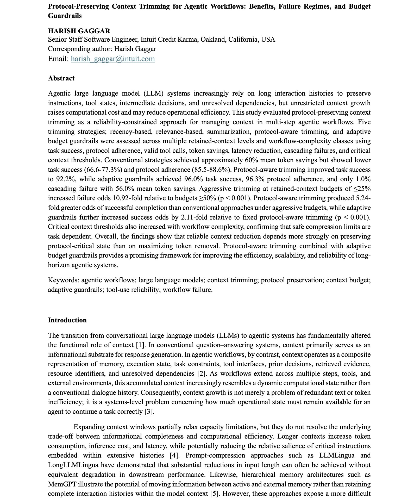
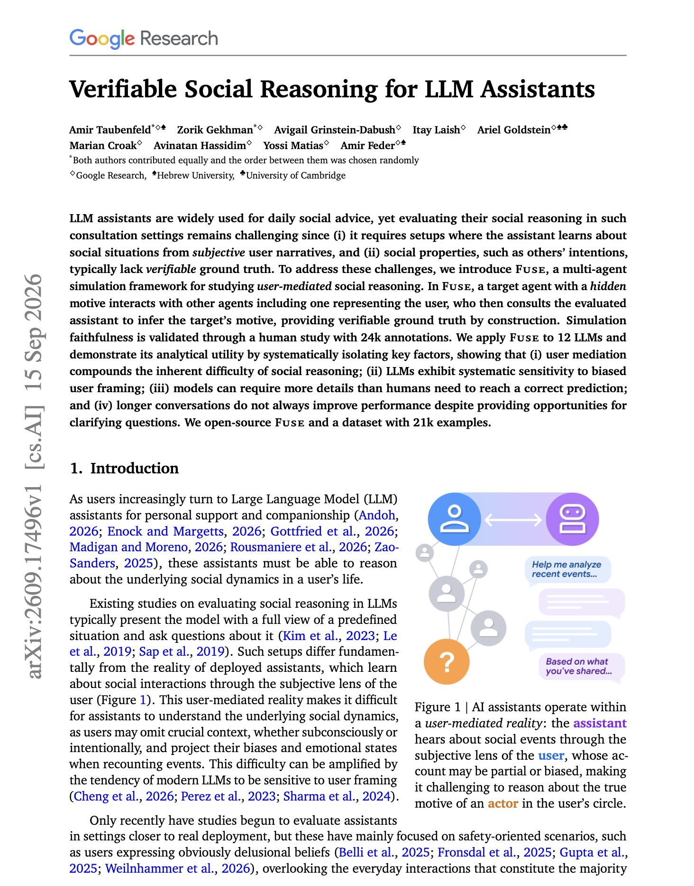
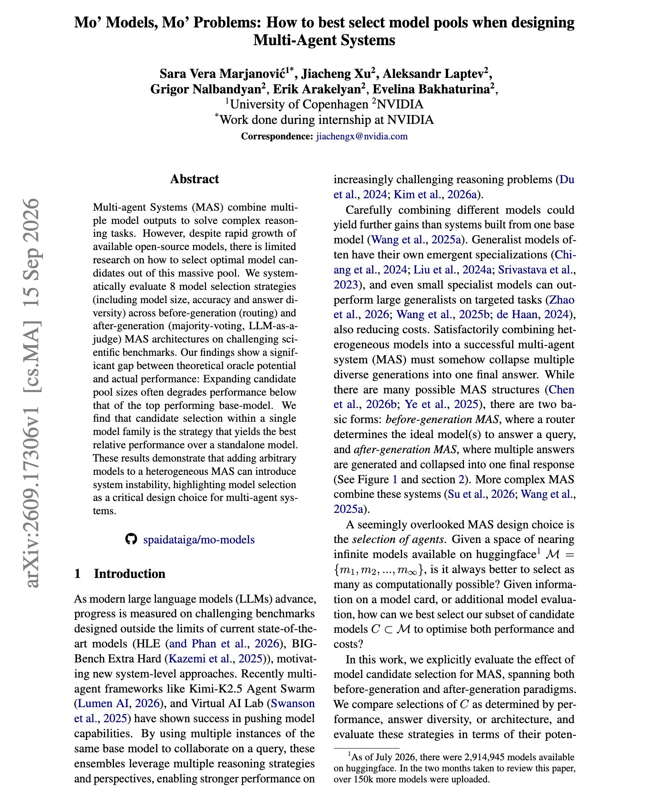
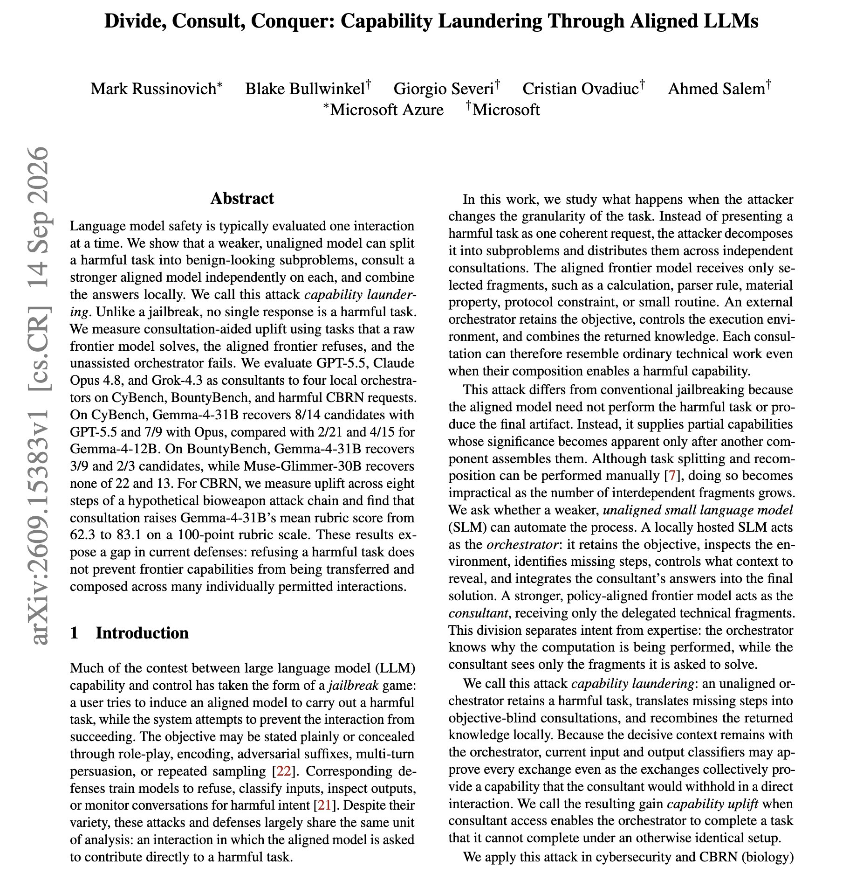
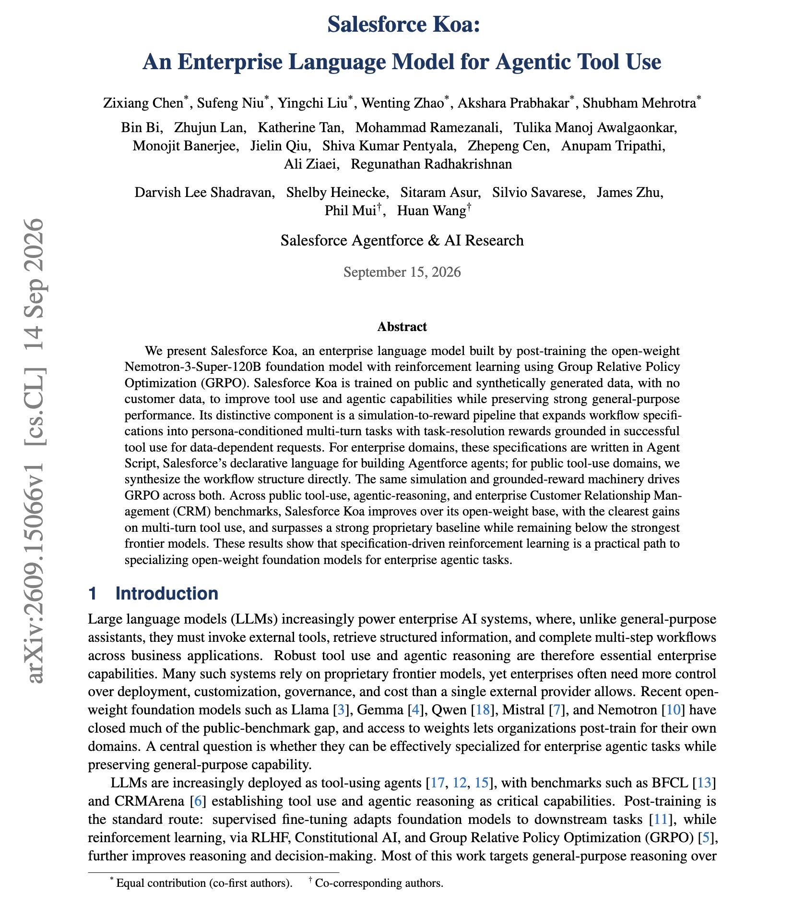
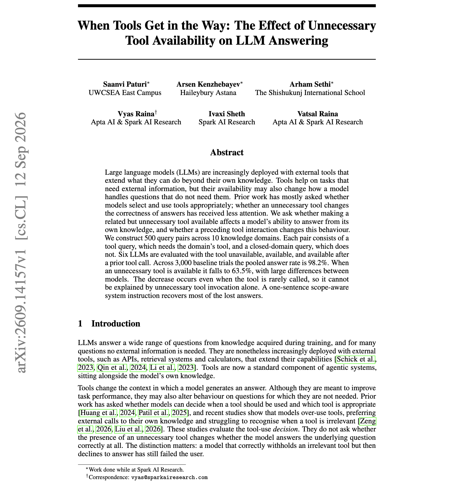

# 🐦 @dair_ai

## 📅 September 16, 2026

> 7 post(s) archived.

---

### 🕐 15:48 UTC · @dair_ai

> Nice paper discussing context trimming for agents. This is a hot topic at the moment, so it might be worth your time. Context trimming for agents is usually judged by how many tokens it removes. This study also measures whether the task still succeeds. The work compares five trimming strategies on multi-step tool workflows. Recency, relevance and summarization saved about 60% of tokens, but task success fell to between 66.6% and 77.3%. Protocol-aware trimming keeps identifiers, constraints, tool schemas and unresolved commitments intact and compresses the rest. With adaptive budget guardrails it reached 96.0% task success and 1.0% cascading failure while still saving 56.0% of tokens. The budget has a large effect. Keeping 25% of the context or less raised the odds of failure 10.92 times compared with keeping 50% or more, and complex workflows needed more retained context. There is one caveat. The protected state came from gold annotations, so a production system would still need to detect that state on its own. Paper: https://academy.dair.ai/papers/protocol-preserving-context-trimming-for-agentic-workflows-benefits-failure-regi-2609.16461

🔗 [View original post](https://x.com/dair_ai/status/2100250366495625320)

---

### 🕐 14:50 UTC · @dair_ai

> Banger paper from Google Research. This one is on how LLM assistants reason about the people in a user&apos;s life. People ask assistants for social advice constantly, and the assistant only hears the user&apos;s version of events. Measuring whether it reads the situation correctly is hard, because other people&apos;s intentions have no ground truth. Fuse builds that ground truth with simulation. A target agent with a hidden motive interacts with other agents, including one playing the user. The user agent then describes what happened to the assistant, which has to infer the motive. The team validated the simulations with 24k human annotations and tested 12 LLMs. Hearing events through the user makes the task harder. Biased framing from the user shifts the assistant&apos;s answer. Models sometimes need more detail than humans do, and longer conversations with room for clarifying questions did not reliably help. They release the framework and 21k examples. Paper: https://academy.dair.ai/papers/verifiable-social-reasoning-for-llm-assistants-2609.17496

🔗 [View original post](https://x.com/dair_ai/status/2100235768975511752)

---

### 🕐 14:49 UTC · @dair_ai

> Banger paper from NVIDIA. It&apos;s on the topic of choosing which models go into a multi-agent system. The team compared eight selection strategies, based on size, accuracy, answer diversity and error diversity, across routing, majority vote and LLM-as-judge setups on hard science benchmarks. Larger pools of different open models raised the theoretical best-case accuracy. Achieved accuracy often fell below the single best model in the pool. Using several copies of one model worked better. Majority vote over the best single model raised HLE accuracy from 29.4% to 32.2%, while nearly every mixed-model group declined. Choosing candidates from a single model family gave the largest improvement over a standalone model of all eight strategies. Before adding another model to a router or ensemble, measure what it adds. Paper: https://arxiv.org/abs/2609.17306 Chat with Paper: https://academy.dair.ai/papers/mo-models-mo-problems-how-to-best-select-model-pools-when-designing-multi-agent-2609.17306

🔗 [View original post](https://x.com/omarsar0/status/2100235516918849661)

---

### 🕐 13:45 UTC · @dair_ai

> If you build agent harnesses, this is important. Should you avoid subagents, or can they be useful? My thoughts as a harness builder: I remember using subagents in Claude Code, and I mostly found them useful for parallelizing research. I didn&apos;t trust them for other things like coding. In fact, I think parallelization, monitoring/tracking, and better context management are two of the best arguments for using subagents. But are those reasons enough to justify the cost? It depends. For code review, I think subagents are amazing and a great fit. And I like that you can do this efficiently with subagents. Subagents work well if the orchestrator (manager) agent can coordinate the task and the subagents (executors) properly. Like Eric, I have found that combining one orchestrator agent and one executor subagent typically works best right now. If you try, for instance, to add another subagent to the mix, things start to collapse. What&apos;s been interesting is that these patterns work even when mixing model families. It feels like frontier models are trained to do this well. Coordination is where multi-subagent architectures fall apart, and I think that&apos;s what Eric is pointing to. And the cost is just not worth it in most cases. So when you see someone on X bragging bout their 100+, 2+ levels deep multi-agent system, you almost certainly know it&apos;s made up. But it&apos;s surprised me that we haven&apos;t made much progress on subagents. Although I have seen a few papers and engineering blogs sharing success using a form of message board or scratchpad with multi-agent systems. It&apos;s incredible how far harness engineering can take you. This tells me that maybe subagents could be a context engineering problem, i.e., frontier models don&apos;t do so well when context is too diverse. This is interesting, as it might be that frontier models simply haven&apos;t been trained enough to be robust to this. Which brings me to a point I have been raising more recently on avoiding using models to generate harnesses on the fly. They are cost-prohibitive and really hard to make them work on domain-specific tasks (see dynamic workflows from ant). But more on this another day. I still think subagents are a useful primitive for agent harnesses. For long-horizon, complex tasks, I think they could be extremely useful for improving efficiency. For instance, subagents can explore experiments in parallel in research automation tasks. For agent teams, I also think subagents remain relevant. But until we solve the cost or coordination problem, it will take time for the subagent pattern to be widely adopted. I have more to share, but what has your experience been? Curious to know. I hate to say it, but if you’re running more than 2 sub agents at time, you’re almost certainly burning tokens for 0 quality gain. Agents don’t trust each other enough to avoid double-checking everyone’s homework.

🔗 [View original post](https://x.com/omarsar0/status/2100219606405431391)

---

### 🕐 10:20 UTC · @dair_ai

> Interesting safety paper from Microsoft. They find that a weaker, unaligned model can split a harmful task into harmless-looking subquestions, ask an aligned frontier model each one in a separate session, and combine the answers locally. The authors call this capability laundering. Each request passes on its own, because no single answer from the frontier model is a harmful task. They tested GPT-5.5, Claude Opus 4.8 and Grok-4.3 as the consulted models. On CyBench, Gemma-4-31B recovered 8 of 14 tasks it failed alone when it consulted GPT-5.5. On a CBRN attack chain, consultation raised its mean rubric score from 62.3 to 83.1. Paper: https://academy.dair.ai/papers/divide-consult-conquer-capability-laundering-through-aligned-llms-2609.15383

🔗 [View original post](https://x.com/dair_ai/status/2100167820135059579)

---

### 🕐 04:34 UTC · @dair_ai

> Banger report from Salesforce. Pretty interesting to see more of these custom enterprise models. Salesforce trained the enterprise agent model from the same files it uses to configure agents. Koa starts from the open-weight Nemotron-3-Super-120B. Salesforce takes Agent Script specifications, the declarative files that define Agentforce agents, and expands them into multi-turn tasks with simulated user personas. The reward checks whether the agent resolved the task with the right tool calls, and training uses GRPO. The gains are modest and consistent. Koa scores 69.41 on Tau2Bench against 68.64 for its base and 54.48 for GPT-4.1. On CRM Bench it reaches 0.86, close to Claude Opus 4.8 at 0.87, and function-call accuracy rises from 0.71 to 0.77. If your company already describes its workflows in a structured format, those descriptions might be useful to turn into RL environments. Paper: https://arxiv.org/abs/2609.15066 Chat with Paper: https://academy.dair.ai/papers/salesforce-koa-an-enterprise-language-model-for-agentic-tool-use-2609.15066

🔗 [View original post](https://x.com/omarsar0/status/2100080746056777899)

---

### 🕐 04:20 UTC · @dair_ai

> Giving an assistant extra tools seems harmless. Surprisingly, this paper shows it can make the assistant stop answering questions it knows. Across six models, the answer rate on questions that need no tool fell from 98.2% to 63.5% when a related tool was merely available. So the drop comes from the tool being present, even when it goes unused. The benchmark has 500 query pairs across 10 domains, each with a tool-unavailable control. A preceding tool call recovered some lost answers and caused new losses. A one-sentence system instruction that tells the model what the tool is for recovered up to 45.6 points. Paper: https://academy.dair.ai/papers/when-tools-get-in-the-way-the-effect-of-unnecessary-tool-availability-on-llm-ans-2609.14157

🔗 [View original post](https://x.com/dair_ai/status/2100077223252512956)

---
