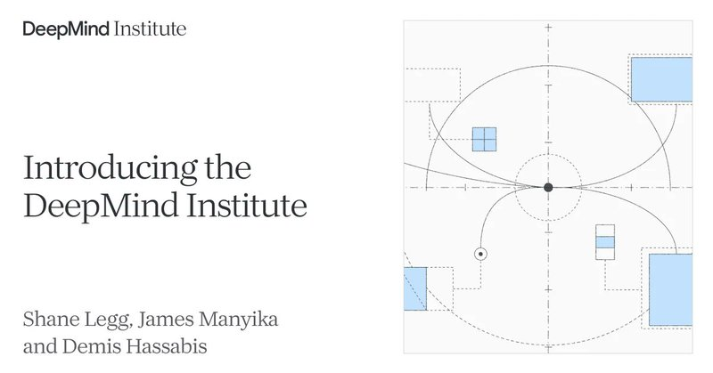
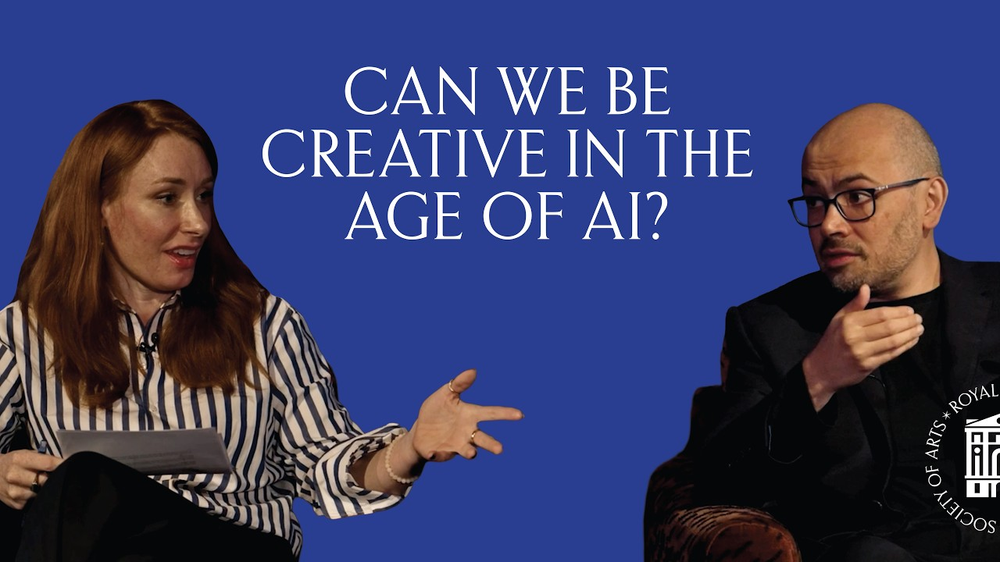

# 🐦 @demishassabis

## 📅 September 16, 2026

> 3 post(s) archived.

---

### 🕐 14:29 UTC · @demishassabis

> For 20+ years @ShaneLegg and I&apos;ve discussed AGI’s potential impact on the economy, science &amp; society. With the DeepMind Institute, we&apos;re expanding interdisciplinary research on key questions for the AI era. We hope it spurs the discussions needed to get the next steps right: http://deepmind.google/institute

🔗 [View original post](https://x.com/demishassabis/status/2100230524383981702)

---

### 🕐 14:29 UTC · @demishassabis

> More on the purpose behind the DeepMind Institute in this short introduction: https://institute.deepmind.com/essays/introducing-the-deepmind-institute/

🔗 [View original post](https://x.com/demishassabis/status/2100230526007218651)

---

### 🕐 13:13 UTC · @demishassabis

> Honoured to receive the Albert Medal from @theRSAorg! Science &amp; tech enable amazing opportunities, but the arts &amp; humanities will be crucial in shaping what sort of future we want to see as a society in the coming AGI era. Fun discussion w/ @FryRsquared covering many new topics: https://www.youtube.com/watch?v=rDteJAuKiBI

🔗 [View original post](https://x.com/demishassabis/status/2100211548794839140)

---
