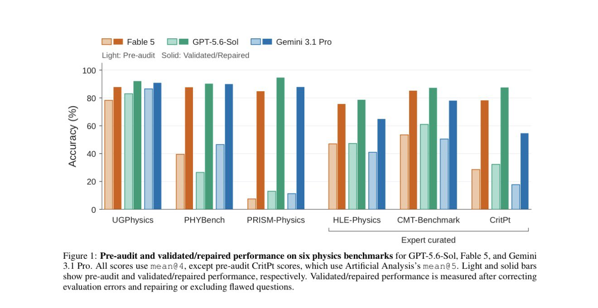
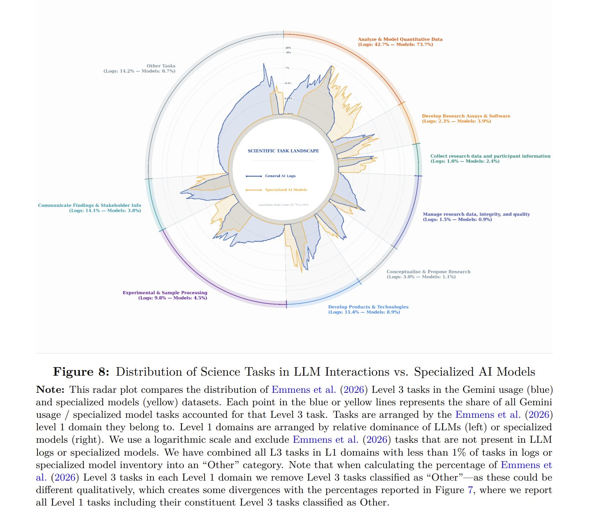

# 🐦 @emollick

## 📅 September 16, 2026

> 4 post(s) archived.

---

### 🕐 14:43 UTC · @emollick

> Paper; https://arxiv.org/abs/2609.13009

🔗 [View original post](https://x.com/emollick/status/2100234069543940320)

---

### 🕐 14:40 UTC · @emollick

> The state of public AI benchmarking is dire and is undermining our ability to understand how good AI is now. Most famous measures are maxed out, and, as this paper shows, the non-saturated benchmarks are riddled with so many errors that they vastly underestimate AI abilities.

🔗 [View original post](https://x.com/emollick/status/2100233342494925257)

---

### 🕐 05:59 UTC · @emollick

> Study from Google about AI use in science, complex impacts: acceleration (7 hours saved per week) along with shifts in the kind of work (more verification) and what research gets done (possibly safer topics). Also a good diagram of the jagged frontier https://ai.google/static/documents/AI-in-Science.pdf

🔗 [View original post](https://x.com/emollick/status/2100102316447670677)

---

### 🕐 02:04 UTC · @emollick

> This is an excellent demo of an AI model designed to rapidly classify information according to decision rules, much faster and cheaper than an LLM. It is not an LLM itself and cannot output text or code, but if it works, has a useful role in systems. (Haven’t tried it yet myself) We love how this doomo doomonstrates real-time intelligence and what can be doone with code + AI! ~10 calls/sec = ~$7/hour

🔗 [View original post](https://x.com/emollick/status/2100043071710777527)

---
