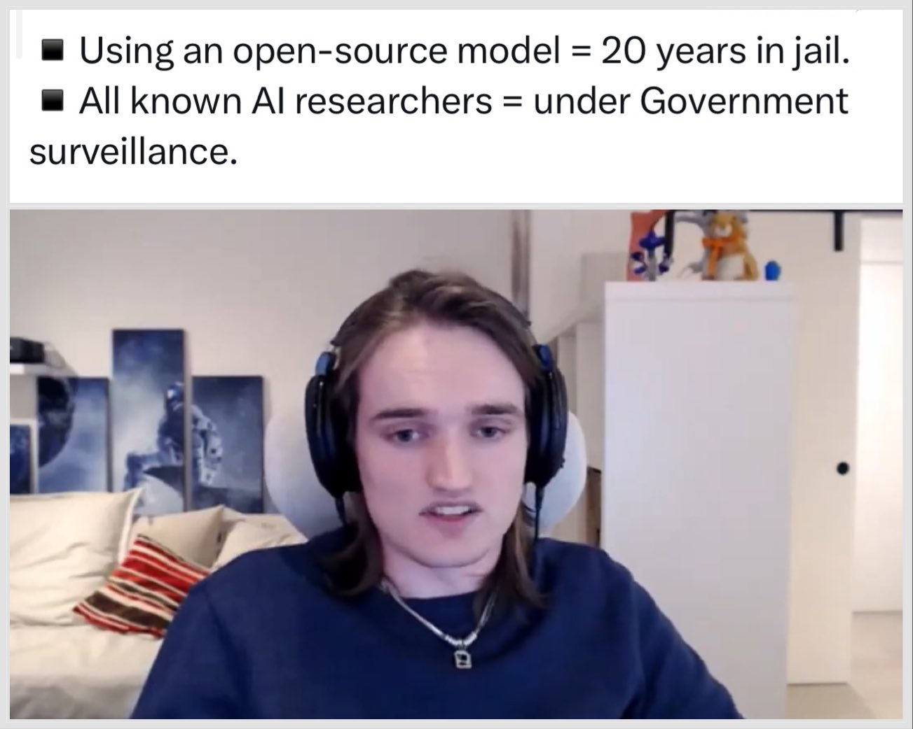

# 🐦 @ylecun

## 📅 September 16, 2026

> 3 post(s) archived.

---

### 🕐 08:23 UTC · @ylecun

> Being better than humans at searching and writing down the formal proof of a theorem does not equate being &quot;beyond human level at math&quot;. This is not all of math, any more than arithmetics, or computing integrals (symbolically or numerically) is all of math. It&apos;s one &quot;mechanical&quot; task in the whole activity that happens to be automatable. Mathematicians invent new concepts, new frameworks, new abstractions, new definitions, and formulate conjectures. This requires intuition and creativity that current AI systems do not have (yet).

🔗 [View original post](https://x.com/ylecun/status/2100138442491306245)

---

### 🕐 02:10 UTC · @ylecun

> Max Winga is the Creator Outreach and Systems Lead at ControlAI. Four facts about this British group: 1. US: This group is behind Bernie Sanders and Greg Casar&apos;s bill to ban superintelligence development. They briefed nearly 200 congressional offices and more than 20 members of the Senate and House of Representatives on AI extinction risk. 2. UK: ControlAI drafted the UK &quot;kill switch&quot; bill amendment which was introduced by Lord Tim Clement-Jones, and the &quot;ban superintelligence&quot; bill which was introduced by Alex Sobel. They briefed over 180 cross-party parliamentarians. 3. ControlAI&apos;s policy proposal, &quot;A Narrow Path,&quot; asks for a 20-year AI pause, because &quot;two decades provide the minimum time frame to construct our defenses.&quot; 4. This group is funded by Jaan Tallinn.

🔗 [View original post](https://x.com/DrTechlash/status/2100044560399475112)

---

### 🕐 00:13 UTC · @ylecun

> “AI doomers should be held accountable for their doomsday claims. It’s made up… It’s irresponsible. We ought to just keep track of all that and remind people when their claims don’t come true”—@JensenHuang NVIDIA I agree and hold the CEOs and executives of the companies that make these outrageous claims criminally libel. https://x.com/innovationcncl/status/2099870768960053469/video/1 Media

🔗 [View original post](https://x.com/BrianRoemmele/status/2100015233284915245)

---
