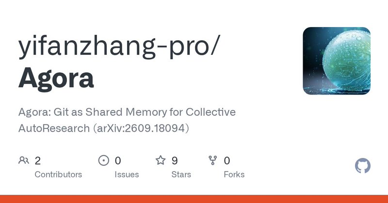
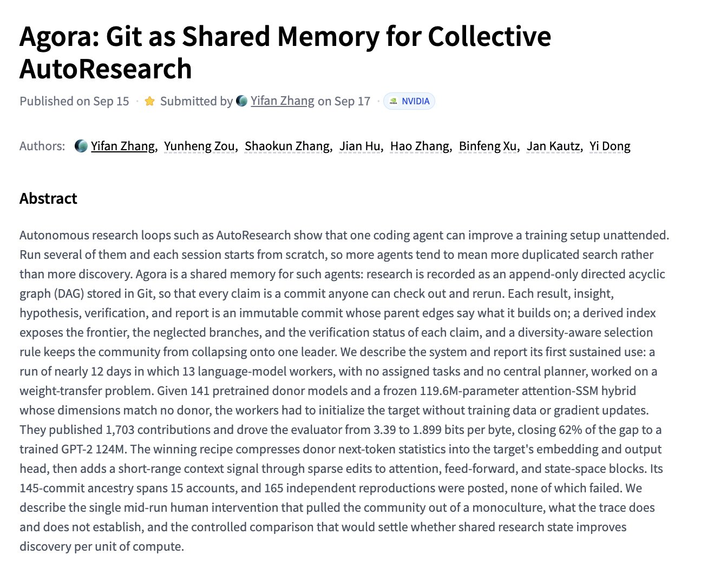

# 🐦 @_akhaliq

## 📅 September 17, 2026

> 4 post(s) archived.

---

### 🕐 20:30 UTC · @_akhaliq

> Thanks for sharing! https://github.com/yifanzhang-pro/Agora Agora Git as Shared Memory for Collective AutoResearch paper: https://huggingface.co/papers/2609.18094

🔗 [View original post](https://x.com/yifanzhang_/status/2100683815714685246)

---

### 🕐 20:01 UTC · @_akhaliq

> Agora Git as Shared Memory for Collective AutoResearch paper: https://huggingface.co/papers/2609.18094

🔗 [View original post](https://x.com/_akhaliq/status/2100676592577937659)

---

### 🕐 17:22 UTC · @_akhaliq

> LimiX-2 A Contextual Mechanism Network Towards General Structured-Data Intelligence paper: https://huggingface.co/papers/2609.17488 Media

🔗 [View original post](https://x.com/_akhaliq/status/2100636566997836191)

---

### 🕐 15:51 UTC · @_akhaliq

> Built a cool HF Space? Bring it to Open Together 🤗 Community demo applications are now open! Oct 16 · The Midway, SF Meet AI Builders. Try demos. Dance. Free registration ➡️ https://luma.com/OpenTogether Apply by Oct 2 ➡️ https://huggingface.co/spaces/OpenTogether/community-demos #OpenTogether #OpenSourceAIWeek Media

🔗 [View original post](https://x.com/jeffboudier/status/2100613673970798836)

---
