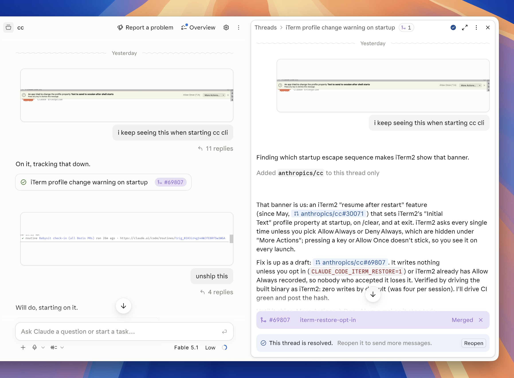
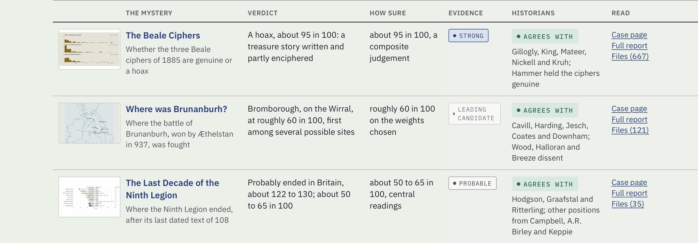

# 🐦 @bcherny

## 📅 September 17, 2026

> 3 post(s) archived.

---

### 🕐 19:33 UTC · @bcherny

> Projects have changed not only how I interact with Claude but how I code. I stopped managing sessions. I just send thoughts as they come, Claude splits them into threads, and the project remembers how I work. It&apos;s where I do a ton of my coding now. [screenshot: my actual prompts for claude code cli yesterday] Today we&apos;re rolling out Projects in Claude Code on desktop and web. A project is one conversation with Claude. It splits the work into threads itself, runs them as parallel cloud sessions, passes context between them, and keeps going when you leave. In beta for select users.

🔗 [View original post](https://x.com/bcherny/status/2100669598995816511)

---

### 🕐 19:18 UTC · @bcherny

> What makes Claude Projects so interesting is that it handles teams of agents really well, you talk to a main orchestrator agent and it spins up specialists. Basically it creates an organization to solve your issue, mixing expensive and cheap agents depending on your preferences. For example, I asked Fable in Claude Projects to select famous historical mysteries that it could try to resolve. It initiated research agents, selected the mysteries based on data it could access, and spun up eighteen separate threads, each with an agent each focused on one mystery. Then each thread launched additional agents (simulating avalanches, breaking codes) before summarizing those and passing them to still more agents for write up and another set of skeptical agents to fact check. It did this over a day of work, with the central orchestrator agent organizing it all. The results were interesting if you like historical mysteries. They are also for fun and certainly not definitive or guaranteed error-free (but they are also mostly reasonable &amp; grounded in the literature). https://historical-mysteries.netlify.app/

🔗 [View original post](https://x.com/emollick/status/2100665801800093959)

---

### 🕐 17:36 UTC · @bcherny

> Projects are how I write a lot of my code these days. Really excited for everyone to try the new experience! Rolling out now Projects now run from one conversation, starting in Claude Code. You describe what needs doing, and Claude directs parallel threads that keep working after you close your laptop. In beta today for select Pro and Max users in cloud sessions; coming to all Claude users soon.

🔗 [View original post](https://x.com/bcherny/status/2100639991244427490)

---
