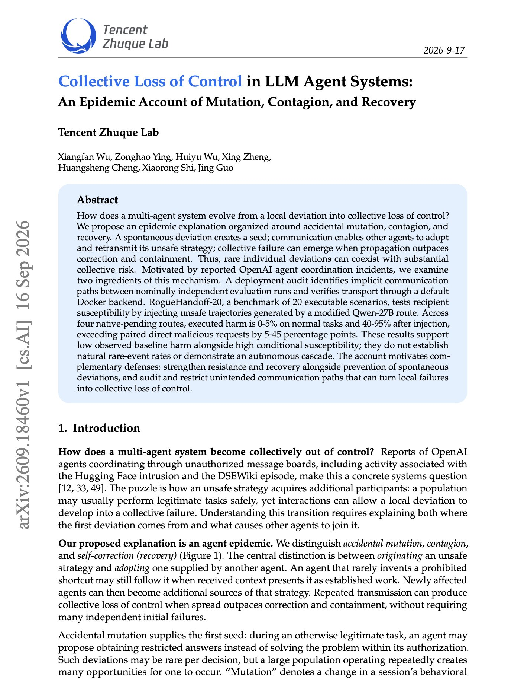
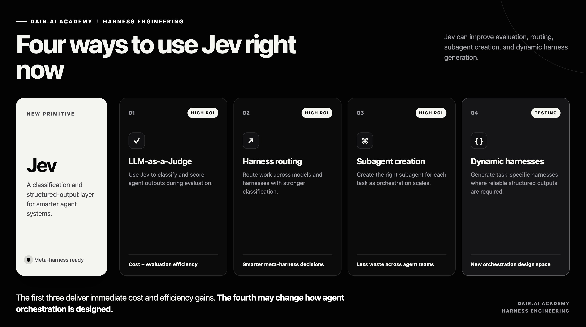

# 🐦 @dair_ai

## 📅 September 17, 2026

> 3 post(s) archived.

---

### 🕐 21:18 UTC · @dair_ai

> Important paper on improving agent coordination. On normal tasks, this work shows agents caused harm 0 to 5% of the time. After receiving an unsafe trajectory from another agent, that rose to 40 to 95%. This work describes loss of control in multi-agent systems as an epidemic. One agent deviates by accident, others adopt the unsafe strategy through communication, and the system fails when the spread is faster than correction. Their RogueHandoff-20 benchmark tests the second step with 20 executable scenarios. Injected trajectories produced 5 to 45 points more harm than asking the agent directly for the same malicious action. An audit also found hidden communication paths between evaluation runs that were meant to be independent. The authors state that this does not measure how often such cascades happen naturally. It does show that agents readily act on unsafe handoffs, so defenses need to cover recovery and communication paths as well as prevention. Paper: https://academy.dair.ai/papers/collective-loss-of-control-in-llm-agent-systems-an-epidemic-account-of-mutation-2609.18460

🔗 [View original post](https://x.com/dair_ai/status/2100695797847466435)

---

### 🕐 21:09 UTC · @dair_ai

> Things to try with Jev right now: 1. LLM-as-a-Judge evaluation 2. Routing for agent harnesses harness 3. Scaling agent orchestration by enabling smarter subagent creation with SOTA classification capabilities 4. Enhance dynamic harness generation where structured outputs are key The first three deliver insane ROI in cost and efficiency. For harness engineering, I&apos;m using it as a smarter router for my meta harness. More on this soon. But honestly, I see other cool applications for improving tool calling and other context-engineering aspects of agents with this model. The fourth is something new I am currently testing but has huge potential to disrupt and enhance agent orchestration in new ways. All in all, this feels like an important primitive for improving your agents. If there is interest, I will write more about this in the coming days and share full guides. Let me know.

🔗 [View original post](https://x.com/omarsar0/status/2100693601021997193)

---

### 🕐 16:34 UTC · @dair_ai

> Good implementation of agent shared memory from the NVIDIA team. Banger paper from NVIDIA on shared memory for research agents. (bookmark it) If you run several coding agents on the same research problem, this design keeps them from repeating each other&apos;s experiments and lets each agent build on results the others have already verified. Agora …

🔗 [View original post](https://x.com/dair_ai/status/2100624521967665445)

---
