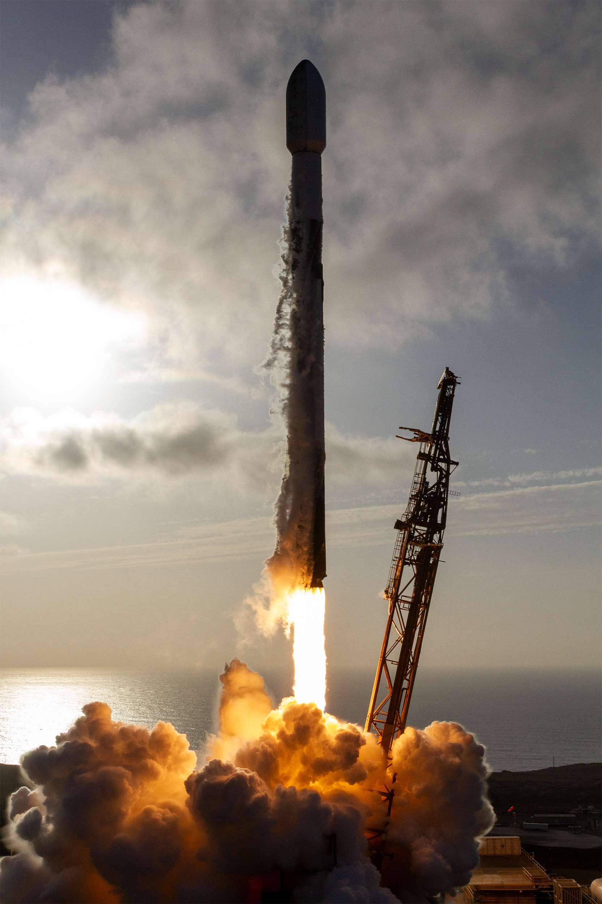

# 🐦 @elonmusk

## 📅 September 17, 2026

> 17 post(s) archived.

---

### 🕐 14:19 UTC · @elonmusk

> It’s amazing how damaging a single false premise (the blank slate fallacy) can be for humans. Same holds true for AI. I thought the tweet below must be omitting some critical context or paraphrasing the text ungenerously. But no, the NYT actually published an op-ed that claims the University of California hasn&apos;t sacrificed excellence even though it admits students who struggle with basic math.

🔗 [View original post](https://x.com/elonmusk/status/2100590521831804986)

---

### 🕐 14:15 UTC · @elonmusk

> I love you A beautiful surprise

🔗 [View original post](https://x.com/elonmusk/status/2100589562191863914)

---

### 🕐 13:48 UTC · @elonmusk

> Final day of Grok Bot Galaxy starts in next few few hours Day 3 — September 17 • 9:00–10:30 AM — Grok Bot for Marketing Operations • 12:30–1:30 PM — Grok Bot for Post-Sales • 2:30–4:00 PM — Grok Bot for Marketing Three more sessions showing how Grok Bot can actually be used across real business workflows Grok Bot Galaxy starts tomorrow (Sep 15) 🚀 If you’re planning to tune in, here’s the full schedule so you don’t miss the sessions you care about September 15 • 9:00–10:00 AM PT — Grok Bot 101 • 12:30–2:00 PM PT — Grok Bot for Engineering • 2:30–3:30 PM PT — Grok Bot for Product …

🔗 [View original post](https://x.com/XFreeze/status/2100582743553773715)

---

### 🕐 13:20 UTC · @elonmusk

> Dragged Off Her Own Porch: York College Students Beaten After Five 911 Calls - And A National Pattern Of Youth Street Mobs https://www.zerohedge.com/political/dragged-her-own-porch-york-college-students-beaten-after-five-911-calls-and-national

🔗 [View original post](https://x.com/zerohedge/status/2100575526356230458)

---

### 🕐 11:42 UTC · @elonmusk

> Milton Friedman: “I am not a conservative. I’ve never been a conservative. Hayek was not a conservative.” “We are liberals in the true meaning of that term: concerned with freedom. We are not liberals in the current distorted sense—those liberal with other people’s money.” Media

🔗 [View original post](https://x.com/MiltonFriedmanW/status/2100550835923227097)

---

### 🕐 08:24 UTC · @elonmusk

> True Starship being the only vehicle in the history of humanity that can take us to other planets does not get enough appreciation

🔗 [View original post](https://x.com/elonmusk/status/2100501250009686419)

---

### 🕐 06:03 UTC · @elonmusk

> That night SpaceX put everything on the line. December 21, 2015. Nearly 11 years later and it hits just as hard. Return to flight after a rocket failure six months earlier. First Full Thrust Falcon 9. First attempt to land an orbital-class booster on land. They had tried the droneship and failed. They had never successfully landed anything. In mission control it was a tense count. They went for it. Nine minutes later a rocket that had just thrown satellites toward orbit dropped out of the Florida dark. A camera on the back of the booster caught the engines lighting, still one of the most insane images in spaceflight. Legs out. The Falcon has landed. That was the peak of everything they had been working toward. The whole industry said it was impossible. They bet the company on that night anyway. Spaceflight has never been the same. Media

🔗 [View original post](https://x.com/cb_doge/status/2100465607519207867)

---

### 🕐 05:59 UTC · @elonmusk

> Falcon 9 launches USSF-259 to orbit from pad 4E in California

🔗 [View original post](https://x.com/SpaceX/status/2100464625993052185)

---

### 🕐 04:49 UTC · @elonmusk

> Starlink V5 terminal is in production The next generation Starlink V5 has a smaller form factor and lightweight design with greater power efficiency. With speeds up to 375+ Mbps, Starlink V5 delivers reliable home internet for streaming, video calling, gaming and more. Available in select areas.

🔗 [View original post](https://x.com/elonmusk/status/2100447103927353423)

---

### 🕐 04:39 UTC · @elonmusk

> I still think about this all the time Elon buying Twitter and restoring free speech was unironically one of the most pivotal moments in the 21st century Its effects will be studied for generations

🔗 [View original post](https://x.com/ArthurMacwaters/status/2100444410563772899)

---

### 🕐 01:22 UTC · @elonmusk

> Wow. Got them dead to rights. A main fundraising apparatus of the left was consistently and knowingly breaking the law, and hiding it. If it was the right caught doing this, it would 100% be the top news story for WEEKS in the legacy media. NEW: A House Judiciary report just dropped screenshots of ActBlue&apos;s internal Slack messages. They show staff knowingly waved through foreign donations—using &quot;verification&quot; methods you won&apos;t believe. Thread 🧵👇

🔗 [View original post](https://x.com/JTLonsdale/status/2100394908200861713)

---

### 🕐 01:17 UTC · @elonmusk

> Falcon 9’s first stage lands on the Of Course I Still Love You droneship Media

🔗 [View original post](https://x.com/SpaceX/status/2100393582418911731)

---

### 🕐 01:14 UTC · @elonmusk

> 💯 If everyone is a far right Nazi then no one is a far right Nazi. Words can be diluted of meaning.

🔗 [View original post](https://x.com/elonmusk/status/2100392984240160839)

---

### 🕐 01:08 UTC · @elonmusk

> Liftoff! Media

🔗 [View original post](https://x.com/SpaceX/status/2100391523338588268)

---

### 🕐 00:48 UTC · @elonmusk

> My Mom’s book is coming out soon @mayemusk https://lnk.to/TimelessMayeMusk

🔗 [View original post](https://x.com/elonmusk/status/2100386414345236662)

---

### 🕐 00:40 UTC · @elonmusk

> New episode of @SpaceX documentary A fully and rapidly reusable rocket will fundamentally change how humanity accesses outer space. “The Holy Grail of Rocketry” continues the ongoing Starship series with a look back at the scrappy days of SpaceX engineers proving reuse was possible and takes you onboard a high-sea…

🔗 [View original post](https://x.com/elonmusk/status/2100384403495293125)

---

### 🕐 00:14 UTC · @elonmusk

> This insane: California and China both started their High Speed Rail projects in 2008 - California hasn’t completed a single track - China completed over 31,000 miles of track during the same time Here’s where it gets really crazy, I did the math on how much California is spending compared to China This is the cost per mile breakdown: - China’s rail coeds about $30 million per mile - California official Phase 1 spending is $255 million per mile Read that again. Gavin Newsom needs to go to prison, this is the biggest money laundering project in California history Media

🔗 [View original post](https://x.com/WallStreetApes/status/2100377793683243174)

---
