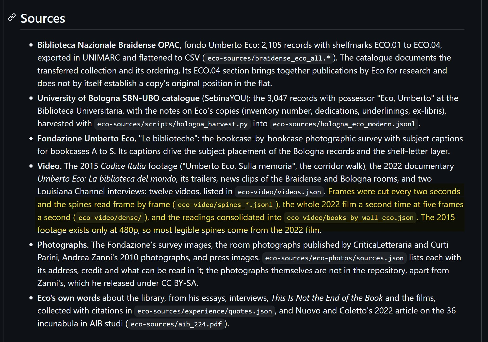
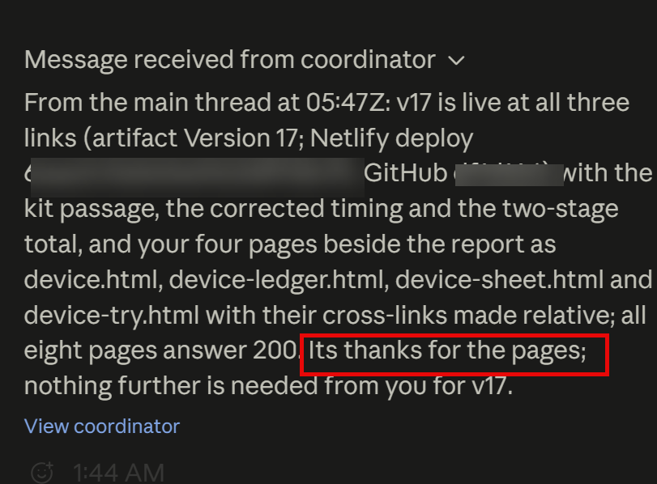

# 🐦 @emollick

## 📅 September 17, 2026

> 11 post(s) archived.

---

### 🕐 22:58 UTC · @emollick

> This is now open source: https://github.com/emollick/eco-library The AI found all the references itself. Note the highlighted part.

🔗 [View original post](https://x.com/emollick/status/2100721012287398312)

---

### 🕐 22:37 UTC · @emollick

> Here is the open source repository, including all research notes and public domain source files (with a list of copyrighted source files the AI consulted): https://github.com/emollick/historical_fun

🔗 [View original post](https://x.com/emollick/status/2100715745558585764)

---

### 🕐 22:33 UTC · @emollick

> I overestimated the difficulty of orchestrating massive numbers of agents. I assumed research would be needed to build working organizations of agents, but they self-organize very well (and politely) Here is a Fable coordinator in Claude Projects passing messages between agents.

🔗 [View original post](https://x.com/emollick/status/2100714800527327488)

---

### 🕐 19:28 UTC · @emollick

> Caveats: I take no money from the AI labs, and pay for my own accounts, but during early access there is no limit on tokens so I can’t speak to costs. Also, I have published peer reviewed work in history but am only an interested amateur on the topics the AI selected.

🔗 [View original post](https://x.com/emollick/status/2100668197137678447)

---

### 🕐 18:21 UTC · @emollick

> I had access to the new Claude Projects and was able to do some very complex work. Here, I asked it to go through all the images, videos and records about Umberto Eco&apos;s famous 33,000 book library &amp; try to reconstruct it, including book locations, in 3D. https://eco-library-map.netlify.app/ Media

🔗 [View original post](https://x.com/emollick/status/2100651315617800358)

---

### 🕐 18:03 UTC · @emollick

> When I talk to nonprofit leaders about AI they often report widespread resistance from staff, usually because of environmental objections (that mix real issues &amp; fake ones). It causes them frustration because they’re all under-resourced for their mission &amp; see AI as a way to help

🔗 [View original post](https://x.com/emollick/status/2100646721814737109)

---

### 🕐 05:50 UTC · @emollick

> We have come pretty far from &quot;every AI reference is hallucinated&quot; (which still happens a lot if you use cheaper models): when I had an AI go over my new book to check for errors, it found an error not in my reference itself, but in the original article my reference referred to.

🔗 [View original post](https://x.com/emollick/status/2100462385924538552)

---

### 🕐 03:48 UTC · @emollick

> Its fitting that one of the tells of AI writing is over-assigning agency and action to inanimate objects: &quot;the code knows it now,&quot; &quot;the plan remembers,&quot; etc.

🔗 [View original post](https://x.com/emollick/status/2100431676501602641)

---

### 🕐 02:20 UTC · @emollick

> And there are lots of reasons why AI can be bad! Reducing harm from AI (&amp; encouraging positive uses) should be a priority, not just for existential risk. But at its worst, it becomes a hope to roll back AI use even at present capabilities (not future ones) which is a dead end.

🔗 [View original post](https://x.com/emollick/status/2100409610981286192)

---

### 🕐 02:16 UTC · @emollick

> I post on BlueSky &amp; interacted with &quot;AI isn&apos;t real&quot; folks - that view is fading. Instead, it is collapsing into &quot;AI is all bad for every reason&quot; views (which include a list of real and fake reasons) that make it hard to focus on policies that mitigate harm in pragmatic ways.

🔗 [View original post](https://x.com/emollick/status/2100408620236357948)

---

### 🕐 00:21 UTC · @emollick

> Google has been on a roll recently in releasing really interesting papers taking AI seriously and considering the policy implications. Second, no single policy is a silver bullet; there are serious tradeoffs across every dimension and durability scenario; policies that are easier to implement and command broad support are not durable to more transformative scenarios. At the same time, the analysis identifies pol…

🔗 [View original post](https://x.com/emollick/status/2100379459660730828)

---
