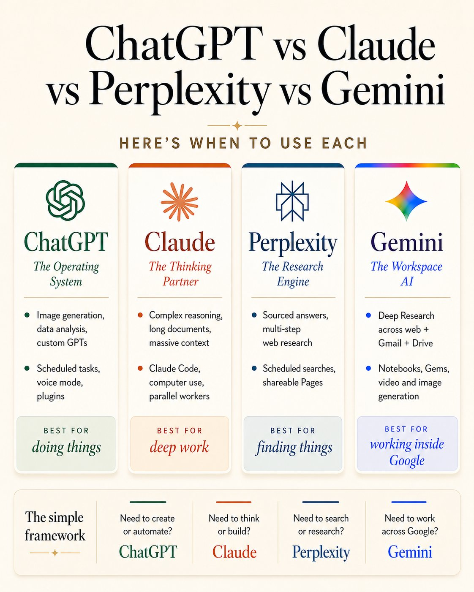

# 🐦 @AiEvolutio58513

## 📅 September 18, 2026

> 1 post(s) archived.

---

### 🕐 16:19 UTC · @AiEvolutio58513

> ChatGPT vs Claude vs Perplexity vs Gemini Here&apos;s when to use each: CHATGPT — The Operating System ↳ Image generation, data analysis, custom GPTs ↳ Scheduled tasks, voice mode, plugins ↳ Best for: doing things CLAUDE — The Thinking Partner ↳ Complex reasoning, long documents, massive context ↳ Claude Code, computer use, parallel workers ↳ Best for: deep work PERPLEXITY — The Research Engine ↳ Sourced answers, multi-step web research ↳ Scheduled searches, shareable Pages ↳ Best for: finding things GEMINI — The Workspace AI ↳ Deep Research across web + Gmail + Drive ↳ Notebooks, Gems, video and image generation ↳ Best for: working inside Google THE SIMPLE FRAMEWORK: → Need to create or automate? ChatGPT → Need to think or build? Claude → Need to search or research? Perplexity → Need to work across Google? Gemini All four are free to start. Most people only need one or two. Power users know when to switch. Save this for the next time you&apos;re stuck deciding.

🔗 [View original post](https://x.com/AiEvolutio58513/status/2100983038230609925)

---
