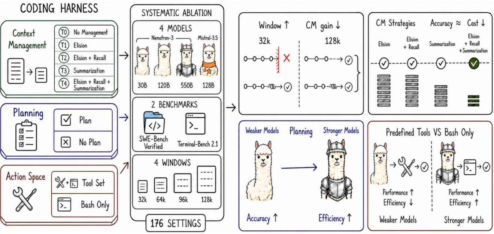

# 🐦 @_akhaliq

## 📅 September 18, 2026

> 2 post(s) archived.

---

### 🕐 08:15 UTC · @_akhaliq

> NVIDIA&apos;s SoL-Pi, now on Hugging Face paper pages A token-efficient agent harness built by recursively scaling auto-research loops. It cuts token traffic by 44.7-49.0% and API cost by about one third while preserving performance. Media

🔗 [View original post](https://x.com/HuggingPapers/status/2100861356442284375)

---

### 🕐 04:13 UTC · @_akhaliq

> Coding agent harnesses, taken apart A new study isolates planning, action space, and context management across 176 settings. Key finding: context management matters most when budgets are tight, and planning flips from accuracy to efficiency as models improve.

🔗 [View original post](https://x.com/HuggingPapers/status/2100800263644705178)

---
