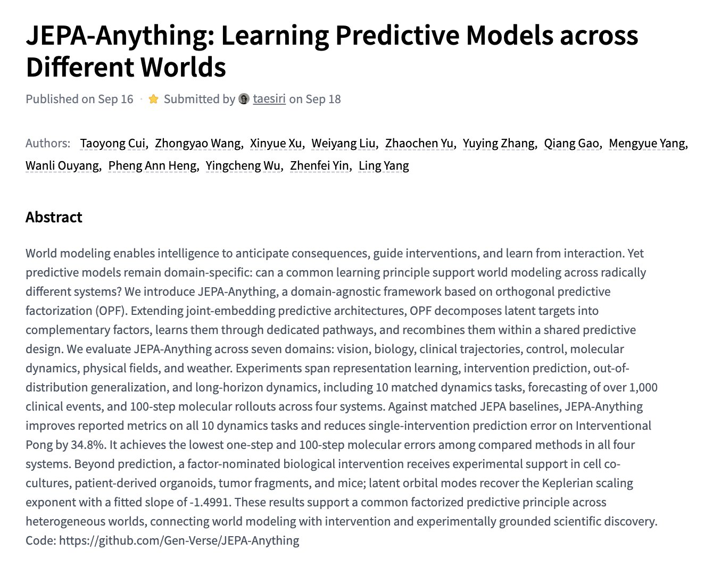
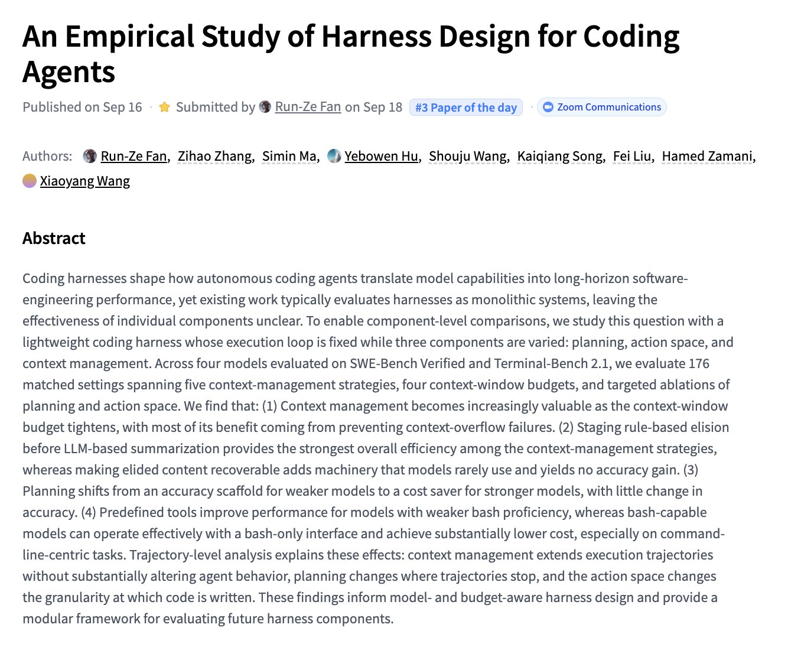
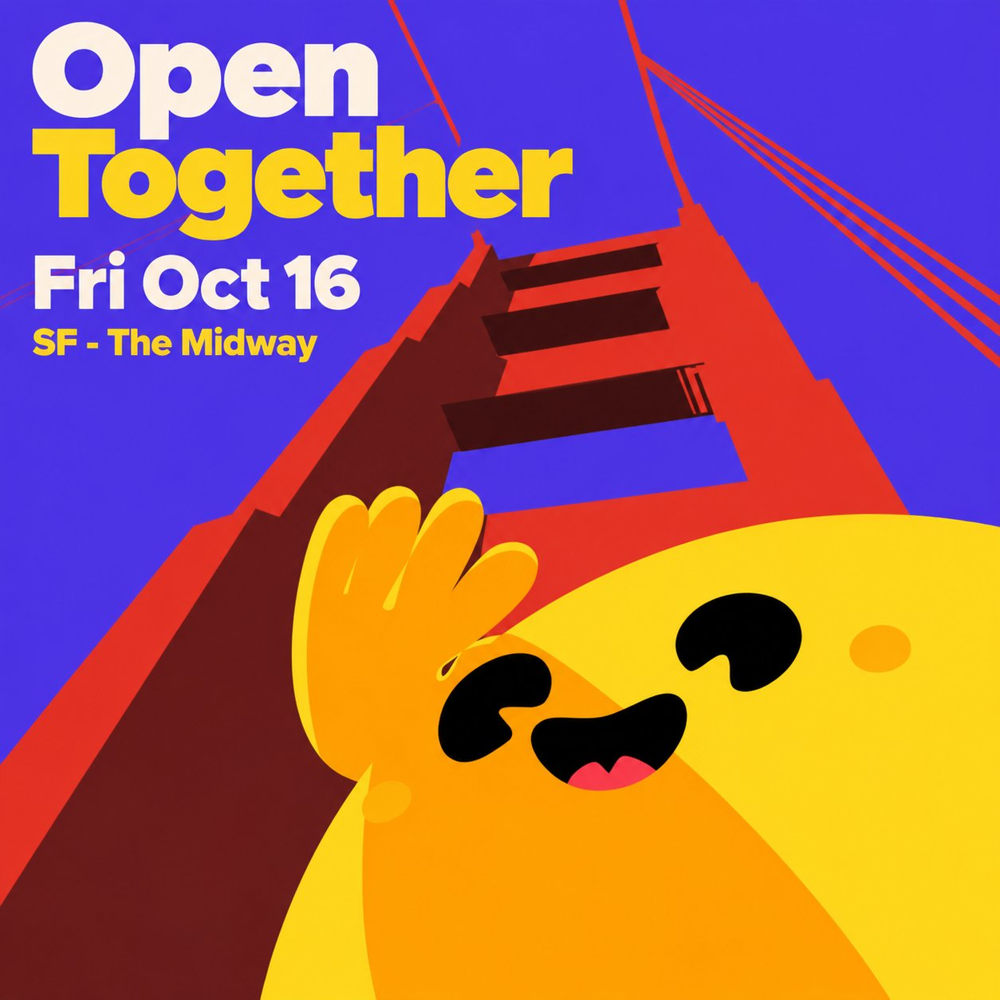

# 🐦 @_akhaliq

## 📅 September 18, 2026

> 5 post(s) archived.

---

### 🕐 18:52 UTC · @_akhaliq

> JEPA-Anything Learning Predictive Models across Different Worlds paper: https://huggingface.co/papers/2609.20800

🔗 [View original post](https://x.com/_akhaliq/status/2101021609113112658)

---

### 🕐 18:48 UTC · @_akhaliq

> An Empirical Study of Harness Design for Coding Agents paper: https://huggingface.co/papers/2609.20804

🔗 [View original post](https://x.com/_akhaliq/status/2101020560964866103)

---

### 🕐 15:07 UTC · @_akhaliq

> We’ll kick off the Open Source AI Week in SF with a meetup, community demos, and a dance party. Let&apos;s all push and celebrate more openness and transparency in AI!

🔗 [View original post](https://x.com/ClementDelangue/status/2100964987720155620)

---

### 🕐 08:15 UTC · @_akhaliq

> NVIDIA&apos;s SoL-Pi, now on Hugging Face paper pages A token-efficient agent harness built by recursively scaling auto-research loops. It cuts token traffic by 44.7-49.0% and API cost by about one third while preserving performance. Media

🔗 [View original post](https://x.com/HuggingPapers/status/2100861356442284375)

---

### 🕐 04:13 UTC · @_akhaliq

> Coding agent harnesses, taken apart A new study isolates planning, action space, and context management across 176 settings. Key finding: context management matters most when budgets are tight, and planning flips from accuracy to efficiency as models improve.

🔗 [View original post](https://x.com/HuggingPapers/status/2100800263644705178)

---
