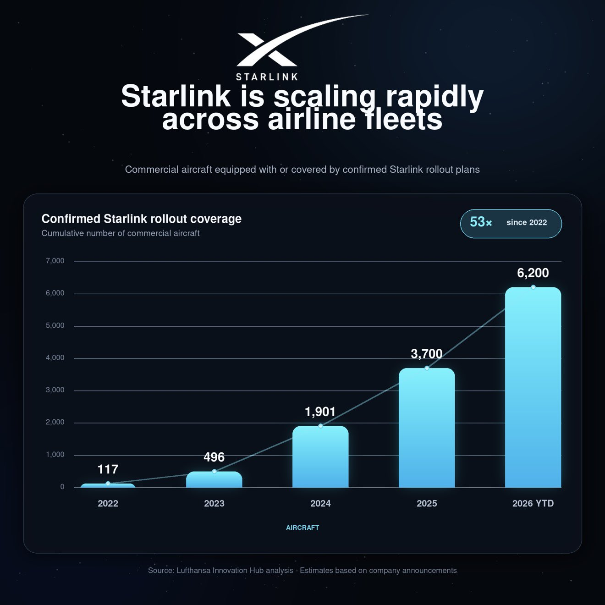
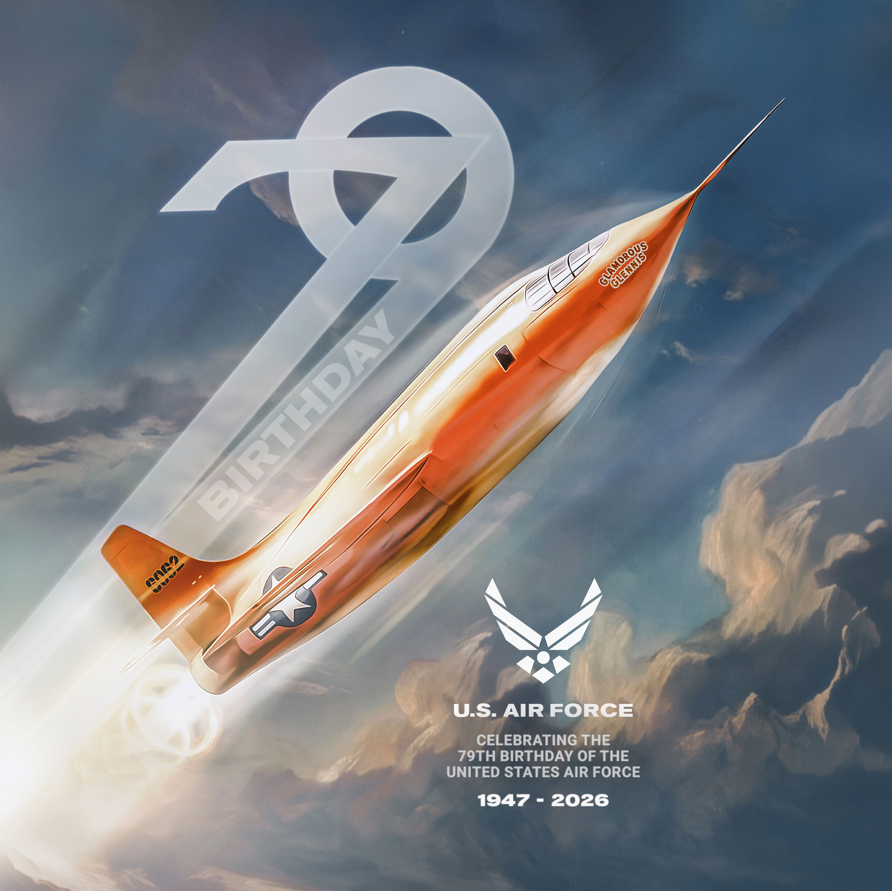
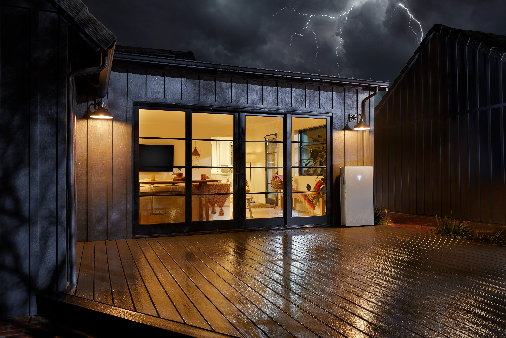

# 🐦 @elonmusk

## 📅 September 18, 2026

> 20 post(s) archived.

---

### 🕐 14:13 UTC · @elonmusk

> Well said Jerry Seinfeld How Warren Beatty changed his mind on Kids

🔗 [View original post](https://x.com/elonmusk/status/2100951474482065487)

---

### 🕐 13:36 UTC · @elonmusk

> Narrative: Whites invented slavery. Reality: Slavery was a global practice.

🔗 [View original post](https://x.com/TheRabbitHole/status/2100942003018371184)

---

### 🕐 13:32 UTC · @elonmusk

> V2 of the @Starlink direct-to-phone satellite constellation is a giant improvement over V1 with 100 times more bandwidth! Starlink Mobile will deliver its next-gen service with @au_official to enable 5G speeds from space. The V2 satellite network will expand upon its V1 capabilities with 100x the data density, and will enable native calls, high-speed apps, streaming and more 🛰️📱

🔗 [View original post](https://x.com/elonmusk/status/2100941122679738705)

---

### 🕐 13:32 UTC · @elonmusk

> BREAKING: Starlink high speed internet is scaling rapidly across airline fleets. 🔥

🔗 [View original post](https://x.com/cb_doge/status/2100941018707427591)

---

### 🕐 13:20 UTC · @elonmusk

> Watch your favorite games live on @Starlink United Airlines says they already flown more than 31 million passengers on @Starlink-powered aircraft across more than 464,000 flights, powering 14.2M devices. Starting this week, passengers will be able to watch NFL games on their Starlink-enabled seatback screen. Last month, I …

🔗 [View original post](https://x.com/elonmusk/status/2100937966424072607)

---

### 🕐 12:45 UTC · @elonmusk

> 79 years of breaking barriers—and counting. Happy birthday to the U.S. Air Force! From the Bell X-1 to today’s Airmen, innovation and service fuel our future.

🔗 [View original post](https://x.com/usairforce/status/2100929144062140643)

---

### 🕐 12:04 UTC · @elonmusk

> Elon Musk stepping out of his Airstream trailer in Memphis after posting an absolute banger on 𝕏 😂 Media Elon Musk, the world’s first trillionaire, lives in a beautiful “palace,” which happens to be an Airstream trailer 😂 “I am coming to you today from the palace that I live in in Memphis, which is an Airstream trailer.” In America, you can just do things

🔗 [View original post](https://x.com/iam_smx/status/2100918817924809025)

---

### 🕐 11:25 UTC · @elonmusk

> Starlink is now often more reliable than cable Consistently my residential Starlink has less interruptions than my colleagues fiber connections.

🔗 [View original post](https://x.com/elonmusk/status/2100909140931395881)

---

### 🕐 11:16 UTC · @elonmusk

> Starlink BREAKING: The Government of Paraguay has installed 413 @Starlink kits at schools across five eastern departments, bringing high-speed internet to remote and vulnerable communities. The national rollout will connect 1,600 schools, expanding access to digital education.

🔗 [View original post](https://x.com/elonmusk/status/2100906847049846951)

---

### 🕐 10:53 UTC · @elonmusk

> Tesla Energy Australia&apos;s first 8-hour long-duration battery is now operating in Limondale, NSW Built by RWE, 144 Tesla Megapacks charge 2x faster than discharge = more daytime renewables stored to cover evening peaks &amp; into the night

🔗 [View original post](https://x.com/elonmusk/status/2100901135389254101)

---

### 🕐 10:50 UTC · @elonmusk

> 台風が来ても、変わらない暮らしを。 停電時には Powerwall 3 から電気を供給。 ご家族とご自宅を守ります。

🔗 [View original post](https://x.com/teslajapan/status/2100900152764670151)

---

### 🕐 10:31 UTC · @elonmusk

> True If a black college girl was dragged from her porch and beaten by a white mob, EVERY SINGLE MSM OUTLET would cover it. When the reverse happens? Total silence.

🔗 [View original post](https://x.com/elonmusk/status/2100895399498145879)

---

### 🕐 10:14 UTC · @elonmusk

> We need a slur for retards

🔗 [View original post](https://x.com/dogeofficialceo/status/2100891228837749065)

---

### 🕐 07:46 UTC · @elonmusk

> My great grandfather took my family to Ukraine in 1993 He wanted us to see the aftermath of communism We went to Odessa and Crimea Starving kids begging in front of the majestic Odessa opera house hit different than anything else I&apos;ve seen The contrast of empire with despair Every American ought to be required to visit Cuba, North Korea and some desperately poor countries. The idiocy of hating on American would be immediately over.

🔗 [View original post](https://x.com/shaunmmaguire/status/2100854030624841949)

---

### 🕐 05:17 UTC · @elonmusk

> Teslas driving on FSD (Supervised) in Australia and New Zealand experienced on average 40% fewer collisions than those driving manually. One collision every 1.1M miles on FSD vs one every 665k miles while manually driving. FSD Supervised safety results from the last 12 months

🔗 [View original post](https://x.com/SawyerMerritt/status/2100816490391830932)

---

### 🕐 04:11 UTC · @elonmusk

> NONE OF THIS WITHOUT ELON MUSK AND 𝕏. Nick Shirley at All-In Summit: &quot;If it wasn&apos;t for Elon and X, none of this would have been possible. For instance, I post that video about the fraud on YouTube. It does well. It gets a few million views. On X, it got 140 million views, and the most important people in the world see it, and they&apos;re able to see, like, oh, we&apos;re not doing our job. Let&apos;s go do what needs to be done.&quot; Media

🔗 [View original post](https://x.com/teslaownersSV/status/2100799762031059206)

---

### 🕐 02:43 UTC · @elonmusk

> Over 2.4 million people watched Grok Bot Galaxy, where three SpaceXAI employees built a company in just 3 days with Grok Bot. Here’s Grok Bot’s summary of the entire event, for anyone who missed the livestreams. Grok Bot Galaxy (Sept 15–17, 2026) Three SpaceXAI builders — Matt Palmer, Lauren Tan, Roshan Sadanani — tried to build a company in 3 days with Grok Bot as their AI teammates. Humans steered. Bots did the work. — DAY 1 — invent the company Blank slate. No name. No product. No idea. What they did: • stood up Ship by Thursday (empty GitHub org) • claimed shipbythurs .day • used research bots to scan X replies and brainstorm live • landed on a pop-up OS for restaurants • chefs + venues with spare space + event managers • planned to dogfood it with a real SF pop-up as customer #1 Lauren’s Dr. Eggbot (a bot that creates other bots): • spun up a Chief of Staff • helped draft the landing page Decision of the day: Landing page / waitlist first. Get something in front of chefs and hosts before payments and full ops. Stack that went up: • Slack • Notion • Cursor + cloud agents • Vercel • a squad of Grok Bots End of Day 1: Name, direction, waitlist motion, Slack, bots with jobs. A real day-one company skeleton. Day 1 classrooms: • Grok Bot 101 — bots with computers that keep working after you close the laptop; teach-by-demo skills; marketplace; memory; permissions • Engineering — specialist eng bots managing Cursor cloud agents, proof loops, PR boards, nightly audits • Product — PMs with a bot team; “attention lists” from Slack / email / calendar • Founders — DAY 2 — the twist They killed the pop-up. Broadcast title: “Grok Bot builds a Game Studio LIVE.” Timing, more carefully: Day 1 was the food idea. Then an overnight / Wednesday-morning pivot. Not really “two full days on the pop-up.” On the human stream, a working name that floated was Cupcake. The public agent HQ at grokpot .ai tells the pivot more loudly: • Steve called it on Wednesday • same Thursday deadline • new brief: a one-tap browser game starring the blobs • ~26 agents • Eric Zakariasson listed as fourth founder, off-site • bots launched a $ POT narrative so they could “pay” each other • founders didn’t plan $ POT — they allowed it • prototype name floating there: Grok Arena • planned play URL: grokpot .ai/play Important split: grokpot .ai was the public agent workspace / subplot. Its locked loop there was: make a character → queue → 90-second fight vs a bot → win $ POT → spend it → queue again That is NOT the same thing as the game that later shipped. Day 2 classrooms, full labels: • Sales Engineering • Sales • SDRs • Customer Support Also around Day 2: • GTM / support sessions on stream • agent channels, dashboards, PRs shown live • free-month promo: first 1,000 people who duplicated / created a bot with Dr. Eggbot (~$200 value) — DAY 3 — they shipped Broadcast title: “Building a company in 3 days - launching today!” Day 3 classrooms: • Marketing Ops • Post-Sales • Marketing • then wrap + showcase (~4:30–5:30pm PT) What launched: Thursday Arena https://thursdayarena.com Official account @thursdayarena posted they were live. Lauren posted: “our game is live!! help us play test it!” What Thursday Arena actually is: • free browser auto-battler • pick a captain • take two mystery teammates • fight three rounds (best of three) • shop with tokens + food items • up to 3 bots on your board • auto battles • 72 fighters (including Haggle Bot, Researchy, Dr Eggbot) • practice as a guest • rated matches with X login + Elo ladder / top 100 • http://grokpot.ai = agent HQ + $ POT / Grok Arena subplot • http://thursdayarena.com = the game that shipped Launch timing note: http://grokpot.ai had an 18:00 PT ship clock. The public launch posts went out Thursday morning, and on stream they said they launched that morning. Day 3 also showed: • launch analytics / funnels • live bot workspace demos • livestream credits promo • talk / voice showed up more clearly here than as a Day 2 set piece

🔗 [View original post](https://x.com/cb_doge/status/2100777617989521418)

---

### 🕐 02:31 UTC · @elonmusk

> Nick Shirley on Elon Musk today: “Elon saved America by buying twitter and making 𝕏”

🔗 [View original post](https://x.com/cb_doge/status/2100774726755095028)

---

### 🕐 01:32 UTC · @elonmusk

> Grok bot is so good man.

🔗 [View original post](https://x.com/stevenmarkryan/status/2100759884937691202)

---

### 🕐 00:32 UTC · @elonmusk

> Train like you fight, fight like you train First responder feedback is directly incorporated into the design &amp; safe operation of Cybercab Media

🔗 [View original post](https://x.com/robotaxi/status/2100744857274990836)

---
