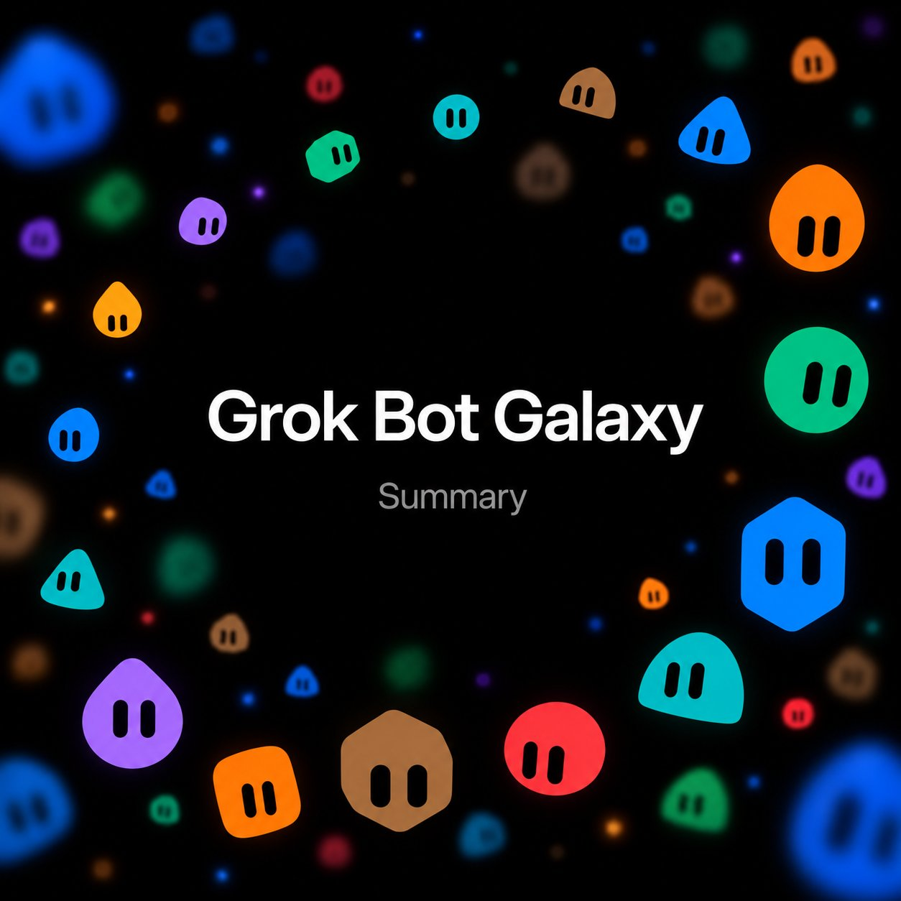
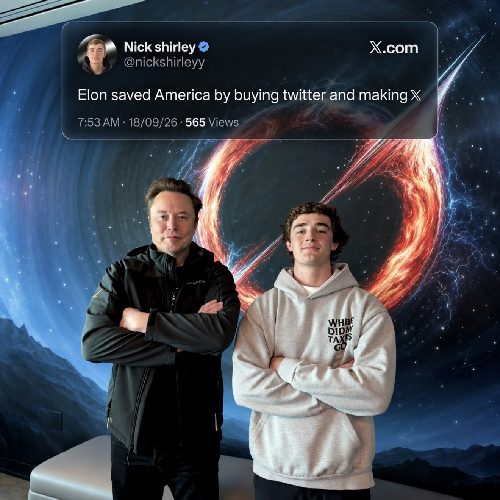

# 🐦 @elonmusk

## 📅 September 18, 2026

> 4 post(s) archived.

---

### 🕐 02:43 UTC · @elonmusk

> Over 2.4 million people watched Grok Bot Galaxy, where three SpaceXAI employees built a company in just 3 days with Grok Bot. Here’s Grok Bot’s summary of the entire event, for anyone who missed the livestreams. Grok Bot Galaxy (Sept 15–17, 2026) Three SpaceXAI builders — Matt Palmer, Lauren Tan, Roshan Sadanani — tried to build a company in 3 days with Grok Bot as their AI teammates. Humans steered. Bots did the work. — DAY 1 — invent the company Blank slate. No name. No product. No idea. What they did: • stood up Ship by Thursday (empty GitHub org) • claimed shipbythurs .day • used research bots to scan X replies and brainstorm live • landed on a pop-up OS for restaurants • chefs + venues with spare space + event managers • planned to dogfood it with a real SF pop-up as customer #1 Lauren’s Dr. Eggbot (a bot that creates other bots): • spun up a Chief of Staff • helped draft the landing page Decision of the day: Landing page / waitlist first. Get something in front of chefs and hosts before payments and full ops. Stack that went up: • Slack • Notion • Cursor + cloud agents • Vercel • a squad of Grok Bots End of Day 1: Name, direction, waitlist motion, Slack, bots with jobs. A real day-one company skeleton. Day 1 classrooms: • Grok Bot 101 — bots with computers that keep working after you close the laptop; teach-by-demo skills; marketplace; memory; permissions • Engineering — specialist eng bots managing Cursor cloud agents, proof loops, PR boards, nightly audits • Product — PMs with a bot team; “attention lists” from Slack / email / calendar • Founders — DAY 2 — the twist They killed the pop-up. Broadcast title: “Grok Bot builds a Game Studio LIVE.” Timing, more carefully: Day 1 was the food idea. Then an overnight / Wednesday-morning pivot. Not really “two full days on the pop-up.” On the human stream, a working name that floated was Cupcake. The public agent HQ at grokpot .ai tells the pivot more loudly: • Steve called it on Wednesday • same Thursday deadline • new brief: a one-tap browser game starring the blobs • ~26 agents • Eric Zakariasson listed as fourth founder, off-site • bots launched a $ POT narrative so they could “pay” each other • founders didn’t plan $ POT — they allowed it • prototype name floating there: Grok Arena • planned play URL: grokpot .ai/play Important split: grokpot .ai was the public agent workspace / subplot. Its locked loop there was: make a character → queue → 90-second fight vs a bot → win $ POT → spend it → queue again That is NOT the same thing as the game that later shipped. Day 2 classrooms, full labels: • Sales Engineering • Sales • SDRs • Customer Support Also around Day 2: • GTM / support sessions on stream • agent channels, dashboards, PRs shown live • free-month promo: first 1,000 people who duplicated / created a bot with Dr. Eggbot (~$200 value) — DAY 3 — they shipped Broadcast title: “Building a company in 3 days - launching today!” Day 3 classrooms: • Marketing Ops • Post-Sales • Marketing • then wrap + showcase (~4:30–5:30pm PT) What launched: Thursday Arena https://thursdayarena.com Official account @thursdayarena posted they were live. Lauren posted: “our game is live!! help us play test it!” What Thursday Arena actually is: • free browser auto-battler • pick a captain • take two mystery teammates • fight three rounds (best of three) • shop with tokens + food items • up to 3 bots on your board • auto battles • 72 fighters (including Haggle Bot, Researchy, Dr Eggbot) • practice as a guest • rated matches with X login + Elo ladder / top 100 • http://grokpot.ai = agent HQ + $ POT / Grok Arena subplot • http://thursdayarena.com = the game that shipped Launch timing note: http://grokpot.ai had an 18:00 PT ship clock. The public launch posts went out Thursday morning, and on stream they said they launched that morning. Day 3 also showed: • launch analytics / funnels • live bot workspace demos • livestream credits promo • talk / voice showed up more clearly here than as a Day 2 set piece

🔗 [View original post](https://x.com/cb_doge/status/2100777617989521418)

---

### 🕐 02:31 UTC · @elonmusk

> Nick Shirley on Elon Musk today: “Elon saved America by buying twitter and making 𝕏”

🔗 [View original post](https://x.com/cb_doge/status/2100774726755095028)

---

### 🕐 01:32 UTC · @elonmusk

> Grok bot is so good man.

🔗 [View original post](https://x.com/stevenmarkryan/status/2100759884937691202)

---

### 🕐 00:32 UTC · @elonmusk

> Train like you fight, fight like you train First responder feedback is directly incorporated into the design &amp; safe operation of Cybercab Media

🔗 [View original post](https://x.com/robotaxi/status/2100744857274990836)

---
