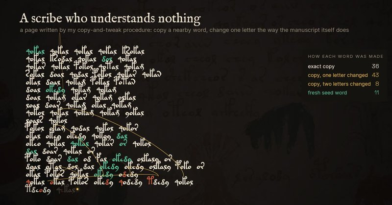

# 🐦 @emollick

## 📅 September 18, 2026

> 5 post(s) archived.

---

### 🕐 14:49 UTC · @emollick

> Here is Claude describing how it did it in the most Claudish way. I gave it encouraging prompts while the various agents were working &quot;is the presentation beautiful and interesting?&quot; but did not comment at all on the end product, which is all Calude. https://the-book-i-cannot-read.netlify.app/

🔗 [View original post](https://x.com/emollick/status/2100960392092483876)

---

### 🕐 02:05 UTC · @emollick

> As per usual, be careful not to be pulled in by the self-anthropomorphism, which was implied by the prompt. This fit into my Claude usage limit, but the entire analysis of the manuscript (including many agents) &amp; movie would have cost about $85 in tokens on Fable 5.1 otherwise

🔗 [View original post](https://x.com/emollick/status/2100768169795227746)

---

### 🕐 02:01 UTC · @emollick

> Hey Claude, &quot;Pick a problem or mystery that obsesses you and solve it as best you can &amp; make a movie we can share on social media about it&quot; So it took a crack at the Voynich Manuscript &amp; failed. Then it made this movie, which is pretty interesting to watch and a good explainer. Media

🔗 [View original post](https://x.com/emollick/status/2100767116819325141)

---

### 🕐 00:30 UTC · @emollick

> Epoch continues to do some of the best public benchmarking work on AI. This is helpful (and tells us how bad the state of benchmarking is, and how terrible some of our favorite benchmarks are) Introducing Benchmark Reviews: our new initiative to audit AI benchmarks. We are launching with 15 benchmarks: 4 Verified, 9 Flawed, and 2 with not enough information for a review.

🔗 [View original post](https://x.com/emollick/status/2100744220562673683)

---

### 🕐 00:28 UTC · @emollick

> I think it is worth continuing to ask if the Labs just eat every valuable AI vertical, especially as their costs of product development drop lower and lower due to AI in addition to the advantages of direct pricing on token costs and access to the underlying models themselves. Astra for Law shows a HUGE performance increase in our Legal Research Bench

🔗 [View original post](https://x.com/emollick/status/2100743641190781114)

---
