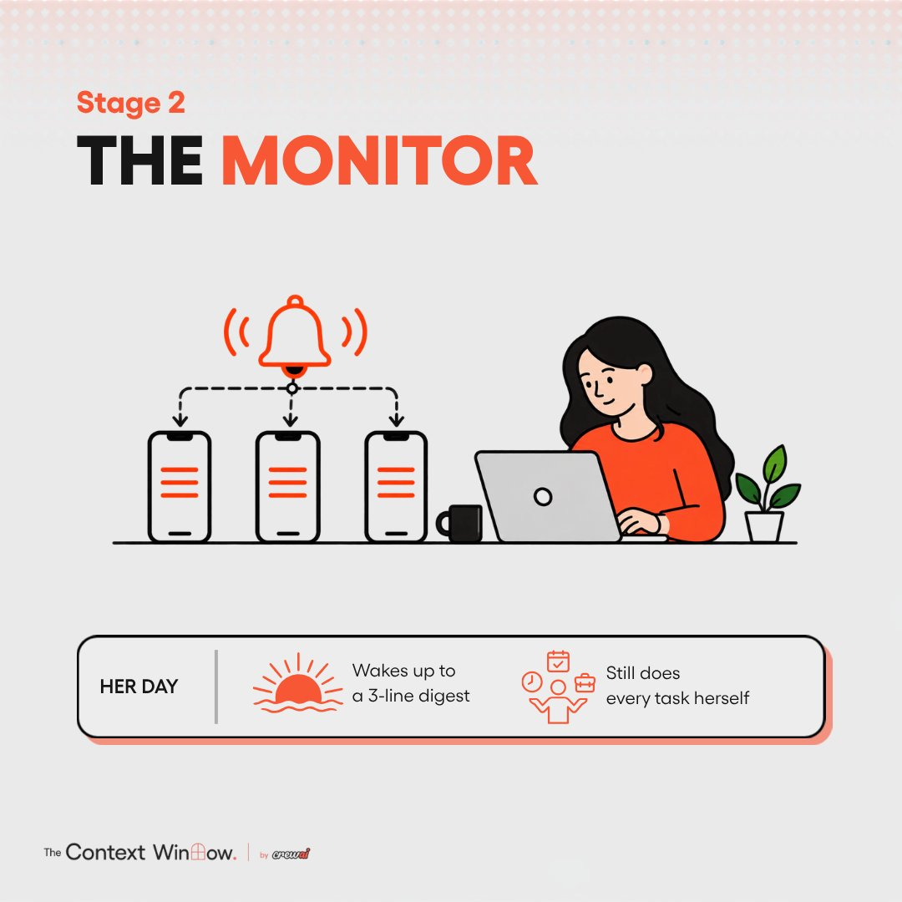

# 🐦 @joaomdmoura

## 📅 September 18, 2026

> 1 post(s) archived.

---

### 🕐 16:00 UTC · @joaomdmoura

> Every morning, an agent at CrewAI drops five bullets into Slack. If your team is new to agents, build this one first. It is a scheduled task. It checks HubSpot, the website and the last 24 hours of deal activity, then posts a five-bullet update. Nobody asks for it. All it does is read and report. When it gets a bullet wrong, someone ignores that bullet. And every morning you see how an agent reads your real systems, long before you let one act on them. The instruction can be this simple: every morning, check the CRM for what changed in the last 24 hours and send me five bullets.

🔗 [View original post](https://x.com/joaomdmoura/status/2100978214114058570)

---
