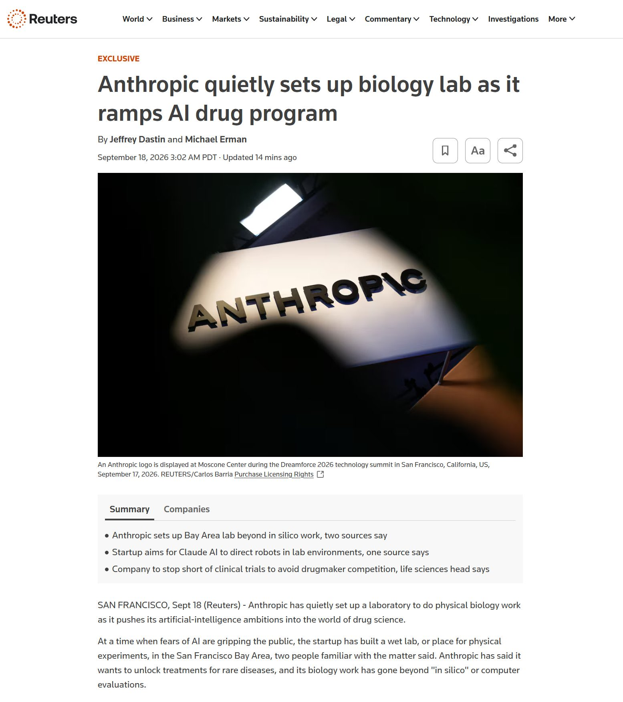

# 🐦 @ylecun

## 📅 September 18, 2026

> 2 post(s) archived.

---

### 🕐 13:49 UTC · @ylecun

> From @WSJopinion: The Hugging Face hack wasn’t what it was cracked up to be. Forget the “hive mind” of AI agents “going rogue.” They did what humans programmed them to do, writes Brian Gross. https://on.wsj.com/3Tgmxx4

🔗 [View original post](https://x.com/WSJ/status/2100945365763600404)

---

### 🕐 11:26 UTC · @ylecun

> In biology, like in cybersecurity, we’ll learn in the coming years that most of the risk is concentrated and created by the few most powerful labs and that open-source AI is the solution and mitigation of this risk!

🔗 [View original post](https://x.com/ClementDelangue/status/2100909343654732242)

---
