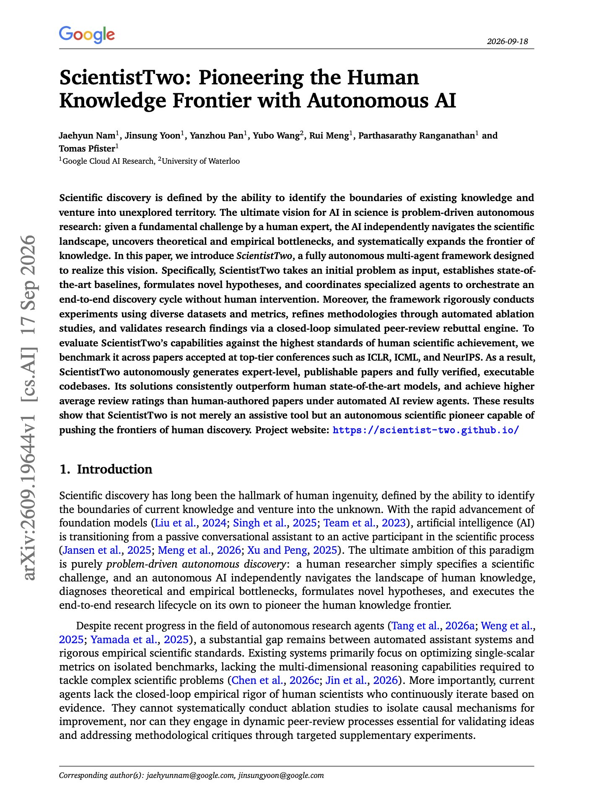

# 🐦 @dair_ai

## 📅 September 19, 2026

> 2 post(s) archived.

---

### 🕐 16:37 UTC · @dair_ai

> Been integrating Jev into my custom harness. I couldn&apos;t be more excited about the results I am seeing. Most demos on my timeline are flashy but very basic. Notice they are all about some boring classification task that was already possible before. I get it. Jev is fast and cheap. That point was made. But what new can Jev unlock? That&apos;s what I am more interested in: how does Jev evolve the agent harness experience? To seriously explore this, we first need to treat Jev as a key primitive, one of many to come. We must think about how it compliment today&apos;s test-time compute strategies. It&apos;s not competing; it&apos;s accelerating and allowing even more interesting scaling strategies. Jev is starting to unlock many insane and interesting experiences in my custom harnesses. Features that were either cost-prohibitive, lacked the right primitive, or were not feasible because of latency constraints. After a bit of exploration (excited to share more details soon), here are a few things that really excite me: - Jev enables cheaper &amp; faster workflows (the obvious one), which can help us better scale our agent harnesses. If you need a classifier, want to improve control flow, or need a more deterministic workflow, don&apos;t use a standard LLM; Jev is probably a better fit. Jev is also great for labeling things at scale. - Jev improves reliability through components like intelligent decision-making, structured intelligence for dynamic workflows/generating harnesses on the fly, and new context management strategies; I&apos;ve seen a few of the latter already, on potential ways to surface context on demand like tool calls, skill metadata, etc. So much to share here. - Jev unlocks new, interesting ways to enhance the agent experience (e.g., dynamic UIs, efficient LLM councils, smarter routing, enabling smarter, efficient orchestration and planning, more decisive, and useful proactive agents through surfacing more relevant and timely context). - Jev feels like the right primitive to enable more reliable evaluation strategies like LLM-as-a-Judge and building powerful verifiers for agent harnesses. These are two areas where Jev might unlock an insane amount of alpha. Not to mention, I see its potential to synthesize high-quality data to accelerate RSI by helping the model and harness co-evolve. I traveled this week (to Dreamforce) and am feeling extremely exhausted, but a full guide is dropping soon.

🔗 [View original post](https://x.com/omarsar0/status/2101349932569370826)

---

### 🕐 03:00 UTC · @dair_ai

> Banger paper from Google Cloud AI Research. If you follow autonomous research agents, this one is worth your time. ScientistTwo takes a problem from a human expert and runs the full discovery cycle without further intervention. It establishes state-of-the-art baselines, generates seed ideas aimed at resolving stated limitations in existing work, screens each idea on a data subset before committing to full experiments, runs its own ablation studies to attribute the gain, and revises the idea from that attribution. Manuscript drafting includes a simulated peer-review and rebuttal engine, plus a meta-review pass that feeds back into the work. They benchmark it against papers accepted at ICLR, ICML and NeurIPS. The reported solutions outperform the human state-of-the-art models on those problems, and the generated papers score higher average ratings than the human-authored ones under automated AI reviewers. Paper: https://academy.dair.ai/papers/scientisttwo-pioneering-the-human-knowledge-frontier-with-autonomous-ai-2609.19644

🔗 [View original post](https://x.com/dair_ai/status/2101144299471884479)

---
