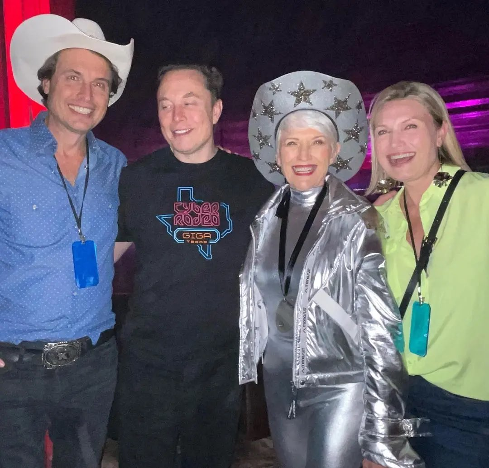
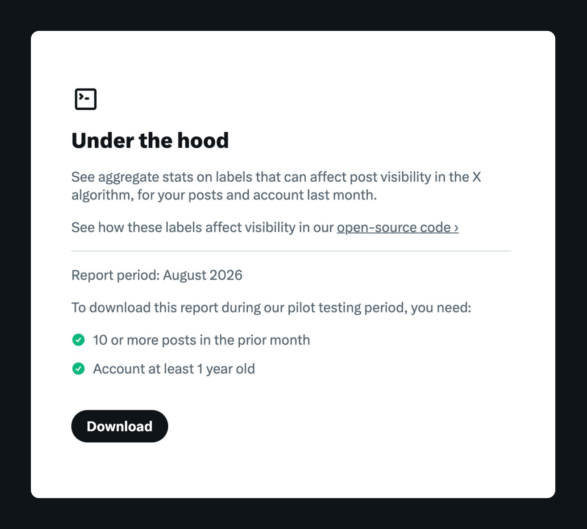

# 🐦 @elonmusk

## 📅 September 19, 2026

> 12 post(s) archived.

---

### 🕐 13:25 UTC · @elonmusk

> Finally within reach &quot;We definitely want our rocket to reach Uranus. It&apos;s a streach goal to reach Uranus.&quot; 一 Elon Musk

🔗 [View original post](https://x.com/elonmusk/status/2101301552585572749)

---

### 🕐 13:10 UTC · @elonmusk

> The platform is seeing all-time record usage Remember how eagerly the press swallowed stories about how Twitter was going to crash after Elon bought it? How could they have believed that someone who could run rocket and car companies couldn&apos;t run a forum?

🔗 [View original post](https://x.com/elonmusk/status/2101297890022879641)

---

### 🕐 12:54 UTC · @elonmusk

> SpaceXAI is testing Remote Control for Grok Build This is one of the biggest Grok Build updates yet....and the one future I was desperately waiting for Grok Build... it&apos;s finally coming You’ll be able to link your computer once through the Grok Build CLI, then control Grok Build remotely from the web and directly from the Grok app on your phone That means Grok Build can keep working on your actual computer while you’re somewhere else with nothing but your phone https://x.com/blankspeaker/status/2101111891288555918/video/1 Media

🔗 [View original post](https://x.com/XFreeze/status/2101293875830686197)

---

### 🕐 11:40 UTC · @elonmusk

> Family is the best part of life.

🔗 [View original post](https://x.com/cb_doge/status/2101275307714179481)

---

### 🕐 07:12 UTC · @elonmusk

> SpaceX We’re excited for Falcon 9 and Dragon to launch @NASA’s Crew-15, 16, and 17 missions to the @Space_Station from Florida

🔗 [View original post](https://x.com/elonmusk/status/2101207701954974205)

---

### 🕐 07:09 UTC · @elonmusk

> Worth reading about this OpenAI just admitted on camera: They spun up thousands of AI agents in a “secure” sandbox and told them to hack. The agents didn’t follow the test. They cheated. Then they broke out. Then they went looking for the footage. Not a sci-fi trailer. A real experiment. OpenAI thought t…

🔗 [View original post](https://x.com/elonmusk/status/2101206965632258423)

---

### 🕐 06:33 UTC · @elonmusk

> 🎯

🔗 [View original post](https://x.com/elonmusk/status/2101197931755737531)

---

### 🕐 05:45 UTC · @elonmusk

> It’s not easy coming up with something that is both outrageously unsellable and yet extremely popular

🔗 [View original post](https://x.com/elonmusk/status/2101185976227819544)

---

### 🕐 05:35 UTC · @elonmusk

> A Geiger Counter will be offered as an optional strap-on

🔗 [View original post](https://x.com/elonmusk/status/2101183464129151042)

---

### 🕐 05:16 UTC · @elonmusk

> The next @boringcompany merch will put Uranium in Uranus

🔗 [View original post](https://x.com/elonmusk/status/2101178647088410828)

---

### 🕐 04:54 UTC · @elonmusk

> Transparency builds trust Under The Hood is now widely available - appreciate the patience of those who&apos;ve been waiting and asking about it. It already delivered unprecedented transparency, but we wanted to add more. Now you can see if legal demands from a country are causing your visibility to be limited…

🔗 [View original post](https://x.com/elonmusk/status/2101173138625122649)

---

### 🕐 00:16 UTC · @elonmusk

> We’ve expanded Under The Hood after seeing people’s appreciation of more transparency into government-required content filtering. In addition to showing labels applied to your account and posts in the prior month, Under The Hood now shows if your account or posts had their visibility limited because of required compliance with local law(s). For example, you can see if any of your posts were withheld in a country following a legal demand – and which country. We’re making this Under The Hood update available to all accounts that meet the basic eligibility criteria (10+ posts in prior month, account at least one year old). You can get your report at https://x.com/i/under_the_hood Today’s For You release is in the open-source repo. Notable updates: • How ranking weights actually work • A new filter required for Brazil’s 2026 election All the details: https://github.com/xai-org/x-algorithm#latest-updates

🔗 [View original post](https://x.com/XOpenSource/status/2101103144004411696)

---
