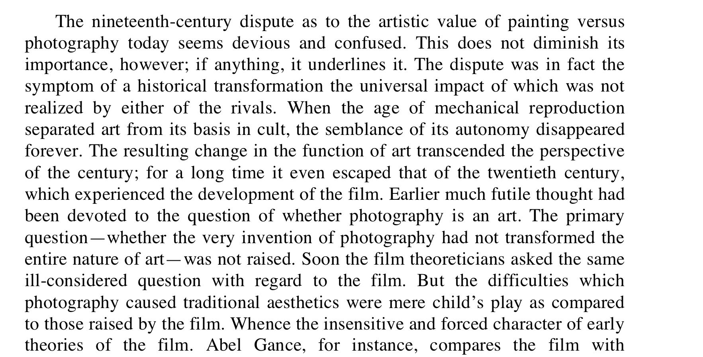
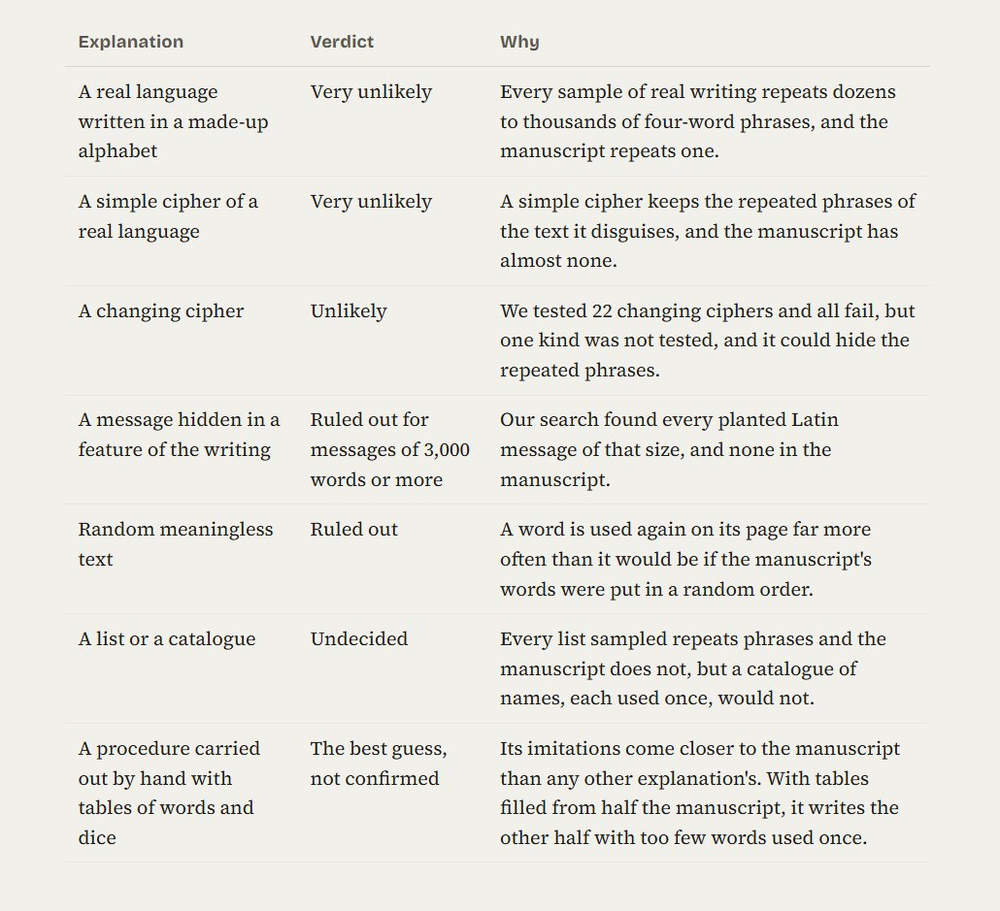

# 🐦 @emollick

## 📅 September 19, 2026

> 4 post(s) archived.

---

### 🕐 13:29 UTC · @emollick

> Also it is funny/tragic/apt that the second sentence of an essay written in 1935 (“This does not diminish its importance, however; if anything, it underlines it”) reads to me as written by Claude. The aura of the work (Benjamin’s use, not the Gen Alpha one) fades further.

🔗 [View original post](https://x.com/emollick/status/2101302622393078265)

---

### 🕐 13:25 UTC · @emollick

> There is starting to be some genuinely interesting AI-created film stuff (among a flood of slop), and I suspect this will only accelerate. The “is it art?” debate will grow Benjamin’s 1935 essay “The Work of Art in the Age of Mechanical Reproduction” said its the wrong question.

🔗 [View original post](https://x.com/emollick/status/2101301629320310871)

---

### 🕐 04:36 UTC · @emollick

> Okay, I let Claude loose against the Manuscript. It tried 211 techniques, 31 it says were never tried before. All dead ends. Here is a site with all the details but at some point a guardrail tripped &amp; Fable switched to Opus, so the writing is too Claudy: https://voynich-text-examination.netlify.app/

🔗 [View original post](https://x.com/emollick/status/2101168554988953950)

---

### 🕐 00:29 UTC · @emollick

> Given the talk of AIs communicating via fluctuations in CPU temperature, I thought of this thread - there is more recoverable information in the world than you might expect. Privacy is hard. Everything can be a microphone. You can recover audio data from: 🛍️The vibrations of chip bags in a video 💡The slight fluctuations of light as hanging lightbulbs are moved by speech 🤖The lidar beams of robot vacuum cleaners 🤳The autofocus in your phone pictur…

🔗 [View original post](https://x.com/emollick/status/2101106479411687489)

---
