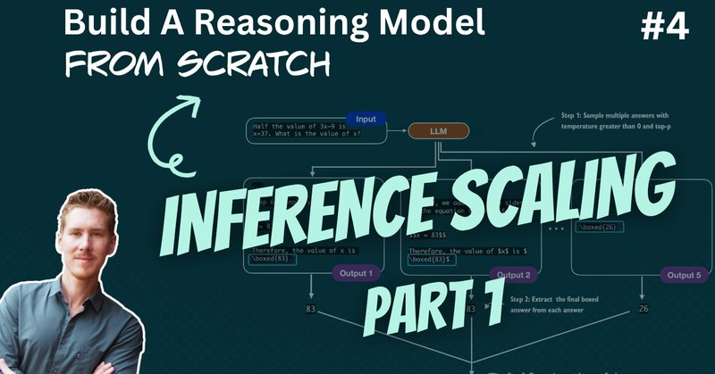

# 🐦 @rasbt

## 📅 September 19, 2026

> 3 post(s) archived.

---

### 🕐 14:21 UTC · @rasbt

> And a link to the video on YouTube: https://youtu.be/t5y-kS9nNxU

🔗 [View original post](https://x.com/rasbt/status/2101315873977860446)

---

### 🕐 14:14 UTC · @rasbt

> Inference scaling part 1. Starting with a modded text generation function (temperature scaling, top-p filtering, multinomial sampling) to generate diverse outputs for self-consistency and best-of-N (improving answer accuracy by&gt;2x) 00:00 Introduction and recap 00:31 Training-time and inference-time scaling 07:52 What we&apos;ll implement 11:47 Notebook setup and model loading 17:43 Building a flexible text generation function 24:40 Chain-of-thought prompting 28:26 Sampling and output diversity 33:43 Next-token logits and greedy decoding 38:20 Temperature scaling step by step 42:46 Softmax and token probabilities 47:42 Multinomial sampling 54:51 Adding temperature sampling to text generation 59:31 Top-p filtering step by step 1:10:23 Adding top-p filtering to text generation 1:13:43 Sampling and LLM watermarking 1:16:01 Self-consistency and majority voting 1:20:36 Implementing self-consistency 1:29:02 MATH-500 results 1:35:01 Accuracy and compute tradeoffs 1:36:50 Next steps and self-refinement Media

🔗 [View original post](https://x.com/rasbt/status/2101313945835368684)

---

### 🕐 14:08 UTC · @rasbt

> Interesting new insights into the old AdamW vs Muon debate: Muon seems to do better because it reduces memorization. 𝗔𝗱𝗮𝗺𝗪 𝘃𝘀. 𝗠𝘂𝗼𝗻: α, 𝗢𝘃𝗲𝗿𝗳𝗶𝘁𝘁𝗶𝗻𝗴, 𝗮𝗻𝗱 𝗠𝗲𝗺𝗼𝗿𝗶𝘇𝗮𝘁𝗶𝗼𝗻. A quick update on our WeightWatcher experiments comparing AdamW with the newer Muon optimizer. We trained a single-head nanoGPT model with both optimizers across five seeds. We then used Weight…

🔗 [View original post](https://x.com/rasbt/status/2101312413643473255)

---
