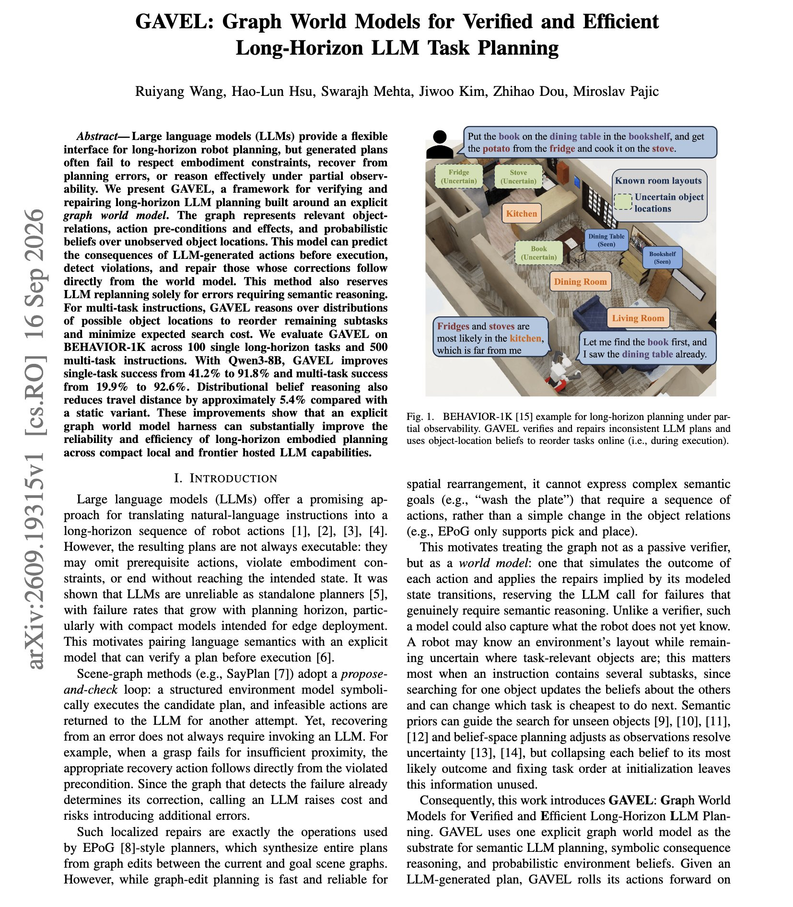

# 🐦 @dair_ai

## 📅 September 20, 2026

> 6 post(s) archived.

---

### 🕐 20:48 UTC · @dair_ai

> 🔥 Introducing a Jev Primer &amp; Playground If you want to learn how Jev works, look no further. This is the only interactive guide you need to get started. No more confusion about what Jev can and cannot do. Plus we built a custom Jev Playground for you try out use cases now. https://x.com/i/article/2101769918484254720

🔗 [View original post](https://x.com/omarsar0/status/2101775584661573692)

---

### 🕐 20:48 UTC · @dair_ai

> A beginner&apos;s introduction to Jev. Plus we also built a Jev Playground for you to test out several use cases. https://x.com/i/article/2101769918484254720

🔗 [View original post](https://x.com/dair_ai/status/2101775443300872536)

---

### 🕐 20:44 UTC · @dair_ai

> https://x.com/i/article/2101769918484254720

🔗 [View original post](https://x.com/omarsar0/status/2101774405521301681)

---

### 🕐 17:35 UTC · @dair_ai

> https://x.com/i/article/2101726389456293888

🔗 [View original post](https://x.com/dair_ai/status/2101726926838620444)

---

### 🕐 15:35 UTC · @dair_ai

> 🔥 Awesome Jev Collection 🔥 Find inspiration in my new Jev collection. (bookmark it) It automatically updates with new trending Jev use cases and demos pulled from X. Curation powered by Jev itself. Surprisingly, I found Jev great at curation, too. Here you go: https://academy.dair.ai/resources/jev-field-notes Media

🔗 [View original post](https://x.com/omarsar0/status/2101696753749655863)

---

### 🕐 02:10 UTC · @dair_ai

> Impressive paper showing the impact of a good harness. Improves Qwen3-8B from 41.2% to 91.8% on long-horizon robot tasks without any change to the model. The gain comes from the harness. GAVEL keeps an explicit graph world model holding object relations, action preconditions and effects, and probabilistic beliefs about where unobserved objects are. Before the robot executes an LLM-generated action, the graph predicts what that action would do. Violations get caught, and the ones whose fix follows directly from the world model get repaired without calling the model again. Only errors that need semantic reasoning go back to the LLM. On BEHAVIOR-1K across 500 multi-task instructions, success rises from 19.9% to 92.6%. Reasoning over the distribution of possible object locations also reorders the remaining subtasks and cuts travel distance about 5.4%. Why does it matter? Many long-horizon agent failures are state-tracking failures rather than reasoning failures, and a symbolic model sitting outside the LLM catches them cheaply. Paper: https://academy.dair.ai/papers/gavel-graph-world-models-for-verified-and-efficient-long-horizon-llm-task-planni-2609.19315

🔗 [View original post](https://x.com/dair_ai/status/2101494059898655108)

---
