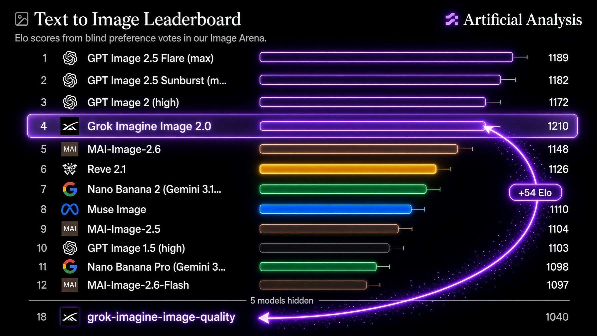
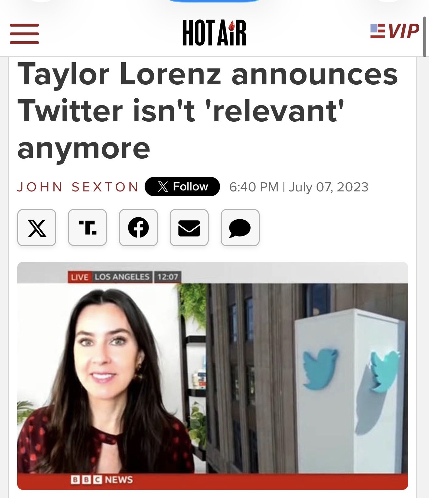

# 🐦 @elonmusk

## 📅 September 20, 2026

> 19 post(s) archived.

---

### 🕐 21:46 UTC · @elonmusk

> Taylor Lorenz said Elon will ruin Twitter back in 2023 after he bought it. Now she has flipped 100% and has admitted that X is better now than ever. &quot;i think X is better now than ever&quot; - @TaylorLorenz &quot;twitter was falling apart so i&apos;m glad @elonmusk took over but i was like elon has never ran a social media product&quot; &quot;he banned me by the way. first major mistake&quot; &quot;i was very skeptical and i thought this would be the end of X b…

🔗 [View original post](https://x.com/WallStreetMav/status/2101790107015504231)

---

### 🕐 20:14 UTC · @elonmusk

> Cybertruck as Heavy Cav When AI Bros enter the chat.

🔗 [View original post](https://x.com/elonmusk/status/2101767007406641574)

---

### 🕐 20:13 UTC · @elonmusk

> A Tesla saves its owner from prison! Tesla helped save a man from jail. Kevin Finley was arrested at gunpoint for allegedly fleeing police. His Tesla captured the key moments, showing why he never saw the unmarked police car. Nearly two years later, the judge watched the video and found him not guilty.

🔗 [View original post](https://x.com/elonmusk/status/2101766776325595530)

---

### 🕐 19:05 UTC · @elonmusk

> Amazing. Everybody is sleeping on how important this is. For all of us! For a relatively very small additional cost, we could add in a few dozen stations and get rid of a lot of traffic in Austin, too. This is key for growing business but also the cultural / music scene, etc. Boring Company is working on a simple, precursor Hyperloop tunnel between Austin and San Antonio (&gt;200 mph). Due to traffic congestion, that journey can currently take up to 2.5 hours. @BoringCompany can reduce that to a consistent &lt;30 mins.

🔗 [View original post](https://x.com/JTLonsdale/status/2101749545478619385)

---

### 🕐 18:39 UTC · @elonmusk

> TBC would be excited and honored to build this massive infrastructure project. Because Loop/Hyperloop is express (i.e. no intermediate stops), one could travel from an Austin parking lot to a favorite San Antonio restaurant in ~30 min. As long as they both have Loop stations! Boring Company is working on a simple, precursor Hyperloop tunnel between Austin and San Antonio (&gt;200 mph). Due to traffic congestion, that journey can currently take up to 2.5 hours. @BoringCompany can reduce that to a consistent &lt;30 mins.

🔗 [View original post](https://x.com/boringcompany/status/2101743162838647183)

---

### 🕐 17:57 UTC · @elonmusk

> Boring Company is working on a simple, precursor Hyperloop tunnel between Austin and San Antonio (&gt;200 mph). Due to traffic congestion, that journey can currently take up to 2.5 hours. @BoringCompany can reduce that to a consistent &lt;30 mins.

🔗 [View original post](https://x.com/elonmusk/status/2101732496396439751)

---

### 🕐 10:43 UTC · @elonmusk

> Every glib, arrogant, virtue-signalling celebrity who’s broadcast the lie that kids will kill themselves if not allowed to transition deserves to have this read aloud to them non-stop through a megaphone for a year. A landmark Finnish study has found a sharp rise in psychiatric illness among adolescents following sex-alteration procedures. The peer-reviewed study, published in Acta Paediatrica, tracked every young person under 23 who contacted Finland&apos;s gender clinics between 1996 and 2019. …

🔗 [View original post](https://x.com/jk_rowling/status/2101623347675119953)

---

### 🕐 09:21 UTC · @elonmusk

> SpaceXAI just made a massive jump in image generation Grok Imagine Image 2.0 is now #4 on Artificial Analysis’ Text-to-Image Leaderboard with 1,154 Elo.....the highest-ranked model outside OpenAI Imagine Image 2.0: #4 — 1,154 Elo It also sits on the Pareto frontier for quality vs price Going from #18 to #4 in a single generation is insane SpaceXAI is moving ridiculously fast

🔗 [View original post](https://x.com/XFreeze/status/2101602553985138718)

---

### 🕐 09:18 UTC · @elonmusk

> This is the future we shall bring into being Media

🔗 [View original post](https://x.com/elonmusk/status/2101601873115681037)

---

### 🕐 09:09 UTC · @elonmusk

> Grok @Bot

🔗 [View original post](https://x.com/elonmusk/status/2101599676214702243)

---

### 🕐 08:53 UTC · @elonmusk

> 8 years ago Elon Musk with The Boring Company’s Not-a-Flamethrower at Joe Rogan’s studio in 2018.

🔗 [View original post](https://x.com/elonmusk/status/2101595506426429618)

---

### 🕐 08:45 UTC · @elonmusk

> Taylor in 2023: Taylor in 2026: “X is better now than ever” &quot;i think X is better now than ever&quot; - @TaylorLorenz &quot;twitter was falling apart so i&apos;m glad @elonmusk took over but i was like elon has never ran a social media product&quot; &quot;he banned me by the way. first major mistake&quot; &quot;i was very skeptical and i thought this would be the end of X b…

🔗 [View original post](https://x.com/KatieMiller/status/2101593589746663435)

---

### 🕐 07:13 UTC · @elonmusk

> Elon Musk in a Japanese game show in 2014 Media

🔗 [View original post](https://x.com/cb_doge/status/2101570470038700433)

---

### 🕐 05:07 UTC · @elonmusk

> Tesla has a Semi 😂 Top Gear tours factory &amp; rides in production Semi w/ @danWpriestley &quot;Maybe the most significant Tesla since the Model 3&quot; At 1.7 kWh/mi, Semi is using only ~7× as much energy as a Model Y, at ~20× the weight. A comparable diesel is using ~3× as much as Semi https://youtu.be/0WP9Hi…

🔗 [View original post](https://x.com/elonmusk/status/2101538675284676696)

---

### 🕐 02:50 UTC · @elonmusk

> Deployment of 27 @Starlink satellites confirmed

🔗 [View original post](https://x.com/SpaceX/status/2101504221266792661)

---

### 🕐 01:57 UTC · @elonmusk

> Not many people know that Elon Musk started The Boring Company as a joke.

🔗 [View original post](https://x.com/cb_doge/status/2101490987617206357)

---

### 🕐 01:52 UTC · @elonmusk

> Fairing separation confirmed. Today’s mission marks our first 40th flight of a fairing half! Media

🔗 [View original post](https://x.com/SpaceX/status/2101489521615385011)

---

### 🕐 00:36 UTC · @elonmusk

> Starlink is now connecting Centro Escolar Cantón Los Toles in El Salvador, bringing fast, reliable internet to its 200 students. 🇸🇻 This newly rebuilt school is now No. 1,001 in El Salvador’s Grok-powered AI tutor program. Starlink and Grok are powering the future of education. Media

🔗 [View original post](https://x.com/cb_doge/status/2101470432855814148)

---

### 🕐 00:25 UTC · @elonmusk

> Uranium in Uranus will be our best merch ever. Put it on your mantelpiece and show your guests Uranus! Elon’s merch formula: Outrageously unsellable...Extremely popular 😂 • $500 Not-a-Flamethrower — 20,000 sold in days • $100 Burnt Hair perfume — 30,000-bottle run • Tesla S3XY shorts — priced at $69.420 • Next up: Uranium in Uranus (glow-in-the-dark + Geiger strap-on) Everything …

🔗 [View original post](https://x.com/elonmusk/status/2101467808664084903)

---
