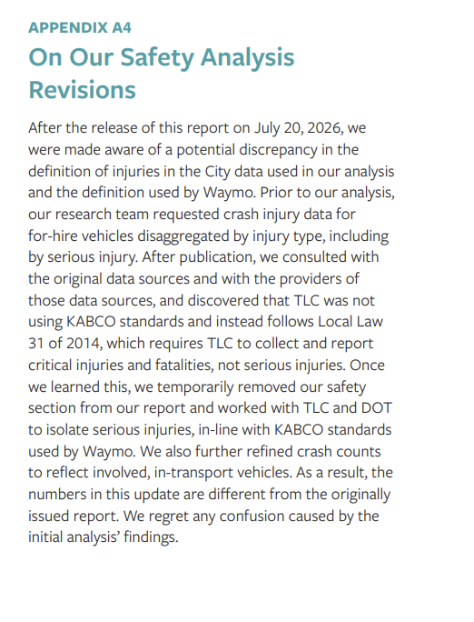
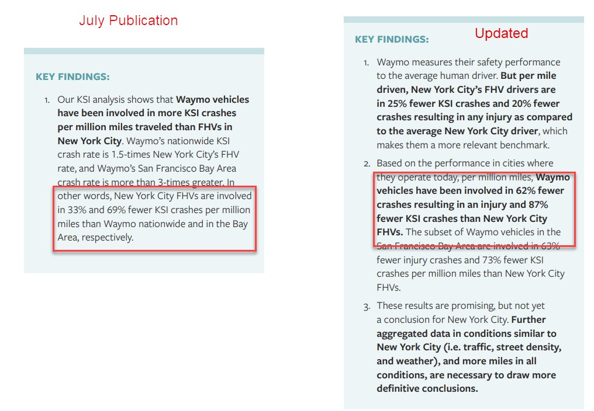

# 🐦 @emollick

## 📅 September 20, 2026

> 8 post(s) archived.

---

### 🕐 22:00 UTC · @emollick

> Reason for the revision

🔗 [View original post](https://x.com/emollick/status/2101793771369193921)

---

### 🕐 21:54 UTC · @emollick

> Back in July, there was a report that got a lot of attention online that Waymo was more dangerous than NYC for-hire vehicles. The analysis turned out to be wrong and the updated report finds they are much safer. Good that they updated with new data, though https://www.openplans.org/how-for-hire-autonomous-vehicles-impact-nyc

🔗 [View original post](https://x.com/emollick/status/2101792148723032151)

---

### 🕐 21:30 UTC · @emollick

> I would broaden this to all social science. We are in uncharted waters. We need fast, smart research on AI that is deeply informed by AI&apos;s abilities, is forward-looking, and may not be fully nailed-down. This sort of work is not usually high status in fields, but it is critical. A few (personal) thoughts on reading empirical AI papers on the economy. Economists have gotten used to reading papers with super clean identification, arguing about the validity of an instrument, making sure parallel trend assumptions are satisfied. This is what gets you into a …

🔗 [View original post](https://x.com/emollick/status/2101786064142705042)

---

### 🕐 17:59 UTC · @emollick

> Yes, I have voice.md files. Yes, I have agents doing final passes as a reader. Yes, I have other agents specifically looking for LLM language. Yes, I have different models from the model family with different approaches going over user facing text. It still isn&apos;t enough.

🔗 [View original post](https://x.com/emollick/status/2101732899145843125)

---

### 🕐 17:52 UTC · @emollick

> It is ironic that the thing that is now most annoying about long-running agentic tasks with Large Language Models isn&apos;t coding or errors or hallucinations, but the fact that their language gets worse due to drift as a task goes on Its in your the name! Just write better already!

🔗 [View original post](https://x.com/emollick/status/2101731295659180527)

---

### 🕐 17:20 UTC · @emollick

> Yes, you can make up some of the difference by giving Claude API access but (1) most people will never do this, (2) it means additional expense or difficulty, and (3) the real gain isn&apos;t from image generators alone, but from Omni models, and Claude has the least multimodal out.

🔗 [View original post](https://x.com/emollick/status/2101723182134616185)

---

### 🕐 14:43 UTC · @emollick

> Claude not having an image generator is a gap in agentic projects that involve knowledge work. It is quite good at using code to draw or model objects, but image generators from Google and OpenAI give their AIs many more option for doing PowerPoints, mockups, infographics, etc.

🔗 [View original post](https://x.com/emollick/status/2101683717571784879)

---

### 🕐 03:43 UTC · @emollick

> Same question to Astra, slick results. It was notable that there was less simulated curiosity here. Like Astra ran the numbers (everything it shows come from its actual simulations), but didn&apos;t seem to be &quot;interested&quot; in the results the way Fable did, for better or worse. Media Hey Claude, &quot;Pick a problem or mystery that obsesses you and solve it as best you can &amp; make a movie we can share on social media about it&quot; So it took a crack at the Voynich Manuscript &amp; failed. Then it made this movie, which is pretty interesting to watch and a good explainer.

🔗 [View original post](https://x.com/emollick/status/2101517626954436623)

---
