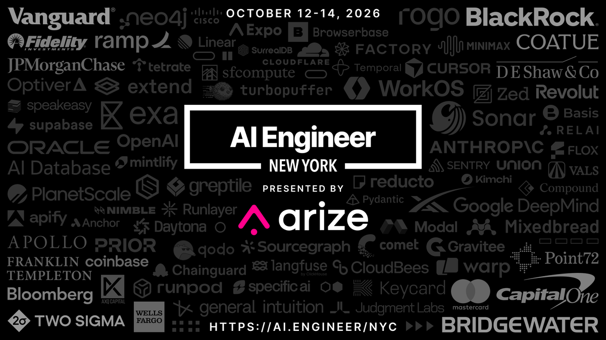

# 🐦 @swyx

## 📅 September 20, 2026

> 1 post(s) archived.

---

### 🕐 18:19 UTC · @swyx

> We&apos;re excited to announce our AI Engineer New York speaker lineup! Presented by @arizeai CEO @ExaAILabs CTO @tryramp CEO @ValsAI CEO @RogoAI CTO @modal CEO @trybasis CEO @SonarSource CEO @runwayml CTO @mintlify CEO @sfcompute CTO Bridgewater CTO @turbopuffer CEO @NousResearch CEO @gen_intuition HEAD OF AI @coatuemgmt TECH LEAD @Vanguard_Group MTS @GoogleDeepMind HEAD OF DEVX @cerebras HEAD OF US BD @MiniMax_AI DEPUTY CISO @Mastercard COO @citsecurities SR. STAFF ENGINEER @GEICO HEAD OF ENGINEERING @linear DIRECTOR OF DX @togethercompute HEAD OF AI PRODUCT @coinbase AI INVESTMENT LEAD @BlackRock GROUP HEAD OF DATA &amp; AI @Wise HEAD OF AI @FTI_Global KNOWLEDGE GRAPHS LEAD @Point72Careers DIRECTOR, AI &amp; DATA @AlixPartnersLLP ANALYTICS ENGINEERING LEADS @monzo DISTINGUISHED ENGINEER @CapitalOne OPS &amp; INFRASTRUCTURE LEADER @RevolutApp GLOBAL CHIEF SECURITY ARCHITECT @jpmorgan CORPORATE VP @NewYorkLife HEAD OF FRONTIER AI MODELS @WellsFargo AGENT HARNESS ENGINEER @cursor_ai / @xai COFOUNDER @getcompoundai (ex-VP @coatuemgmt + @ycombinator) DIRECTOR OF DATA SCIENCE @Fidelity HEAD OF DATA, DIGITAL &amp; AI @apolloglobal SVP, ENTERPRISE PLATFORM ENGINEERING ARCHITECTURE @twosigma PARTNER, HEAD OF THEMATIC INVESTING @apolloglobal HEAD OF ARCHITECTURE &amp; EMERGING TECH, OFFICE OF THE CTO @Bloomberg PRODUCT + ENGINEERING LEAD, CHATGPT FOR FINANCIAL SERVICES @OpenAI PRODUCT + ENGINEERING LEADS, CLAUDE FOR FINANCIAL SERVICES @AnthropicAI Oct 12–14 in NYC. https://ai.engineer/nyc

🔗 [View original post](https://x.com/aiDotEngineer/status/2101738020630298971)

---
