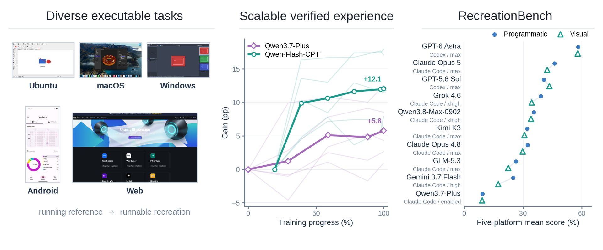
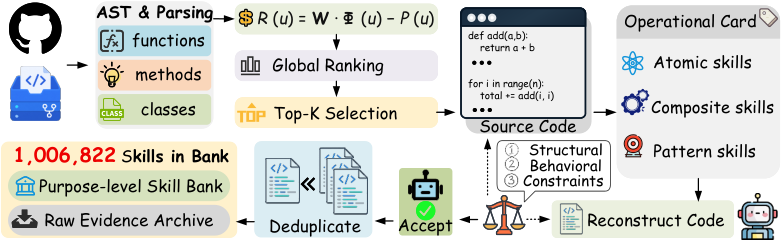

# 🐦 @_akhaliq

## 📅 September 21, 2026

> 5 post(s) archived.

---

### 🕐 17:28 UTC · @_akhaliq

> Introducing Halo, the best framework for post-training of open-source models. Halo delivers up to 2.8x the throughput of stock TRL with less peak memory, while models stay in their native HuggingFace format. Star us on GitHub: https://github.com/whitecircle/halo Media

🔗 [View original post](https://x.com/whitecircle/status/2102087563913609534)

---

### 🕐 16:13 UTC · @_akhaliq

> Alibaba&apos;s Qwen team just released RecreationWorld on Hugging Face A five-platform sandbox where hybrid computer-use agents explore real apps, implement them, and visually verify their own builds.

🔗 [View original post](https://x.com/HuggingPapers/status/2102068609396736180)

---

### 🕐 16:00 UTC · @_akhaliq

> Introducing Codos: The first virtual Chief AI Officer. AI is crushing all benchmarks but real companies still struggle to see P&amp;L impact. Codos interviews employees, deploys automations across all functions and gets smarter over time while running on your own servers. Our NASDAQ-listed and PE-backed customers are adding millions to their bottom line months ahead of schedule and we are proud of the first results we deliver. It’s time to turn the 500BN AI-transformation market into software and unlock the impact for the real economy. Media

🔗 [View original post](https://x.com/dimakhanarin/status/2102065316406997475)

---

### 🕐 15:21 UTC · @_akhaliq

> 🚀 Introducing #HYPER3D Agentic Mode. AGI optimizes your input and chooses how to model it. Generate editable N-GONS #3D model for #CAD, building &amp; industrial product. 📏Adjust dimensions. 🏃‍♀️Add animation. Towards Production-Ready, to Agent-Ready. This is Vibe Modeling👇 Media

🔗 [View original post](https://x.com/DeemosTech/status/2102055632887324775)

---

### 🕐 12:15 UTC · @_akhaliq

> Code2Skill A fully automated pipeline that transforms 19,769 open-source repositories into over 1 million verified, reusable procedural skills for AI agents.

🔗 [View original post](https://x.com/HuggingPapers/status/2102008836865352067)

---
