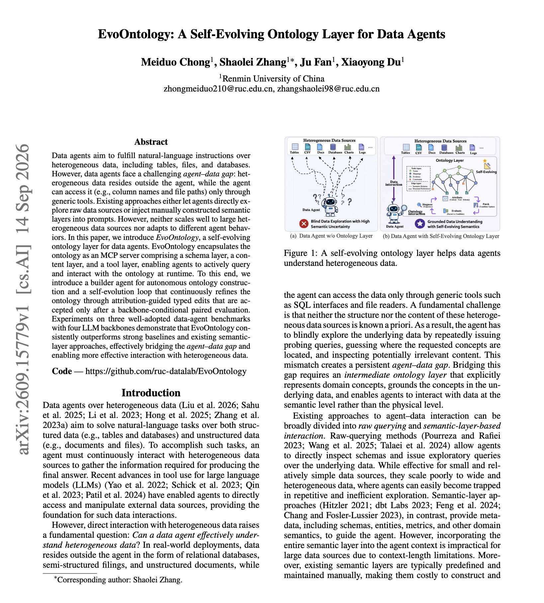
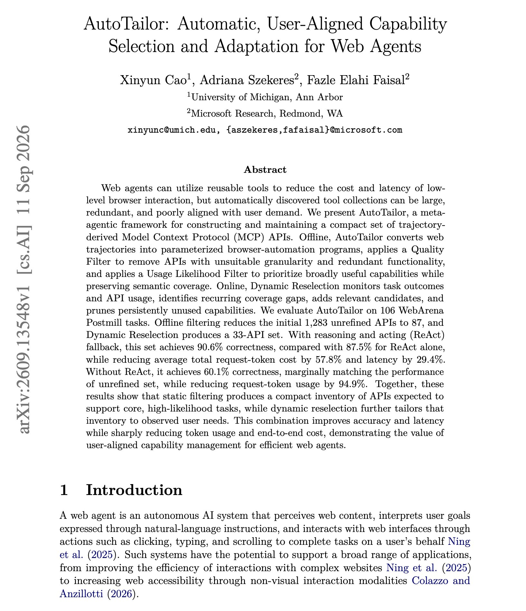
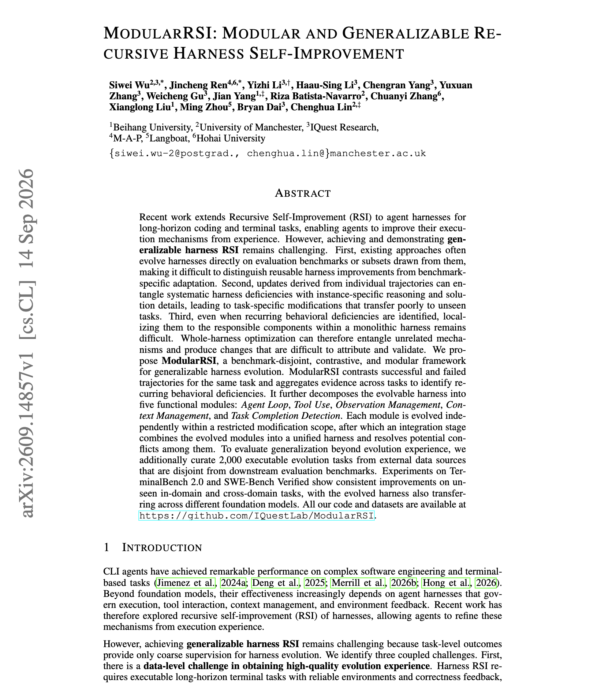

# 🐦 @dair_ai

## 📅 September 21, 2026

> 7 post(s) archived.

---

### 🕐 19:13 UTC · @dair_ai

> Recommended reading. This offers a solid set of ideas for where you can place Jev in your agent harness. It&apos;s cool to see ideas I have shared before, like approval gates, MCP/tool-calling routing, model routing, dynamic subagent patterns, structured skills, and more. Feed the doc to your agent and start exploring. sharing some notes on typesafe 🤝 coding agents: https://docs.google.com/document/d/1G61uUB0FifUnmmrPzFQojZ3KpczYKmXGpgEXDJ2l_Zg/edit?tab=t.0 we likely will never have time (ever again) to play ourselves, but hope the that the community goes WILD (and makes me look like a naive i…

🔗 [View original post](https://x.com/omarsar0/status/2102113906529538496)

---

### 🕐 18:15 UTC · @dair_ai

> Banger paper on self-evolving ontologies for agents. You just can&apos;t go wrong with implementing an ontology layer for your agents. This paper shows exactly why. The show that GPT-5.5 gains 26.7 points on DDR-Bench when the data agent can query an ontology of the data it works with. Why is this useful? Data agents normally see tables, files and databases through generic tools, reading column names and file paths one call at a time. The alternative is a hand-written semantic layer pasted into the prompt, which does not scale to many sources. EvoOntology builds the ontology with a dedicated agent and serves it as an MCP server with schema, content and tool layers. The data agent queries it at runtime. The ontology is then edited in small typed steps, and each edit is kept only if a paired evaluation on the same backbone shows it helps. Across six backbones on DDR-Bench, accuracy rises 17.8 points on average, from 4.8 on Qwen3.5-Flash to 26.7 on GPT-5.5. On BIRD, execution accuracy rises 7.4 points. Edits to the tool layer account for 57% of the gain from evolution. Paper: https://arxiv.org/abs/2609.15779 Chat with Paper: https://academy.dair.ai/papers/evoontology-a-self-evolving-ontology-layer-for-data-agents-2609.15779

🔗 [View original post](https://x.com/omarsar0/status/2102099298716660223)

---

### 🕐 17:30 UTC · @dair_ai

> Great paper from Microsoft Research and colleagues. If you auto-generate MCP tools from agent trajectories, this one is worth your time. AutoTailor turns web trajectories into parameterized browser-automation APIs and then filters them. A quality filter drops APIs with the wrong granularity or duplicate function, and a usage filter keeps the ones likely to be needed. That takes 1,283 candidates down to 87. Online, it watches task outcomes, adds APIs for recurring gaps and prunes ones that go unused, ending at 33. On 106 WebArena Postmill tasks, the 33 APIs with a ReAct fallback reach 90.6% correctness against 87.5% for ReAct alone. Request-token cost drops 57.8% and latency 29.4%. Without the fallback, accuracy matches the unfiltered set while using 94.9% fewer request tokens. Paper: https://academy.dair.ai/papers/autotailor-automatic-user-aligned-capability-selection-and-adaptation-for-web-ag-2609.13548

🔗 [View original post](https://x.com/dair_ai/status/2102087979099717799)

---

### 🕐 16:35 UTC · @dair_ai

> Finally, a company brain that actually works! Codos starts with the people doing the work. It interviews employees to find which tasks can be automated, then deploys the automations and keeps learning from the teams using them. I like how openly they explain the system. Under the hood, it builds a context graph and a layered memory of company facts, operational history, and working priorities. One midsize fintech freed up 21% of its team&apos;s capacity in six months. Introducing Codos: The first virtual Chief AI Officer. AI is crushing all benchmarks but real companies still struggle to see P&amp;L impact. Codos interviews employees, deploys automations across all functions and gets smarter over time while running on your own servers. Our NASDAQ-…

🔗 [View original post](https://x.com/omarsar0/status/2102074242565021847)

---

### 🕐 16:03 UTC · @dair_ai

> Found a great production use case for Jev. I used Jev to organize ~2.3K AI research papers. The total cost was $0.14, and it took about 83 seconds. The process: The papers already had old tags, which I ran through a previous open model (DeepSeek V4 Flash). However, I wasn&apos;t confident in the classifications, and I didn&apos;t want to spend more on tokens unless I spent time tuning it into a good LLM classifier via few-shot (more expensive). Too tedious, too costly, and unsustainable. Luckily for us, we now have Jev to help us with organizing papers better. So Jev first went through all the papers and retagged them. It agreed with 75% of the previous tags. Jev found about 579 high-confidence topic changes. I evaluated reliability by manually labeling 30 disagreements and accepted all of them. I was astonished by Jev&apos;s classification capabilities. We applied and verified all changes in production. I&apos;m much more satisfied with the classifications, but I think there is still room for improvement. Check out the papers here: https://academy.dair.ai/papers I will experiment with Jev more. The takeaway is that pipelines can be significantly improved by carefully combining System One and System Two models. Jev clearly unlocks more interesting ways to organize papers and offer a more useful discovery layer for research papers. More updates on that soon. Media

🔗 [View original post](https://x.com/omarsar0/status/2102066232383979749)

---

### 🕐 13:59 UTC · @dair_ai

> StepFun’s new Step 5 Preview model is impressive! Had a chance to test it early. I&apos;ve been testing it as a coding agent. It’s on the Pareto frontier for cost vs. capability. It is a very capable model, comparable to GLM 5.3, Kimi K3, and others, and it comes at a very competitive price. It’s worth trying in your favorite coding agent. I tested it in a minimal harness to see how it compares with GLM 5.3. Here are my results. Overall, it is very effective and feels like a model I could use for a whole range of coding tasks. One behavior that stood out is that it knows when to stop, which makes it very effective at long-horizon tasks compared with other models in this class. I gave it and GLM 5.3 two real tasks in the same repo, at the same commit. First, a bug where numeric filters silently returned zero rows for decimals and negatives. Then a feature that needed new routes, permission gating, and a refactor of the background task supervisor. Both models got both tasks right. Every held-out test passed with no regressions, and neither one weakened an existing test to get there. Step 5 Preview finished, checked its work, and declared itself done. Both times. GLM 5.3 wrote correct code both times and then kept going until the step limit ended the run. Neither model got a follow-up prompt or a retry. Both had zero fix rounds, so the first delivery was the final delivery on both tasks. On the bug, Step 5 Preview wrote the shorter patch, the same approach the Datasette maintainer used in the real commit. It also added its own tests without being asked. Based on this, I would reach for it on unattended agent runs where a clear completion signal matters more than speed, on bug fixes in unfamiliar codebases, and on long-context work. On long context, I gave it a separate test earlier in the week. I generated about 368K tokens of fake incident tickets and hid five clues inside them that together explain an outage. When I asked for the root cause, it found all five clues and connected them correctly in about 90 seconds. Thanks to the StepFun team for partnering on this post. Media

🔗 [View original post](https://x.com/omarsar0/status/2102035017262149640)

---

### 🕐 00:46 UTC · @dair_ai

> Impressive paper on building recursive self-improving agent harnesses. It&apos;s rich with great insights on building effective agent harnesses. If you maintain an agent harness, this paper names three defects in how harnesses get improved and the fixes. First, evolving a harness against the evaluation benchmark makes reusable improvements impossible to tell apart from benchmark fitting. Instead, ModularRSI evolves on tasks disjoint from the benchmark. Second, updating from a single trajectory confuses a systematic harness deficiency with one task&apos;s reasoning details, which produces changes that fail on unseen tasks. ModularRSI contrasts successful against failed trajectories for the same task, then aggregates across tasks to find recurring behavioral deficiencies. Third, a monolithic harness makes it hard to localize a recurring problem, and optimizing the whole thing entangles unrelated mechanisms, so no change can be attributed. ModularRSI splits the evolvable harness into five functional modules that evolve separately. Agent Loop, Tool Use, Observation Management, Context Management, and Task Completion Detection. Paper: https://academy.dair.ai/papers/modularrsi-modular-and-generalizable-recursive-harness-self-improvement-2609.14857

🔗 [View original post](https://x.com/dair_ai/status/2101835306953736396)

---
