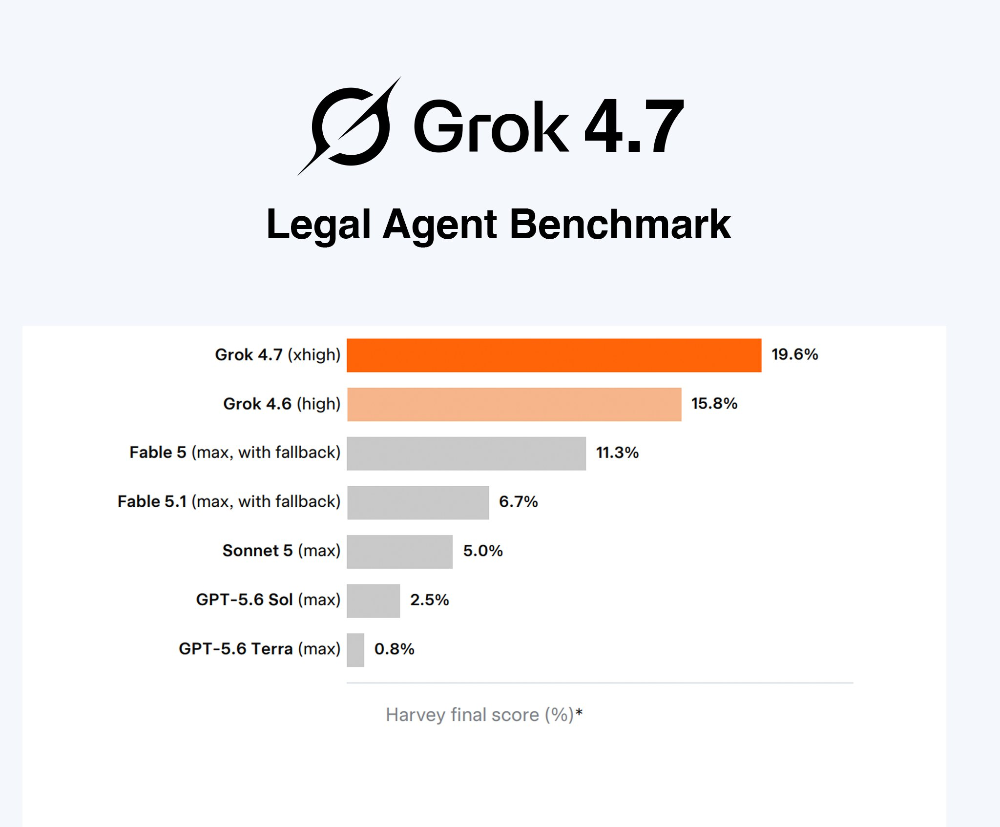
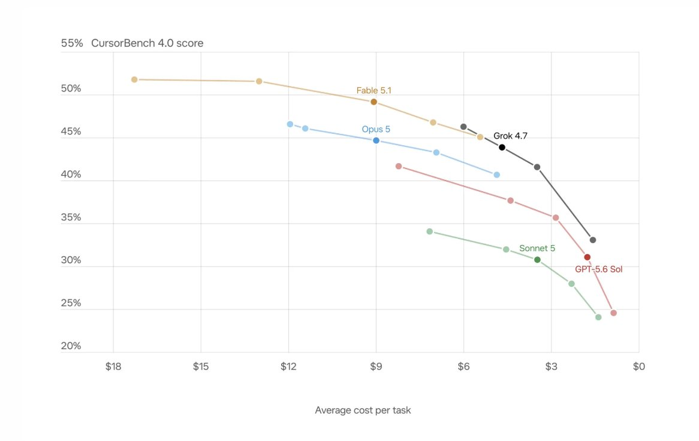
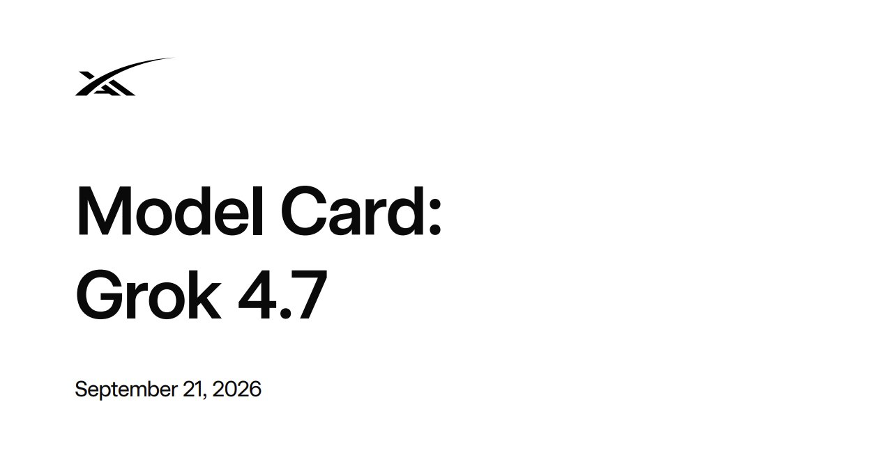
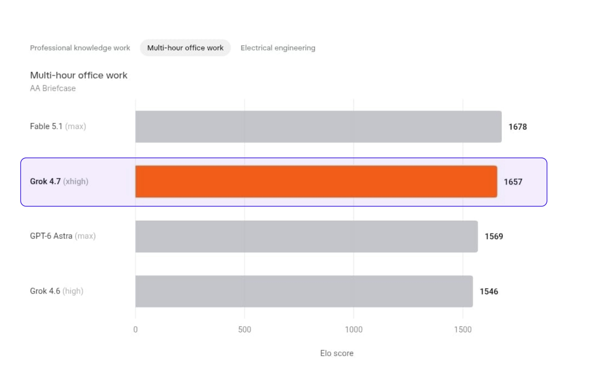
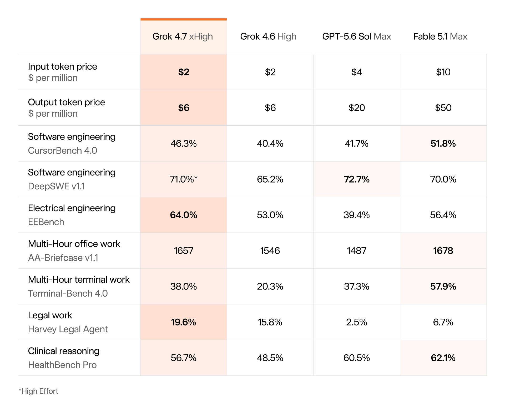

# 🐦 @elonmusk

## 📅 September 21, 2026

> 29 post(s) archived.

---

### 🕐 18:45 UTC · @elonmusk

> “I’ve used FSD for like 90%+ of my miles since Saturday morning. Literally feels like magic. Has handled issues on the road better than I would have at times. Just remarkable technology” A demo drive might change your life http://Tesla.com/drive I picked up my new Tesla model Y on Saturday. The whole process of picking it up took like 5 minutes. I never want to deal with a car salesman ever again. I immediately had the FSD drive me home for 45 minutes. I’ve used FSD for like 90%+ of my miles since Saturday morning. Liter…

🔗 [View original post](https://x.com/Tesla/status/2102107015422304419)

---

### 🕐 18:38 UTC · @elonmusk

> BREAKING: Grok 4.7 dominates the Legal Agent Benchmark. It scored 19.6% on realistic, long-term legal tasks, beating every other model tested. That is nearly 3× Fable 5.1. Another major win for Grok 4.7 and SpaceXAI.

🔗 [View original post](https://x.com/cb_doge/status/2102105111187321280)

---

### 🕐 18:28 UTC · @elonmusk

> Important to use Grok 4.7 with our Build harness for the best results https://X.ai/build grok 4.7 is here, and its our best model so far! try it out in cursor, grok build, api or anywhere you get your tokens! curious to hear what you think here&apos;s grok 4.6 vs 4.7 building age of empires ii

🔗 [View original post](https://x.com/elonmusk/status/2102102621037236699)

---

### 🕐 18:11 UTC · @elonmusk

> Grok 4.7 made this in blender. I didn&apos;t tell it what to make but only that it should be something it can accomplish in 10 minutes or so. Honestly not bad at all. Not bad at all. Did they train Grok on blender? Media

🔗 [View original post](https://x.com/cherry_mx_reds/status/2102098340699668865)

---

### 🕐 17:51 UTC · @elonmusk

> Wow Grok 4.7 mogging out there. @SpaceXAI has been cooking hard.

🔗 [View original post](https://x.com/stevehou/status/2102093439311528073)

---

### 🕐 17:49 UTC · @elonmusk

> and here’s the grok 4.7 model card. a few jumps vs 4.6 that stood out: - Terminal-Bench: 20.3% → 38.0% - SWE-Marathon: 31.9% → 46.0% - HealthBench Pro: 48.5% → 56.7% - Legal Agent: 15.8% → 19.6% - EEBench: 60.0% → 66.0% for the same price as 4.6! https://media.x.ai/v1/website/4p7card-5eccc980.pdf

🔗 [View original post](https://x.com/ericzakariasson/status/2102092784727679127)

---

### 🕐 17:37 UTC · @elonmusk

> I just gave Grok 4.7 a pretty hard problem, involving reverse-engineering a running binary. Beautifully solved. And it&apos;s so fast!

🔗 [View original post](https://x.com/rauchg/status/2102089968860721335)

---

### 🕐 17:19 UTC · @elonmusk

> Electrical engineering score is a pretty big deal. SpaceX has the engineering data that software companies don&apos;t. Grok 4.7 is here. It&apos;s a notable improvement over Grok 4.6 at the same price and speed.

🔗 [View original post](https://x.com/NickADobos/status/2102085410549854639)

---

### 🕐 17:15 UTC · @elonmusk

> I’ve been testing Grok 4.7… it’s a really great daily driver, and a huge step up over 4.6. Definitely worth trying! Grok 4.7 is here. It&apos;s a notable improvement over Grok 4.6 at the same price and speed.

🔗 [View original post](https://x.com/mattshumer_/status/2102084211456827542)

---

### 🕐 17:14 UTC · @elonmusk

> 🚀 Grok 4.7 has landed. 🚀 Congrats to @SpaceXAI on its most capable model yet for coding and knowledge work. Proud to support the team with NVIDIA accelerated computing.

🔗 [View original post](https://x.com/elonmusk/status/2102084081475350829)

---

### 🕐 17:13 UTC · @elonmusk

> Grok 4.7 works extremely well with our Build harness https://X.ai/Build Excited to bring 4.7 to you all! Numerics aside, it&apos;s incredibly capable in Grok Build/Cursor. We spent a lot of hours on the harness, iterating with some of the greatest engineers in the world. Also, the fast mode has INSANE tps. Happy Grok Building :) Lmk what you think!

🔗 [View original post](https://x.com/elonmusk/status/2102083930107101382)

---

### 🕐 17:06 UTC · @elonmusk

> Grok 4.7 places @SpaceXAI as third, after Anthropic &amp; OpenAI, for agentic coding. When factoring in that Grok is significantly faster &amp; lower cost, it’s a great choice for your everyday workhorse. Grok 4.7 scores 46 on the Artificial Analysis Intelligence Index to bring SpaceXAI into the top 4 AI labs. Coding Agent Index performance has also improved, overtaking GPT-5.6 Sol Grok 4.7 scores +2 points over Grok 4.6 on the Intelligence Index, with strong performance on agenti…

🔗 [View original post](https://x.com/elonmusk/status/2102082011233931762)

---

### 🕐 16:46 UTC · @elonmusk

> We trained 4.7 on longer-running problems compared to Grok 4.6. It holds context better and checks its own work more carefully. Give it a try and let us know your feedback! Grok 4.7 is here. It&apos;s a notable improvement over Grok 4.6 at the same price and speed.

🔗 [View original post](https://x.com/haozhu_wang/status/2102077111548940709)

---

### 🕐 16:31 UTC · @elonmusk

> Try Grok 4.7 - it excels at coding, engineering work, and 3D, and the model is a fantastic thought partner at high TPS in Grok Build and Cursor Grok 4.7 is here. It&apos;s a notable improvement over Grok 4.6 at the same price and speed.

🔗 [View original post](https://x.com/milichab/status/2102073296900796862)

---

### 🕐 16:24 UTC · @elonmusk

> We put Grok 4.7 from @SpaceXAI to work on a $2 million insurance claim where one deductible error alone changes the calculation by $143,000. In this Box Agent preview, @grok reconciles the claim against the policy and supporting records. It catches an $82,000 duplicate invoice and a missing $64,000 supplier credit. It also explains why the Business Income waiting period doesn’t apply to Extra Expense. The result is a cited claims review for the adjuster, with final coverage and payment decisions left to the insurer. Explore Box AI Studio to build custom agents for your own document-heavy workflows. Media Grok 4.7 is here. It&apos;s a notable improvement over Grok 4.6 at the same price and speed.

🔗 [View original post](https://x.com/Box/status/2102071357244854498)

---

### 🕐 16:19 UTC · @elonmusk

> SpaceXAI just released Grok 4.7 And it’s already showing a huge jump in multi-hour office work Grok 4.7 outperforms GPT-6 Astra and is already nearly matching Fable 5.1

🔗 [View original post](https://x.com/XFreeze/status/2102070215898976401)

---

### 🕐 16:17 UTC · @elonmusk

> Compare Grok 4.7 (first) and 4.6 (second) building an open world city game. Media Media

🔗 [View original post](https://x.com/SpaceXAI/status/2102069820418048091)

---

### 🕐 16:17 UTC · @elonmusk

> Grok 4.7 is here. It&apos;s a notable improvement over Grok 4.6 at the same price and speed.

🔗 [View original post](https://x.com/SpaceXAI/status/2102069815225586149)

---

### 🕐 16:11 UTC · @elonmusk

> In 7 days, the first Starship launch to orbit will be carrying Starlink V3 satellites intended for operational use Booster 21 moved to the pad at Starbase

🔗 [View original post](https://x.com/elonmusk/status/2102068280156414171)

---

### 🕐 14:14 UTC · @elonmusk

> America’s Golden Age will not simply be declared. It will be designed.

🔗 [View original post](https://x.com/jgebbia/status/2102038704139186263)

---

### 🕐 14:03 UTC · @elonmusk

> Morgan Stanley&apos;s Adam Jonas in new note: &quot;SpaceX and Tesla share tech, talent, and infrastructure in a shared mission of converting energy to intelligence. In our view, it is the belief of Elon Musk &amp; team that the next decade of AI value creation will be decided by who can build, power, connect, and instrument AI in the physical world. Tesla and SpaceX have each arguably assembled separate, but synergistically linked, physical AI capabilities and are working to gradually close the gap between them. Areas linking SpaceX &amp; Tesla today: • Advanced chips and AI hardware • Energy storage • Vehicles and components • Agentic platform development • Solar • Materials engineering • Vendors • Connectivity • Cross-Ownership • Culture • Talent SpaceX provides Tesla: • Compute • Connectivity • Capital Tesla provides SpaceX: • Robots • Data • Energy • Manufacturing&quot;

🔗 [View original post](https://x.com/SawyerMerritt/status/2102036118573076567)

---

### 🕐 10:04 UTC · @elonmusk

> Intelligence is improving exponentially Just a reminder that GLM 5.3 Flash, DeepSeek V4.1 Flash, Qwen 3.8 Next Flash, and even Qwen 3.8 27B are all outperforming (in both intelligence and capabilities) every model that was considered &quot;frontier intelligence&quot; in Xmas 2025 (just 10 months ago) Opensource AI is on fire

🔗 [View original post](https://x.com/elonmusk/status/2101975928800714904)

---

### 🕐 04:50 UTC · @elonmusk

> Interesting This is literally my new workflow now: Realtime Research → Grok Bot Planning &amp; Orchestration→ Grok Bot Day-to-day Coding/Debug → Grok Build + Grok 4.6 Write &amp; Run Tests → Grok Build + Grok 4.6 Complex Coding/Debug → GPT-6 Astra Frontend → Fable 5.1 Bookmark this.

🔗 [View original post](https://x.com/elonmusk/status/2101896799699062963)

---

### 🕐 03:42 UTC · @elonmusk

> Week 1 at SpaceXAI. The intensity is real and the people are great, but there is so much information coming from every direction that you mostly absorb what you can and keep moving. Managed to fix a bug in Grok Bot browser use tho 😛 But a lot more exciting stuff coming. Grok is going to be great, and agents still have a long way to go. If you use http://grok.com or Grok Bot, what is the most urgent thing to fix right now (or what feature is really missing)?

🔗 [View original post](https://x.com/larsencc/status/2101879725274845502)

---

### 🕐 02:43 UTC · @elonmusk

> Don’t mess with 𝕏 Last week, @X sued several people who abused Creator Revenue Sharing by operating a coordinated network of accounts, posting inauthentic content to manipulate engagement, and using multiple bank accounts to hide their scheme. We do not tolerate fraudulent behavior on X -- and wil…

🔗 [View original post](https://x.com/elonmusk/status/2101864954173251996)

---

### 🕐 02:37 UTC · @elonmusk

> They&apos;re rioting in Austin against the US govt while flying foreign flags 🚨 HAPPENING NOW: Austin Texas looks like an absolute WARZONE right now with Foreign Flags SEND IN THE NATIONAL GUARD AUSTIN HAS FALLEN

🔗 [View original post](https://x.com/JackPosobiec/status/2101863241328595096)

---

### 🕐 02:04 UTC · @elonmusk

> Tom Cruise reveals he never reads scripts himself, he has the writers read them to him out loud &quot;What I do with directors and writers is I don&apos;t read the scripts, I have them read it to me.” “Because I don&apos;t want my ideas to invade it yet. I want to understand what is their communication, they&apos;ve been working on it, they have things that are just there. So they come to me and I just sit there and I&apos;m like, I want you to read it to me&quot; &quot;And then we get to a place where I start to understand, and I&apos;m like, I know how to contribute to that now. It sparks ideas. I have certain ideas, certain things I&apos;d like to play with, and then I don&apos;t necessarily talk about it, I just do it.” Media

🔗 [View original post](https://x.com/thirdmetax/status/2101855091024081094)

---

### 🕐 01:07 UTC · @elonmusk

> you are going to fail, so fail while daring greatly

🔗 [View original post](https://x.com/OfficialLoganK/status/2101840695430435122)

---

### 🕐 00:06 UTC · @elonmusk

> Starlink saving lives, the real purpose. BREAKING: Starlink just helped make medical history in Africa! 🇳🇬 Using a Starlink internet connection, a surgeon near Lagos remotely controlled a robot to remove a cancerous kidney from a patient in Abuja, around 500 km away, in West Africa’s first tele-robotic surgery.

🔗 [View original post](https://x.com/mayemusk/status/2101825322266099984)

---
