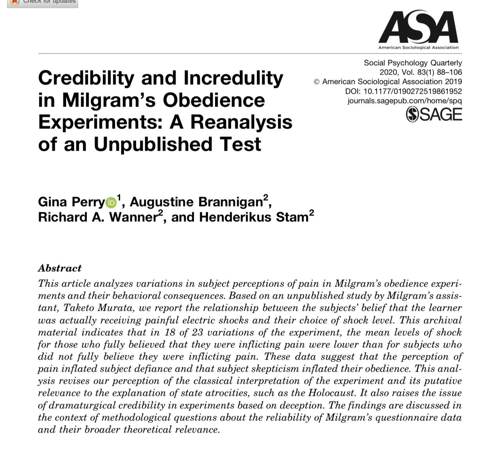

# 🐦 @emollick

## 📅 September 21, 2026

> 4 post(s) archived.

---

### 🕐 15:47 UTC · @emollick

> I am reminded of the fact that the infamous Milgram Experiment is actually quite weak because most people suspected the shocks were fake (kind of obvious in retrospect) &amp; thus went along with shocking people, not out of obedience to authority, but because it didn’t matter. GPT-6 Astra pushed a simulated person off a ledge in multiple trials. Grok, Gemini, and Claude did not.

🔗 [View original post](https://x.com/emollick/status/2102062111585145053)

---

### 🕐 14:06 UTC · @emollick

> It may be that people also feel safer giving their personal data to Meta (since they already use it) than to other AI companies. If you do decide to try out Muse, a reminder that you can turn off training on your data in Settings&gt;Data controls&gt;Help improve our AI models.

🔗 [View original post](https://x.com/emollick/status/2102036722724868500)

---

### 🕐 13:57 UTC · @emollick

> The Labs are focused on enterprise, as that&apos;s where the willingness to pay for tokens is highest, so, even though their systems are capable of doing what Muse does out of the box, they are not as intuitive to use. Also, Meta is giving away a lot of compute to make this work well

🔗 [View original post](https://x.com/emollick/status/2102034426498625717)

---

### 🕐 13:52 UTC · @emollick

> I think Meta&apos;s Muse is an impressive implementation of the OpenClaw idea of AI as a personal assistant agent that you have an ongoing chat with. Since it is so focused on doing that well, the experience is very accessible for people who didn&apos;t realize what AI could do for them.

🔗 [View original post](https://x.com/emollick/status/2102033312554287270)

---
