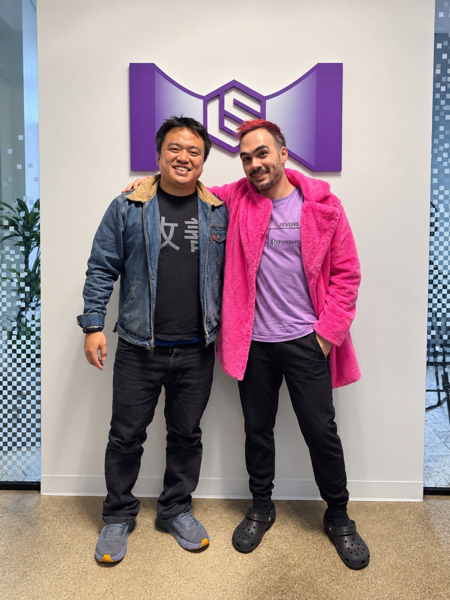

# 🐦 @swyx

## 📅 September 21, 2026

> 1 post(s) archived.

---

### 🕐 03:16 UTC · @swyx

> Jev pod tomorrow subscribe on apple /youtube @latentspacepod thanks to @allenpark and Ke for making this happen! After co-inventing ChatGPT, I kept asking myself: why have superhuman chat models not led to AGI? I’ve spent the last 2 years in stealth building a new way to train models (RLCD), and a new type of frontier AI model that we are releasing today: Jev • 20-200x faster • 40-400x chea…

🔗 [View original post](https://x.com/swyx/status/2101873256097804529)

---
