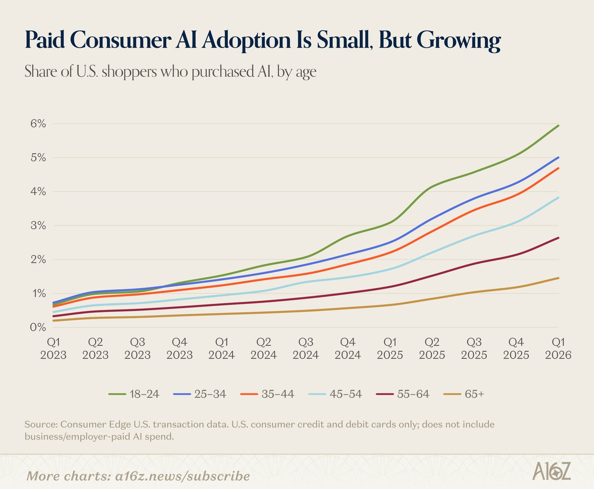

# 🐦 @AiEvolutio58513

## 📅 September 22, 2026

> 5 post(s) archived.

---

### 🕐 13:59 UTC · @AiEvolutio58513

> Jensen Huang on the 2030 doom predictions: “2030 is not going to be the end of the world. There is zero percent chance that&apos;s going to be the end of the world. I completely disagree that AI is going to destroy, is going to be the end of the world in 2030.” Media

🔗 [View original post](https://x.com/AiEvolutio58513/status/2102397327378170049)

---

### 🕐 13:02 UTC · @AiEvolutio58513

> Interested in AI? Follow @AiEvolutio58513 and never fall behind. I track ChatGPT, Claude, and every tool quietly changing how we work and create, then hand you the tested signals.

🔗 [View original post](https://x.com/AiEvolutio58513/status/2102383071484162396)

---

### 🕐 13:02 UTC · @AiEvolutio58513

> TL;DR 1. Base case is 14,000 gross profit a year 2. It assumes a dollar a mile and 35% to Tesla 3. Tires and charging are the largest running costs 4. Empty miles cut a dollar fare to 57 cents 5. Maximum utilization roughly doubles the profit 6. About 8,000 net after a 35% tax rate 7. Expensive FSD plus a high take rate turns it negative 8. None of it is purchasable today

🔗 [View original post](https://x.com/AiEvolutio58513/status/2102383059534581845)

---

### 🕐 13:01 UTC · @AiEvolutio58513

> Elon Musk says Tesla will sell a Cybercab to a customer for under 30,000 dollars before 2027. A chartered financial analyst built the model for what one would actually earn you. On Herbert Ong&apos;s channel, Soren Basher gave 8 things worth knowing: 1. Fourteen thousand in the worst case Media Elon Musk explains how Tesla owners will make money from its Cybercab fleet: “For the fleet that is owned by our customers, it’ll be like an Airbnb thing. You can add or subtract your car to the fleet whenever you want. You can say, ‘I’m going away for a week.’ Just one tap on yo…

🔗 [View original post](https://x.com/AiEvolutio58513/status/2102382733494464584)

---

### 🕐 11:01 UTC · @AiEvolutio58513

> Almost nobody is paying for AI out of their own pocket yet. Only about 3% of US consumers do. In 2023 it was under 1%. The youngest buyers are adopting at 4x the rate of the oldest. The consumer AI market has barely started. — a16z, Charts of the Week Interested in AI? Follow @AiEvolutio58513 and never fall behind. I track ChatGPT, Claude, and every tool quietly changing how we work and create, then hand you the tested signals.

🔗 [View original post](https://x.com/AiEvolutio58513/status/2102352464246960154)

---
