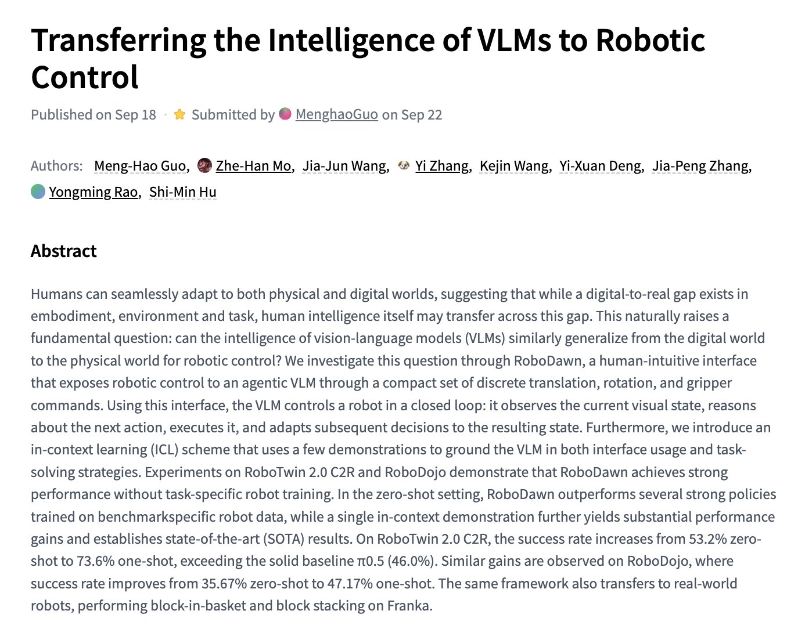
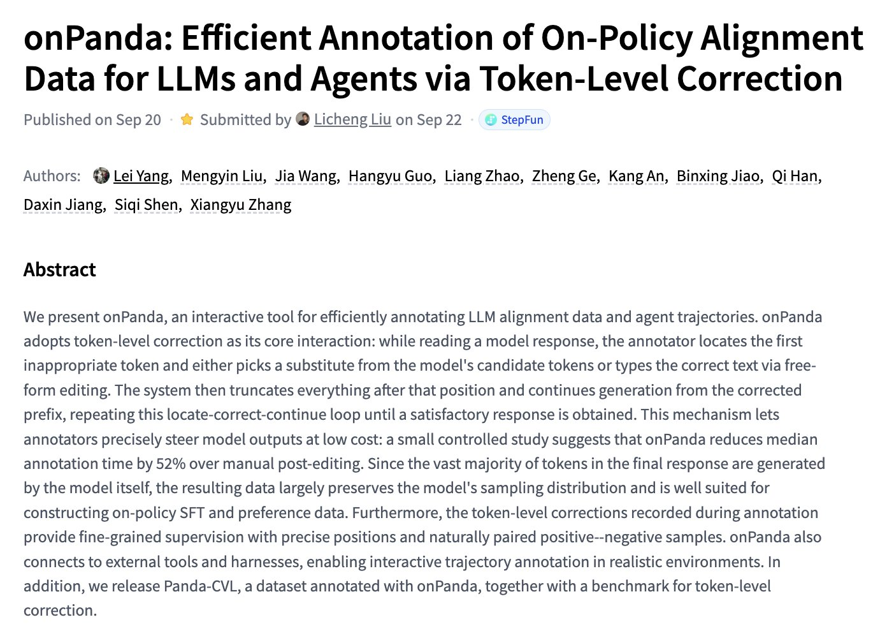
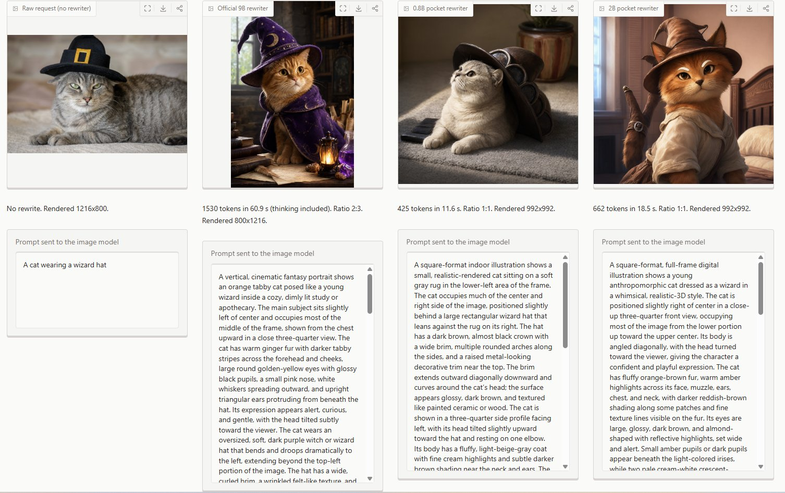
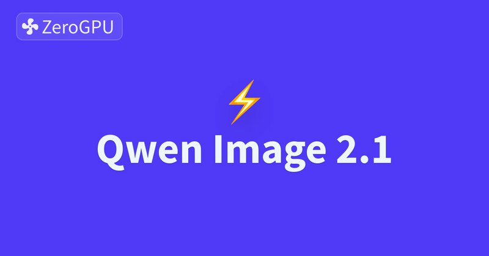
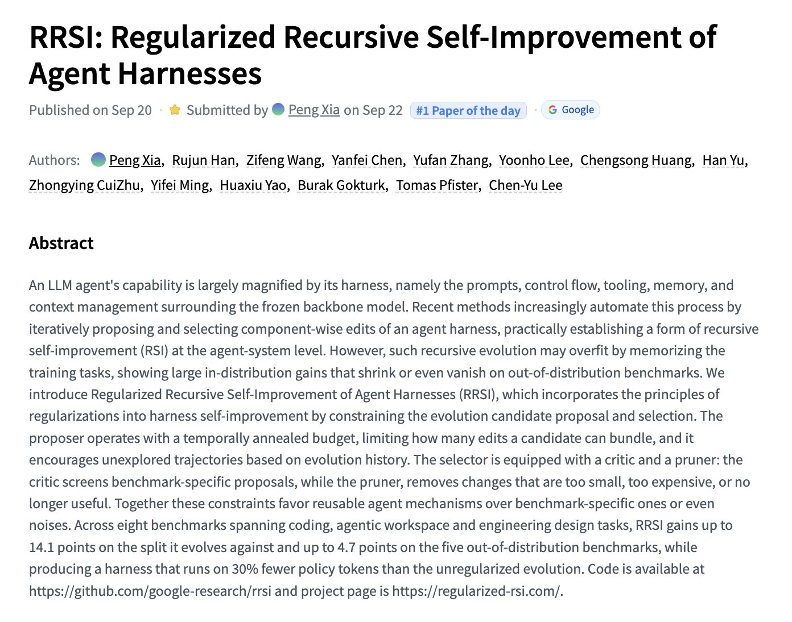
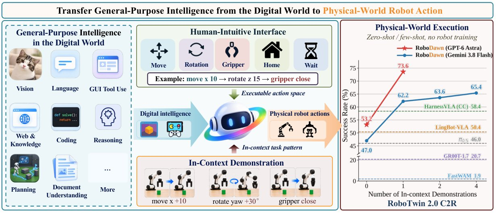
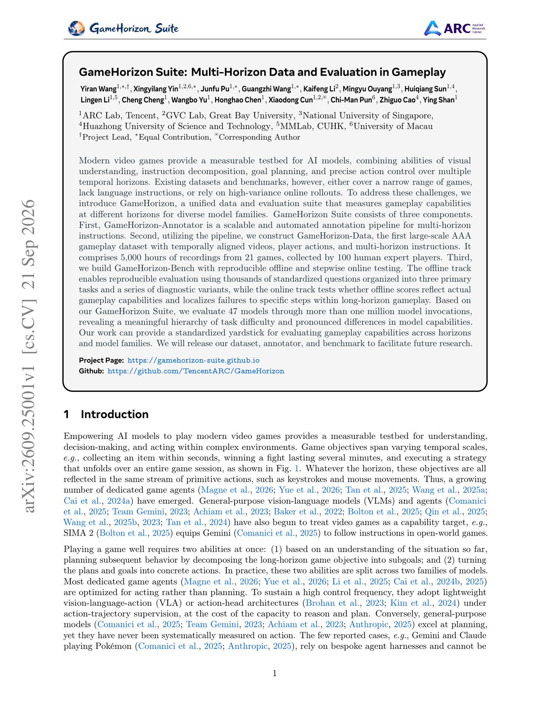

# 🐦 @_akhaliq

## 📅 September 22, 2026

> 13 post(s) archived.

---

### 🕐 19:06 UTC · @_akhaliq

> Transferring the Intelligence of VLMs to Robotic Control paper: https://huggingface.co/papers/2609.22966

🔗 [View original post](https://x.com/_akhaliq/status/2102474539620090152)

---

### 🕐 19:04 UTC · @_akhaliq

> onPanda Efficient Annotation of On-Policy Alignment Data for LLMs and Agents via Token-Level Correction paper: https://huggingface.co/papers/2609.24983

🔗 [View original post](https://x.com/_akhaliq/status/2102474190335234301)

---

### 🕐 18:29 UTC · @_akhaliq

> Thanks for sharing @_akhaliq! RRSI Regularized Recursive Self-Improvement of Agent Harnesses paper: https://huggingface.co/papers/2609.24972

🔗 [View original post](https://x.com/richardxp888/status/2102465252856369403)

---

### 🕐 18:28 UTC · @_akhaliq

> Qwen-Image 2.1 draws its best pictures when a 9B &quot;prompt rewriter&quot; expands your request first. That is 20 GB in bf16 and uses 1700 words as system prompt, and thinks for ~1,600 tokens before answering. We shrank it to 0.8B. It fits on a laptop now. 🧵

🔗 [View original post](https://x.com/Gradio/status/2102464987889553848)

---

### 🕐 18:21 UTC · @_akhaliq

> 🚀 Test the Qwen-Image-2.1 workflow on our official demo, thanks to @_akhaliq &amp; @huggingface! 🔗 https://huggingface.co/spaces/Qwen/Qwen-Image-2.1-workflow 💡 Pro tip: Default steps are lowered due to free limits. Set to 40 &amp; enable PE thinking to unleash its FULL power! ⚡🔥

🔗 [View original post](https://x.com/Kun11664638/status/2102463206208008290)

---

### 🕐 17:37 UTC · @_akhaliq

> RRSI Regularized Recursive Self-Improvement of Agent Harnesses paper: https://huggingface.co/papers/2609.24972

🔗 [View original post](https://x.com/_akhaliq/status/2102452358118871331)

---

### 🕐 15:08 UTC · @_akhaliq

> DigitalOcean Managed Agents is now in public preview. Run Claude Code, Codex, or your own LangGraph agent in a runtime environment that pauses when idle. Put its tools behind one governed endpoint, and pick from 75+ open and proprietary models. One cloud, one bill. Prompts to get started available in the blog: https://do.co/4ysh3it Media

🔗 [View original post](https://x.com/digitalocean/status/2102414817797550320)

---

### 🕐 14:26 UTC · @_akhaliq

> Meet PixVerse R2, our new real-time world model. Explore living worlds. Control and edit them with prompts. Shape the story. Meet characters that remember and respond. Media

🔗 [View original post](https://x.com/PixVerse/status/2102404266484989983)

---

### 🕐 12:17 UTC · @_akhaliq

> RoboDawn: Transferring the Intelligence of VLMs to Robotic Control Tsinghua and Tencent Hunyuan show a frozen VLM can drive robots through simple move, rotate and gripper commands, reaching 73.6% one-shot success on RoboTwin 2.0 C2R.

🔗 [View original post](https://x.com/HuggingPapers/status/2102371789842071837)

---

### 🕐 08:28 UTC · @_akhaliq

> Tencent ARC Lab just released GameHorizon Suite A unified data and evaluation suite measuring AAA gameplay capabilities across multiple temporal horizons for VLMs, UMMs, GUI, coding, and game agents.

🔗 [View original post](https://x.com/HuggingPapers/status/2102314047878345185)

---

### 🕐 05:19 UTC · @_akhaliq

> WorldCrafter Consistent Video World Model with Implicit 3D-aware Memory paper: https://huggingface.co/papers/2609.24984 Media

🔗 [View original post](https://x.com/_akhaliq/status/2102266547108819254)

---

### 🕐 03:20 UTC · @_akhaliq

> Excited to welcome @reflection_ai as a co-host and sponsor of Open Together! 🤗 We’re already at 50% capacity! Grab your spot before registration switches to the waitlist. 📍 San Francisco · October 16 🎟️ Register: https://luma.com/OpenTogether Media

🔗 [View original post](https://x.com/jeffboudier/status/2102236502210310613)

---

### 🕐 01:16 UTC · @_akhaliq

> CodeMidas Scaling Agentic Coding RL Environments from Code Itself paper: https://huggingface.co/papers/2609.22068

🔗 [View original post](https://x.com/_akhaliq/status/2102205326485557643)

---
