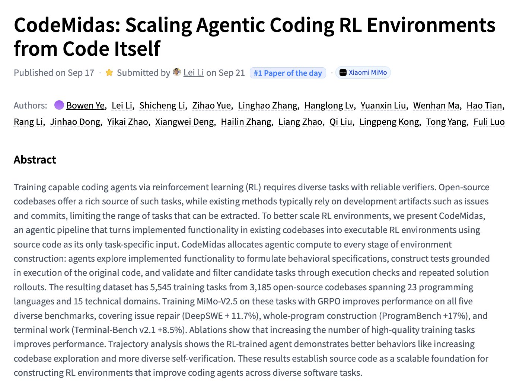

# 🐦 @_akhaliq

## 📅 September 22, 2026

> 2 post(s) archived.

---

### 🕐 03:20 UTC · @_akhaliq

> Excited to welcome @reflection_ai as a co-host and sponsor of Open Together! 🤗 We’re already at 50% capacity! Grab your spot before registration switches to the waitlist. 📍 San Francisco · October 16 🎟️ Register: https://luma.com/OpenTogether Media

🔗 [View original post](https://x.com/jeffboudier/status/2102236502210310613)

---

### 🕐 01:16 UTC · @_akhaliq

> CodeMidas Scaling Agentic Coding RL Environments from Code Itself paper: https://huggingface.co/papers/2609.22068

🔗 [View original post](https://x.com/_akhaliq/status/2102205326485557643)

---
