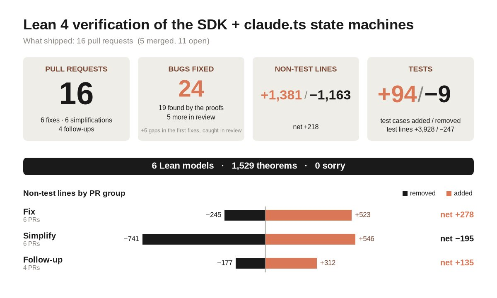

# 🐦 @bcherny

## 📅 September 22, 2026

> 4 post(s) archived.

---

### 🕐 23:39 UTC · @bcherny

> I used Opus 5.5 to formally verify the Claude Agent SDK using Lean. A couple short prompts = 16 PRs fixing various bugs and race conditions. Video attached. TLA+ also works well. I sometimes combine Lean and TLA+ to look for issues around data flow, concurrency, and state mgmt. I don&apos;t know either language well, but Claude is excellent at both. This approach is super useful for formally modeling your code and finding bugs that a human probably wouldn&apos;t have spotted. Is formal verification the future of coding (or at least, bug finding)? Media

🔗 [View original post](https://x.com/bcherny/status/2102543349102338309)

---

### 🕐 23:39 UTC · @bcherny

> Opus made an infographic

🔗 [View original post](https://x.com/bcherny/status/2102543350436180277)

---

### 🕐 16:45 UTC · @bcherny

> Opus 5.5 is a really good model. It&apos;s been my daily driver the last few weeks. We had Opus 5.5 and Fable 5.1 each port HAProxy from C to Rust. Both passed nearly all of HAProxy&apos;s tests, but Opus 5.5 finished in 9.5 hours compared to Fable 5.1&apos;s 12 hours, and for 51% less cost. Introducing Claude Opus 5.5, the first model in our new Claude 5.5 family. It performs at the level of Claude Fable 5.1 for most tasks, and costs 40% less to run than Opus 5.

🔗 [View original post](https://x.com/bcherny/status/2102439069053747549)

---

### 🕐 16:39 UTC · @bcherny

> Opus 5.5 is the result of your feedback. It communicates clearly, it&apos;s cheaper per token than Opus 5.0 with the intelligence of Fable 5.1, it’s very token efficient and works across every effort level. We&apos;re also increasing 5h rate limits &amp; giving you a banked reset. Introducing Claude Opus 5.5, the first model in our new Claude 5.5 family. It performs at the level of Claude Fable 5.1 for most tasks, and costs 40% less to run than Opus 5.

🔗 [View original post](https://x.com/trq212/status/2102437686967738431)

---
