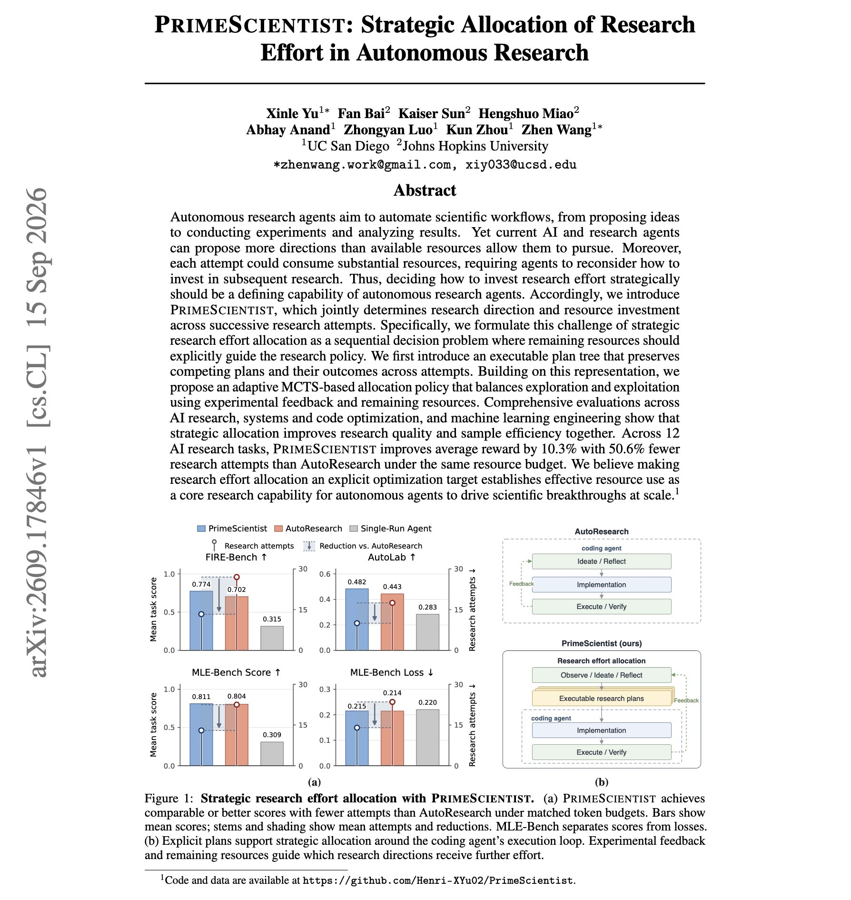
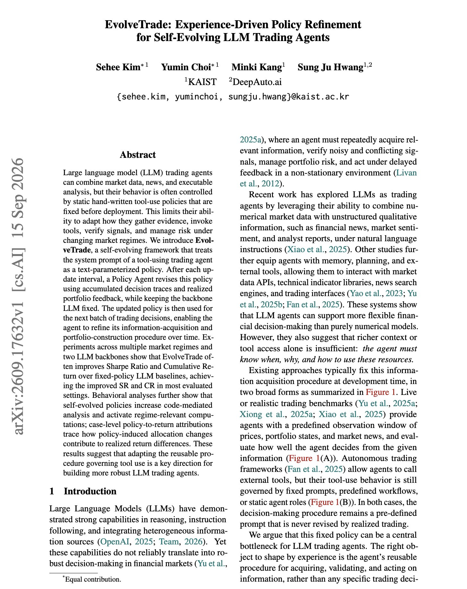
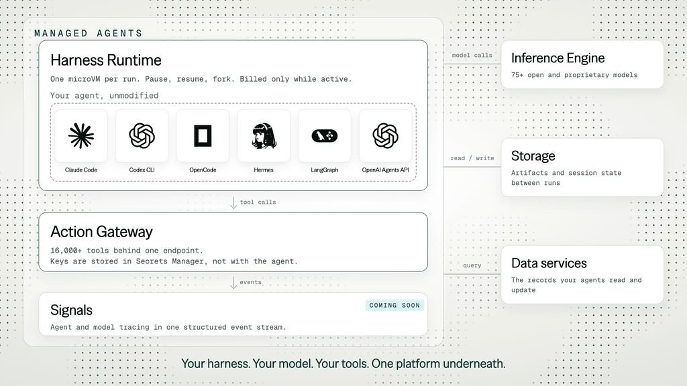
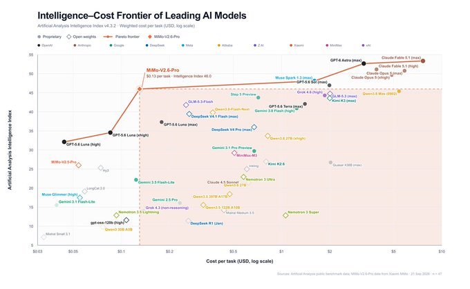
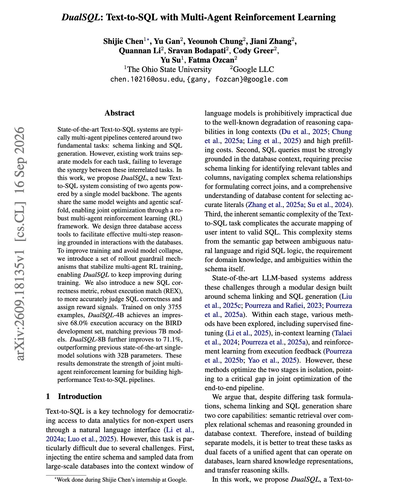

# 🐦 @dair_ai

## 📅 September 22, 2026

> 6 post(s) archived.

---

### 🕐 18:30 UTC · @dair_ai

> Interesting work on long-horizon research agents. PrimeScientists can decide where a research agent spends its budget. Achieves 10.3% more reward with 50.6% fewer research attempts, under the same budget. That is PrimeScientist against AutoResearch on 12 AI research tasks. They treat deciding where to spend a research agent&apos;s budget as part of the agent&apos;s job. PrimeScientist keeps an executable plan tree of competing research directions and their outcomes. An adaptive MCTS policy reads the experimental feedback and the remaining budget and chooses whether to explore a new direction or continue a promising one. The gains also hold on systems, code optimization and ML engineering tasks. If your research agent can propose more experiments than you can afford to run, this is a concrete method for choosing among them. Paper: https://academy.dair.ai/papers/primescientist-strategic-allocation-of-research-effort-in-autonomous-research-2609.17846

🔗 [View original post](https://x.com/dair_ai/status/2102465468556820660)

---

### 🕐 16:27 UTC · @dair_ai

> Cool paper showing how effective tuning a system prompt for an agent can be. Recommended paper if you tune agent harnesses. This paper presents EvolveTrade, which treats a trading agent&apos;s system prompt as its policy. After each trading interval, a separate Policy Agent reads the decision traces and the realized returns and rewrites the prompt. The backbone model stays frozen. Across several market regimes and two backbone models, the evolved agent beats fixed-prompt baselines on Sharpe ratio and cumulative return in most settings. The rewritten prompts also led the agent to run more code-based analysis and to compute signals that fit the current market regime. Paper: https://academy.dair.ai/papers/evolvetrade-experience-driven-policy-refinement-for-self-evolving-llm-trading-ag-2609.17632

🔗 [View original post](https://x.com/dair_ai/status/2102434507043598432)

---

### 🕐 16:10 UTC · @dair_ai

> DigitalOcean Managed Agents are here! They work with major harnesses like Claude Code and Codex. 16,000+ tools. Idle agents stop using CPU. Optimized to help builders scale agents in production. Worth checking out. DigitalOcean Managed Agents is now in public preview. Run Claude Code, Codex, or your own LangGraph agent in a runtime environment that pauses when idle. Put its tools behind one governed endpoint, and pick from 75+ open and proprietary models. One cloud, one bill. Prompts to get…

🔗 [View original post](https://x.com/omarsar0/status/2102430254535233981)

---

### 🕐 14:48 UTC · @dair_ai

> Recommended if you work on agent memory. Retrieval is the hardest memory problem in most harnesses because agents keep pulling stale context. AML tests this with a coding track of 150 software tasks, each run with relevant history and again with noisy history. Agent Memory Challenge 2026 Cycle 2 is now open. Long-term memory is not just about storing more history. It is about retrieving the right evidence, recognizing what has changed, and avoiding stale context when an agent needs to act. Three tracks: Textual · Coding · Multimodal Op…

🔗 [View original post](https://x.com/omarsar0/status/2102409612486230074)

---

### 🕐 14:27 UTC · @dair_ai

> New open frontier model! MiMo-V2.6 Pro lands on the Intelligence-vs.-Cost-per-Task Pareto frontier. The best part is that they are open-sourcing Pro and Flash, MiMo-V2.6-Distill-Qwen-9B, the technical report, 7K+ RL task environments, an end-to-end RL framework, and composable mini-harnesses. MiMo-V2.6-Pro debuts as the top open weights model on the Artificial Analysis Intelligence Index (46). At $0.13 per Intelligence Index task, it lands on the Intelligence vs. Cost per Task Pareto frontier @Xiaomi has just released MiMo-V2.6-Pro, an open weights model with major ad…

🔗 [View original post](https://x.com/omarsar0/status/2102404483800052021)

---

### 🕐 14:19 UTC · @dair_ai

> Great paper from Google and colleagues. Trains Text-to-SQL agents using multi-agent RL. (bookmark it) This work proposes DualSQL, which splits Text-to-SQL into two agents, one that links the question to the right tables and columns and one that writes the SQL. Both agents run on the same model weights, so a single multi-agent RL run trains both roles together. The agents can query the database through three tools while they reason. Multi-agent RL tends to collapse during training, so the authors add guardrails on rollouts and a new reward, robust execution match, that judges SQL correctness more accurately. Trained on only 3,755 examples, DualSQL-4B reaches 68.0% execution accuracy on BIRD dev, matching earlier 7B models. DualSQL-8B reaches 71.1%, ahead of previous single-model systems with 32B parameters. Paper: https://arxiv.org/abs/2609.18135 Chat with Paper: https://academy.dair.ai/papers/dualsql-text-to-sql-with-multi-agent-reinforcement-learning-2609.18135

🔗 [View original post](https://x.com/omarsar0/status/2102402295682224325)

---
