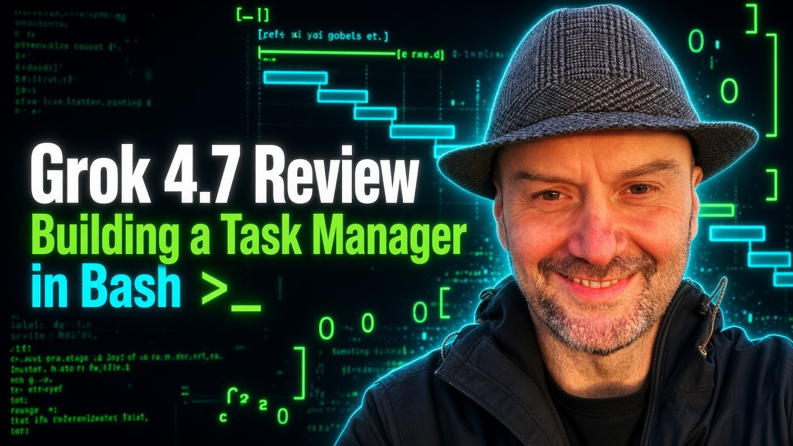
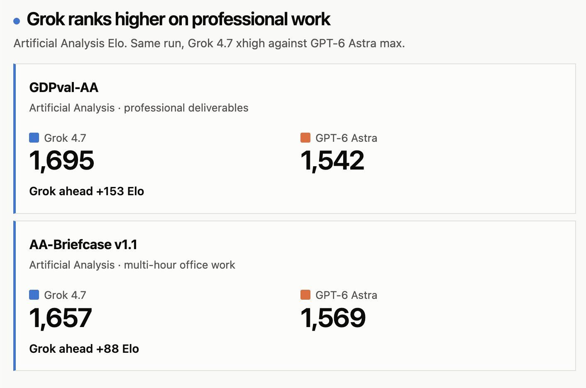
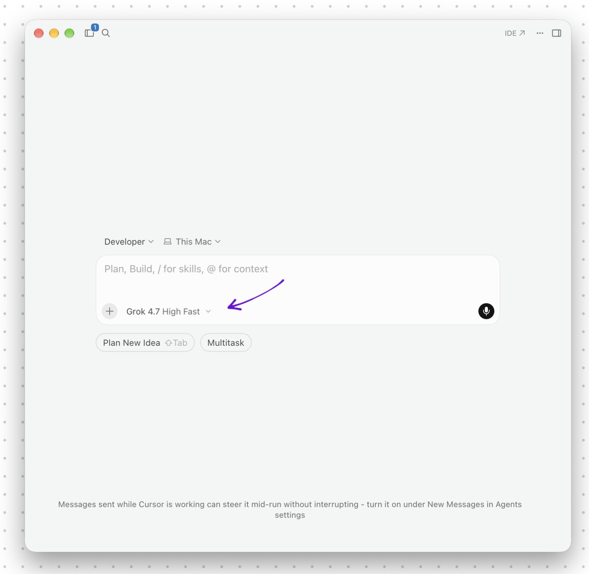
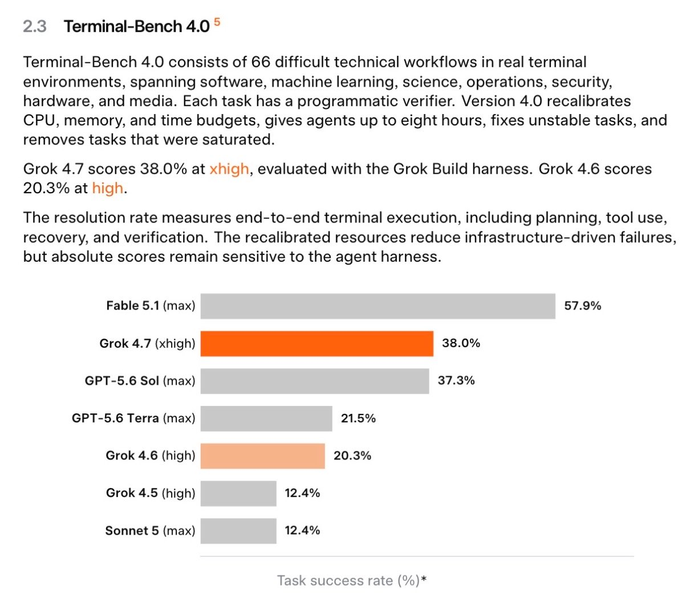
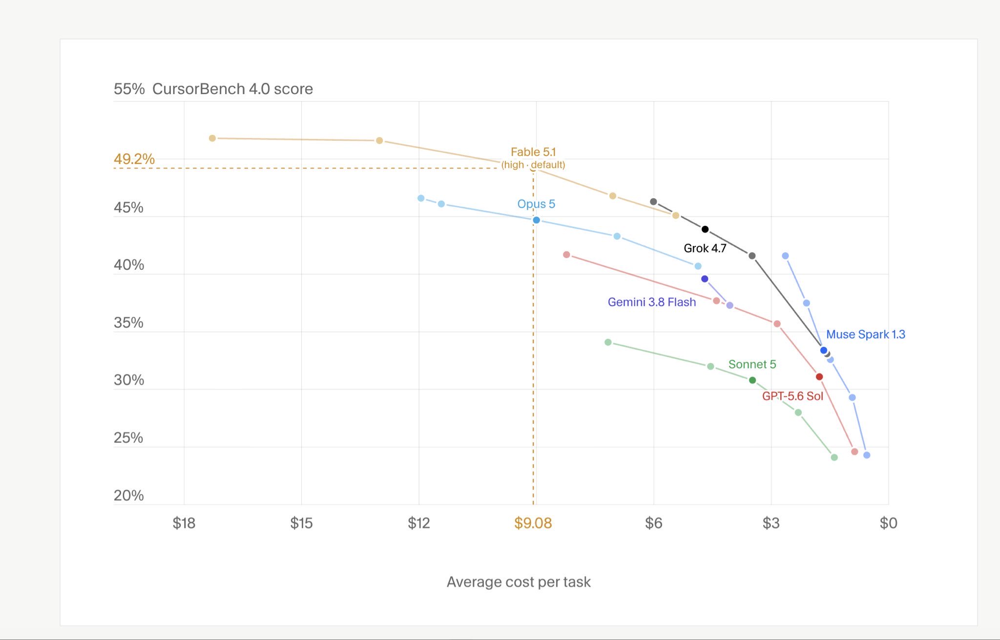

# 🐦 @elonmusk

## 📅 September 22, 2026

> 35 post(s) archived.

---

### 🕐 18:11 UTC · @elonmusk

> We rebuilt customer support around Grok Bot to scale our operations without adding headcount. It works autonomously to respond to customers, resolve tickets, and manage the queue. https://x.ai/news/grok-bot-customer-support

🔗 [View original post](https://x.com/bot/status/2102460785649959362)

---

### 🕐 17:21 UTC · @elonmusk

> BREAKING: SpaceXAI just released a major Grok Build update, with Grok 4.7 now available in Grok Build. The update improves crash recovery, prompt handling, navigation, configuration reliability and overall subagent performance. It also adds new subagent controls, configurable request limits and long-reasoning reminders. Release Notes Version 1.0.41 — September 22, 2026 Features • Added a new sports_search tool that can look up live NFL scores, standings, schedules, player stats and team records directly from X data. • Added a subagent model inheritance setting to /settings. It persists in config.toml and respects managed and overlay layers. • Per-model request size limits can now be configured to match provider HTTP body caps and control inline image eviction. • A long-reasoning reminder can now be enabled through config to nudge the model after lengthy hidden-reasoning steps. Bug Fixes • Fixed the subagent fullscreen view so it no longer shows a stray [Dashboard] button in the header. • Fixed agent frontmatter mcpServers so headers and URLs from the active agent’s agent.md correctly override config.toml and survive config reloads or agent switches. • Ctrl+P now opens the command palette immediately from the welcome screen. • The Dashboard now focuses the “+ New Agent” row instead of leaving the previous session selected. • Sessions interrupted by a crash now show a clear marker instead of silently dropping the turn. • Pressing Ctrl+Z immediately after stashing a prompt now restores it. • The collapsed edit blocks setting now correctly collapses edits even when expanded_by_default is pinned to true. • Interjections now receive a visible reply before the agent resumes its previous tasks. • Cancelling a turn blocked on spawn_subagent now tells the model that the child moved to the background instead of claiming it was never executed. • Saving a queued-prompt edit now returns focus to the composer so the next keystrokes type the next message. • Subagent activation is now consistent between the TUI and Grok Agent Studio. Tables that only set limits or models no longer disable subagents. • Effort-level selection now accepts menu labels in addition to IDs. Media

🔗 [View original post](https://x.com/cb_doge/status/2102448328638382234)

---

### 🕐 17:18 UTC · @elonmusk

> 💪 Inside Ari Emanuel&apos;s Earliest Days in Hollywood: Coffee Runs, Couch Surfing and Replacing Michael Ovitz&apos;s Toilet Paper https://www.hollywoodreporter.com/lifestyle/arts/inside-ari-emanuels-earliest-days-hollywood-memoir-excerpt-1236707236/

🔗 [View original post](https://x.com/AriEmanuel/status/2102447527354351801)

---

### 🕐 17:04 UTC · @elonmusk

> Today we&apos;re beginning to roll out 𝕏 Numbers, a brand new way to let anyone contact you on 𝕏 without needing to follow each other or accept requests. Media

🔗 [View original post](https://x.com/benjitaylor/status/2102443951898992825)

---

### 🕐 16:57 UTC · @elonmusk

> X Numbers are here. Share yours with anyone you want to contact you, even if you don&apos;t follow them. It&apos;s an optional way for people to message or call you, without you needing to accept requests or follow them back. Media

🔗 [View original post](https://x.com/chat/status/2102442240354165057)

---

### 🕐 16:45 UTC · @elonmusk

> Grok @Bot now in your Tesla! .@Grok in your Tesla can now do meaningful work for you With Connectors, you can manage your inbox, clean up your calendar, or talk through existing files/chat/tasks – all hands-free

🔗 [View original post](https://x.com/elonmusk/status/2102439262507725294)

---

### 🕐 16:45 UTC · @elonmusk

> I will admit, I am enjoying vibe coding. I may have been a teensy tiny bit wrong.

🔗 [View original post](https://x.com/notch/status/2102439244887453825)

---

### 🕐 16:17 UTC · @elonmusk

> Grok Bot has just officially launched in @Tesla vehicles. I got early access a couple weeks ago. You can order stuff on online (such as Amazon), manage your email, calendar, finances, or other tasks through Grok @Bot using just your voice in your Tesla. There is no separate app, everything just lives within the existing Grok Voice interface in your Tesla (as shown in my Model Y below). One good use case for Grok Bot in your Tesla: You get in, tell Grok Bot to order coffee at a location of your choice, and while your Tesla drives you to the coffee shop using FSD (Supervised), Grok places the order so it’s ready when you arrive. Grok Bot in Tesla vehicles is currently only available to SuperGrok Heavy users, but will expand to more owners later. Connectors are available to all users. Media

🔗 [View original post](https://x.com/SawyerMerritt/status/2102432181666590951)

---

### 🕐 16:13 UTC · @elonmusk

> Grok @bot lets you take on more complex tasks, like placing your usual coffee order, booking a reservation, or scheduling an appointment Currently available to SuperGrok Heavy subscribers, with more tiers to follow

🔗 [View original post](https://x.com/Tesla/status/2102431173314273633)

---

### 🕐 16:10 UTC · @elonmusk

> Interesting 🚨 Cathie Wood’s Starship math gets crazy very quickly! Larry Goldberg @TeslaLarry breaks down ARK’s estimate that a single Starship launch could eventually generate around $1 BILLION in connectivity revenue. Now combine that with Elon’s goal of 10,000 Starship flights per year. …

🔗 [View original post](https://x.com/elonmusk/status/2102430276450390482)

---

### 🕐 16:05 UTC · @elonmusk

> If AI gave you back 2 hours a day, that&apos;s 730 hours a year. What would you do with them? Spend more time with your kids? Get healthy? Start the business you&apos;ve been putting off? That&apos;s the conversation about the future of tech I want to have. What becomes possible when people get part of their lives back?

🔗 [View original post](https://x.com/PeterDiamandis/status/2102429058558501330)

---

### 🕐 16:02 UTC · @elonmusk

> lol Some of the funniest times on this app 😂

🔗 [View original post](https://x.com/elonmusk/status/2102428227545493995)

---

### 🕐 15:54 UTC · @elonmusk

> 🚨NEW: @JTLonsdale &amp; @SquawkCNBC clash on AI and wealth inequality. Joe Lonsdale: 2030s is the disinflation decade... we&apos;re all going to be really wealthy if we don&apos;t break this. Joe Kernen: Everybody&apos;s going to get wealthier? Because only the wealthy have been getting wealthier... Joe Lonsdale: That&apos;s not true. Let&apos;s go back: 1870 to 1900, the Second Industrial Revolution, the last time productivity shot up a lot, the average American, the average working class American, was twice as wealthy in real terms within one generation... Andrew Ross Sorkin: Tell me where you land on &quot;We&apos;ve got to slow everything down, because if we don&apos;t, we could end up dying... Joe Kernen: or worse... Joe Lonsdale: or worse, the companies go bankrupt Andrew: versus we&apos;ve got to go full steam ahead. No matter what. No matter what the case. Joe Lonsdale: I love the meme where it&apos;s Dario and Sam saying, please regulate us. And Trump says, keep building, nerds. These companies have a lot of liabilities. These companies need to slow down if they see themselves causing damage. I&apos;m not worried about any existential risks in the near term. I 100% could see these companies accidentally causing some problems with hacking with cyber, for example. They have a responsibility to slow down themselves, and we should be holding them liable if they cause any damage. And so it makes sense that they would be very careful about that. But we were just talking... 2030s is disinflation decade. We&apos;re going to all be really wealthy if we don&apos;t break this. So don&apos;t slow down too much is my view. Joe Kernen: Go back to this again. You told me that 2030s are going to be the decade of disinflation. We&apos;re going to all get rich, and we&apos;re not going to need to raise taxes, and we&apos;re going to start growing faster. The deficit will come under control. This is going to happen? Joe Lonsdale: The AI is really good for rooting out fraud and grift in the government. It&apos;s really going to bring down health care costs dramatically. It&apos;s amazing for bringing back manufacturing. We have companies already bringing back lots of manufacturing here. That&apos;s only about to accelerate. We&apos;re at what&apos;s called a GPT-3 moment right now for robotics, right. World models, which are a new type of AI -- how do things move and interact in the real world in general terms... Joe Kernen: So this will help one of our most daunting fears of the $40 trillion and the out of control deficits we&apos;re running now, this will come under control from AI? Joe Lonsdale: If you get productivity up to 3, 4 or 5%, what you 100% should be able to do with these things, if not significantly higher, that solves the deficit problem. This is an amazing thing for a civilization; this is the answer is to get growth higher, and it&apos;s how everyone gets wealthier, it&apos;s doing more with less. It&apos;s going to do it. Joe Kernen: Everybody&apos;s going to get wealthier? Because only the wealthy have been getting wealthier... Joe Lonsdale: That&apos;s not true. Let&apos;s go back: 1870 to1900, the Second Industrial Revolution, the last time productivity shot up a lot, the average American, the average working class American, was twice as wealthy in real terms within one generation. And that&apos;s what happens when productivity goes up. Everyone gets wealthier. We we teach economics very poorly in this country. Media

🔗 [View original post](https://x.com/AmOptimistShow/status/2102426287193092221)

---

### 🕐 15:42 UTC · @elonmusk

> Grok 4.7 doing real engineering work at Tesla Over the last few weeks, Grok Build teams have optimized the harness for 4.7: - Better presentation, less slop, and better prose - Better self-validation - Improved thinking efficiency - Improved long-horizon monitoring tasks - Improved VLM and multimodal tasks Many FSD and Cyber…

🔗 [View original post](https://x.com/elonmusk/status/2102423241897705926)

---

### 🕐 15:40 UTC · @elonmusk

> Grok 4.7 Grok 4.7 turned a simple prompt into this interactive 3D jet engine visualizer in minutes. This is insane. 🔥

🔗 [View original post](https://x.com/elonmusk/status/2102422703798137219)

---

### 🕐 15:14 UTC · @elonmusk

> Grok 4.7 turned a simple prompt into this interactive 3D jet engine visualizer in minutes. This is insane. 🔥 Media

🔗 [View original post](https://x.com/cb_doge/status/2102416305513230455)

---

### 🕐 14:59 UTC · @elonmusk

> Grok 4.7 with our Build harness is a strong daily workhorse I’ve been building with Grok 4.7 extra high in Grok Build today for hours. It’s fantastic and my usage percent (Cursor Ultra) is barely moving. Getting so much done. While Build works on one thing, I discuss the next feature/change with my Grok Bot team and have Engineer Bot

🔗 [View original post](https://x.com/elonmusk/status/2102412363332805078)

---

### 🕐 14:47 UTC · @elonmusk

> 🚨 WTF! New York dumped the literacy exam for TEACHERS, because only 61% could pass it. Not the kids… The teachers! That is the education system in one statistic. Lower the bar. Fail the kids. Call it progress. Never forget that in New York they eliminated the literacy exam in 2017. And this exam wasn&apos;t for students - it was the literacy exam for TEACHERS. Only 61% could pass it!

🔗 [View original post](https://x.com/GuntherEagleman/status/2102409342960185681)

---

### 🕐 14:42 UTC · @elonmusk

> Interesting perspective The loudest voices stoking fears about AI dangers have made tremendous headway in the past two weeks. AI technology has not taken some unexpected, dangerous turn, but the hype around it — propelled by what appears to be a well orchestrated PR campaign — has drummed up considerabl…

🔗 [View original post](https://x.com/elonmusk/status/2102408239774151050)

---

### 🕐 14:34 UTC · @elonmusk

> Grok will be able to make photo-realistic &amp; physics-precise games Grok 4.7 just built a GTA-style open-world game from a single prompt in Grok Build You can walk around, drive cars, enter vehicles and explore an entire city It looks insane, and I had way too much fun playing it 😂

🔗 [View original post](https://x.com/elonmusk/status/2102406300303049172)

---

### 🕐 14:00 UTC · @elonmusk

> I let Grok Bot manage my YouTube channel... and it&apos;s better than I am! 0:53 Automating tagging with @Bot 1:40 How the Bot works 2:38 Figma thumbs and brand-voice descriptions 3:47 Template setup (YouTube Data API + AssemblyAI) 4:34 Install and get started Media

🔗 [View original post](https://x.com/mattyp/status/2102397514792001868)

---

### 🕐 10:07 UTC · @elonmusk

> @XFreeze Not a big fan of benchmarking. I just took it out for a real life test. Asked it to build me a bash only, self contained agenda, based on some sparse text files with tasks. Finished in 45 minutes end to end. Full video and repo link https://youtu.be/HI0ea6urJMw Solid model.

🔗 [View original post](https://x.com/dragosroua/status/2102339041341714509)

---

### 🕐 06:07 UTC · @elonmusk

> Grok 4.7 just outperformed GPT-6 Astra on professional work On the same Artificial Analysis run: • GDPval-AA — Grok leads by +153 Elo • AA-Briefcase — Grok leads by +88 Elo Grok 4.7 is now ahead on both professional deliverables and multi-hour office work SpaceXAI is pushing Grok hard into real-world knowledge work

🔗 [View original post](https://x.com/XFreeze/status/2102278706651861345)

---

### 🕐 05:17 UTC · @elonmusk

> Grok 4.7 Fast is now live in Grok Build and Cursor It’s the same Grok 4.7 model running on faster infrastructure, with roughly 2× the output speed • Available now in only Grok Build and Cursor • Costs 2× the standard Grok 4.7 token rates • Not included in Grok Build’s free tier • Not available on the public xAI API Same intelligence, much faster inference......at 2× the cost

🔗 [View original post](https://x.com/XFreeze/status/2102266095864602993)

---

### 🕐 05:01 UTC · @elonmusk

> Made a fun little game for my nephew using Grok 4.7. I gave it a simple prompt, and within minutes, he was playing the game. Seeing a random idea turn into a real game that quickly is honestly incredible. Media

🔗 [View original post](https://x.com/cb_doge/status/2102262068586205512)

---

### 🕐 03:45 UTC · @elonmusk

> Grok TRIPLED on Terminal-Bench 4.0 in only two months (12.4% -&gt; 38.0%), overtaking GPT-5.6 Sol

🔗 [View original post](https://x.com/ns123abc/status/2102242854924173798)

---

### 🕐 03:11 UTC · @elonmusk

> day 1 observations for grok 4.7 ignore the reports that say “it’s terrible” and the only thing they reference is a public benchmark. the same benchmarks told us opus 5 was better that fable - they are useless also ignore the reports that compare models with 3d games - that’s not real work. it&apos;s made for attention on social media i used grok 4.7 for a whole day as my firstmate, and it has been a really solid model with visible improvements over 4.5 (i&apos;m ignoring 4.6 because 4.5 has been working better in my experience) key differences with 4.7 - 1. it follows system prompt very, very closely i noticed firstmate showing many new behaviors that i&apos;ve never seen before, such as asking me to name specific red CI checks that i&apos;m ok with bypassing, and refuse a simple &quot;yolo&quot; instruction i traced it and it&apos;s indeed how i instructed it in firstmate&apos;s system prompt, but none of the other models followed it closely enough to make this behavior visible - grok 4.7 is the first to pick that up there were a few other similar examples as well. so to me this is a clear behavioral difference 2. it&apos;s very &quot;stable&quot; if you&apos;ve used astra then you know what a &quot;spiky&quot; model is. it can have some genius moments but you occasionally also wonder &quot;how could it be so dumb and doesn&apos;t get me&quot;. grok 4.7 is the opposite of that throughout the whole day so far, i&apos;ll be honest i haven&apos;t get a &quot;wow this is absolutely genius&quot; moment yet, but grok 4.7 has been very steady with no big surprises. its behavior feels predictable, which does help it gain trust from me quickly 3. it&apos;s a conservative model it doesn&apos;t like to take actions without asking, and would explicitly say so this is a bit of a double edged sword, because it means i sometimes have to state the obvious &quot;yes i do want that&quot;, but in hindsight a lot of those cases are indeed a bit ambiguous and i may not have preferred the model to just move forward without my confirmation 4. it&apos;s a bit slower and costs more than 4.5, visibly turns are taking a bit longer and my quota is draining at a visibly faster pace. i haven&apos;t quantified exactly where this is coming from yet so overall, i think it&apos;s showing some clearly different traits, and i mostly like the changes. i&apos;m going to keep it as my primary firstmate and observe more if you&apos;ve been using it, what qualitative insights have you gathered from real usage so far?

🔗 [View original post](https://x.com/kunchenguid/status/2102234191639257399)

---

### 🕐 02:30 UTC · @elonmusk

> Remembering Roger Boisjoly, the engineer who correctly identified a fatal flaw in the Challenger shuttle design months before the disaster, but nobody gave a damn. His exact words to his wife, Darlene: &quot;It&apos;s going to blow up&quot; 73 seconds before it did. More rare historical photos: https://bit.ly/44OpIzi

🔗 [View original post](https://x.com/fasc1nate/status/2102223883227091134)

---

### 🕐 01:23 UTC · @elonmusk

> Grok 4.7

🔗 [View original post](https://x.com/elonmusk/status/2102207241101144450)

---

### 🕐 01:01 UTC · @elonmusk

> True In just the last 90 days: 1. Grok 4.3 — barely top 10. “xAI is dead beyond compute leases.” 2. Grok 4.5 — massive comeback. “Maybe a chance. But Grok will never catch up to the frontier.” 3. Grok 4.6 — they’re frontier. “Still not top 3.” 4. Grok 4.7 — now top 3 in frontier codin…

🔗 [View original post](https://x.com/elonmusk/status/2102201534776025356)

---

### 🕐 00:30 UTC · @elonmusk

> Love Trump or hate him, it’s genuinely embarrassing the White House didn’t have this before now. Decline is a choice.

🔗 [View original post](https://x.com/A_d_n_R_d_i_g/status/2102193661371179179)

---

### 🕐 00:09 UTC · @elonmusk

> @elonmusk I&apos;m using it right now to build a game engine in C. It&apos;s really good.

🔗 [View original post](https://x.com/tetsuoai/status/2102188432441414005)

---

### 🕐 00:08 UTC · @elonmusk

> Cool This was unexpected. Grok 4.7 scored 100% on my music error detection test, the same as GPT-6 Astra.

🔗 [View original post](https://x.com/elonmusk/status/2102188167860273661)

---

### 🕐 00:07 UTC · @elonmusk

> Grok 4.7 just released and it&apos;s an EXCELLENT model It was trained FOR Grok Bot Meaning this is a fully agentic model trained to do your knowledge work better than you can In this video I show you how to use Grok 4.7 and a Grok Bot workflow that will 10x your productivity: Media

🔗 [View original post](https://x.com/AlexFinn/status/2102188069483155841)

---

### 🕐 00:05 UTC · @elonmusk

> Grok 4.7 Grok 4.7 is behind only Anthropic models on AA-Briefcase, ranking just behind Opus 5 at ~50% of its Cost per Task Grok 4.7’s improvements over Grok 4.6 are clear in AA-Briefcase-Lite, our public due diligence scenario where models are tasked with building market models and target…

🔗 [View original post](https://x.com/elonmusk/status/2102187423098642792)

---
